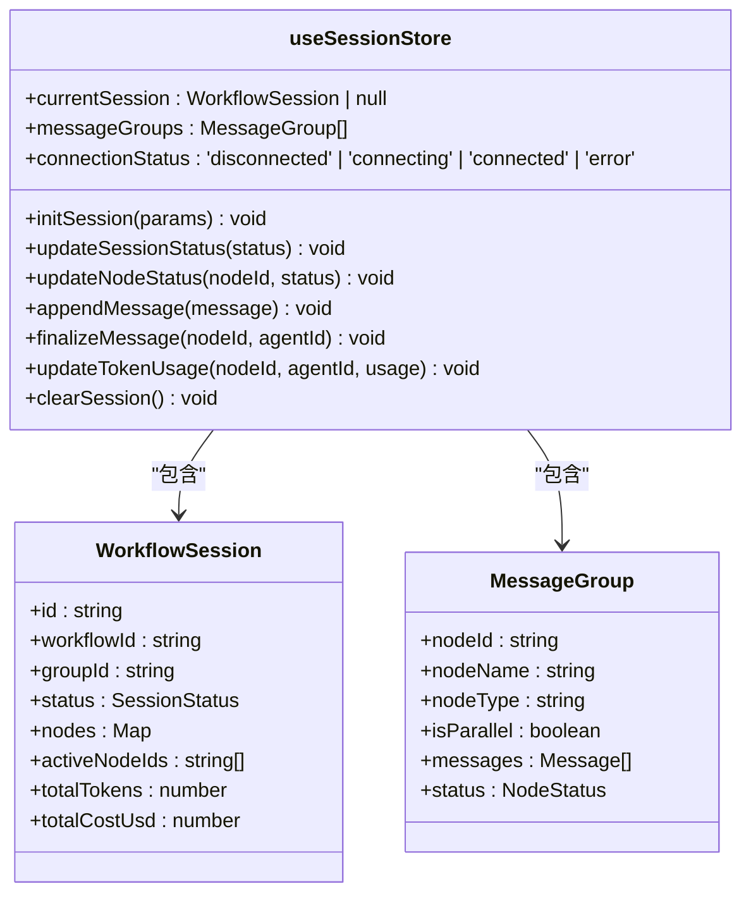
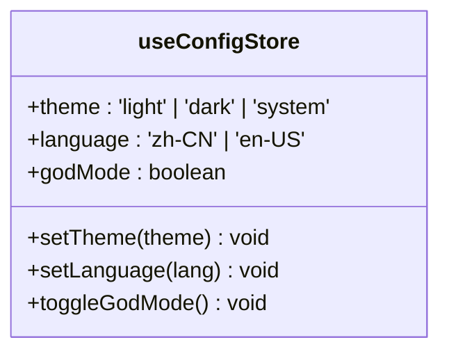
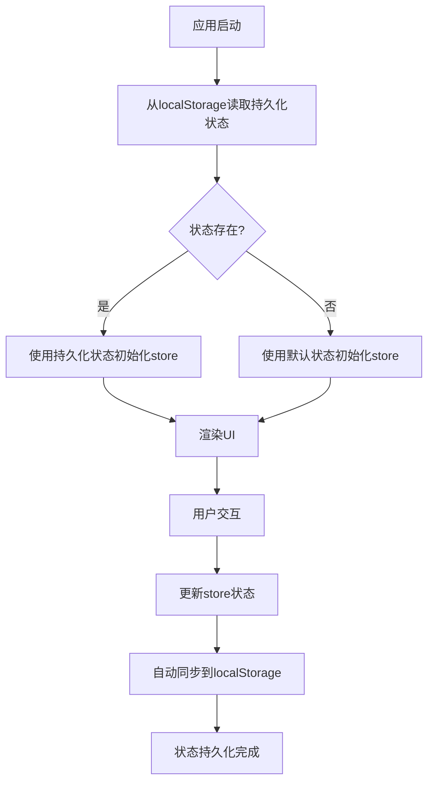
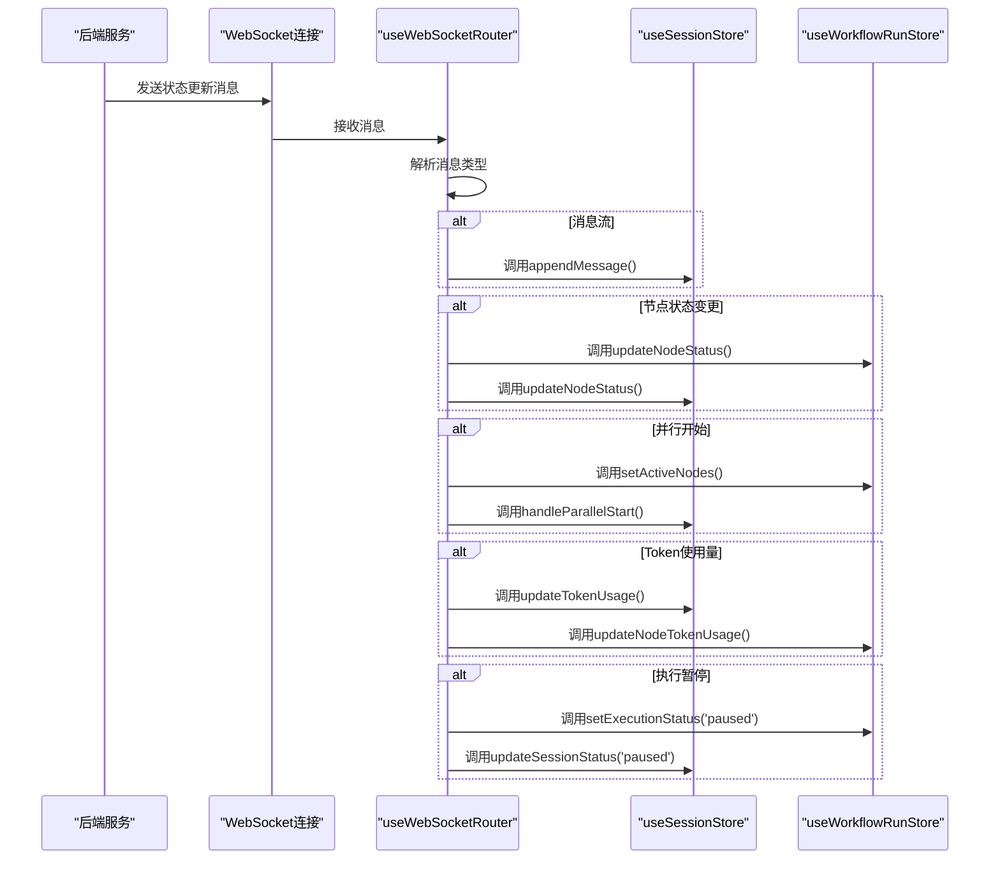
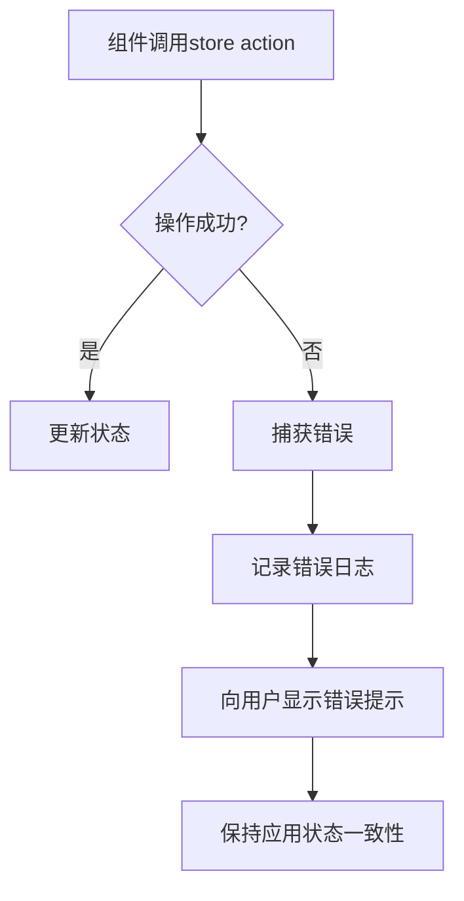
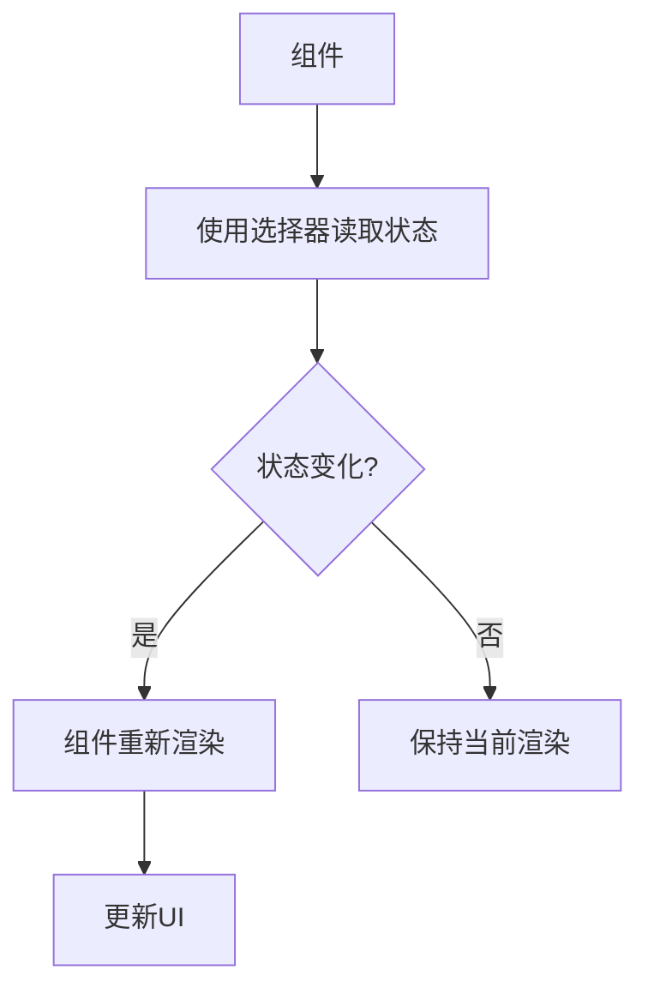
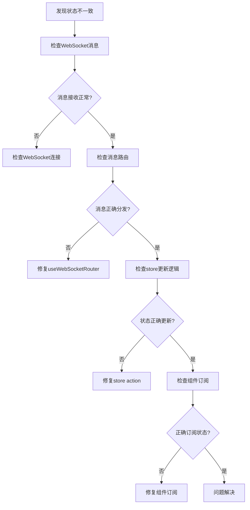

# 状态管理

<cite>
**本文档引用的文件**
- [useSessionStore.ts](file://frontend/src/stores/useSessionStore.ts)
- [useWorkflowRunStore.ts](file://frontend/src/stores/useWorkflowRunStore.ts)
- [useAuthStore.ts](file://frontend/src/stores/useAuthStore.ts)
- [useConfigStore.ts](file://frontend/src/stores/useConfigStore.ts)
- [useAgents.ts](file://frontend/src/hooks/useAgents.ts)
- [useGroups.ts](file://frontend/src/hooks/useGroups.ts)
- [useWebSocketRouter.ts](file://frontend/src/hooks/useWebSocketRouter.ts)
- [session.ts](file://frontend/src/types/session.ts)
- [workflow-run.ts](file://frontend/src/types/workflow-run.ts)
- [MeetingRoom.tsx](file://frontend/src/features/meeting/MeetingRoom.tsx)
- [ExecutionControlBar.tsx](file://frontend/src/components/meeting/ExecutionControlBar.tsx)
</cite>

## 目录
1. [简介](#简介)
2. [核心状态存储](#核心状态存储)
3. [状态持久化与同步](#状态持久化与同步)
4. [自定义Hook封装](#自定义hook封装)
5. [错误处理与调试](#错误处理与调试)
6. [最佳实践与常见问题](#最佳实践与常见问题)

## 简介
The Council前端采用Zustand作为状态管理解决方案，构建了一个模块化、可维护的状态架构。该架构通过多个专用的store来管理不同维度的应用状态，包括会话生命周期、工作流执行、用户认证和UI配置等。通过自定义Hook封装store逻辑，为组件提供了简洁的API接口。状态更新通过WebSocket实时同步，并采用持久化策略确保用户体验的一致性。

## 核心状态存储

### 会话状态管理
`useSessionStore`负责管理会话的生命周期状态，包括当前会话信息、消息组、连接状态等。该store通过`initSession`方法初始化新会话，`updateSessionStatus`更新会话状态，`appendMessage`处理消息流式输出。



**Diagram sources**
- [useSessionStore.ts](file://frontend/src/stores/useSessionStore.ts#L15-L332)
- [session.ts](file://frontend/src/types/session.ts#L75-L92)

**Section sources**
- [useSessionStore.ts](file://frontend/src/stores/useSessionStore.ts#L1-L332)
- [session.ts](file://frontend/src/types/session.ts#L1-L93)

### 工作流执行状态管理
`useWorkflowRunStore`跟踪工作流的执行进度，管理React Flow节点状态、执行控制和统计信息。该store通过`loadWorkflow`加载工作流定义，`updateNodeStatus`更新节点状态，`sendControl`发送控制命令。

```mermaid
classDiagram
class useWorkflowRunStore {
+nodes : Node<RuntimeNode>[]
+edges : Edge[]
+activeNodeIds : Set<string>
+executionStatus : 'idle' | 'running' | 'paused' | 'completed' | 'failed'
+humanReview : HumanReviewRequest | null
+stats : { totalNodes, completedNodes, failedNodes, totalTokens, totalCostUsd, elapsedTimeMs }
+loadWorkflow(nodes, edges) void
+setGraphFromTemplate(template) void
+clearWorkflow() void
+updateNodeStatus(nodeId, status, error) void
+setActiveNodes(nodeIds) void
+addActiveNode(nodeId) void
+removeActiveNode(nodeId) void
+updateNodeTokenUsage(nodeId, usage) void
+setExecutionStatus(status) void
+sendControl(sessionId, action) Promise<void>
+setHumanReview(request) void
+submitHumanReview(req, action, data) Promise<void>
+startTimer() void
+stopTimer() void
}
class RuntimeNode {
+id : string
+type : string
+label : string
+status : NodeStatus
+progress? : number
+error? : string
+tokenUsage? : { input, output, cost }
}
class HumanReviewRequest {
+sessionId : string
+nodeId : string
+reason : string
+timeout : number
}
useWorkflowRunStore --> RuntimeNode : "包含"
useWorkflowRunStore --> HumanReviewRequest : "包含"
```

**Diagram sources**
- [useWorkflowRunStore.ts](file://frontend/src/stores/useWorkflowRunStore.ts#L14-L301)
- [workflow-run.ts](file://frontend/src/types/workflow-run.ts#L6-L41)

**Section sources**
- [useWorkflowRunStore.ts](file://frontend/src/stores/useWorkflowRunStore.ts#L1-L301)
- [workflow-run.ts](file://frontend/src/types/workflow-run.ts#L1-L41)

### 认证状态管理
`useAuthStore`处理用户认证状态，管理用户信息和登录状态。该store提供`setUser`和`logout`方法来更新认证状态。

```mermaid
classDiagram
class useAuthStore {
+user : { id : string; name : string } | null
+setUser(user) void
+logout() void
}
```

**Diagram sources**
- [useAuthStore.ts](file://frontend/src/stores/useAuthStore.ts#L3-L17)

**Section sources**
- [useAuthStore.ts](file://frontend/src/stores/useAuthStore.ts#L1-L17)

### 配置状态管理
`useConfigStore`管理UI主题等配置，采用持久化策略将配置存储在localStorage中。该store提供`setTheme`、`setLanguage`和`toggleGodMode`方法来更新配置。



**Diagram sources**
- [useConfigStore.ts](file://frontend/src/stores/useConfigStore.ts#L5-L35)

**Section sources**
- [useConfigStore.ts](file://frontend/src/stores/useConfigStore.ts#L1-L35)

## 状态持久化与同步

### 状态持久化策略
The Council采用Zustand的persist中间件实现状态持久化，确保用户配置在页面刷新后保持不变。`useConfigStore`和`useLayoutStore`都使用了持久化策略。



**Diagram sources**
- [useConfigStore.ts](file://frontend/src/stores/useConfigStore.ts#L15-L35)
- [useLayoutStore.ts](file://frontend/src/stores/useLayoutStore.ts#L19-L44)

**Section sources**
- [useConfigStore.ts](file://frontend/src/stores/useConfigStore.ts#L1-L35)
- [useLayoutStore.ts](file://frontend/src/stores/useLayoutStore.ts#L1-L44)

### 状态同步机制
通过WebSocket实现实时状态同步，`useWebSocketRouter`作为消息路由器，将WebSocket消息分发到相应的store进行处理。



**Diagram sources**
- [useWebSocketRouter.ts](file://frontend/src/hooks/useWebSocketRouter.ts#L13-L126)
- [useSessionStore.ts](file://frontend/src/stores/useSessionStore.ts#L38-L89)
- [useWorkflowRunStore.ts](file://frontend/src/stores/useWorkflowRunStore.ts#L64-L78)

**Section sources**
- [useWebSocketRouter.ts](file://frontend/src/hooks/useWebSocketRouter.ts#L1-L126)

## 自定义Hook封装

### Agents Hook
`useAgents`封装了与agents相关的API调用和状态管理，提供了一组自定义Hook来简化组件中的数据获取和操作。

```mermaid
classDiagram
class useAgents {
+useAgents() QueryResult<Agent[]>
+useAgent(id) QueryResult<Agent>
+useCreateAgent() MutationResult<Agent>
+useUpdateAgent() MutationResult<Agent>
+useDeleteAgent() MutationResult<void>
}
useAgents --> "React Query" : "依赖"
```

**Diagram sources**
- [useAgents.ts](file://frontend/src/hooks/useAgents.ts#L58-L103)

**Section sources**
- [useAgents.ts](file://frontend/src/hooks/useAgents.ts#L1-L103)

### Groups Hook
`useGroups`封装了与groups相关的API调用和状态管理，提供了简洁的API供组件调用。

```mermaid
classDiagram
class useGroups {
+useGroups() QueryResult<Group[]>
+useGroup(id) QueryResult<Group>
+useCreateGroup() MutationResult<Group>
+useUpdateGroup() MutationResult<Group>
+useDeleteGroup() MutationResult<void>
}
useGroups --> "React Query" : "依赖"
```

**Diagram sources**
- [useGroups.ts](file://frontend/src/hooks/useGroups.ts#L62-L107)

**Section sources**
- [useGroups.ts](file://frontend/src/hooks/useGroups.ts#L1-L107)

## 错误处理与调试

### 错误处理模式
The Council采用统一的错误处理模式，通过store的action方法捕获和处理错误，确保应用的稳定性和用户体验。



**Section sources**
- [useWorkflowRunStore.ts](file://frontend/src/stores/useWorkflowRunStore.ts#L197-L225)
- [useWebSocketRouter.ts](file://frontend/src/hooks/useWebSocketRouter.ts#L97-L108)

## 最佳实践与常见问题

### 状态读取与更新
推荐使用Zustand的选择器模式来订阅store中的特定状态，避免不必要的重新渲染。



### 常见状态不一致问题排查
当遇到状态不一致问题时，应检查WebSocket消息路由、store更新逻辑和组件订阅。



**Section sources**
- [useWebSocketRouter.ts](file://frontend/src/hooks/useWebSocketRouter.ts#L13-L126)
- [useSessionStore.ts](file://frontend/src/stores/useSessionStore.ts#L38-L89)
- [useWorkflowRunStore.ts](file://frontend/src/stores/useWorkflowRunStore.ts#L64-L78)