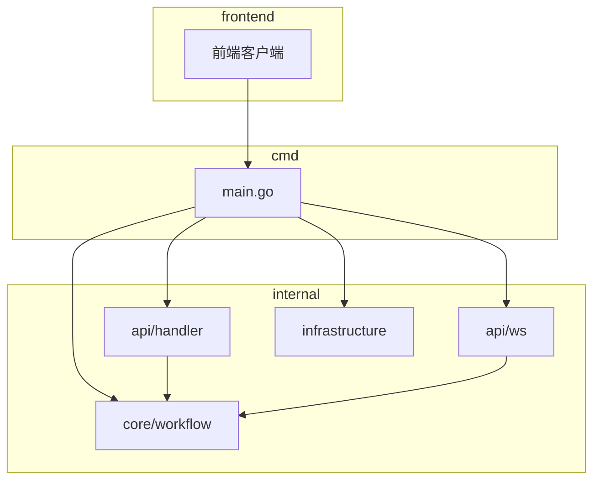
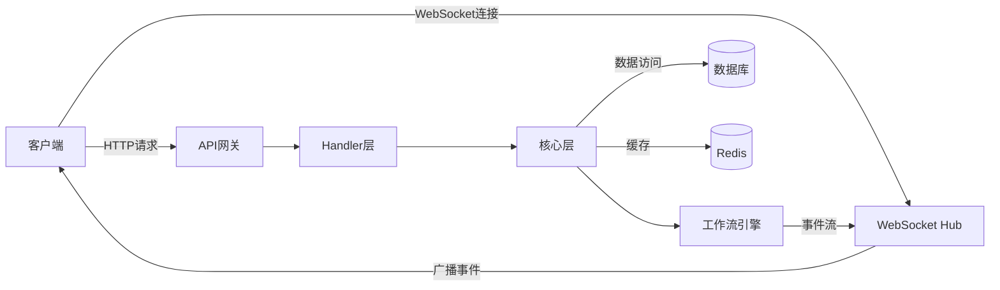
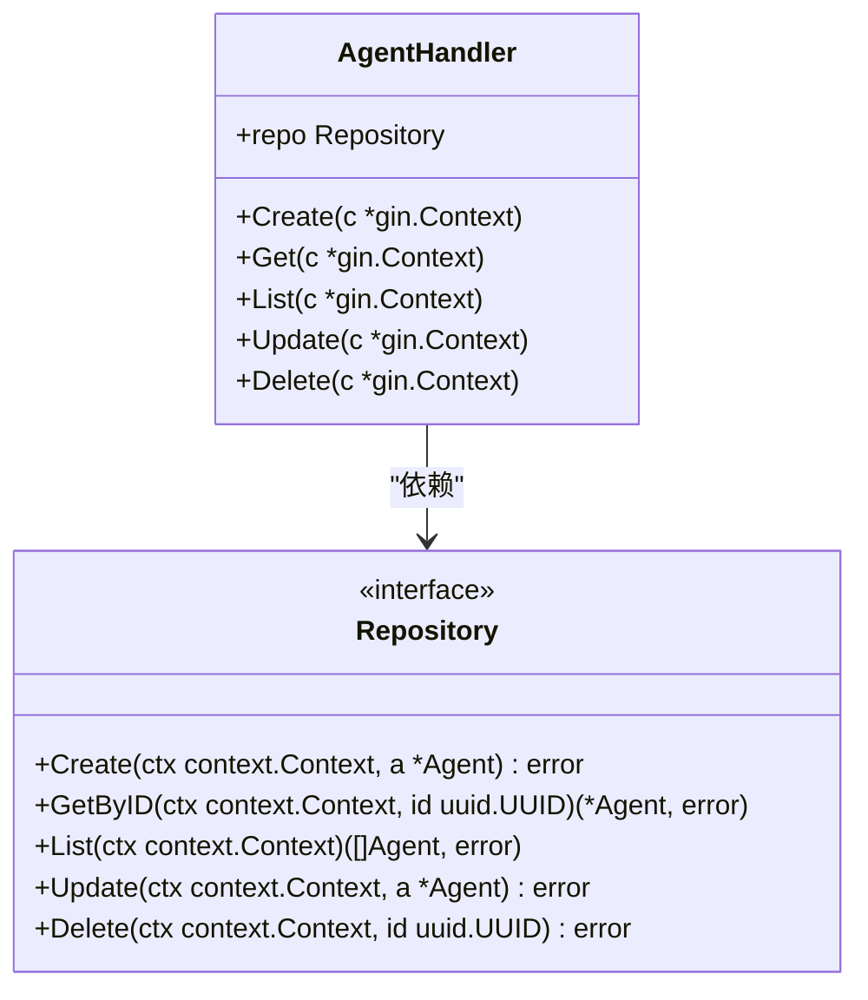
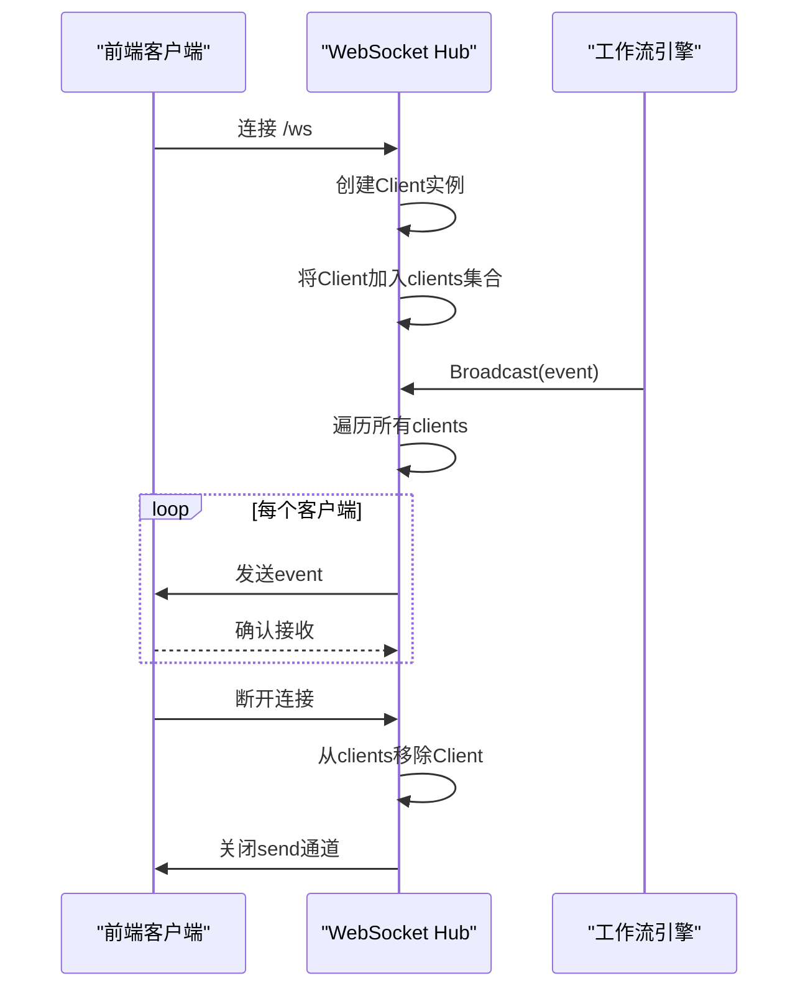
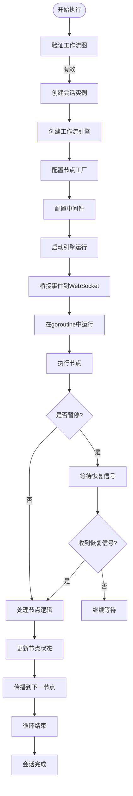
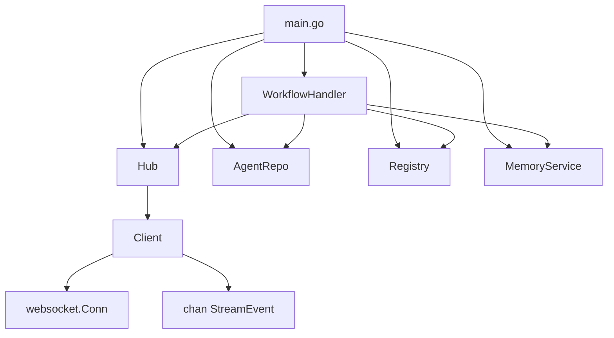

# API网关

<cite>
**本文档引用文件**  
- [main.go](file://cmd/council/main.go)
- [agent.go](file://internal/api/handler/agent.go)
- [group.go](file://internal/api/handler/group.go)
- [workflow.go](file://internal/api/handler/workflow.go)
- [template.go](file://internal/api/handler/template.go)
- [memory.go](file://internal/api/handler/memory.go)
- [hub.go](file://internal/api/ws/hub.go)
- [engine.go](file://internal/core/workflow/engine.go)
- [session.go](file://internal/core/workflow/session.go)
- [types.go](file://internal/core/workflow/types.go)
- [config.go](file://internal/pkg/config/config.go)
- [websocket.ts](file://frontend/src/types/websocket.ts)
</cite>

## 目录
1. [简介](#简介)
2. [项目结构](#项目结构)
3. [核心组件](#核心组件)
4. [架构概览](#架构概览)
5. [详细组件分析](#详细组件分析)
6. [依赖分析](#依赖分析)
7. [性能考虑](#性能考虑)
8. [故障排除指南](#故障排除指南)
9. [结论](#结论)

## 简介
本文档详细描述了基于Gin框架实现的RESTful API与WebSocket实时通信的集成架构。系统通过API网关统一管理智能体、群组、工作流、模板和记忆等资源的访问。RESTful API处理资源的增删改查操作，而WebSocket连接则用于实时推送工作流执行状态、节点事件和流式响应。该架构实现了HTTP接口与实时通信的无缝集成，支持复杂的工作流协调与状态同步。

## 项目结构
项目采用分层架构设计，主要分为`cmd`、`internal`和`frontend`三个顶层目录。`cmd/council/main.go`是应用入口，负责初始化所有核心服务和路由。`internal`目录包含应用的核心逻辑，分为`api`（处理HTTP和WebSocket请求）、`core`（业务逻辑和工作流引擎）、`infrastructure`（基础设施和数据访问）和`pkg`（通用包）。`frontend`目录包含前端代码，通过API与后端交互。

**图源**  
- [main.go](file://cmd/council/main.go#L1-L150)
- [project_structure](file://)

**本节来源**  
- [main.go](file://cmd/council/main.go#L1-L150)

## 核心组件
系统的核心组件包括RESTful API处理器、WebSocket中心（Hub）、工作流引擎和会话管理器。API处理器（如`AgentHandler`、`WorkflowHandler`）负责处理HTTP请求，验证输入并调用核心服务。WebSocket Hub管理所有客户端连接，接收来自工作流引擎的事件并广播给所有订阅者。工作流引擎（`Engine`）负责解析和执行工作流图，协调节点间的执行顺序。会话管理器（`Session`）跟踪每个工作流实例的执行状态，支持暂停、恢复和停止操作。

**本节来源**  
- [workflow.go](file://internal/api/handler/workflow.go#L37-L246)
- [engine.go](file://internal/core/workflow/engine.go#L12-L246)
- [session.go](file://internal/core/workflow/session.go#L24-L165)
- [hub.go](file://internal/api/ws/hub.go#L22-L125)

## 架构概览
系统采用微内核架构，以工作流引擎为核心，通过依赖注入将各种服务（如LLM注册表、记忆服务）连接起来。API网关作为外部访问的统一入口，将RESTful请求和WebSocket连接都路由到相应的处理器。当工作流开始执行时，引擎会生成一系列事件，这些事件通过`StreamChannel`发送到WebSocket Hub，由Hub广播给所有连接的客户端，实现执行状态的实时同步。

**图源**  
- [main.go](file://cmd/council/main.go#L52-L148)
- [hub.go](file://internal/api/ws/hub.go#L22-L125)
- [workflow.go](file://internal/api/handler/workflow.go#L58-L123)

## 详细组件分析

### RESTful API处理器分析
API处理器实现了资源的CRUD操作，每个处理器（如`AgentHandler`）都遵循相同的模式：接收请求、绑定JSON数据、调用存储库方法、返回响应。处理器与核心层通过接口（如`Repository`）解耦，便于测试和替换实现。

#### AgentHandler类图

**图源**  
- [agent.go](file://internal/api/handler/agent.go#L11-L99)

**本节来源**  
- [agent.go](file://internal/api/handler/agent.go#L11-L99)
- [group.go](file://internal/api/handler/group.go#L11-L99)

### WebSocket实时通信分析
WebSocket Hub采用发布-订阅模式管理客户端连接。当客户端通过`/ws`端点建立连接时，`ServeWs`函数会创建一个新的`Client`实例并将其注册到Hub中。工作流引擎通过调用`Hub.Broadcast`方法发送事件，Hub会将事件推送给所有注册的客户端。

#### WebSocket消息流序列图

**图源**  
- [hub.go](file://internal/api/ws/hub.go#L71-L73)
- [workflow.go](file://internal/api/handler/workflow.go#L110-L112)

**本节来源**  
- [hub.go](file://internal/api/ws/hub.go#L22-L125)
- [workflow.go](file://internal/api/handler/workflow.go#L106-L112)

### 工作流执行协调分析
工作流执行涉及多个组件的协同工作。`WorkflowHandler.Execute`方法启动一个工作流会话，创建`Engine`实例并运行在独立的goroutine中。引擎执行过程中产生的事件通过`StreamChannel`发送到WebSocket Hub，实现执行状态的实时更新。

#### 工作流执行流程图

**图源**  
- [workflow.go](file://internal/api/handler/workflow.go#L58-L123)
- [engine.go](file://internal/core/workflow/engine.go#L41-L50)

**本节来源**  
- [workflow.go](file://internal/api/handler/workflow.go#L58-L123)
- [engine.go](file://internal/core/workflow/engine.go#L41-L246)
- [session.go](file://internal/core/workflow/session.go#L51-L72)

## 依赖分析
系统通过清晰的依赖关系实现了组件间的解耦。`main.go`作为根容器，负责创建所有服务实例并注入到相应的处理器中。`WorkflowHandler`依赖`Hub`、`AgentRepo`、`Registry`和`MemoryService`，这些依赖通过`NewWorkflowHandler`构造函数注入。这种依赖注入模式使得组件易于测试和维护。

**图源**  
- [main.go](file://cmd/council/main.go#L82-L95)
- [workflow.go](file://internal/api/handler/workflow.go#L37-L51)

**本节来源**  
- [main.go](file://cmd/council/main.go#L82-L95)
- [workflow.go](file://internal/api/handler/workflow.go#L37-L51)
- [go.mod](file://go.mod#L1-L10)

## 性能考虑
系统在设计时考虑了多项性能优化。WebSocket Hub使用带缓冲的`send`通道（大小为256）来避免阻塞。工作流引擎使用`sync.RWMutex`进行并发控制，允许多个goroutine同时读取状态。数据库操作通过连接池（pgxpool）进行管理，减少连接开销。对于长时间运行的工作流，系统使用独立的goroutine执行，避免阻塞HTTP请求处理。

## 故障排除指南
常见问题包括WebSocket连接失败、工作流执行卡住和API响应超时。连接失败通常由CORS配置或网络问题引起，可通过检查浏览器控制台和服务器日志诊断。工作流卡住可能是由于节点未正确处理暂停状态，应检查`Session.WaitIfPaused`调用。API超时可能与数据库查询性能有关，建议检查慢查询日志。

**本节来源**  
- [hub.go](file://internal/api/ws/hub.go#L110-L124)
- [session.go](file://internal/core/workflow/session.go#L92-L108)
- [engine.go](file://internal/core/workflow/engine.go#L53-L67)

## 结论
该API网关成功实现了RESTful API与WebSocket实时通信的集成，为复杂的工作流系统提供了稳定可靠的访问接口。通过清晰的分层架构和依赖注入，系统具有良好的可维护性和可扩展性。未来可考虑增加更精细的认证授权机制和更完善的监控指标。