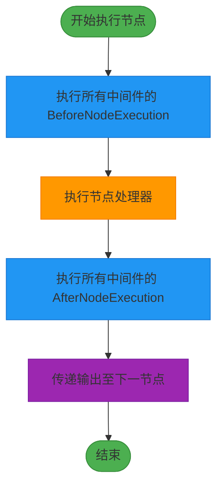
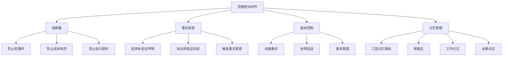
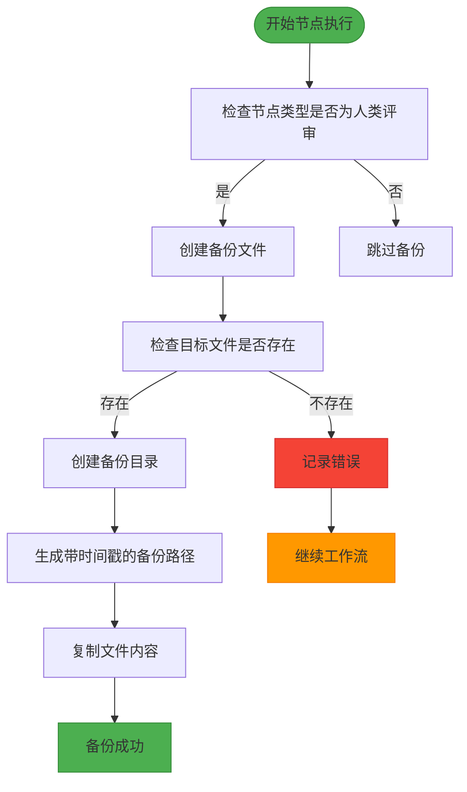
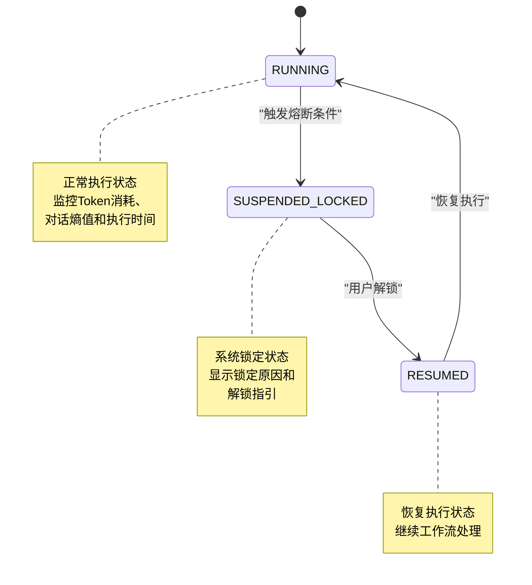
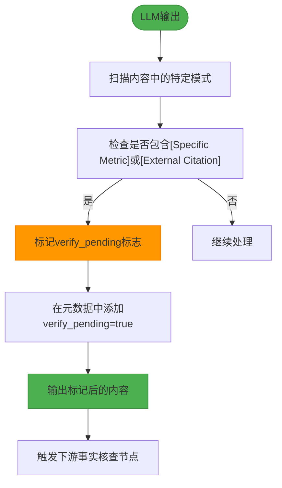
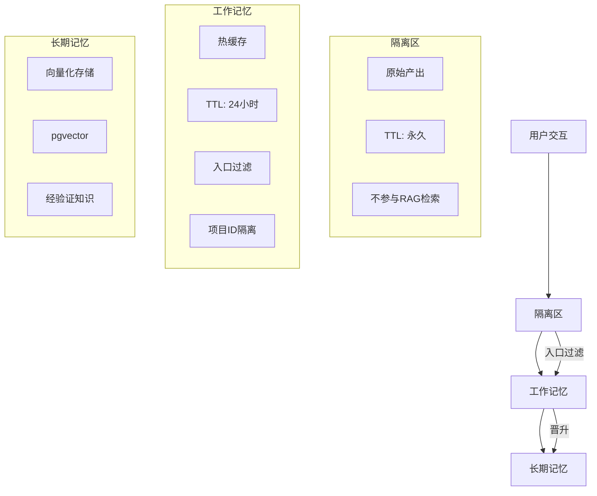

# 中间件层

<cite>
**本文档引用的文件**
- [versioning.go](file://internal/core/middleware/versioning.go)
- [circuit_breaker.go](file://internal/core/middleware/circuit_breaker.go)
- [fact_check.go](file://internal/core/middleware/fact_check.go)
- [memory.go](file://internal/core/middleware/memory.go)
- [middleware_test.go](file://internal/core/middleware/middleware_test.go)
- [types.go](file://internal/core/workflow/types.go)
- [engine.go](file://internal/core/workflow/engine.go)
- [service.go](file://internal/core/memory/service.go)
- [tavily.go](file://internal/infrastructure/search/tavily.go)
- [SPEC-409-circuit-breaker.md](file://docs/specs/backend/SPEC-409-circuit-breaker.md)
- [SPEC-410-anti-hallucination.md](file://docs/specs/backend/SPEC-410-anti-hallucination.md)
- [SPEC-408-memory-protocol.md](file://docs/specs/backend/SPEC-408-memory-protocol.md)
- [SPEC-605-versioning-middleware.md](file://docs/specs/sprint6/SPEC-605-versioning-middleware.md)
</cite>

## 目录
1. [引言](#引言)
2. [中间件执行链顺序](#中间件执行链顺序)
3. [防御性中间件设计理念](#防御性中间件设计理念)
4. [版本控制中间件](#版本控制中间件)
5. [熔断器中间件](#熔断器中间件)
6. [事实核查中间件](#事实核查中间件)
7. [记忆中间件](#记忆中间件)
8. [性能开销评估](#性能开销评估)
9. [配置参数说明](#配置参数说明)
10. [结论](#结论)

## 引言
中间件层是本系统的核心安全与观测机制，通过拦截工作流节点执行过程，实现防御性编程、版本控制、事实验证和记忆管理等功能。本文档详细阐述了各中间件的设计理念与实现细节，包括版本控制、熔断器、事实核查和记忆中间件的工作原理。

## 中间件执行链顺序
中间件在工作流引擎执行节点前后按特定顺序执行，形成完整的拦截链。执行顺序遵循注册顺序，确保各中间件功能正确叠加。

**图示来源**
- [engine.go](file://internal/core/workflow/engine.go#L92-L120)

**本节来源**
- [engine.go](file://internal/core/workflow/engine.go#L92-L120)
- [types.go](file://internal/core/workflow/types.go#L62-L66)

## 防御性中间件设计理念
防御性中间件旨在防止系统级联故障，通过预设的安全机制拦截潜在风险。设计遵循"预防优于修复"原则，确保系统稳定性和数据完整性。

**图示来源**
- [SPEC-409-circuit-breaker.md](file://docs/specs/backend/SPEC-409-circuit-breaker.md)
- [SPEC-410-anti-hallucination.md](file://docs/specs/backend/SPEC-410-anti-hallucination.md)
- [SPEC-408-memory-protocol.md](file://docs/specs/backend/SPEC-408-memory-protocol.md)

**本节来源**
- [SPEC-409-circuit-breaker.md](file://docs/specs/backend/SPEC-409-circuit-breaker.md)
- [SPEC-410-anti-hallucination.md](file://docs/specs/backend/SPEC-410-anti-hallucination.md)
- [SPEC-408-memory-protocol.md](file://docs/specs/backend/SPEC-408-memory-protocol.md)

## 版本控制中间件
版本控制中间件在人类评审节点执行前自动创建文件备份，支持后续回滚操作。该中间件实现了SPEC-605规范，确保关键决策点的数据可追溯性。

### 核心功能
- **自动备份**: 在人类评审节点执行前创建时间戳备份
- **版本管理**: 支持查找最新备份和列出所有备份
- **回滚支持**: 提供从备份恢复文件的功能

**图示来源**
- [versioning.go](file://internal/core/middleware/versioning.go#L31-L56)
- [SPEC-605-versioning-middleware.md](file://docs/specs/sprint6/SPEC-605-versioning-middleware.md)

**本节来源**
- [versioning.go](file://internal/core/middleware/versioning.go)
- [SPEC-605-versioning-middleware.md](file://docs/specs/sprint6/SPEC-605-versioning-middleware.md)

## 熔断器中间件
熔断器中间件监控系统执行状态，当检测到异常情况时立即中断执行，防止级联故障。该中间件基于滑动窗口算法和状态机模型实现。

### 状态转换逻辑
熔断器具有三种状态：运行、锁定和恢复。状态转换由预设条件触发。

### 触发条件
| 条件 | 阈值 | 说明 |
|------|------|------|
| Token消耗激增 | > 3倍预估 | 成本失控 |
| 死循环检测 | 连续3轮对话熵值 < 0.1 | 无效重复 |
| 执行超时 | > 10分钟 | 异常阻塞 |

**图示来源**
- [circuit_breaker.go](file://internal/core/middleware/circuit_breaker.go)
- [SPEC-409-circuit-breaker.md](file://docs/specs/backend/SPEC-409-circuit-breaker.md#L18-L30)

**本节来源**
- [circuit_breaker.go](file://internal/core/middleware/circuit_breaker.go)
- [SPEC-409-circuit-breaker.md](file://docs/specs/backend/SPEC-409-circuit-breaker.md)

## 事实核查中间件
事实核查中间件拦截LLM输出，通过正则表达式模式匹配检测未验证的声明，并标记待验证内容。该中间件与Tavily搜索服务集成，实现外部验证。

### 工作流程

### 模式匹配规则
- **MetricRegex**: `\[Specific Metric\]` - 标记需要验证的具体指标
- **CitationRegex**: `\[External Citation\]` - 标记需要外部引用的内容

**图示来源**
- [fact_check.go](file://internal/core/middleware/fact_check.go#L31-L52)
- [tavily.go](file://internal/infrastructure/search/tavily.go)

**本节来源**
- [fact_check.go](file://internal/core/middleware/fact_check.go)
- [tavily.go](file://internal/infrastructure/search/tavily.go)
- [SPEC-410-anti-hallucination.md](file://docs/specs/backend/SPEC-410-anti-hallucination.md)

## 记忆中间件
记忆中间件自动管理会话记忆上下文，实现三层记忆架构：隔离区、工作记忆和长期记忆。该中间件确保高质量知识的沉淀和低质量内容的隔离。

### 三层记忆架构

### 入口过滤机制
工作记忆层采用双重过滤机制：
1. **置信度过滤**: 置信度低于0.8的内容被拒绝
2. **内容长度过滤**: 少于50字符的内容被视为噪声

**图示来源**
- [memory.go](file://internal/core/middleware/memory.go)
- [service.go](file://internal/core/memory/service.go)
- [SPEC-408-memory-protocol.md](file://docs/specs/backend/SPEC-408-memory-protocol.md)

**本节来源**
- [memory.go](file://internal/core/middleware/memory.go)
- [service.go](file://internal/core/memory/service.go)
- [SPEC-408-memory-protocol.md](file://docs/specs/backend/SPEC-408-memory-protocol.md)

## 性能开销评估
各中间件的性能开销评估如下：

| 中间件 | 执行时机 | 平均延迟 | 资源消耗 | 失败影响 |
|-------|--------|--------|--------|--------|
| 版本控制 | 前置执行 | 10-50ms | 低 | 仅警告，不阻塞工作流 |
| 熔断器 | 前置执行 | <1ms | 极低 | 可能中断工作流 |
| 事实核查 | 后置处理 | 1-5ms | 低 | 不阻塞工作流 |
| 记忆中间件 | 后置处理 | 5-20ms | 中 | 仅警告，不阻塞工作流 |

**本节来源**
- [versioning.go](file://internal/core/middleware/versioning.go)
- [circuit_breaker.go](file://internal/core/middleware/circuit_breaker.go)
- [fact_check.go](file://internal/core/middleware/fact_check.go)
- [memory.go](file://internal/core/middleware/memory.go)

## 配置参数说明
各中间件的关键配置参数如下：

### 版本控制中间件
- **BackupDir**: 备份目录路径，用于存储版本备份文件

### 熔断器中间件
- **MaxRecursionDepth**: 最大递归深度，用于防止死循环

### 事实核查中间件
- **MetricRegex**: 指标模式正则表达式，用于检测需要验证的具体指标
- **CitationRegex**: 引用模式正则表达式，用于检测需要外部引用的内容

### 记忆中间件
- **Manager**: 记忆管理器实例，负责与底层存储交互

**本节来源**
- [versioning.go](file://internal/core/middleware/versioning.go#L18)
- [circuit_breaker.go](file://internal/core/middleware/circuit_breaker.go#L11)
- [fact_check.go](file://internal/core/middleware/fact_check.go#L12-L13)
- [memory.go](file://internal/core/middleware/memory.go#L13)

## 结论
中间件层通过精心设计的拦截机制，实现了系统的安全性、可观测性和稳定性。各中间件协同工作，形成了完整的防御体系：
- **版本控制中间件**确保关键决策点的可追溯性
- **熔断器中间件**防止系统级联故障
- **事实核查中间件**保证输出内容的准确性
- **记忆中间件**实现高质量知识的沉淀

这些中间件共同构成了系统的核心防御机制，为复杂工作流的可靠执行提供了保障。