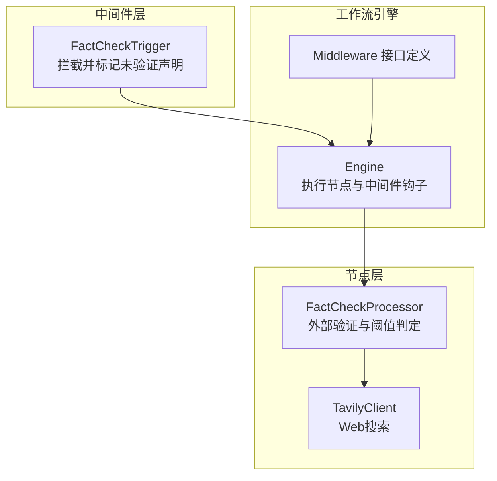
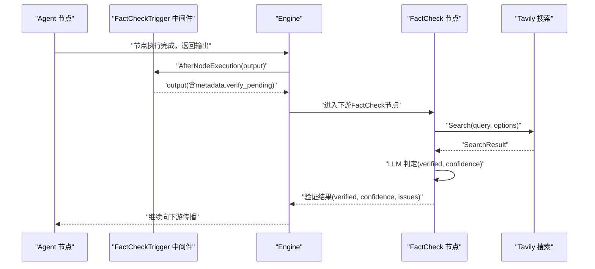
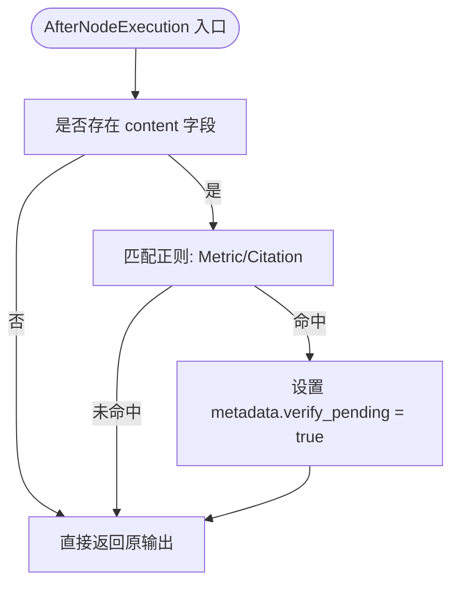
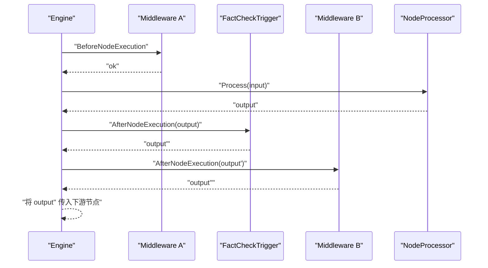
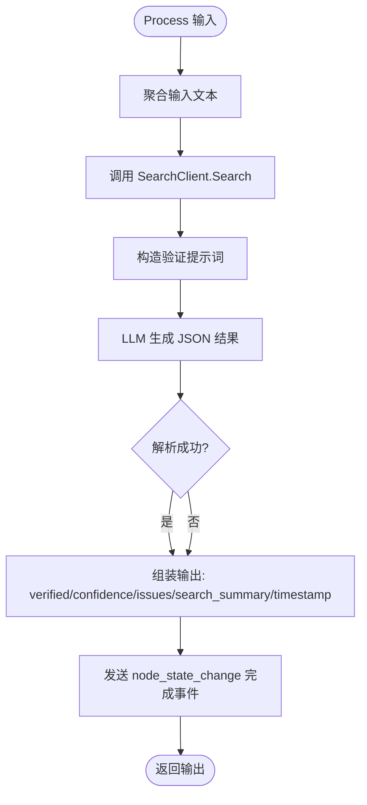
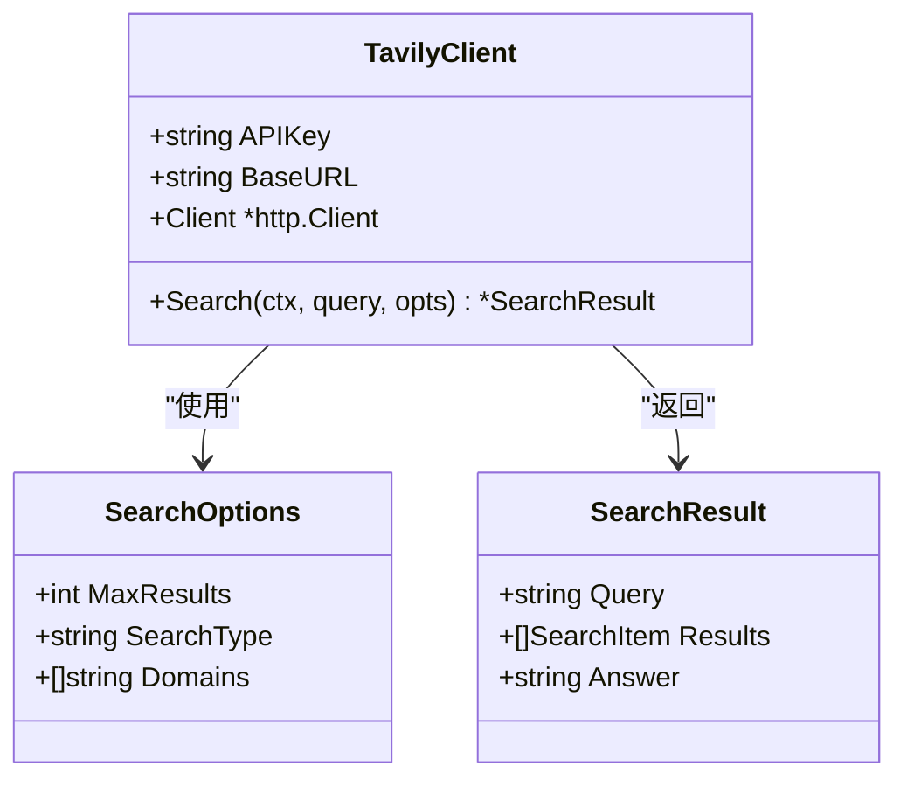
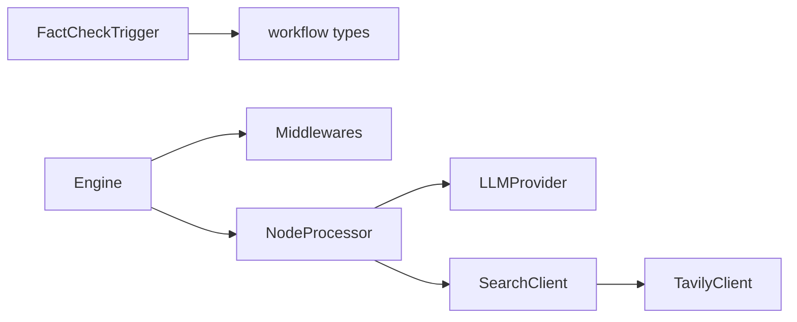

# 事实核查中间件

<cite>
**本文引用的文件列表**
- [internal/core/middleware/fact_check.go](file://internal/core/middleware/fact_check.go)
- [internal/core/workflow/engine.go](file://internal/core/workflow/engine.go)
- [internal/core/workflow/types.go](file://internal/core/workflow/types.go)
- [internal/core/workflow/nodes/fact_check.go](file://internal/core/workflow/nodes/fact_check.go)
- [internal/infrastructure/search/tavily.go](file://internal/infrastructure/search/tavily.go)
- [docs/specs/backend/SPEC-410-anti-hallucination.md](file://docs/specs/backend/SPEC-410-anti-hallucination.md)
- [docs/tdd/02_core/12_fact_check.md](file://docs/tdd/02_core/12_fact_check.md)
- [internal/api/handler/workflow.go](file://internal/api/handler/workflow.go)
- [frontend/src/features/editor/components/PropertyPanel/NodeForms/FactCheckNodeForm.tsx](file://frontend/src/features/editor/components/PropertyPanel/NodeForms/FactCheckNodeForm.tsx)
- [internal/core/middleware/middleware_test.go](file://internal/core/middleware/middleware_test.go)
- [internal/core/workflow/nodes/fact_check_test.go](file://internal/core/workflow/nodes/fact_check_test.go)
- [internal/pkg/config/config.go](file://internal/pkg/config/config.go)
</cite>

## 目录
1. [引言](#引言)
2. [项目结构](#项目结构)
3. [核心组件](#核心组件)
4. [架构总览](#架构总览)
5. [详细组件分析](#详细组件分析)
6. [依赖关系分析](#依赖关系分析)
7. [性能考量](#性能考量)
8. [故障排查指南](#故障排查指南)
9. [结论](#结论)
10. [附录](#附录)

## 引言
本文件系统性说明事实核查中间件的实现与工作机制，重点解释其如何在工作流中拦截智能体输出、识别潜在未验证声明，并通过Tavily搜索与LLM综合判断进行外部验证。文档结合SPEC-410说明其在工作流中的执行时机与策略配置（如置信度阈值），并提供拦截案例与调试日志分析，帮助开发者理解其决策逻辑与对响应延迟的影响，以及可采取的缓存优化策略。

## 项目结构
事实核查中间件涉及三个层面：
- 中间件层：在节点执行前后注入检查与标记逻辑
- 工作流引擎：统一编排节点执行与中间件钩子
- 节点层：FactCheckProcessor负责具体验证流程与阈值控制

图表来源
- [internal/core/middleware/fact_check.go](file://internal/core/middleware/fact_check.go#L1-L52)
- [internal/core/workflow/engine.go](file://internal/core/workflow/engine.go#L92-L120)
- [internal/core/workflow/types.go](file://internal/core/workflow/types.go#L61-L66)
- [internal/core/workflow/nodes/fact_check.go](file://internal/core/workflow/nodes/fact_check.go#L1-L114)
- [internal/infrastructure/search/tavily.go](file://internal/infrastructure/search/tavily.go#L1-L154)

章节来源
- [internal/core/middleware/fact_check.go](file://internal/core/middleware/fact_check.go#L1-L52)
- [internal/core/workflow/engine.go](file://internal/core/workflow/engine.go#L92-L120)
- [internal/core/workflow/types.go](file://internal/core/workflow/types.go#L61-L66)
- [internal/core/workflow/nodes/fact_check.go](file://internal/core/workflow/nodes/fact_check.go#L1-L114)
- [internal/infrastructure/search/tavily.go](file://internal/infrastructure/search/tavily.go#L1-L154)

## 核心组件
- 中间件 FactCheckTrigger：在节点执行后扫描输出内容，命中特定模式即在元数据中标记“verify_pending”，用于驱动下游FactCheck节点进行验证。
- 工作流引擎 Engine：在节点执行前后依次调用中间件钩子，保证拦截逻辑在节点输出之后、下一节点输入之前生效。
- 节点 FactCheckProcessor：聚合文本、调用Tavily搜索、构造提示词并使用LLM判断，输出verified、confidence、issues等字段，并支持阈值控制。
- 搜索客户端 TavilyClient：封装Tavily API调用，支持超时、错误处理与结果解析。

章节来源
- [internal/core/middleware/fact_check.go](file://internal/core/middleware/fact_check.go#L1-L52)
- [internal/core/workflow/engine.go](file://internal/core/workflow/engine.go#L92-L120)
- [internal/core/workflow/nodes/fact_check.go](file://internal/core/workflow/nodes/fact_check.go#L1-L114)
- [internal/infrastructure/search/tavily.go](file://internal/infrastructure/search/tavily.go#L1-L154)

## 架构总览
事实核查中间件在工作流中的执行时机如下：
- BeforeNodeExecution：当前实现为空操作，预留扩展点
- AfterNodeExecution：扫描节点输出，命中未验证声明则在metadata中设置verify_pending
- 下游FactCheck节点：读取verify_pending或claims，执行外部验证与阈值判定

图表来源
- [internal/core/middleware/fact_check.go](file://internal/core/middleware/fact_check.go#L31-L51)
- [internal/core/workflow/engine.go](file://internal/core/workflow/engine.go#L92-L120)
- [internal/core/workflow/nodes/fact_check.go](file://internal/core/workflow/nodes/fact_check.go#L20-L114)
- [internal/infrastructure/search/tavily.go](file://internal/infrastructure/search/tavily.go#L80-L143)

章节来源
- [internal/core/middleware/fact_check.go](file://internal/core/middleware/fact_check.go#L27-L51)
- [internal/core/workflow/engine.go](file://internal/core/workflow/engine.go#L92-L120)
- [internal/core/workflow/nodes/fact_check.go](file://internal/core/workflow/nodes/fact_check.go#L20-L114)
- [internal/infrastructure/search/tavily.go](file://internal/infrastructure/search/tavily.go#L80-L143)

## 详细组件分析

### 中间件：FactCheckTrigger
- 触发条件：扫描输出中的content字段，匹配特定正则（如“[Specific Metric]”、“[External Citation]”）
- 行为：若命中，则在metadata中设置verify_pending=true，作为下游FactCheck节点的信号
- 设计意图：在不阻断主流程的前提下，对潜在未验证声明进行标记，交由专门节点处理

图表来源
- [internal/core/middleware/fact_check.go](file://internal/core/middleware/fact_check.go#L31-L51)

章节来源
- [internal/core/middleware/fact_check.go](file://internal/core/middleware/fact_check.go#L10-L51)
- [internal/core/middleware/middleware_test.go](file://internal/core/middleware/middleware_test.go#L24-L39)

### 工作流引擎：中间件钩子执行顺序
- BeforeNodeExecution：按注册顺序依次调用
- 节点执行：调用节点处理器的Process
- AfterNodeExecution：按注册顺序依次调用，输出经中间件链路传递给下游节点

图表来源
- [internal/core/workflow/engine.go](file://internal/core/workflow/engine.go#L92-L120)
- [internal/core/workflow/types.go](file://internal/core/workflow/types.go#L61-L66)

章节来源
- [internal/core/workflow/engine.go](file://internal/core/workflow/engine.go#L92-L120)
- [internal/core/workflow/types.go](file://internal/core/workflow/types.go#L61-L66)

### 节点：FactCheckProcessor
- 输入聚合：遍历输入中的字符串值，拼接为待验证文本
- 搜索阶段：调用SearchClient.Search，支持answer与结果列表摘要
- LLM判定：构造JSON格式提示词，要求LLM输出verified、confidence、issues
- 结果输出：包含verified、confidence、issues、search_summary、timestamp等字段
- 阈值控制：节点内部持有VerifyThreshold，用于决定整体通过与否（在测试中可见）

图表来源
- [internal/core/workflow/nodes/fact_check.go](file://internal/core/workflow/nodes/fact_check.go#L20-L114)

章节来源
- [internal/core/workflow/nodes/fact_check.go](file://internal/core/workflow/nodes/fact_check.go#L1-L114)
- [internal/core/workflow/nodes/fact_check_test.go](file://internal/core/workflow/nodes/fact_check_test.go#L1-L61)

### 搜索客户端：TavilyClient
- 能力：封装Tavily API请求，支持最大结果数、是否包含答案、域名过滤等
- 错误处理：API Key缺失、HTTP错误、JSON解码失败均返回明确错误
- 超时控制：内置10秒超时，避免阻塞工作流

图表来源
- [internal/infrastructure/search/tavily.go](file://internal/infrastructure/search/tavily.go#L1-L154)

章节来源
- [internal/infrastructure/search/tavily.go](file://internal/infrastructure/search/tavily.go#L1-L154)

### 执行时机与策略配置（结合SPEC-410）
- 执行时机：中间件在AfterNodeExecution阶段对输出进行扫描与标记；下游FactCheck节点负责验证与阈值判定
- 策略配置：
  - 置信度阈值：节点属性中包含verify_threshold，前端表单提供滑杆调整
  - 搜索源：前端表单支持选择Tavily、Serper、Local KB等搜索源
  - 最大查询数：前端表单提供max_queries范围配置
- 严格/宽松模式：当前实现以verify_threshold作为主要策略开关；严格模式可提高阈值，宽松模式降低阈值

章节来源
- [docs/specs/backend/SPEC-410-anti-hallucination.md](file://docs/specs/backend/SPEC-410-anti-hallucination.md#L1-L157)
- [docs/tdd/02_core/12_fact_check.md](file://docs/tdd/02_core/12_fact_check.md#L1-L84)
- [frontend/src/features/editor/components/PropertyPanel/NodeForms/FactCheckNodeForm.tsx](file://frontend/src/features/editor/components/PropertyPanel/NodeForms/FactCheckNodeForm.tsx#L1-L88)
- [internal/core/workflow/nodes/fact_check_test.go](file://internal/core/workflow/nodes/fact_check_test.go#L1-L61)

### 置信度评分体系与决策
- 置信度来源：FactCheckProcessor在LLM生成的JSON中读取confidence字段
- 决策规则：节点内部持有VerifyThreshold，用于判断整体通过与否；测试用例展示了不同confidence下的行为
- 问题记录：issues字段用于记录潜在不一致或需要修正的内容

章节来源
- [internal/core/workflow/nodes/fact_check.go](file://internal/core/workflow/nodes/fact_check.go#L65-L114)
- [internal/core/workflow/nodes/fact_check_test.go](file://internal/core/workflow/nodes/fact_check_test.go#L1-L61)

### 实际拦截案例与调试日志分析
- 案例一：命中“[Specific Metric]”
  - 触发条件：AfterNodeExecution扫描到content包含该模式
  - 行为：在metadata中设置verify_pending=true
  - 影响：下游FactCheck节点将优先处理该消息
- 案例二：命中“[External Citation]”
  - 触发条件：AfterNodeExecution扫描到content包含该模式
  - 行为：同样设置verify_pending=true
- 调试日志：
  - Engine在节点状态变化时发出node_state_change事件，便于前端与后端追踪
  - FactCheckProcessor在开始与结束时分别发出状态事件，便于观察验证进度

章节来源
- [internal/core/middleware/fact_check.go](file://internal/core/middleware/fact_check.go#L31-L51)
- [internal/core/workflow/engine.go](file://internal/core/workflow/engine.go#L101-L110)
- [internal/core/workflow/nodes/fact_check.go](file://internal/core/workflow/nodes/fact_check.go#L20-L25)
- [internal/core/workflow/nodes/fact_check.go](file://internal/core/workflow/nodes/fact_check.go#L106-L113)
- [internal/core/middleware/middleware_test.go](file://internal/core/middleware/middleware_test.go#L24-L39)

## 依赖关系分析
- 中间件依赖：依赖workflow.Session与workflow.Node类型，以便在AfterNodeExecution中访问输出
- 节点依赖：依赖llm.LLMProvider与search.SearchClient接口，便于替换不同提供商
- 搜索客户端：依赖http.Client与环境变量（如TAVILY_API_KEY），并提供超时控制
- 工作流引擎：统一调度中间件与节点，保证执行顺序与错误传播

图表来源
- [internal/core/middleware/fact_check.go](file://internal/core/middleware/fact_check.go#L1-L52)
- [internal/core/workflow/engine.go](file://internal/core/workflow/engine.go#L92-L120)
- [internal/core/workflow/types.go](file://internal/core/workflow/types.go#L61-L66)
- [internal/core/workflow/nodes/fact_check.go](file://internal/core/workflow/nodes/fact_check.go#L1-L114)
- [internal/infrastructure/search/tavily.go](file://internal/infrastructure/search/tavily.go#L1-L154)

章节来源
- [internal/core/middleware/fact_check.go](file://internal/core/middleware/fact_check.go#L1-L52)
- [internal/core/workflow/engine.go](file://internal/core/workflow/engine.go#L92-L120)
- [internal/core/workflow/types.go](file://internal/core/workflow/types.go#L61-L66)
- [internal/core/workflow/nodes/fact_check.go](file://internal/core/workflow/nodes/fact_check.go#L1-L114)
- [internal/infrastructure/search/tavily.go](file://internal/infrastructure/search/tavily.go#L1-L154)

## 性能考量
- 延迟来源：
  - 搜索调用：TavilyClient默认超时10秒，且在API Key缺失或网络异常时返回错误
  - LLM调用：FactCheckProcessor使用较低温度生成更稳定的JSON输出
- 缓存优化建议：
  - 搜索结果缓存：对相同查询在一定时间窗口内复用结果，减少重复调用
  - LLM输出缓存：对相同提示词的验证结果进行缓存，避免重复推理
  - 增量验证：仅对新增或变更的声明进行验证，而非整段重算
  - 并行化：在多分支工作流中并行执行FactCheck节点，缩短总时延

章节来源
- [internal/infrastructure/search/tavily.go](file://internal/infrastructure/search/tavily.go#L70-L80)
- [internal/infrastructure/search/tavily.go](file://internal/infrastructure/search/tavily.go#L111-L120)
- [internal/core/workflow/nodes/fact_check.go](file://internal/core/workflow/nodes/fact_check.go#L65-L96)

## 故障排查指南
- 中间件未生效
  - 检查中间件是否正确注册到Engine.Middlewares
  - 确认AfterNodeExecution返回的output包含metadata字段
- 未触发验证
  - 确认content中包含“[Specific Metric]”或“[External Citation]”模式
  - 可在测试中参考单元测试用例
- 搜索失败
  - 检查TAVILY_API_KEY是否配置
  - 关注TavilyClient返回的状态码与错误信息
- LLM判定异常
  - 确认提示词格式与LLM输出JSON结构一致
  - 参考测试用例中对verified与confidence的断言

章节来源
- [internal/api/handler/workflow.go](file://internal/api/handler/workflow.go#L83-L90)
- [internal/core/middleware/middleware_test.go](file://internal/core/middleware/middleware_test.go#L24-L39)
- [internal/infrastructure/search/tavily.go](file://internal/infrastructure/search/tavily.go#L80-L120)
- [internal/core/workflow/nodes/fact_check_test.go](file://internal/core/workflow/nodes/fact_check_test.go#L1-L61)

## 结论
事实核查中间件通过在节点执行后对输出进行轻量扫描与标记，将潜在未验证声明交由专门的FactCheck节点进行外部验证与阈值判定。该设计在不阻断主流程的前提下，有效降低了LLM幻觉在工作流中的传播风险。结合SPEC-410与前端配置，开发者可通过置信度阈值、搜索源与查询上限等策略灵活控制严格/宽松模式。在性能方面，建议引入缓存与并行化以降低响应延迟。

## 附录
- 环境变量与配置
  - TAVILY_API_KEY：用于启用Tavily搜索
  - 其他LLM与嵌入配置：见全局配置加载逻辑

章节来源
- [internal/pkg/config/config.go](file://internal/pkg/config/config.go#L1-L133)