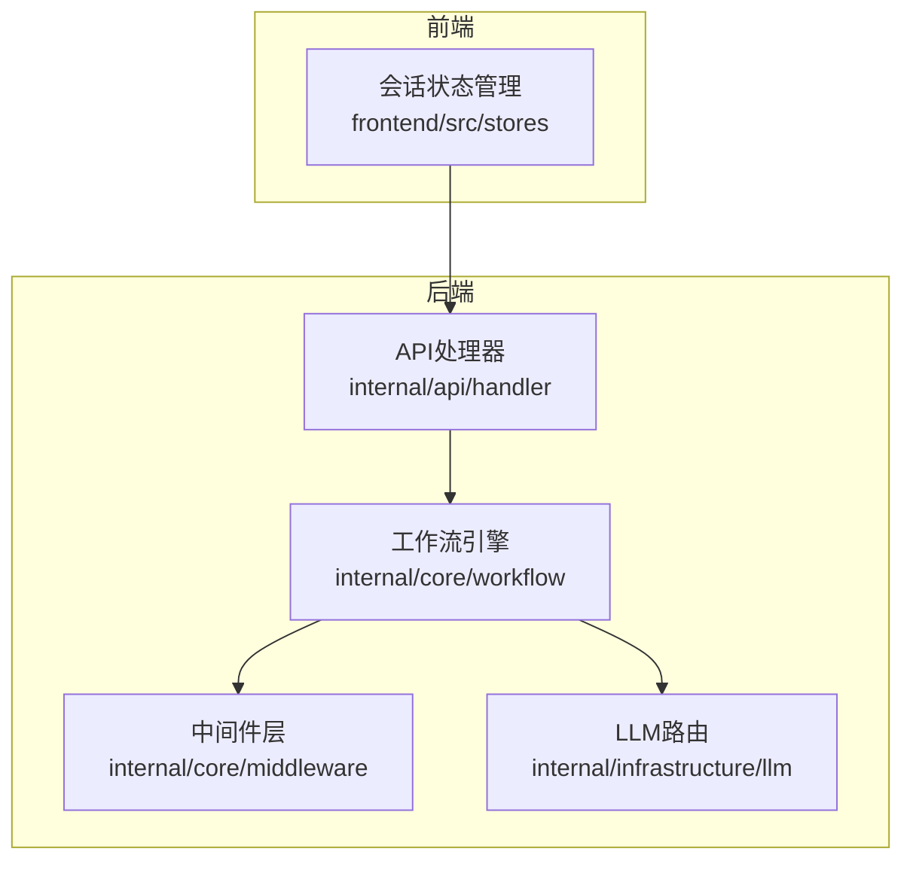
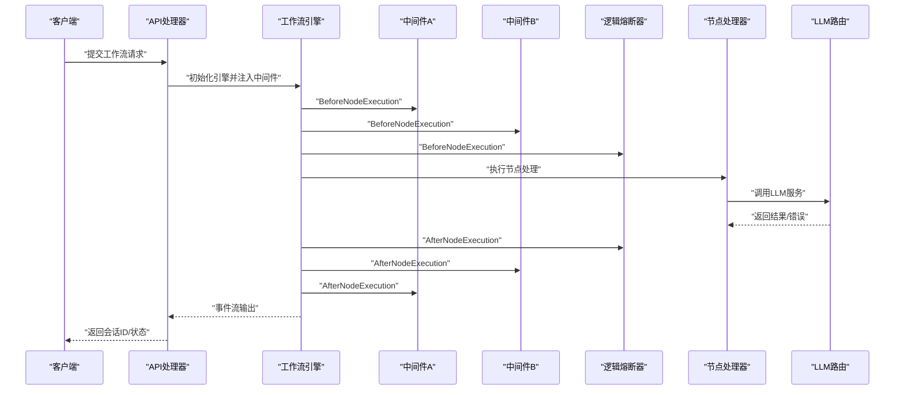
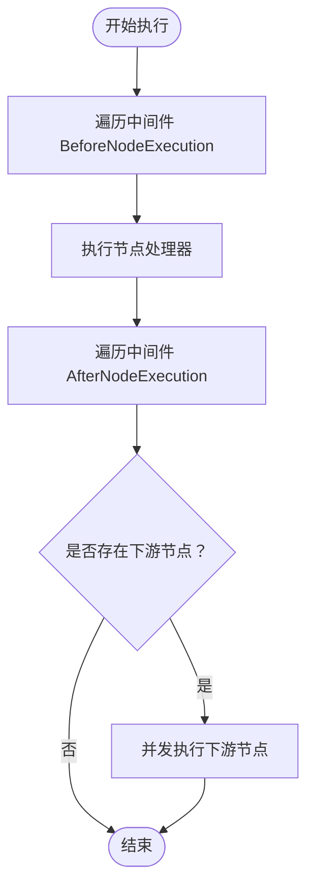
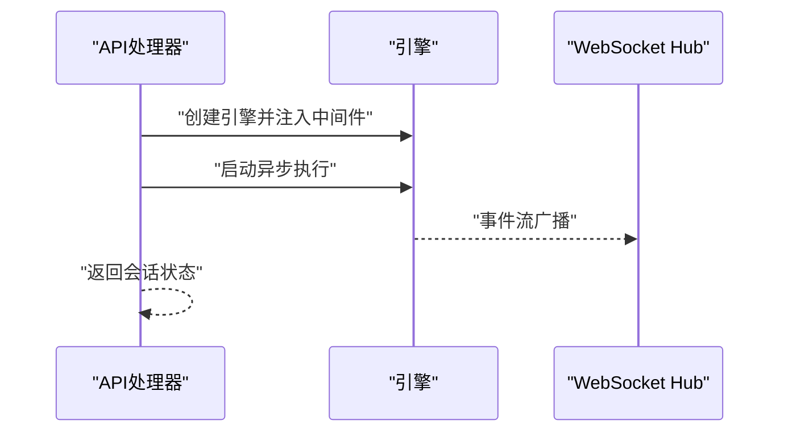
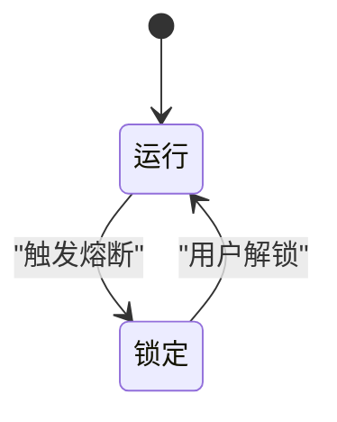
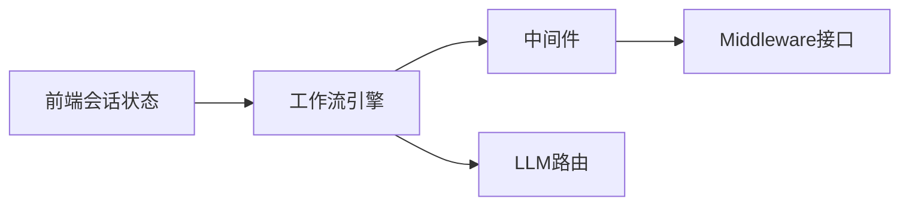

# 熔断器中间件

<cite>
**本文引用的文件列表**
- [circuit_breaker.go](file://internal/core/middleware/circuit_breaker.go)
- [types.go](file://internal/core/workflow/types.go)
- [engine.go](file://internal/core/workflow/engine.go)
- [workflow.go](file://internal/api/handler/workflow.go)
- [SPEC-409-circuit-breaker.md](file://docs/specs/backend/SPEC-409-circuit-breaker.md)
- [router.go](file://internal/infrastructure/llm/router.go)
- [useSessionStore.ts](file://frontend/src/stores/useSessionStore.ts)
- [middleware_test.go](file://internal/core/middleware/middleware_test.go)
</cite>

## 目录
1. [简介](#简介)
2. [项目结构](#项目结构)
3. [核心组件](#核心组件)
4. [架构总览](#架构总览)
5. [详细组件分析](#详细组件分析)
6. [依赖关系分析](#依赖关系分析)
7. [性能考量](#性能考量)
8. [故障排查指南](#故障排查指南)
9. [结论](#结论)
10. [附录](#附录)

## 简介
本技术文档围绕“逻辑熔断器中间件”展开，目标是帮助读者理解该中间件如何在工作流引擎中拦截节点执行，以防止级联故障与资源滥用。文档重点覆盖：
- 设计目标：在高并发与LLM调用场景下，通过深度限制、Token消耗激增检测、死循环检测与执行超时等手段，避免下游服务雪崩。
- 状态机与超时机制：基于SPEC-409定义的状态机与超时策略，结合前端解锁流程，确保系统在异常状态下可控恢复。
- 滑动窗口算法思路：虽然当前仓库中的中间件实现为占位符，但SPEC-409提供了滑动窗口用于熵值检测的完整设计，可用于指导后续实现。
- 集成方式：中间件通过责任链模式挂载到工作流引擎，贯穿Before/After节点执行阶段，影响吞吐与延迟。
- 性能与影响：从中间件钩子、事件流与并发执行角度分析对系统整体性能的影响。

## 项目结构
与熔断器中间件直接相关的模块包括：
- 中间件层：位于 internal/core/middleware，包含逻辑熔断器占位实现与通用中间件接口。
- 工作流引擎：位于 internal/core/workflow，负责节点执行、中间件链路与事件流。
- API处理器：在内部路由中注册中间件，驱动工作流执行。
- 文档规范：docs/specs/backend/SPEC-409-circuit-breaker.md 提供了熔断器的触发条件、状态机与前端交互。
- 前端会话存储：前端使用会话状态管理记录节点Token用量，为熔断监控提供数据来源。



图表来源
- [workflow.go](file://internal/api/handler/workflow.go#L83-L123)
- [engine.go](file://internal/core/workflow/engine.go#L41-L139)
- [circuit_breaker.go](file://internal/core/middleware/circuit_breaker.go#L1-L39)
- [router.go](file://internal/infrastructure/llm/router.go#L1-L177)
- [useSessionStore.ts](file://frontend/src/stores/useSessionStore.ts#L243-L266)

章节来源
- [workflow.go](file://internal/api/handler/workflow.go#L83-L123)
- [engine.go](file://internal/core/workflow/engine.go#L41-L139)
- [circuit_breaker.go](file://internal/core/middleware/circuit_breaker.go#L1-L39)
- [SPEC-409-circuit-breaker.md](file://docs/specs/backend/SPEC-409-circuit-breaker.md#L1-L208)
- [useSessionStore.ts](file://frontend/src/stores/useSessionStore.ts#L243-L266)

## 核心组件
- 中间件接口：定义 BeforeNodeExecution 与 AfterNodeExecution 两个钩子，用于在节点执行前后进行拦截与校验。
- 逻辑熔断器中间件：当前实现为占位，保留深度限制参数与钩子入口；具体熔断逻辑（Token激增、死循环、超时）由SPEC-409定义，可在后续迭代中落地。
- 工作流引擎：在节点执行前依次调用所有中间件的 BeforeNodeExecution，执行完成后依次调用 AfterNodeExecution，形成责任链。
- API处理器：在创建引擎时注入中间件链，启动异步执行并将引擎事件桥接至WebSocket广播。
- LLM路由：为LLM调用提供统一的供应商选择与模型配置，是熔断保护的重要下游依赖。

章节来源
- [types.go](file://internal/core/workflow/types.go#L61-L66)
- [circuit_breaker.go](file://internal/core/middleware/circuit_breaker.go#L9-L39)
- [engine.go](file://internal/core/workflow/engine.go#L92-L119)
- [workflow.go](file://internal/api/handler/workflow.go#L83-L123)
- [router.go](file://internal/infrastructure/llm/router.go#L1-L177)

## 架构总览
下图展示了从API请求到节点执行、中间件拦截与事件流的全链路：



图表来源
- [workflow.go](file://internal/api/handler/workflow.go#L83-L123)
- [engine.go](file://internal/core/workflow/engine.go#L92-L119)
- [circuit_breaker.go](file://internal/core/middleware/circuit_breaker.go#L21-L38)
- [router.go](file://internal/infrastructure/llm/router.go#L1-L177)

## 详细组件分析

### 逻辑熔断器中间件（占位实现）
- 结构与职责
  - 字段：最大递归深度参数，用于后续深度限制逻辑。
  - 方法：Name 返回中间件标识；BeforeNodeExecution 与 AfterNodeExecution 提供钩子入口。
- 当前行为
  - BeforeNodeExecution：预留深度检查逻辑，当前返回空操作。
  - AfterNodeExecution：预留Token速率/用量检查，当前直接透传输出。
- 后续演进
  - 可结合SPEC-409的Monitor函数实现滑动窗口与超时检测，接入事件流以统计Token激增与死循环。

```mermaid
classDiagram
class CircuitBreaker {
+int MaxRecursionDepth
+Name() string
+BeforeNodeExecution(ctx, session, node) error
+AfterNodeExecution(ctx, session, node, output) map~string,interface{}~, error
}
class Middleware {
<<interface>>
+Name() string
+BeforeNodeExecution(ctx, session, node) error
+AfterNodeExecution(ctx, session, node, output) map~string,interface{}~, error
}
CircuitBreaker ..|> Middleware : "实现"
```

图表来源
- [circuit_breaker.go](file://internal/core/middleware/circuit_breaker.go#L9-L39)
- [types.go](file://internal/core/workflow/types.go#L61-L66)

章节来源
- [circuit_breaker.go](file://internal/core/middleware/circuit_breaker.go#L9-L39)
- [types.go](file://internal/core/workflow/types.go#L61-L66)
- [middleware_test.go](file://internal/core/middleware/middleware_test.go#L11-L22)

### 工作流引擎与中间件链
- 责任链执行顺序
  - BeforeNodeExecution：按注册顺序依次调用。
  - 执行节点处理器：若节点处理器返回ErrSuspended，则暂停执行。
  - AfterNodeExecution：按注册顺序依次调用，允许对输出进行二次处理。
- 并发与传播
  - 引擎在分支场景采用并发执行下游节点，保证吞吐。
  - 事件通过StreamChannel广播，API层将其桥接到WebSocket。



图表来源
- [engine.go](file://internal/core/workflow/engine.go#L92-L139)

章节来源
- [engine.go](file://internal/core/workflow/engine.go#L41-L139)

### API处理器中的中间件集成
- 注册中间件链：在创建引擎时注入逻辑熔断器、事实核查与内存中间件。
- 异步执行：在独立goroutine中运行引擎，同时将StreamChannel事件广播至WebSocket Hub。
- 会话生命周期：在defer中完成会话收尾，确保资源释放与状态更新。



图表来源
- [workflow.go](file://internal/api/handler/workflow.go#L83-L123)

章节来源
- [workflow.go](file://internal/api/handler/workflow.go#L83-L123)

### SPEC-409：滑动窗口与状态机设计
- 触发条件
  - Token消耗激增：实际Token用量超过预估用量的阈值倍数。
  - 死循环检测：连续多轮对话的熵值低于阈值。
  - 执行超时：单次执行超过设定时长。
- 状态机
  - RUNNING（运行）、SUSPENDED_LOCKED（锁定）、RESUMED（恢复）。
- 监控与触发
  - Monitor函数持续监听事件流，维护熵值历史与起始时间，满足任一触发条件即Trip并发送前端事件。
- 解锁流程
  - 前端需要用户提供风险陈述或完成三项安全自查，验证通过后方可恢复。



图表来源
- [SPEC-409-circuit-breaker.md](file://docs/specs/backend/SPEC-409-circuit-breaker.md#L18-L31)
- [SPEC-409-circuit-breaker.md](file://docs/specs/backend/SPEC-409-circuit-breaker.md#L52-L106)
- [SPEC-409-circuit-breaker.md](file://docs/specs/backend/SPEC-409-circuit-breaker.md#L110-L129)

章节来源
- [SPEC-409-circuit-breaker.md](file://docs/specs/backend/SPEC-409-circuit-breaker.md#L1-L208)

### 前端交互与事件流
- 会话状态管理：前端store聚合节点与消息的Token用量，便于熔断监控与可视化。
- 事件接收：当熔断被触发时，后端通过事件通道推送“circuit_breaker:tripped”，前端弹出解锁模态框，引导用户确认风险或完成安全自查后恢复。

章节来源
- [useSessionStore.ts](file://frontend/src/stores/useSessionStore.ts#L243-L266)
- [SPEC-409-circuit-breaker.md](file://docs/specs/backend/SPEC-409-circuit-breaker.md#L92-L106)

## 依赖关系分析
- 中间件与引擎
  - 中间件实现Middleware接口，引擎在节点执行前后调用钩子，耦合度低、扩展性强。
- 中间件与LLM
  - LLM路由作为下游依赖，熔断器通过事件流与会话状态间接感知Token用量与对话内容，从而做出熔断决策。
- 中间件与前端
  - 事件流与前端模态联动，形成闭环的安全控制。



图表来源
- [types.go](file://internal/core/workflow/types.go#L61-L66)
- [engine.go](file://internal/core/workflow/engine.go#L92-L119)
- [router.go](file://internal/infrastructure/llm/router.go#L1-L177)
- [useSessionStore.ts](file://frontend/src/stores/useSessionStore.ts#L243-L266)

章节来源
- [types.go](file://internal/core/workflow/types.go#L61-L66)
- [engine.go](file://internal/core/workflow/engine.go#L92-L119)
- [router.go](file://internal/infrastructure/llm/router.go#L1-L177)
- [useSessionStore.ts](file://frontend/src/stores/useSessionStore.ts#L243-L266)

## 性能考量
- 中间件钩子开销
  - Before/After钩子应保持轻量，避免引入额外延迟；当前实现为占位，不会对性能造成显著影响。
- 事件流与并发
  - 引擎在分支场景并发执行下游节点，有利于提升吞吐；但需注意事件流广播与WebSocket广播的背压。
- LLM调用与Token统计
  - Token用量与熵值计算应在事件流中异步统计，避免阻塞主执行路径。
- 超时与恢复
  - 合理设置超时阈值，避免长时间阻塞；解锁流程应快速验证，减少用户等待。

[本节为通用性能讨论，不直接分析具体文件]

## 故障排查指南
- 中间件未生效
  - 确认中间件是否正确注入到引擎的Middlewares切片中。
  - 检查钩子返回值，确保Before/After未返回错误导致提前终止。
- 事件流未到达前端
  - 检查API层是否正确桥接StreamChannel到WebSocket Hub。
  - 确认事件类型与数据格式与前端订阅一致。
- 熔断未触发
  - 确认事件流中存在token_usage与message事件，且前端会话状态已聚合Token用量。
  - 检查SPEC-409中Monitor函数的阈值与窗口参数是否合理。

章节来源
- [workflow.go](file://internal/api/handler/workflow.go#L83-L123)
- [engine.go](file://internal/core/workflow/engine.go#L92-L119)
- [SPEC-409-circuit-breaker.md](file://docs/specs/backend/SPEC-409-circuit-breaker.md#L52-L106)
- [useSessionStore.ts](file://frontend/src/stores/useSessionStore.ts#L243-L266)

## 结论
- 当前仓库中的逻辑熔断器中间件为占位实现，保留了深度限制参数与钩子入口，满足未来演进需求。
- SPEC-409提供了完整的熔断策略：Token激增、死循环与超时三类触发条件，配合状态机与前端解锁流程，形成闭环的安全控制。
- 在工作流引擎中，中间件以责任链形式串联，既保证了可扩展性，又不影响并发执行的吞吐特性。
- 建议在后续版本中将SPEC-409的Monitor逻辑落地到中间件，结合事件流与会话状态，实现对LLM调用的有效保护。

[本节为总结性内容，不直接分析具体文件]

## 附录

### 配置参数与设置建议（基于SPEC-409）
- 故障阈值
  - Token激增阈值：建议根据业务成本与模型单价设定，例如预估用量的3倍作为初始阈值，结合实际观测逐步优化。
- 采样周期
  - 熵值滑动窗口大小：建议以对话轮次为单位，窗口长度可设为3~5轮，兼顾实时性与稳定性。
- 恢复超时时间
  - 单次执行超时：建议设置为分钟级阈值（如SPEC-409所述），避免长时间阻塞。
- 解锁流程
  - 前端解锁需用户提供风险陈述或完成三项安全自查，确保人工复核后再恢复执行。

章节来源
- [SPEC-409-circuit-breaker.md](file://docs/specs/backend/SPEC-409-circuit-breaker.md#L1-L208)