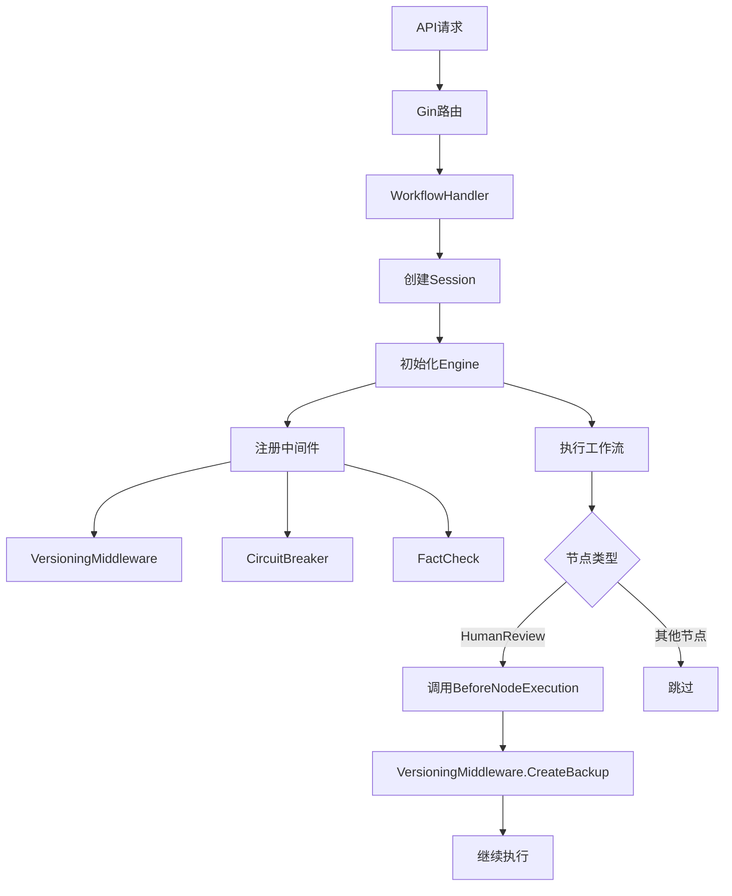
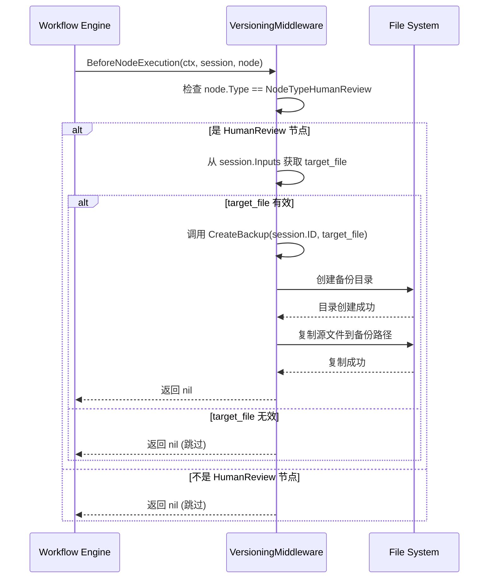
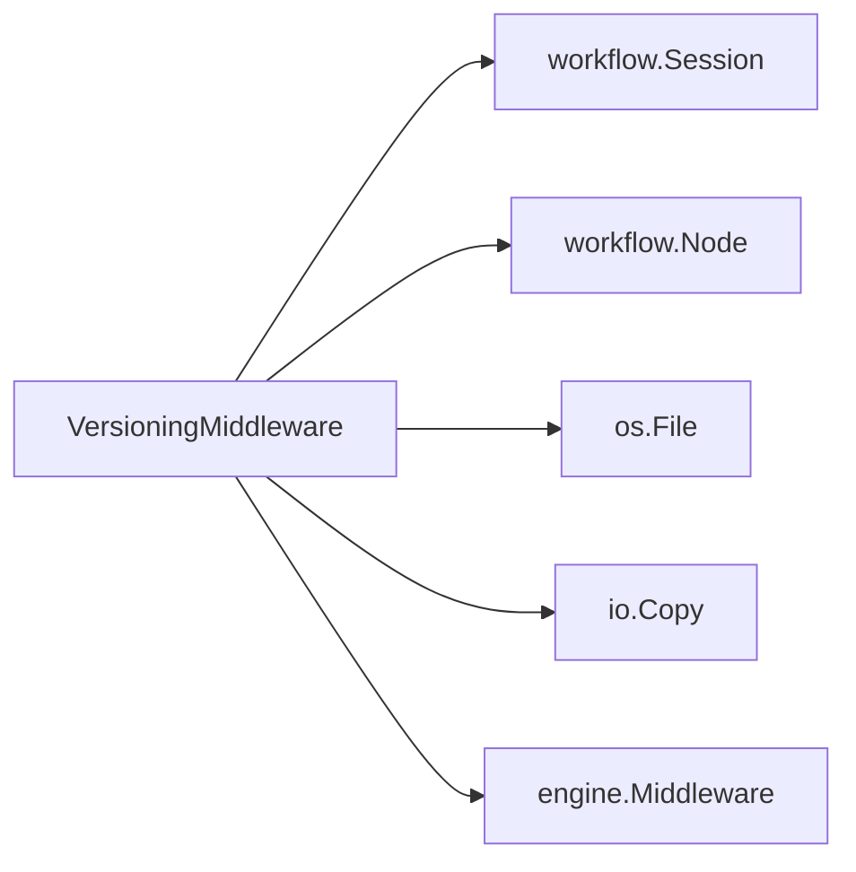

# 版本控制中间件

<cite>
**本文档引用的文件**   
- [versioning.go](file://internal/core/middleware/versioning.go)
- [versioning_test.go](file://internal/core/middleware/versioning_test.go)
- [main.go](file://cmd/council/main.go)
- [engine.go](file://internal/core/workflow/engine.go)
- [session.go](file://internal/core/workflow/session.go)
- [SPEC-605-versioning-middleware.md](file://docs/specs/sprint6/SPEC-605-versioning-middleware.md)
</cite>

## 目录
1. [简介](#简介)
2. [核心组件](#核心组件)
3. [架构概述](#架构概述)
4. [详细组件分析](#详细组件分析)
5. [依赖分析](#依赖分析)
6. [性能考量](#性能考量)
7. [故障排除指南](#故障排除指南)
8. [结论](#结论)

## 简介
本文档详细阐述了版本控制中间件（VersioningMiddleware）在API网关层的实现机制。该中间件旨在为关键操作（如人工审核）提供自动化的文件版本控制与回滚能力，确保数据安全与操作可追溯。文档将深入解析其结构体设计、执行流程、兼容性策略，并结合代码示例说明其在Gin框架中的注册与执行顺序。

## 核心组件

`VersioningMiddleware` 结构体是实现版本控制功能的核心。它通过 `BackupDir` 配置项指定备份文件的存储路径，并实现了 `Middleware` 接口的 `BeforeNodeExecution` 和 `AfterNodeExecution` 方法，以在工作流执行的关键节点介入。其主要功能是在 `HumanReview` 节点执行前，根据会话输入中的 `target_file` 路径创建一个时间戳命名的备份文件。

**Section sources**
- [versioning.go](file://internal/core/middleware/versioning.go#L17-L24)

## 架构概述

版本控制中间件作为工作流引擎（Workflow Engine）的一部分，采用责任链（Chain of Responsibility）模式进行集成。当工作流执行到 `HumanReview` 节点时，引擎会依次调用已注册的中间件。`VersioningMiddleware` 在 `BeforeNodeExecution` 阶段被触发，负责创建文件备份，从而实现非侵入式的版本控制。



**Diagram sources **
- [main.go](file://cmd/council/main.go#L85-L89)
- [engine.go](file://internal/core/workflow/engine.go#L92-L97)
- [versioning.go](file://internal/core/middleware/versioning.go#L31-L56)

## 详细组件分析

### VersioningMiddleware 结构体分析

`VersioningMiddleware` 结构体的设计简洁而高效，其核心功能围绕文件的备份、查找和恢复。

#### 结构体定义与初始化
`VersioningMiddleware` 包含一个 `BackupDir` 字段，用于存储备份文件的根目录。通过 `NewVersioningMiddleware` 函数进行实例化，该函数接收一个字符串参数并返回一个指向 `VersioningMiddleware` 的指针。

```mermaid
classDiagram
class VersioningMiddleware {
+BackupDir string
+Name() string
+BeforeNodeExecution(ctx context.Context, session *workflow.Session, node *workflow.Node) error
+AfterNodeExecution(ctx context.Context, session *workflow.Session, node *workflow.Node, output map[string]interface{}) (map[string]interface{}, error)
+CreateBackup(sessionID string, targetPath string) error
+FindLatestBackup(sessionID string, targetPath string) string
+RestoreFromBackup(backupPath string, targetPath string) error
+ListBackups(sessionID string, targetPath string) ([]string, error)
}
```

**Diagram sources **
- [versioning.go](file://internal/core/middleware/versioning.go#L17-L24)

#### 执行流程分析
中间件的执行流程由 `BeforeNodeExecution` 方法驱动。该方法首先检查当前节点是否为 `HumanReview` 类型，然后从会话输入中提取 `target_file` 路径。如果路径有效，则调用 `CreateBackup` 方法创建备份。此过程为非阻塞式，即使备份失败，工作流仍会继续执行，但会记录警告日志。



**Diagram sources **
- [versioning.go](file://internal/core/middleware/versioning.go#L31-L56)
- [versioning.go](file://internal/core/middleware/versioning.go#L69-L104)

#### 备份与恢复功能
`CreateBackup` 方法负责创建备份文件。它会根据会话ID和当前时间戳生成唯一的备份文件名（格式为 `{filename}_{timestamp}.bak`），并将源文件内容复制到备份目录中。`RestoreFromBackup` 方法则用于从指定的备份文件恢复原始文件。`FindLatestBackup` 和 `ListBackups` 方法提供了查询功能，支持按时间倒序列出所有备份，便于用户选择恢复点。

**Section sources**
- [versioning.go](file://internal/core/middleware/versioning.go#L68-L155)

## 依赖分析

版本控制中间件的实现依赖于项目中的多个核心组件。它直接依赖于 `workflow` 包中的 `Session` 和 `Node` 结构体，以获取执行上下文和节点信息。同时，它也依赖于Go标准库的 `os` 和 `io` 包来执行文件系统操作。在架构上，它通过 `engine.go` 中定义的 `Middleware` 接口与工作流引擎耦合，确保了其作为插件的可扩展性。



**Diagram sources **
- [versioning.go](file://internal/core/middleware/versioning.go#L12)
- [engine.go](file://internal/core/workflow/types.go#L61-L66)
- [session.go](file://internal/core/workflow/session.go#L24)
- [session.go](file://internal/core/workflow/session.go#L34)

## 性能考量

版本控制中间件的性能影响主要体现在文件I/O操作上。创建备份涉及文件读取和写入，其耗时取决于文件大小和磁盘I/O性能。为最小化对工作流执行的阻塞，中间件在备份失败时仅记录警告日志，不会中断主流程。建议将备份目录配置在高性能的存储设备上，并定期清理过期的备份文件，以避免磁盘空间耗尽。

## 故障排除指南

### 常见问题

1.  **备份未创建**：检查 `target_file` 路径是否在 `session.Inputs` 中正确传递，且源文件是否存在。
2.  **权限错误**：确保运行程序的用户对 `BackupDir` 目录具有读写权限。
3.  **磁盘空间不足**：监控备份目录的磁盘使用情况，设置自动清理策略。
4.  **版本未匹配**：此中间件不涉及API版本路由，其“版本”指文件的备份版本。若需API版本控制，需在API网关层实现。

### 优化建议

- **异步备份**：对于大文件，可考虑将备份操作放入goroutine中异步执行，以进一步减少对工作流的延迟影响。
- **压缩备份**：在备份前对文件进行压缩，可以显著节省存储空间。
- **配置热加载**：`BackupDir` 配置项在程序启动时通过 `main.go` 注入，若需热加载，可结合配置中心实现。

**Section sources**
- [versioning.go](file://internal/core/middleware/versioning.go#L49-L53)
- [main.go](file://cmd/council/main.go#L111)

## 结论

`VersioningMiddleware` 是一个功能明确、实现稳健的中间件，它通过在 `HumanReview` 节点执行前自动创建文件备份，为系统提供了关键的数据保护能力。其设计遵循了单一职责原则，与工作流引擎松耦合，易于维护和扩展。通过合理配置 `BackupDir` 并遵循最佳实践，可以有效保障数据安全，为系统提供可靠的版本回滚机制。