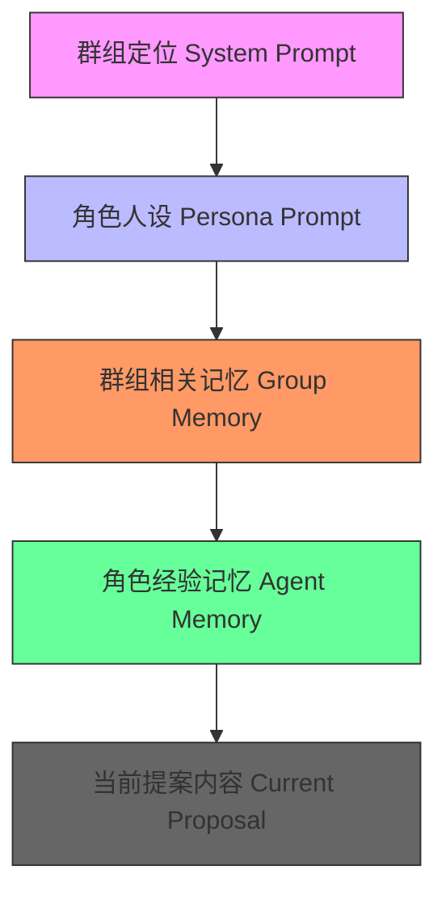
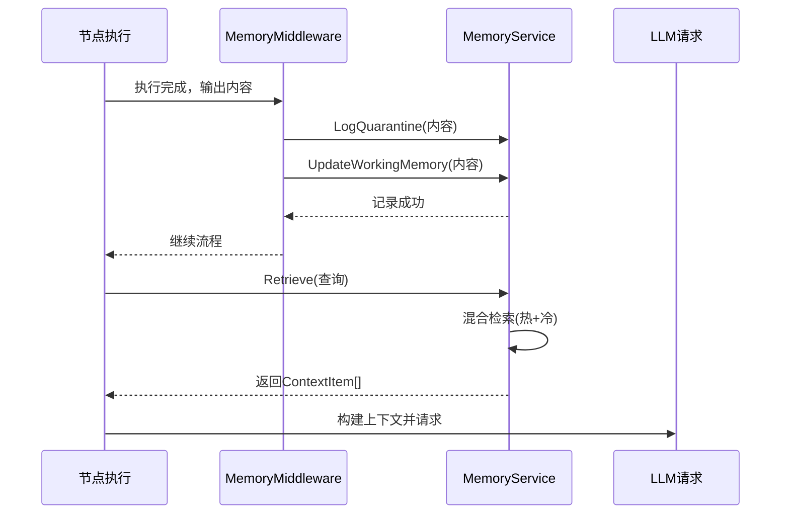

# 记忆注入中间件

<cite>
**本文档引用的文件**  
- [memory.go](file://internal/core/middleware/memory.go)
- [service.go](file://internal/core/memory/service.go)
- [types.go](file://internal/core/memory/types.go)
- [memory_retrieval.go](file://internal/core/workflow/nodes/memory_retrieval.go)
- [SPEC-408-memory-protocol.md](file://docs/specs/backend/SPEC-408-memory-protocol.md)
- [context_builder.md](file://docs/tdd/02_core/09_context_builder.md)
</cite>

## 目录
1. [引言](#引言)
2. [三层记忆协议架构](#三层记忆协议架构)
3. [记忆注入中间件核心机制](#记忆注入中间件核心机制)
4. [记忆检索与上下文构建](#记忆检索与上下文构建)
5. [节点差异化注入逻辑](#节点差异化注入逻辑)
6. [性能调优策略](#性能调优策略)
7. [结论](#结论)

## 引言

记忆注入中间件是本系统会话上下文管理的核心组件，负责在工作流执行过程中自动管理并注入记忆信息。该中间件通过与三层记忆协议协同工作，确保LLM请求能够获取到隔离区记忆、工作记忆与长期记忆中的相关信息，从而提升生成内容的相关性与一致性。本技术文档将详细阐述其工作机制、与各节点的协同逻辑以及性能优化策略。

## 三层记忆协议架构

```mermaid
graph TD
A[用户交互层] --> B[隔离区 (Quarantine)]
B --> C[工作记忆 (Working Memory)]
C --> D[长期记忆 (Long-Term DB)]
B --> |原始产出，永久存储| B
C --> |热缓存，入口过滤，24小时TTL| C
D --> |经验证的高价值知识，向量化存储| D
```

**图示来源**  
- [SPEC-408-memory-protocol.md](file://docs/specs/backend/SPEC-408-memory-protocol.md#L8-L36)

**本节来源**  
- [SPEC-408-memory-protocol.md](file://docs/specs/backend/SPEC-408-memory-protocol.md#L1-L36)

## 记忆注入中间件核心机制

记忆注入中间件（MemoryMiddleware）在每个节点执行后自动触发，负责将节点输出内容持久化到三层记忆系统中。其核心功能包括：

1. **隔离区日志记录**：所有节点输出内容均被记录到隔离区（Quarantine），作为原始产出进行物理隔离。
2. **工作记忆更新**：通过入口过滤器（Ingress Filter）对内容进行自洽性检查后，符合条件的内容被写入Redis工作记忆缓存。
3. **长期记忆晋升**：高价值内容可通过晋升机制（Promotion）被切分为文本块，生成向量嵌入并存储到PostgreSQL的长期记忆数据库中。

中间件通过`AfterNodeExecution`钩子在节点执行完成后自动处理输出内容，并利用`MemoryManager`接口与底层记忆服务进行交互。

```mermaid
classDiagram
class MemoryMiddleware {
+Manager MemoryManager
+AfterNodeExecution(ctx, session, node, output) (map[string]interface{}, error)
}
class MemoryManager {
+LogQuarantine(ctx, sessionID, nodeID, content, metadata) error
+UpdateWorkingMemory(ctx, groupID, content, metadata) error
+Promote(ctx, groupID, digest) error
+Retrieve(ctx, query, groupID) ([]ContextItem, error)
}
class ContextItem {
+Content string
+Source string
+Score float64
}
MemoryMiddleware --> MemoryManager : "依赖"
MemoryManager ..> ContextItem : "返回"
```

**图示来源**  
- [memory.go](file://internal/core/middleware/memory.go#L11-L40)
- [types.go](file://internal/core/memory/types.go#L7-L26)

**本节来源**  
- [memory.go](file://internal/core/middleware/memory.go#L11-L73)
- [types.go](file://internal/core/memory/types.go#L7-L26)

## 记忆检索与上下文构建

记忆检索通过`Retrieve`接口实现，采用混合检索策略，同时查询工作记忆（热）和长期记忆（冷）：

- **工作记忆检索**：从Redis中获取最近10条相关记录，来源标记为"hot"，相似度评分为1.0。
- **长期记忆检索**：使用向量相似度（余弦距离）从pgvector数据库中检索最多5条最相关记录，来源标记为"cold"，返回相似度分数。

上下文构建遵循五层优先级策略，确保关键信息优先注入：



**图示来源**  
- [context_builder.md](file://docs/tdd/02_core/09_context_builder.md#L5-L87)
- [service.go](file://internal/core/memory/service.go#L159-L208)

**本节来源**  
- [context_builder.md](file://docs/tdd/02_core/09_context_builder.md#L1-L102)
- [service.go](file://internal/core/memory/service.go#L159-L208)

## 节点差异化注入逻辑

根据SPEC-408文档，不同节点类型在记忆注入逻辑上存在差异化处理：

- **Agent节点**：输出内容默认进入隔离区，经入口过滤器检查后可能进入工作记忆。其记忆检索会同时考虑群组记忆和角色经验记忆。
- **FactCheck节点**：在执行事实核查时，会主动检索相关记忆作为验证依据，但其输出通常不直接注入长期记忆，除非被明确晋升。
- **MemoryRetrieval节点**：专门用于检索历史上下文，其输出包含格式化的记忆摘要，直接注入到后续节点的上下文中。

这种差异化逻辑通过节点处理器（NodeProcessor）和中间件的协同实现，确保不同类型节点的记忆处理策略符合其语义角色。



**图示来源**  
- [memory_retrieval.go](file://internal/core/workflow/nodes/memory_retrieval.go#L24-L84)
- [service.go](file://internal/core/memory/service.go#L159-L208)

**本节来源**  
- [SPEC-408-memory-protocol.md](file://docs/specs/backend/SPEC-408-memory-protocol.md)
- [memory_retrieval.go](file://internal/core/workflow/nodes/memory_retrieval.go)

## 性能调优策略

为平衡上下文丰富度与token消耗，系统提供以下性能调优建议：

1. **向量相似度阈值设置**：在长期记忆检索中，可设置相似度阈值（如0.7），仅返回高于阈值的记忆片段，避免注入无关信息。
2. **记忆片段截断策略**：对检索到的记忆内容进行长度截断，例如限制单条记忆不超过500字符，防止过长上下文占用过多token。
3. **工作记忆大小限制**：Redis工作记忆列表保留最近50条记录，通过`LTrim`命令自动清理过期条目。
4. **分块策略优化**：长期记忆晋升时，使用`RecursiveCharacterSplitter`按500字符分块，50字符重叠，确保语义完整性。

这些策略通过配置参数和代码逻辑实现，可在不影响核心功能的前提下有效控制资源消耗。

**本节来源**  
- [service.go](file://internal/core/memory/service.go#L66-L94)
- [splitter.go](file://internal/core/memory/splitter.go#L7-L20)

## 结论

记忆注入中间件通过与三层记忆协议的深度集成，实现了智能化的会话上下文管理。它不仅确保了记忆信息的有序流动与净化，还通过优先级构建和差异化注入策略，为LLM提供了高质量的上下文支持。结合合理的性能调优措施，该中间件在保证生成质量的同时，有效控制了计算资源的消耗，是系统实现持续、连贯对话能力的关键基础设施。