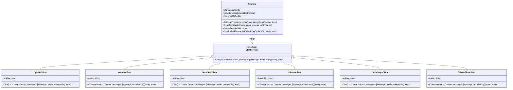
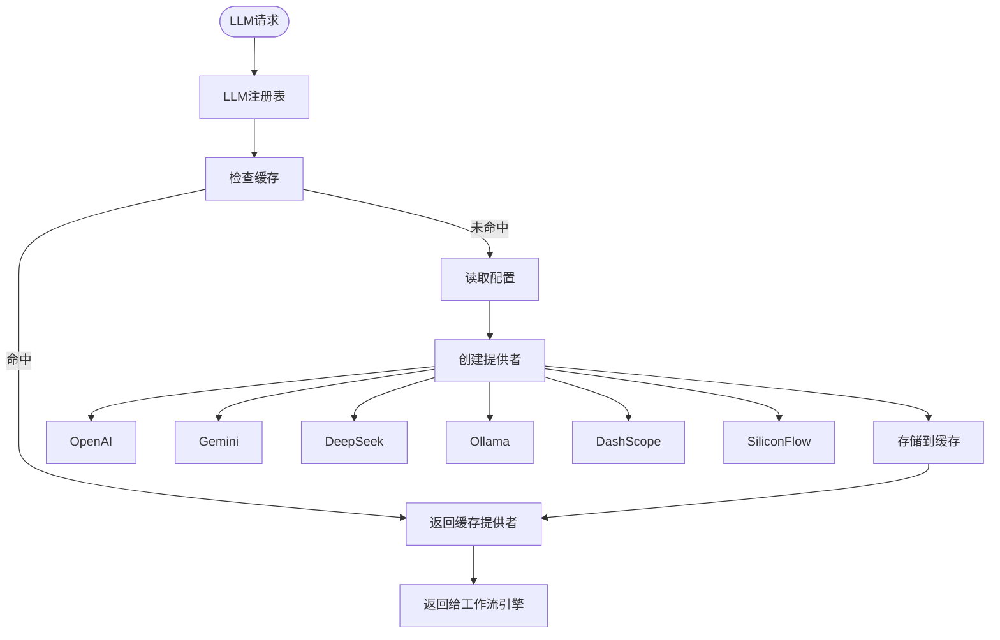

# 后端架构

<cite>
**本文档中引用的文件**  
- [main.go](file://cmd/council/main.go)
- [engine.go](file://internal/core/workflow/engine.go)
- [workflow.go](file://internal/api/handler/workflow.go)
- [factory.go](file://internal/core/workflow/nodes/factory.go)
- [circuit_breaker.go](file://internal/core/middleware/circuit_breaker.go)
- [versioning.go](file://internal/core/middleware/versioning.go)
- [fact_check.go](file://internal/core/middleware/fact_check.go)
- [memory.go](file://internal/core/middleware/memory.go)
- [router.go](file://internal/infrastructure/llm/router.go)
- [service.go](file://internal/core/memory/service.go)
- [config.go](file://internal/pkg/config/config.go)
- [types.go](file://internal/core/workflow/types.go)
- [hub.go](file://internal/api/ws/hub.go)
</cite>

## 目录
1. [项目结构](#项目结构)
2. [核心组件](#核心组件)
3. [架构概述](#架构概述)
4. [详细组件分析](#详细组件分析)
5. [依赖分析](#依赖分析)
6. [性能考虑](#性能考虑)
7. [故障排除指南](#故障排除指南)
8. [结论](#结论)

## 项目结构

The Council后端采用分层架构设计，主要分为以下几个层次：

- **cmd/council/**: 应用程序入口点，包含main.go文件
- **internal/api/**: API层，包含HTTP和WebSocket处理程序
- **internal/core/**: 核心业务逻辑层，包含工作流引擎、中间件等
- **internal/infrastructure/**: 基础设施层，包含数据库、缓存、LLM提供商等
- **internal/pkg/config/**: 配置管理
- **internal/resources/**: 资源文件和种子数据


**图源**
- [main.go](file://cmd/council/main.go#L21-L148)

**本节来源**
- [main.go](file://cmd/council/main.go#L1-L150)

## 核心组件

The Council后端的核心组件包括Gin框架作为API网关、工作流引擎、AI网关、记忆管理器以及各种防御性中间件。这些组件协同工作，实现了复杂的AI驱动产品流程。

**本节来源**
- [main.go](file://cmd/council/main.go#L21-L148)
- [engine.go](file://internal/core/workflow/engine.go#L1-L246)

## 架构概述

The Council后端采用分层架构设计，以Gin框架作为API网关，接收来自前端的HTTP和WebSocket请求。工作流引擎是系统的核心，负责协调和执行复杂的工作流。AI网关通过LLM注册表管理多个LLM提供商，记忆管理器则负责处理短期和长期记忆。


**图源**
- [main.go](file://cmd/council/main.go#L21-L148)
- [engine.go](file://internal/core/workflow/engine.go#L1-L246)

## 详细组件分析

### 工作流引擎分析

工作流引擎是The Council后端的核心，负责执行和管理复杂的工作流。它通过NodeFactory模式支持可扩展的节点处理器，并利用sync.WaitGroup实现并行分支执行。

#### 工作流引擎类图
```mermaid
classDiagram
class Engine {
+Graph *GraphDefinition
+Status map[string]NodeStatus
+NodeFactory func(node *Node) (NodeProcessor, error)
+StreamChannel chan StreamEvent
+Middlewares []Middleware
+Session *Session
+Run(ctx context.Context)
+executeNode(ctx context.Context, nodeID string, input map[string]interface{})
+handleParallel(ctx context.Context, node *Node, input map[string]interface{})
+updateStatus(nodeID string, status NodeStatus)
+GetStatus(nodeID string) NodeStatus
+emitError(nodeID string, err error)
+ResumeNode(ctx context.Context, nodeID string, output map[string]interface{}) error
}
class GraphDefinition {
+ID string
+Name string
+Description string
+Nodes map[string]*Node
+StartNodeID string
}
class Node {
+ID string
+Type NodeType
+Name string
+NextIDs []string
+Properties map[string]interface{}
}
class Session {
+ID string
+Graph *GraphDefinition
+Inputs map[string]interface{}
+Status SessionStatus
+Context() context.Context
+Pause()
+Resume()
+Stop()
+WaitIfPaused(ctx context.Context) error
+SendSignal(nodeID string, payload interface{}) error
}
class StreamEvent {
+Type string
+Timestamp time.Time
+NodeID string
+Data map[string]interface{}
}
class Middleware {
<<interface>>
+Name() string
+BeforeNodeExecution(ctx context.Context, session *Session, node *Node) error
+AfterNodeExecution(ctx context.Context, session *Session, node *Node, output map[string]interface{}) (map[string]interface{}, error)
}
Engine --> GraphDefinition : "执行"
Engine --> Node : "处理"
Engine --> Session : "管理"
Engine --> StreamEvent : "发送"
Engine --> Middleware : "应用"
Session --> Context : "提供"
```

**图源**
- [engine.go](file://internal/core/workflow/engine.go#L11-L246)
- [types.go](file://internal/core/workflow/types.go#L8-L67)

#### 工作流执行序列图


**图源**
- [engine.go](file://internal/core/workflow/engine.go#L41-L246)
- [workflow.go](file://internal/api/handler/workflow.go#L58-L123)

**本节来源**
- [engine.go](file://internal/core/workflow/engine.go#L1-L246)
- [workflow.go](file://internal/api/handler/workflow.go#L1-L246)

### API网关分析

Gin框架作为API网关，负责处理所有HTTP请求和WebSocket连接。它提供了路由、中间件和请求处理功能。

#### API网关类图
```mermaid
classDiagram
class Gin {
+Default() *Engine
+Group(relativePath string) *RouterGroup
+Run(addr string) error
}
class Engine {
+Routes() []RouteInfo
+ServeHTTP(w http.ResponseWriter, req *http.Request)
+Use(middleware ...HandlerFunc) IRoutes
}
class RouterGroup {
+GET(relativePath string, handlers ...HandlerFunc) IRoutes
+POST(relativePath string, handlers ...HandlerFunc) IRoutes
+PUT(relativePath string, handlers ...HandlerFunc) IRoutes
+DELETE(relativePath string, handlers ...HandlerFunc) IRoutes
}
class HandlerFunc {
<<interface>>
+Handle(c *Context)
}
class Context {
+JSON(code int, obj interface{})
+ShouldBindJSON(obj interface{}) error
+Param(key string) string
+Request *http.Request
+Writer http.ResponseWriter
}
Gin --> Engine : "创建"
Engine --> RouterGroup : "分组"
RouterGroup --> HandlerFunc : "注册"
HandlerFunc --> Context : "使用"
```

**图源**
- [main.go](file://cmd/council/main.go#L21-L148)
- [workflow.go](file://internal/api/handler/workflow.go#L1-L246)

#### API请求流程图


**图源**
- [main.go](file://cmd/council/main.go#L21-L148)
- [workflow.go](file://internal/api/handler/workflow.go#L58-L123)

**本节来源**
- [main.go](file://cmd/council/main.go#L1-L150)
- [workflow.go](file://internal/api/handler/workflow.go#L1-L246)

### 防御性中间件分析

防御性中间件是The Council后端的重要组成部分，包括熔断器、认证、版本控制等，用于确保系统的安全性和稳定性。

#### 防御性中间件类图
```mermaid
classDiagram
class Middleware {
<<interface>>
+Name() string
+BeforeNodeExecution(ctx context.Context, session *Session, node *Node) error
+AfterNodeExecution(ctx context.Context, session *Session, node *Node, output map[string]interface{}) (map[string]interface{}, error)
}
class CircuitBreaker {
+MaxRecursionDepth int
+Name() string
+BeforeNodeExecution(ctx context.Context, session *Session, node *Node) error
+AfterNodeExecution(ctx context.Context, session *Session, node *Node, output map[string]interface{}) (map[string]interface{}, error)
}
class VersioningMiddleware {
+BackupDir string
+Name() string
+BeforeNodeExecution(ctx context.Context, session *Session, node *Node) error
+AfterNodeExecution(ctx context.Context, session *Session, node *Node, output map[string]interface{}) (map[string]interface{}, error)
+CreateBackup(sessionID, targetPath string) error
+FindLatestBackup(sessionID, targetPath string) string
+RestoreFromBackup(backupPath, targetPath string) error
+ListBackups(sessionID, targetPath string) ([]string, error)
}
class FactCheckTrigger {
+MetricRegex *regexp.Regexp
+CitationRegex *regexp.Regexp
+Name() string
+BeforeNodeExecution(ctx context.Context, session *Session, node *Node) error
+AfterNodeExecution(ctx context.Context, session *Session, node *Node, output map[string]interface{}) (map[string]interface{}, error)
}
class MemoryMiddleware {
+Manager memory.MemoryManager
+Name() string
+BeforeNodeExecution(ctx context.Context, session *Session, node *Node) error
+AfterNodeExecution(ctx context.Context, session *Session, node *Node, output map[string]interface{}) (map[string]interface{}, error)
}
Middleware <|-- CircuitBreaker
Middleware <|-- VersioningMiddleware
Middleware <|-- FactCheckTrigger
Middleware <|-- MemoryMiddleware
```

**图源**
- [circuit_breaker.go](file://internal/core/middleware/circuit_breaker.go#L1-L40)
- [versioning.go](file://internal/core/middleware/versioning.go#L1-L156)
- [fact_check.go](file://internal/core/middleware/fact_check.go#L1-L53)
- [memory.go](file://internal/core/middleware/memory.go#L1-L73)

#### 中间件执行流程图


**图源**
- [engine.go](file://internal/core/workflow/engine.go#L92-L120)
- [workflow.go](file://internal/api/handler/workflow.go#L85-L89)

**本节来源**
- [circuit_breaker.go](file://internal/core/middleware/circuit_breaker.go#L1-L40)
- [versioning.go](file://internal/core/middleware/versioning.go#L1-L156)
- [fact_check.go](file://internal/core/middleware/fact_check.go#L1-L53)
- [memory.go](file://internal/core/middleware/memory.go#L1-L73)

### AI网关分析

AI网关通过LLM注册表管理多个LLM提供商，为工作流引擎提供AI能力。

#### AI网关类图


**图源**
- [router.go](file://internal/infrastructure/llm/router.go#L1-L177)
- [config.go](file://internal/pkg/config/config.go#L8-L133)

#### LLM请求流程图


**图源**
- [router.go](file://internal/infrastructure/llm/router.go#L37-L108)
- [config.go](file://internal/pkg/config/config.go#L45-L133)

**本节来源**
- [router.go](file://internal/infrastructure/llm/router.go#L1-L177)
- [config.go](file://internal/pkg/config/config.go#L8-L133)

### 记忆管理器分析

记忆管理器负责处理短期和长期记忆，包括记忆摄入、查询和检索。

#### 记忆管理器类图
```mermaid
classDiagram
class Service {
+Embedder llm.Embedder
+pool db.DB
+cache cache.Cache
+LogQuarantine(ctx context.Context, sessionID string, nodeID string, content string, metadata map[string]interface{}) error
+UpdateWorkingMemory(ctx context.Context, groupID string, content string, metadata map[string]interface{}) error
+CleanupWorkingMemory(ctx context.Context) error
+Promote(ctx context.Context, groupID string, content string) error
+Retrieve(ctx context.Context, query string, groupID string) ([]ContextItem, error)
}
class MemoryManager {
<<interface>>
+LogQuarantine(ctx context.Context, sessionID string, nodeID string, content string, metadata map[string]interface{}) error
+UpdateWorkingMemory(ctx context.Context, groupID string, content string, metadata map[string]interface{}) error
+Retrieve(ctx context.Context, query string, groupID string) ([]ContextItem, error)
}
Service --> MemoryManager : "实现"
Service --> Embedder : "使用"
Service --> DB : "使用"
Service --> Cache : "使用"
```

**图源**
- [service.go](file://internal/core/memory/service.go#L1-L209)
- [memory.go](file://internal/core/middleware/memory.go#L1-L73)

#### 记忆处理流程图


**图源**
- [service.go](file://internal/core/memory/service.go#L28-L209)
- [memory.go](file://internal/core/middleware/memory.go#L24-L72)

**本节来源**
- [service.go](file://internal/core/memory/service.go#L1-L209)
- [memory.go](file://internal/core/middleware/memory.go#L1-L73)

## 依赖分析

The Council后端的依赖关系清晰，各组件之间通过接口和依赖注入进行通信，降低了耦合度。


**图源**
- [main.go](file://cmd/council/main.go#L21-L148)
- [go.mod](file://go.mod#L1-L44)

**本节来源**
- [main.go](file://cmd/council/main.go#L1-L150)
- [go.mod](file://go.mod#L1-L44)

## 性能考虑

The Council后端在性能方面做了多项优化：

1. **并发执行**: 工作流引擎使用sync.WaitGroup实现并行分支执行，提高了执行效率。
2. **缓存机制**: LLM注册表使用缓存存储已创建的提供商实例，避免重复创建。
3. **流式传输**: 使用WebSocket实现实时流式传输，减少了HTTP请求的开销。
4. **批量操作**: 记忆管理器支持批量嵌入和存储操作，提高了数据库操作效率。
5. **连接池**: 使用数据库连接池和Redis连接池，减少了连接创建的开销。

**本节来源**
- [engine.go](file://internal/core/workflow/engine.go#L130-L138)
- [router.go](file://internal/infrastructure/llm/router.go#L28-L32)
- [hub.go](file://internal/api/ws/hub.go#L14-L19)
- [service.go](file://internal/core/memory/service.go#L130-L154)

## 故障排除指南

### 常见问题及解决方案

1. **工作流执行卡住**
   - 检查是否有节点处理器未正确返回
   - 检查是否有死循环或无限递归
   - 查看日志中的错误信息

2. **LLM调用失败**
   - 检查API密钥是否正确
   - 检查网络连接是否正常
   - 查看LLM提供商的状态

3. **记忆检索不准确**
   - 检查嵌入模型是否匹配
   - 检查向量维度是否一致
   - 调整相似度阈值

4. **WebSocket连接失败**
   - 检查CORS配置
   - 检查防火墙设置
   - 查看服务器日志

**本节来源**
- [engine.go](file://internal/core/workflow/engine.go#L173-L182)
- [router.go](file://internal/infrastructure/llm/router.go#L100-L103)
- [service.go](file://internal/core/memory/service.go#L30-L37)
- [hub.go](file://internal/api/ws/hub.go#L112-L114)

## 结论

The Council后端采用分层架构设计，具有良好的可扩展性和可维护性。Gin框架作为API网关，提供了高效的HTTP和WebSocket处理能力。工作流引擎通过NodeFactory模式支持可扩展的节点处理器，并利用sync.WaitGroup实现并行分支执行。防御性中间件包括熔断器、认证、版本控制等，确保了系统的安全性和稳定性。AI网关通过LLM注册表管理多个LLM提供商，记忆管理器则负责处理短期和长期记忆。整体架构设计合理，性能优化到位，为AI驱动产品流程提供了坚实的基础。