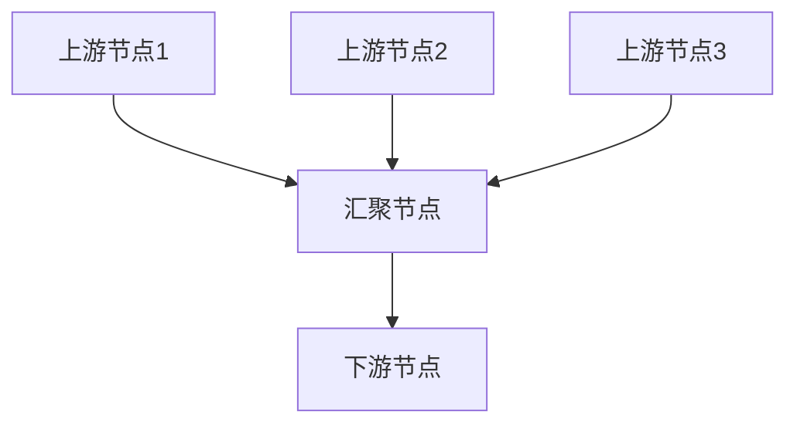
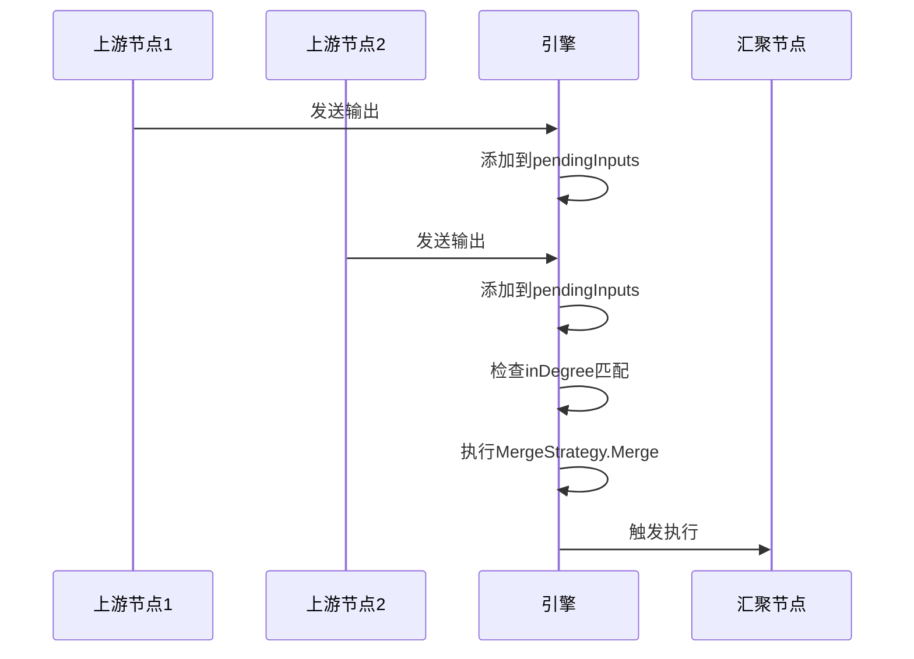
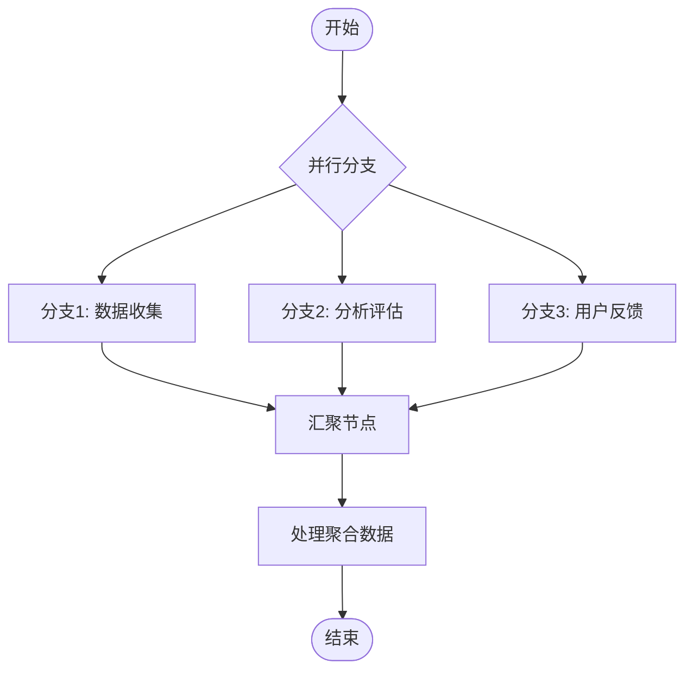

# 工作流引擎Join机制与合并策略

<cite>
**本文档引用文件**  
- [engine.go](file://internal/core/workflow/engine.go#L1-L355)
- [merge.go](file://internal/core/workflow/merge.go#L1-L36)
- [merge_strategy.go](file://internal/council/merge_strategy.go#L1-L50)
- [factory.go](file://internal/core/workflow/nodes/factory.go#L1-L147)
- [types.go](file://internal/core/workflow/types.go#L1-L68)
- [context_keys.go](file://internal/council/context_keys.go#L1-L56)
- [start.go](file://internal/core/workflow/nodes/start.go#L1-L28)
- [end.go](file://internal/core/workflow/nodes/end.go#L1-L113)
- [vote.go](file://internal/core/workflow/nodes/vote.go#L1-L70)
- [loop.go](file://internal/core/workflow/nodes/loop.go#L1-L108)
- [passthrough.go](file://internal/core/workflow/passthrough.go#L1-L29)
- [session.go](file://internal/core/workflow/session.go#L1-L250)
- [validation.go](file://internal/core/workflow/validation.go#L1-L71)
- [engine_test.go](file://internal/core/workflow/engine_test.go#L1-L254)
- [workflow.md](file://example/workflow.md#L1-L128)
</cite>

## 目录
1. [引言](#引言)
2. [核心机制概述](#核心机制概述)
3. [Join机制实现原理](#join机制实现原理)
4. [合并策略设计](#合并策略设计)
5. [关键组件分析](#关键组件分析)
6. [应用场景与示例](#应用场景与示例)
7. [测试验证](#测试验证)
8. [结论](#结论)

## 引言
工作流引擎的Join机制是实现复杂控制流的关键组件，用于处理并行分支的汇聚与数据合并。该机制确保在多个上游节点完成执行后，下游节点能够正确接收并处理聚合后的输入数据。本文件详细分析了该工作流引擎中Join机制的实现原理、合并策略的设计以及相关组件的协同工作方式。

**Section sources**
- [engine.go](file://internal/core/workflow/engine.go#L1-L355)
- [merge.go](file://internal/core/workflow/merge.go#L1-L36)

## 核心机制概述
工作流引擎通过`Engine`结构体管理整个工作流的执行过程。其中，`inDegree`字段记录每个节点的入度（即有多少个上游节点指向该节点），`pendingInputs`字段用于暂存来自不同上游节点的输入数据，`MergeStrategy`接口定义了如何将多个输入合并为一个输出。

当一个节点完成执行时，其输出会被发送到所有下游节点。对于入度大于1的节点，引擎会等待所有上游节点的数据到达后，使用配置的合并策略进行数据合并，然后触发该节点的执行。



**Diagram sources**
- [engine.go](file://internal/core/workflow/engine.go#L27-L31)
- [merge.go](file://internal/core/workflow/merge.go#L5-L12)

## Join机制实现原理
Join机制的核心实现在`deliverToDownstream`方法中。该方法负责将上游节点的输出传递给下游节点，并处理数据汇聚逻辑。

### 入度计算
在工作流启动时，`computeInDegrees`方法会遍历整个图结构，计算每个节点的入度。此计算会跳过循环节点的回边，以避免错误地增加入度计数。

### 数据汇聚
`deliverToDownstream`方法在接收到上游节点的输出后，会执行以下步骤：
1. 检查是否为循环回边传递，若是则直接传递数据以避免死锁
2. 将输出数据添加到目标节点的待处理输入列表中
3. 检查是否已收到来自所有上游节点的数据
4. 若数据完整，则使用合并策略生成最终输入并触发下游节点执行

### 循环回边处理
为了防止循环节点导致的死锁，引擎对循环回边进行了特殊处理。当检测到从循环节点返回其第一个后续节点的传递时，会绕过正常的入度等待机制，直接传递数据并清空该节点的待处理输入列表。



**Diagram sources**
- [engine.go](file://internal/core/workflow/engine.go#L304-L354)
- [engine.go](file://internal/core/workflow/engine.go#L286-L301)

## 合并策略设计
合并策略通过`MergeStrategy`接口实现，允许根据不同应用场景配置不同的数据合并方式。

### 默认合并策略
`DefaultMergeStrategy`是引擎提供的默认实现，其合并规则如下：
1. 保留每个分支的完整输出，键名为`branch_N`
2. 对于普通字段，采用"先到先得"策略，保留第一个出现的值

这种策略既保证了数据的完整性，又避免了字段冲突。

### 专用合并策略
针对特定应用场景，如理事会辩论工作流，实现了专用的`CouncilMergeStrategy`。该策略：
1. 聚合所有分支的`agent_output`字段，用分隔符连接形成`aggregated_outputs`
2. 透传指定的上下文字段，同样采用"先到先得"策略
3. 保留分支原始数据用于调试

```mermaid
classDiagram
class MergeStrategy {
<<interface>>
+Merge(inputs []map[string]interface{}) map[string]interface{}
}
class DefaultMergeStrategy {
+Merge(inputs []map[string]interface{}) map[string]interface{}
}
class CouncilMergeStrategy {
+Merge(inputs []map[string]interface{}) map[string]interface{}
}
MergeStrategy <|-- DefaultMergeStrategy
MergeStrategy <|-- CouncilMergeStrategy
```

**Diagram sources**
- [merge.go](file://internal/core/workflow/merge.go#L5-L36)
- [merge_strategy.go](file://internal/council/merge_strategy.go#L14-L50)

## 关键组件分析
### 节点工厂
`GenericNodeFactory`负责创建各种类型的节点处理器。它通过依赖注入的方式获取必要的服务实例，如LLM注册表、代理仓库和内存管理器。

### 透传机制
`ApplyPassthrough`函数实现了字段透传功能，允许配置指定字段从输入直接复制到输出。这一机制在循环节点和条件路由中尤为重要，确保上下文信息能够在工作流中持续传递。

### 会话管理
`Session`结构体管理单个工作流实例的执行状态。它提供了暂停、恢复、信号传递等控制功能，并维护运行时上下文数据。

**Section sources**
- [factory.go](file://internal/core/workflow/nodes/factory.go#L1-L147)
- [passthrough.go](file://internal/core/workflow/passthrough.go#L1-L29)
- [session.go](file://internal/core/workflow/session.go#L1-L250)

## 应用场景与示例
### 并行处理
在并行节点后接汇聚节点的场景中，Join机制确保所有并行分支完成后才执行后续操作。例如，在理事会辩论中，多个AI代理并行生成意见，然后在投票节点汇聚。

### 循环优化
在设计优化循环中，每次迭代的结果需要与历史数据合并。通过配置适当的合并策略，可以实现增量式优化和回归检测。

### 多源数据整合
当工作流需要整合来自不同数据源的信息时，Join机制可以将这些信息合并为统一的输入格式，供后续处理节点使用。



**Diagram sources**
- [workflow.md](file://example/workflow.md#L1-L128)
- [engine.go](file://internal/core/workflow/engine.go#L167-L194)

## 测试验证
引擎的测试套件包含了对Join机制的全面验证。`TestEngine_JoinMechanism`测试用例验证了：
1. 汇聚节点仅执行一次
2. 正确接收来自所有上游节点的数据
3. 合并策略正确应用
4. 分支数据完整保留

此外，还测试了并行执行、循环处理和节点恢复等场景，确保Join机制在各种复杂情况下都能正确工作。

**Section sources**
- [engine_test.go](file://internal/core/workflow/engine_test.go#L163-L254)
- [validation.go](file://internal/core/workflow/validation.go#L1-L71)

## 结论
工作流引擎的Join机制通过精确的入度管理和灵活的合并策略，实现了复杂控制流的可靠处理。该设计既保证了数据完整性，又提供了足够的扩展性以适应不同应用场景。通过将合并策略抽象为可插拔的接口，系统能够在保持核心逻辑稳定的同时，支持多样化的业务需求。