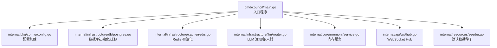
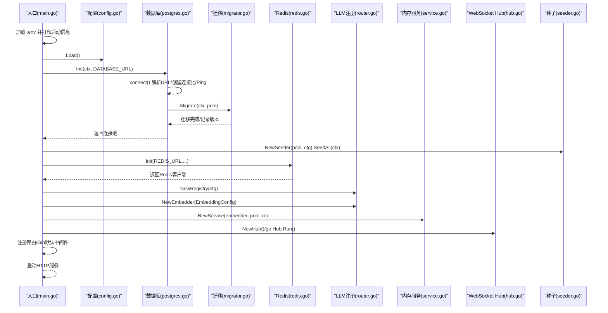
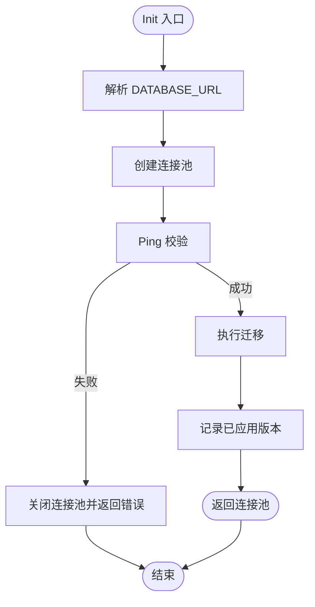
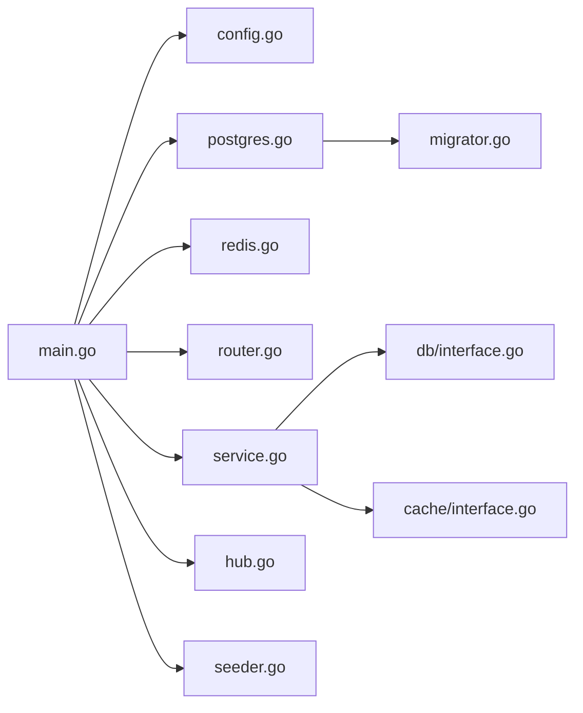

# 服务生命周期

<cite>
**本文引用的文件**
- [main.go](file://cmd/council/main.go)
- [config.go](file://internal/pkg/config/config.go)
- [postgres.go](file://internal/infrastructure/db/postgres.go)
- [migrator.go](file://internal/infrastructure/db/migrator.go)
- [redis.go](file://internal/infrastructure/cache/redis.go)
- [router.go](file://internal/infrastructure/llm/router.go)
- [hub.go](file://internal/api/ws/hub.go)
- [service.go](file://internal/core/memory/service.go)
- [interface.go](file://internal/infrastructure/db/interface.go)
- [interface.go](file://internal/infrastructure/cache/interface.go)
- [seeder.go](file://internal/resources/seeder.go)
</cite>

## 目录
1. [引言](#引言)
2. [项目结构](#项目结构)
3. [核心组件](#核心组件)
4. [架构总览](#架构总览)
5. [详细组件分析](#详细组件分析)
6. [依赖关系分析](#依赖关系分析)
7. [性能考量](#性能考量)
8. [故障排查指南](#故障排查指南)
9. [结论](#结论)

## 引言
本文件系统化梳理后端服务从启动到运行再到优雅关闭的完整生命周期，覆盖以下关键环节：
- 入口程序与环境变量/配置文件加载
- 数据库连接池初始化与迁移
- 缓存（Redis）连接初始化
- LLM 客户端注册与嵌入器创建
- 路由注册与 WebSocket Hub 启动
- 中间件链装配与错误处理
- 依赖注入与核心服务初始化
- 优雅关闭流程（信号监听、连接释放、在途请求处理）

## 项目结构
服务入口位于命令模块，配置、基础设施、核心业务与资源种子分布在各自子包中。整体采用“入口驱动初始化”的顺序：先配置与环境变量，再数据库与缓存，随后 LLM 注册与核心服务，最后路由与 WebSocket。

图表来源
- [main.go](file://cmd/council/main.go#L1-L150)
- [config.go](file://internal/pkg/config/config.go#L1-L133)
- [postgres.go](file://internal/infrastructure/db/postgres.go#L1-L66)
- [redis.go](file://internal/infrastructure/cache/redis.go#L1-L51)
- [router.go](file://internal/infrastructure/llm/router.go#L1-L177)
- [service.go](file://internal/core/memory/service.go#L1-L209)
- [hub.go](file://internal/api/ws/hub.go#L1-L125)
- [seeder.go](file://internal/resources/seeder.go#L1-L420)

章节来源
- [main.go](file://cmd/council/main.go#L1-L150)

## 核心组件
- 配置加载：从环境变量读取端口、数据库 URL、Redis URL、LLM/Embedding 参数等，提供默认值与回退策略。
- 数据库：单例连接池初始化，Ping 校验，内嵌迁移执行，迁移记录表保证幂等。
- 缓存：单例 Redis 客户端初始化，Ping 校验。
- LLM 注册：按配置动态创建不同提供商客户端，支持嵌入器工厂。
- 内存服务：结合数据库与缓存，提供工作记忆写入、冷热检索、隔离存储与日志。
- WebSocket Hub：维护活跃客户端集合，广播事件，处理升级与写泵。
- 资源种子：默认代理、分组、工作流模板与 LLM 选项的初始化。

章节来源
- [config.go](file://internal/pkg/config/config.go#L1-L133)
- [postgres.go](file://internal/infrastructure/db/postgres.go#L1-L66)
- [migrator.go](file://internal/infrastructure/db/migrator.go#L1-L109)
- [redis.go](file://internal/infrastructure/cache/redis.go#L1-L51)
- [router.go](file://internal/infrastructure/llm/router.go#L1-L177)
- [service.go](file://internal/core/memory/service.go#L1-L209)
- [hub.go](file://internal/api/ws/hub.go#L1-L125)
- [seeder.go](file://internal/resources/seeder.go#L1-L420)

## 架构总览
下图展示服务启动阶段的调用序列与依赖关系，体现“配置—数据库—缓存—LLM—服务—路由—WebSocket”的初始化顺序。

图表来源
- [main.go](file://cmd/council/main.go#L1-L150)
- [config.go](file://internal/pkg/config/config.go#L1-L133)
- [postgres.go](file://internal/infrastructure/db/postgres.go#L1-L66)
- [migrator.go](file://internal/infrastructure/db/migrator.go#L1-L109)
- [redis.go](file://internal/infrastructure/cache/redis.go#L1-L51)
- [router.go](file://internal/infrastructure/llm/router.go#L1-L177)
- [service.go](file://internal/core/memory/service.go#L1-L209)
- [hub.go](file://internal/api/ws/hub.go#L1-L125)
- [seeder.go](file://internal/resources/seeder.go#L1-L420)

## 详细组件分析

### 配置加载（环境变量与默认值）
- 端口 PORT 默认 8080；数据库 URL 默认本地开发地址；Redis URL 默认本地端口。
- LLM 与 Embedding 支持多提供商，默认值根据提供商类型自动选择模型与键来源。
- 提供全局 API Key 别名映射，便于按提供商统一注入。

章节来源
- [config.go](file://internal/pkg/config/config.go#L1-L133)

### 数据库初始化与迁移
- 单例模式：Init 仅在首次调用时建立连接池，后续调用直接返回。
- 连接建立后执行 Ping 校验；随后执行内嵌迁移脚本，按文件名排序应用。
- 迁移记录表 schema_migrations 用于幂等，避免重复执行。
- 关闭时统一释放连接池。

图表来源
- [postgres.go](file://internal/infrastructure/db/postgres.go#L1-L66)
- [migrator.go](file://internal/infrastructure/db/migrator.go#L1-L109)

章节来源
- [postgres.go](file://internal/infrastructure/db/postgres.go#L1-L66)
- [migrator.go](file://internal/infrastructure/db/migrator.go#L1-L109)
- [interface.go](file://internal/infrastructure/db/interface.go#L1-L16)

### Redis 初始化
- 单例模式：Init 仅在首次调用时创建客户端，随后直接返回。
- 建立连接后执行 Ping 校验，确保可用性。
- 关闭时统一释放客户端。

章节来源
- [redis.go](file://internal/infrastructure/cache/redis.go#L1-L51)
- [interface.go](file://internal/infrastructure/cache/interface.go#L1-L18)

### LLM 注册与嵌入器
- Registry 维护提供商实例缓存，支持按名称获取或默认提供商解析。
- 嵌入器工厂根据 EmbeddingConfig 类型创建对应客户端。
- 默认模型回退策略依据提供商类型选择。

章节来源
- [router.go](file://internal/infrastructure/llm/router.go#L1-L177)

### 内存服务（工作记忆与检索）
- 依赖接口：DB 与 Cache，分别用于持久化与缓存。
- 工作记忆写入：基于内容长度与置信度进行入站过滤，写入 Redis 列表并设置 TTL 与上限。
- 冷记忆检索：优先从 Redis 获取热项，再基于查询向量与嵌入器相似度检索数据库。
- 隔离存储：将片段嵌入并写入数据库，元数据包含来源与时间戳。

章节来源
- [service.go](file://internal/core/memory/service.go#L1-L209)
- [interface.go](file://internal/infrastructure/db/interface.go#L1-L16)
- [interface.go](file://internal/infrastructure/cache/interface.go#L1-L18)

### WebSocket Hub
- 维护客户端集合，提供广播通道与注册/注销通道。
- 升级 HTTP 请求为 WebSocket，启动写泵协程。
- 广播消息时对阻塞通道进行兜底关闭，避免泄漏。

章节来源
- [hub.go](file://internal/api/ws/hub.go#L1-L125)

### 路由与依赖注入
- Gin 默认中间件链已启用。
- 依赖注入顺序：仓库层（PGX 池），服务层（内存服务），处理器层（路由绑定）。
- WebSocket 路由单独挂载，Hub 在后台协程运行。

章节来源
- [main.go](file://cmd/council/main.go#L1-L150)

### 默认数据种子
- 顺序：代理 → 分组 → 工作流模板 → LLM 提供商与模型。
- 使用确定性 UUID 保证幂等，冲突时更新而非插入新记录。
- LLM 选项表按提供商与模型列表进行 upsert。

章节来源
- [seeder.go](file://internal/resources/seeder.go#L1-L420)

## 依赖关系分析
- 入口依赖配置、数据库、缓存、LLM 注册、内存服务、WebSocket Hub 与资源种子。
- 数据库与缓存均为单例，避免重复连接。
- 内存服务同时依赖 DB 与 Cache 接口，便于替换实现。
- 路由层通过处理器依赖仓库接口，保持业务与基础设施解耦。

图表来源
- [main.go](file://cmd/council/main.go#L1-L150)
- [config.go](file://internal/pkg/config/config.go#L1-L133)
- [postgres.go](file://internal/infrastructure/db/postgres.go#L1-L66)
- [migrator.go](file://internal/infrastructure/db/migrator.go#L1-L109)
- [redis.go](file://internal/infrastructure/cache/redis.go#L1-L51)
- [router.go](file://internal/infrastructure/llm/router.go#L1-L177)
- [service.go](file://internal/core/memory/service.go#L1-L209)
- [hub.go](file://internal/api/ws/hub.go#L1-L125)
- [seeder.go](file://internal/resources/seeder.go#L1-L420)
- [interface.go](file://internal/infrastructure/db/interface.go#L1-L16)
- [interface.go](file://internal/infrastructure/cache/interface.go#L1-L18)

## 性能考量
- 连接池与单例：数据库与 Redis 采用单例初始化，减少重复握手与上下文切换。
- 迁移幂等：schema_migrations 记录已应用版本，避免重复执行。
- 写泵异步：WebSocket Hub 的写泵在独立协程中处理，降低主线程阻塞。
- 内存服务限流：工作记忆列表设置上限与 TTL，控制热点增长。
- 嵌入批量：当前逐条嵌入，可考虑在支持批量的提供商上优化。

[本节为通用建议，不直接分析具体文件]

## 故障排查指南
- 启动失败（数据库）
  - 现象：初始化数据库失败或迁移失败。
  - 排查要点：检查 DATABASE_URL 是否正确；确认数据库可达；查看迁移脚本是否与现有表结构冲突。
  - 参考路径：[postgres.go](file://internal/infrastructure/db/postgres.go#L1-L66)、[migrator.go](file://internal/infrastructure/db/migrator.go#L1-L109)
- 启动失败（Redis）
  - 现象：初始化 Redis 失败。
  - 排查要点：检查 REDIS_URL、密码与 DB 索引；确认 Redis 可达且 Ping 成功。
  - 参考路径：[redis.go](file://internal/infrastructure/cache/redis.go#L1-L51)
- 启动失败（LLM 嵌入器）
  - 现象：创建嵌入器失败。
  - 排查要点：检查 EMBEDDING_PROVIDER、EMBEDDING_API_KEY、EMBEDDING_MODEL 是否匹配；核对提供商密钥是否正确。
  - 参考路径：[router.go](file://internal/infrastructure/llm/router.go#L1-L177)
- 启动失败（端口占用）
  - 现象：服务器启动失败。
  - 排查要点：检查 PORT 环境变量；确认端口未被占用。
  - 参考路径：[main.go](file://cmd/council/main.go#L1-L150)
- WebSocket 升级失败
  - 现象：升级为 WebSocket 失败。
  - 排查要点：检查 CORS 设置与上游代理；查看升级错误日志。
  - 参考路径：[hub.go](file://internal/api/ws/hub.go#L1-L125)
- 优雅关闭
  - 当前实现：入口处 defer 关闭数据库与缓存；未显式监听系统信号。
  - 建议：增加信号监听（如 SIGTERM/SIGINT），在关闭前：
    - 停止接收新请求（GracefulStop 或 Shutdown）
    - 等待在途请求完成
    - 关闭数据库连接池与 Redis 客户端
    - 停止 WebSocket Hub（关闭广播通道与写泵）
  - 参考路径：[main.go](file://cmd/council/main.go#L1-L150)、[postgres.go](file://internal/infrastructure/db/postgres.go#L1-L66)、[redis.go](file://internal/infrastructure/cache/redis.go#L1-L51)、[hub.go](file://internal/api/ws/hub.go#L1-L125)

## 结论
该服务以入口程序为驱动，严格遵循“配置—数据库—缓存—LLM—服务—路由—WebSocket”的初始化顺序，通过单例连接池与内嵌迁移保障稳定性与幂等性。当前实现未包含显式的优雅关闭逻辑，建议补充信号监听与在途请求处理，以提升生产环境的可靠性与可观测性。