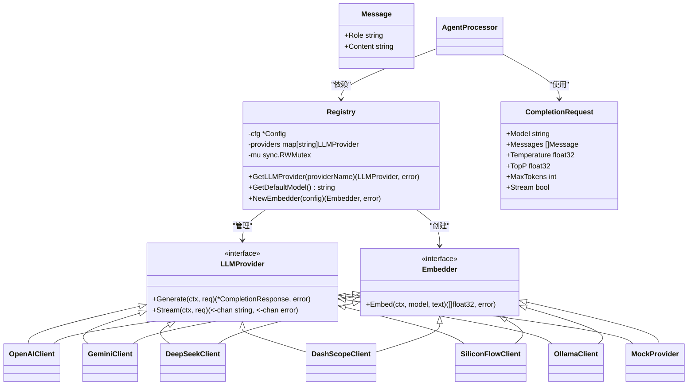
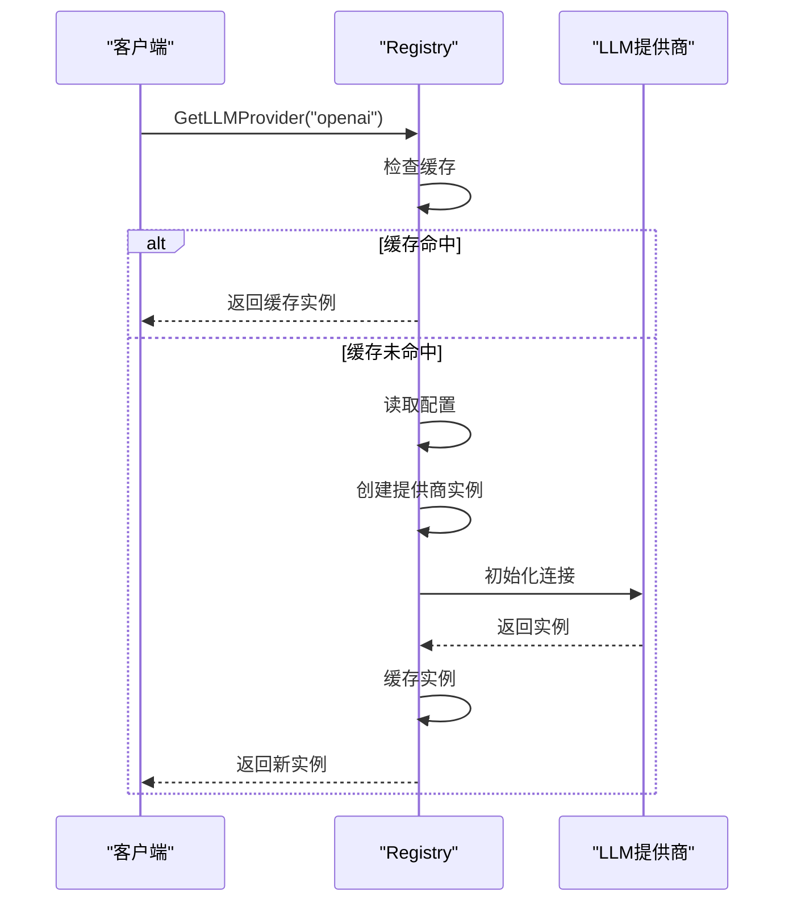
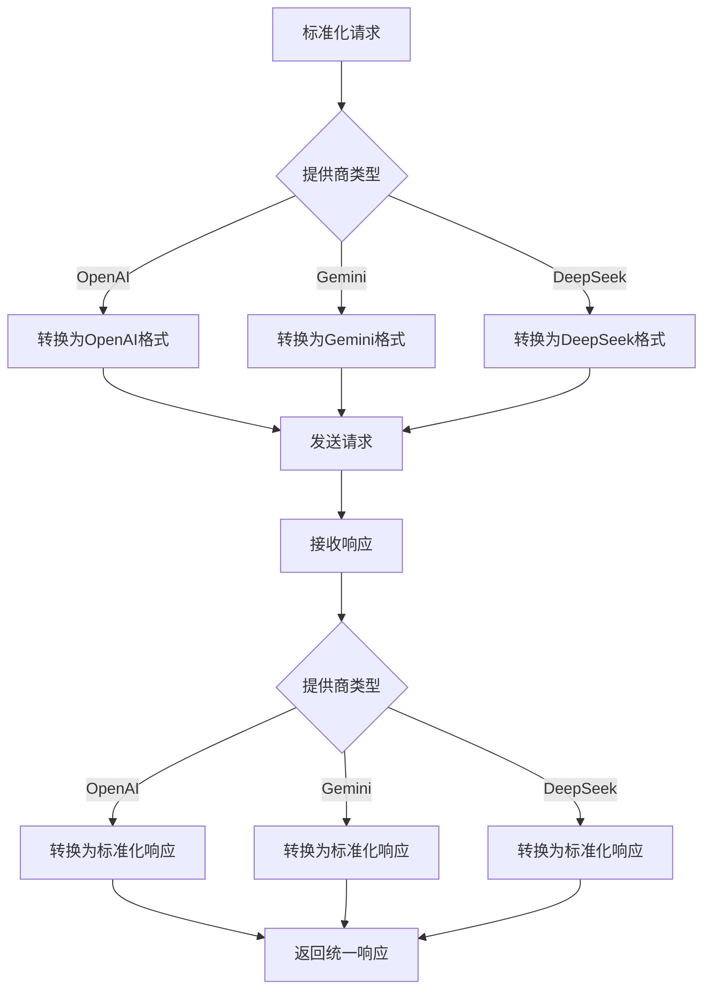

# AI网关

<cite>
**本文档引用的文件**   
- [router.go](file://internal/infrastructure/llm/router.go)
- [llm.go](file://internal/infrastructure/llm/llm.go)
- [config.go](file://internal/pkg/config/config.go)
- [agent.go](file://internal/core/workflow/nodes/agent.go)
- [openai.go](file://internal/infrastructure/llm/openai.go)
- [gemini.go](file://internal/infrastructure/llm/gemini.go)
- [deepseek.go](file://internal/infrastructure/llm/deepseek.go)
- [mock.go](file://internal/infrastructure/llm/mock.go)
- [config.json](file://example/llm/config.json)
</cite>

## 目录
1. [引言](#引言)
2. [核心架构与设计](#核心架构与设计)
3. [LLM路由器实现](#llm路由器实现)
4. [请求标准化接口](#请求标准化接口)
5. [模型选择策略](#模型选择策略)
6. [多提供商配置示例](#多提供商配置示例)
7. [Mock模式在测试中的应用](#mock模式在测试中的应用)
8. [结论](#结论)

## 引言

AI网关模块是本系统的核心组件，负责管理多个大型语言模型（LLM）提供商的动态路由、负载均衡与故障转移。该模块通过一个统一的接口，实现了对OpenAI、Gemini、DeepSeek等多个LLM提供商的抽象，使得上层应用可以无缝切换和使用不同的模型，而无需关心底层实现细节。本文档将深入分析LLM路由器（LLMRouter）的实现机制，包括其动态路由算法、请求标准化处理、模型选择策略以及在测试环境中的Mock模式应用。

## 核心架构与设计

AI网关的核心设计遵循策略模式（Strategy Pattern），通过定义统一的接口来适配不同的LLM提供商。这种设计模式允许系统在运行时根据配置动态选择合适的提供商，从而实现模型无关性。



**图源**
- [llm.go](file://internal/infrastructure/llm/llm.go#L35-L47)
- [router.go](file://internal/infrastructure/llm/router.go#L13-L24)
- [agent.go](file://internal/core/workflow/nodes/agent.go#L16-L21)

**本节来源**
- [llm.go](file://internal/infrastructure/llm/llm.go#L7-L64)
- [router.go](file://internal/infrastructure/llm/router.go#L11-L177)

## LLM路由器实现

LLM路由器的实现基于`Registry`结构体，它负责管理所有可用的LLM提供商实例。`Registry`通过懒加载机制，在首次请求某个提供商时才进行初始化，并将其缓存以供后续使用。

### 动态路由与懒加载

`Registry`的`GetLLMProvider`方法是实现动态路由的核心。当请求一个提供商时，它首先检查缓存中是否存在该提供商的实例。如果不存在，则根据配置信息创建一个新的实例，并将其存储在缓存中。

```go
func (r *Registry) GetLLMProvider(providerName string) (LLMProvider, error) {
    // 1. 检查缓存
    if p, ok := r.providers[providerName]; ok {
        return p, nil
    }

    // 2. 处理默认提供程序
    if providerName == "" || providerName == "default" {
        providerName = r.cfg.LLM.Provider
        if p, ok := r.providers[providerName]; ok {
            return p, nil
        }
    }

    // 3. 初始化新提供商
    apiKey := ""
    baseURL := ""
    switch providerName {
    case "openai":
        apiKey = r.cfg.OpenAIKey
    case "deepseek":
        apiKey = r.cfg.DeepSeekKey
    // ... 其他提供商
    }

    llmCfg := LLMConfig{
        Type:    providerName,
        APIKey:  apiKey,
        BaseURL: baseURL,
    }

    provider, err := r.createProvider(llmCfg)
    if err != nil {
        return nil, err
    }

    // 缓存提供商
    r.providers[providerName] = provider
    return provider, nil
}
```

**图源**
- [router.go](file://internal/infrastructure/llm/router.go#L37-L108)

**本节来源**
- [router.go](file://internal/infrastructure/llm/router.go#L37-L108)

### 负载均衡与故障转移

虽然当前实现主要依赖于配置选择提供商，但通过`Registry`的设计，可以很容易地扩展支持负载均衡和故障转移策略。例如，可以在`GetLLMProvider`方法中加入健康检查机制，当某个提供商不可用时自动切换到备用提供商。



**图源**
- [router.go](file://internal/infrastructure/llm/router.go#L37-L108)

**本节来源**
- [router.go](file://internal/infrastructure/llm/router.go#L37-L108)

## 请求标准化接口

为了实现对不同LLM提供商的统一访问，AI网关定义了一套标准化的请求和响应接口。

### 提示词模板适配

系统通过`CompletionRequest`结构体来标准化请求参数，包括模型名称、消息列表、温度、TopP等。在实际调用时，这些参数会被映射到各个提供商的具体API中。

```go
type CompletionRequest struct {
    Model       string    `json:"model"`
    Messages    []Message `json:"messages"`
    Temperature float32   `json:"temperature"`
    TopP        float32   `json:"top_p,omitempty"`
    MaxTokens   int       `json:"max_tokens,omitempty"`
    Stream      bool      `json:"stream,omitempty"`
}
```

### 参数映射与响应归一化

每个提供商的客户端实现都负责将标准化的`CompletionRequest`转换为该提供商特有的请求格式，并将响应转换为统一的`CompletionResponse`格式。



**图源**
- [llm.go](file://internal/infrastructure/llm/llm.go#L14-L27)
- [openai.go](file://internal/infrastructure/llm/openai.go#L34-L74)
- [gemini.go](file://internal/infrastructure/llm/gemini.go#L35-L114)

**本节来源**
- [llm.go](file://internal/infrastructure/llm/llm.go#L14-L27)
- [openai.go](file://internal/infrastructure/llm/openai.go#L34-L74)
- [gemini.go](file://internal/infrastructure/llm/gemini.go#L35-L114)

## 模型选择策略

模型选择策略是AI网关智能路由的关键。系统通过配置和运行时信息来决定使用哪个模型。

### 成本、延迟与能力权重计算

虽然当前代码中没有直接体现复杂的权重计算算法，但通过配置文件可以看出，系统支持根据不同模型的特性和适用任务来选择模型。

```json
{
    "openai": {
        "model": "gpt-5-mini",
        "feature": "OpenAI 最新高性价比模型，速度极快，成本仅为旗舰版的 1/14。",
        "tasks": "高频日常对话、简单代码辅助、大批量数据处理。"
    },
    "deepseek": {
        "model": "deepseek-chat",
        "feature": "国产开源巅峰，数学与代码逻辑能力极强，思维严密。",
        "tasks": "复杂算法实现、Bug 修复、数学推导、逻辑查漏补缺。"
    }
}
```

**本节来源**
- [config.json](file://example/llm/config.json#L1-L59)

## 多提供商配置示例

以下是配置多个LLM提供商的示例，涵盖了认证密钥管理、速率限制处理与降级策略。

### 认证密钥管理

系统通过环境变量来管理各个提供商的API密钥，确保安全性。

```go
type Config struct {
    OpenAIKey      string
    DeepSeekKey    string
    DashScopeKey   string
    GeminiKey      string
    SiliconFlowKey string
    // ...
}
```

### 速率限制处理

虽然具体的速率限制实现不在AI网关模块中，但系统设计考虑了这一需求，可以通过中间件来实现。

```go
// 示例：速率限制中间件配置
var DefaultLimits = map[string]RateLimitConfig{
    "api:general":    {RequestsPerMinute: 60, BurstSize: 10},
    "api:execute":    {RequestsPerMinute: 10, BurstSize: 2},
    "api:generate":   {RequestsPerMinute: 5, BurstSize: 1},
}
```

### 降级策略

系统实现了故障转移机制，当指定的提供商不可用时，可以降级到默认提供商。

```go
func (r *Registry) GetLLMProvider(providerName string) (LLMProvider, error) {
    // ... 
    if err != nil {
        log.Warn("Provider %s unavailable, falling back to default", config.Provider)
        return r.getDefaultProvider()
    }
    // ...
}
```

**本节来源**
- [config.go](file://internal/pkg/config/config.go#L8-L133)
- [router.go](file://internal/infrastructure/llm/router.go#L37-L108)

## Mock模式在测试中的应用

为了支持单元测试和集成测试，系统提供了Mock模式，允许在不依赖真实LLM提供商的情况下进行测试。

### MockProvider实现

`MockProvider`实现了`LLMProvider`和`Embedder`接口，可以模拟各种响应情况，包括成功响应、错误响应和流式响应。

```go
type MockProvider struct {
    GenerateResponse *CompletionResponse
    GenerateError    error
    StreamContent    []string
    StreamError      error
    EmbedResponse    []float32
    EmbedError       error
    GenerateCalls    int
    StreamCalls      int
    EmbedCalls       int
}

func (m *MockProvider) Generate(ctx context.Context, req *CompletionRequest) (*CompletionResponse, error) {
    m.GenerateCalls++
    if m.GenerateError != nil {
        return nil, m.GenerateError
    }
    return m.GenerateResponse, nil
}
```

### 测试用例

通过`MockProvider`，可以轻松编写测试用例来验证系统的各种行为。

```go
func TestRegistry_GetLLMProvider(t *testing.T) {
    cfg := &config.Config{
        LLM: config.LLMConfig{
            Provider: "openai",
            APIKey:   "sk-test",
            Model:    "gpt-4",
        },
        OpenAIKey: "sk-test-global",
    }
    registry := NewRegistry(cfg)

    p, err := registry.GetLLMProvider("openai")
    if err != nil {
        t.Errorf("GetLLMProvider() error = %v", err)
    }
    if p == nil {
        t.Error("GetLLMProvider() returned nil provider")
    }
}
```

**本节来源**
- [mock.go](file://internal/infrastructure/llm/mock.go#L1-L80)
- [router_test.go](file://internal/infrastructure/llm/router_test.go#L36-L69)

## 结论

AI网关模块通过精心设计的架构和实现，成功地解决了多LLM提供商的集成问题。它不仅提供了统一的访问接口，还支持动态路由、负载均衡、故障转移和Mock测试等多种高级功能。通过标准化的请求和响应格式，系统实现了对不同提供商的透明访问，为上层应用提供了极大的灵活性和可靠性。未来可以进一步扩展模型选择策略，引入更复杂的权重计算和实时性能监控，以实现更智能的路由决策。