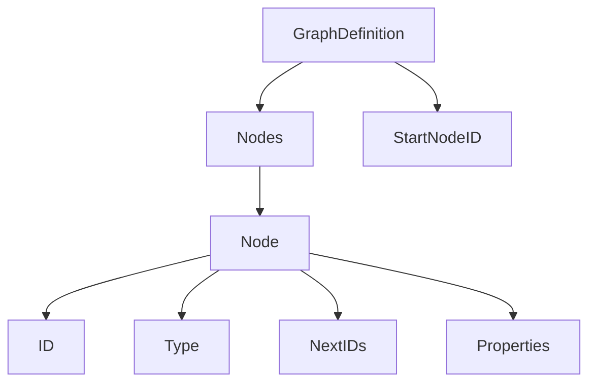
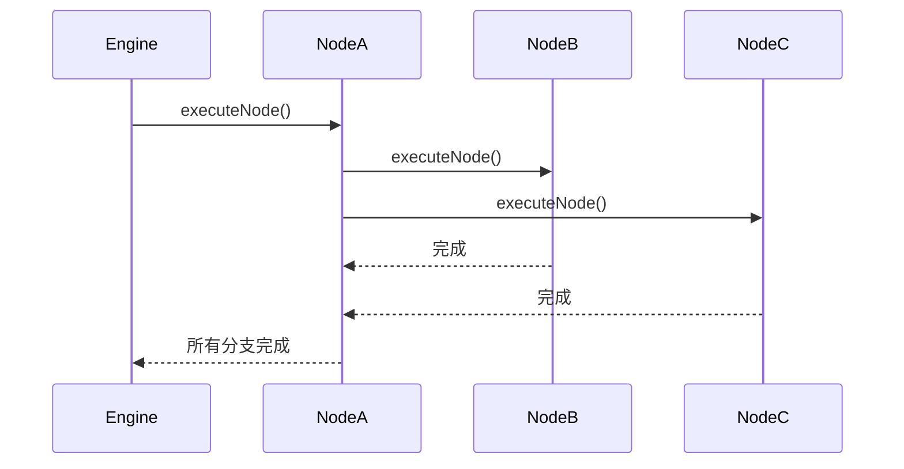
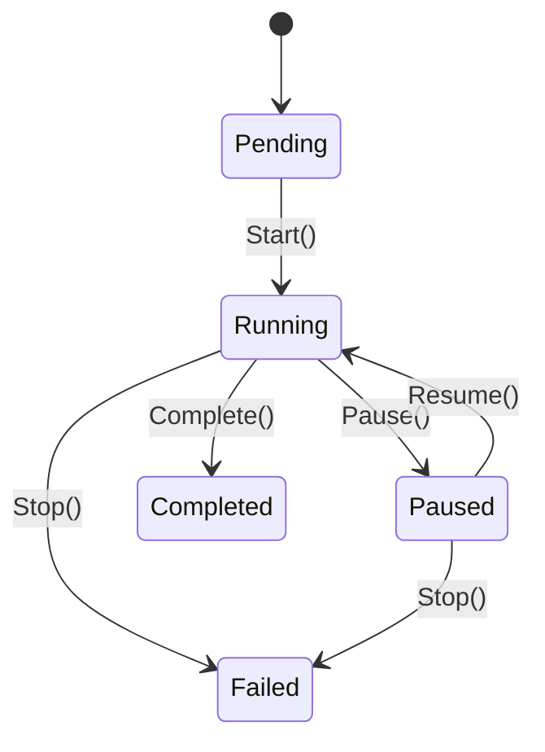
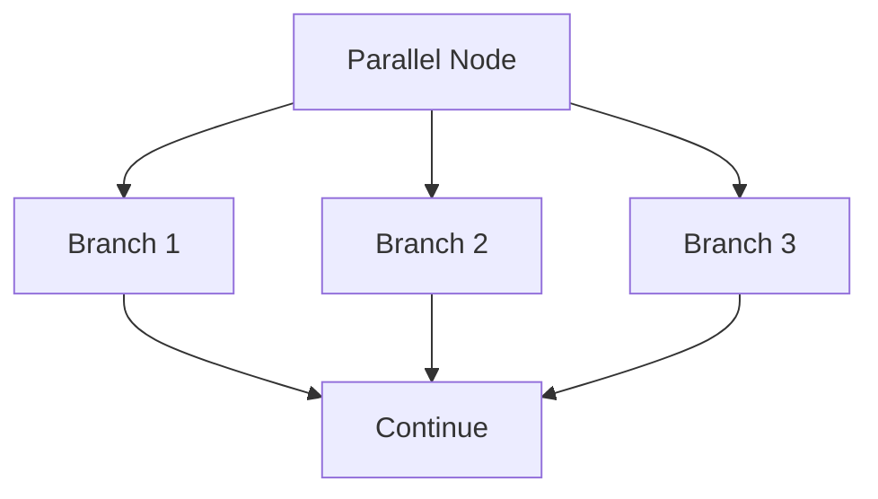
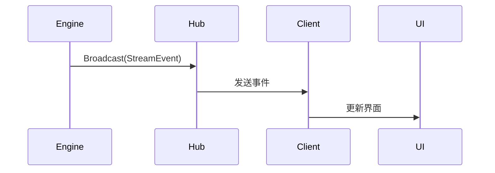

# 工作流引擎

<cite>
**本文档引用的文件**  
- [engine.go](file://internal/core/workflow/engine.go)
- [session.go](file://internal/core/workflow/session.go)
- [session_repository.go](file://internal/core/workflow/session_repository.go)
- [persistence/session_repository.go](file://internal/infrastructure/persistence/session_repository.go)
- [types.go](file://internal/core/workflow/types.go)
- [context.go](file://internal/core/workflow/context.go)
- [factory.go](file://internal/core/workflow/nodes/factory.go)
- [start.go](file://internal/core/workflow/nodes/start.go)
- [end.go](file://internal/core/workflow/nodes/end.go)
- [vote.go](file://internal/core/workflow/nodes/vote.go)
- [loop.go](file://internal/core/workflow/nodes/loop.go)
- [fact_check.go](file://internal/core/workflow/nodes/fact_check.go)
- [human_review.go](file://internal/core/workflow/nodes/human_review.go)
- [memory_retrieval.go](file://internal/core/workflow/nodes/memory_retrieval.go)
- [validation.go](file://internal/core/workflow/validation.go)
- [middleware/fact_check.go](file://internal/core/middleware/fact_check.go)
- [middleware/versioning.go](file://internal/core/middleware/versioning.go)
- [ws/hub.go](file://internal/api/ws/hub.go)
- [main.go](file://cmd/council/main.go)
</cite>

## 更新摘要
**变更内容**   
- 更新了**Engine结构体与工作流状态维护**部分，增加了SessionRepository依赖注入和节点状态持久化机制
- 更新了**执行生命周期管理**部分，说明了节点状态如何通过异步方式持久化
- 更新了**会话状态与上下文数据传递**部分，增加了NodeStatuses字段的说明
- 新增了**节点状态持久化机制**专门章节，详细描述持久化实现

## 目录
1. [简介](#简介)
2. [DAG解析机制](#dag解析机制)
3. [节点调度策略](#节点调度策略)
4. [执行生命周期管理](#执行生命周期管理)
5. [Engine结构体与工作流状态维护](#engine结构体与工作流状态维护)
6. [复杂节点逻辑处理](#复杂节点逻辑处理)
7. [StreamChannel与WebSocket实时事件推送](#streamchannel与websocket实时事件推送)
8. [NodeFactory与依赖注入机制](#nodefactory与依赖注入机制)
9. [工作流控制流程](#工作流控制流程)
10. [中间件拦截机制](#中间件拦截机制)
11. [会话状态与上下文数据传递](#会话状态与上下文数据传递)
12. [节点状态持久化机制](#节点状态持久化机制)

## 简介
本文档详细描述了工作流引擎的核心机制，包括DAG（有向无环图）解析、节点调度策略、执行生命周期管理、复杂节点逻辑处理、实时事件推送、依赖注入模式以及中间件拦截机制。重点分析了Engine结构体如何维护工作流状态，处理并行/顺序/投票/循环等复杂节点逻辑，并通过StreamChannel实现WebSocket实时事件推送。同时说明了NodeFactory如何基于依赖注入模式动态创建节点处理器，支持扩展自定义节点类型。特别说明了新增的节点状态持久化机制，包括在SessionEntity中添加NodeStatuses字段，Engine结构体包含SessionRepository依赖，以及updateStatus方法异步持久化节点状态的实现。

## DAG解析机制
工作流引擎使用有向无环图（DAG）来表示工作流的执行逻辑。`GraphDefinition`结构体定义了工作流的静态结构，包含节点集合和起始节点ID。引擎在执行前会对DAG进行验证，确保图的完整性。

验证过程包括：
- 检查起始节点是否存在
- 验证所有节点链接指向存在的节点
- 检查图的可达性（所有节点都能从起始节点访问）

虽然引擎允许循环结构（如循环节点），但通过运行时保护机制（如最大轮次限制）来防止无限循环。



**图源**  
- [types.go](file://internal/core/workflow/types.go#L43-L60)
- [validation.go](file://internal/core/workflow/validation.go#L8-L71)

## 节点调度策略
工作流引擎采用基于事件驱动的调度策略，通过递归执行节点来推进工作流。每个节点执行完成后，会触发其后续节点的执行。

对于并行节点，引擎使用WaitGroup机制并发执行所有分支，确保所有分支完成后再继续执行后续节点。这种设计既保证了并行性，又维护了执行顺序的正确性。



**图源**  
- [engine.go](file://internal/core/workflow/engine.go#L130-L138)
- [engine.go](file://internal/core/workflow/engine.go#L149-L157)

## 执行生命周期管理
工作流引擎通过`Session`结构体管理执行生命周期，支持运行、暂停、恢复和终止等状态转换。



**图源**  
- [session.go](file://internal/core/workflow/session.go#L12-L21)
- [session.go](file://internal/core/workflow/session.go#L51-L155)

## Engine结构体与工作流状态维护
`Engine`结构体是工作流执行的核心协调器，负责维护工作流的执行状态和控制流程。

```go
type Engine struct {
    Graph         *GraphDefinition
    Status        map[string]NodeStatus
    NodeFactory   func(node *Node) (NodeProcessor, error)
    StreamChannel chan StreamEvent
    mu            sync.RWMutex
    inputs        map[string]interface{}
    Middlewares   []Middleware
    Session       *Session
    SessionRepo   SessionRepository // 新增：会话存储库依赖
}
```

Engine通过`Status`映射维护每个节点的执行状态，使用读写锁保证并发安全。`StreamChannel`用于向客户端推送实时事件，`Middlewares`切片存储中间件链，`Session`引用会话状态。**新增了SessionRepo字段，用于注入会话存储库依赖，支持节点状态的持久化操作**。

**节源**  
- [engine.go](file://internal/core/workflow/engine.go#L11-L31)

## 复杂节点逻辑处理
工作流引擎支持多种复杂节点类型，包括并行、投票、循环、事实核查和人工审核等。

### 并行节点
并行节点（NodeTypeParallel）用于同时执行多个分支，所有分支完成后才继续执行后续节点。



**图源**  
- [engine.go](file://internal/core/workflow/engine.go#L80-L83)
- [engine.go](file://internal/core/workflow/engine.go#L141-L158)

### 投票节点
投票节点（NodeTypeVote）根据预设阈值对多个输入进行投票决策。

```go
type VoteProcessor struct {
    Threshold float64
    VoteType  string
}
```

**节源**  
- [vote.go](file://internal/core/workflow/nodes/vote.go#L10-L13)

### 循环节点
循环节点（NodeTypeLoop）支持基于最大轮次或评分阈值的循环执行。

```go
type LoopProcessor struct {
    MaxRounds   int
    ExitOnScore int
}
```

**节源**  
- [loop.go](file://internal/core/workflow/nodes/loop.go#L10-L13)

### 事实核查节点
事实核查节点（NodeTypeFactCheck）结合网络搜索和LLM验证内容准确性。

```go
type FactCheckProcessor struct {
    LLM             llm.LLMProvider
    SearchClient    search.SearchClient
    VerifyThreshold float64
}
```

**节源**  
- [fact_check.go](file://internal/core/workflow/nodes/fact_check.go#L14-L18)

### 人工审核节点
人工审核节点（NodeTypeHumanReview）用于暂停工作流等待人工干预。

```go
type HumanReviewProcessor struct {
    TimeoutMinutes int
    AllowSkip      bool
}
```

**节源**  
- [human_review.go](file://internal/core/workflow/nodes/human_review.go#L10-L13)

## StreamChannel与WebSocket实时事件推送
工作流引擎通过`StreamChannel`实现WebSocket实时事件推送，向客户端发送执行状态变更、令牌流、错误等事件。



WebSocket Hub使用广播模式将事件推送给所有连接的客户端，实现多客户端实时同步。

**图源**  
- [hub.go](file://internal/api/ws/hub.go#L21-L68)
- [engine.go](file://internal/core/workflow/engine.go#L16-L16)

## NodeFactory与依赖注入机制
`NodeFactory`基于依赖注入模式动态创建节点处理器，支持扩展自定义节点类型。

```go
func NewNodeFactory(deps NodeDependencies) func(node *workflow.Node) (workflow.NodeProcessor, error) {
    return func(node *workflow.Node) (workflow.NodeProcessor, error) {
        switch node.Type {
        case workflow.NodeTypeStart:
            return &StartProcessor{}, nil
        case workflow.NodeTypeEnd:
            return &EndProcessor{...}, nil
        // 其他节点类型
        default:
            return nil, fmt.Errorf("unsupported node type: %s", node.Type)
        }
    }
}
```

依赖注入通过`NodeDependencies`结构体传递所需服务，如LLM注册表、代理仓库和内存服务。

**节源**  
- [factory.go](file://internal/core/workflow/nodes/factory.go#L19-L106)

## 工作流控制流程
工作流的控制流程包括启动、暂停、恢复和终止等操作。

### 启动
工作流通过`Run`方法启动，首先进行基本验证，然后从起始节点开始执行。

```go
func (e *Engine) Run(ctx context.Context) {
    if err := e.Graph.Validate(); err != nil {
        e.emitError("validation_failed", err)
        return
    }
    e.executeNode(ctx, e.Graph.StartNodeID, e.inputs)
}
```

### 暂停与恢复
暂停操作通过`Session.Pause()`方法实现，恢复通过`Session.Resume()`方法实现。

```go
func (s *Session) Pause() {
    s.mu.Lock()
    defer s.mu.Unlock()
    if s.Status == SessionRunning {
        s.Status = SessionPaused
        s.resumeCh = make(chan struct{})
    }
}
```

### 终止
终止操作通过`Session.Stop()`方法实现，会取消上下文并清理资源。

**节源**  
- [engine.go](file://internal/core/workflow/engine.go#L40-L50)
- [session.go](file://internal/core/workflow/session.go#L74-L90)
- [session.go](file://internal/core/workflow/session.go#L144-L155)

## 中间件拦截机制
工作流引擎支持中间件链，在节点执行前后进行拦截处理，实现防幻觉、成本估算等功能。

### 防幻觉中间件
`FactCheckTrigger`中间件扫描输出内容，检测未验证的声明。

```go
func (fc *FactCheckTrigger) AfterNodeExecution(ctx context.Context, session *workflow.Session, node *workflow.Node, output map[string]interface{}) (map[string]interface{}, error) {
    if content, ok := output["content"].(string); ok {
        if fc.MetricRegex.MatchString(content) || fc.CitationRegex.MatchString(content) {
            meta, _ := output["metadata"].(map[string]interface{})
            if meta == nil {
                meta = make(map[string]interface{})
            }
            meta["verify_pending"] = true
            output["metadata"] = meta
        }
    }
    return output, nil
}
```

### 版本控制中间件
`VersioningMiddleware`在人工审核节点执行前创建备份，支持回滚功能。

```go
func (v *VersioningMiddleware) BeforeNodeExecution(ctx context.Context, session *workflow.Session, node *workflow.Node) error {
    if node.Type != workflow.NodeTypeHumanReview {
        return nil
    }
    if err := v.CreateBackup(session.ID, targetPath); err != nil {
        fmt.Printf("[versioning] backup warning: %v\n", err)
    }
    return nil
}
```

**节源**  
- [fact_check.go](file://internal/core/middleware/fact_check.go#L10-L53)
- [versioning.go](file://internal/core/middleware/versioning.go#L15-L56)

## 会话状态与上下文数据传递
工作流引擎通过`Session`和`WorkflowContext`管理会话状态和上下文数据传递。

`Session`结构体维护工作流实例的全局状态，包括输入、输出、开始时间、结束时间等。

`WorkflowContext`包装标准上下文，提供会话ID和输入数据的访问。

```go
type Session struct {
    ID        string
    Graph     *GraphDefinition
    Status    SessionStatus
    StartTime time.Time
    EndTime   time.Time
    Inputs    map[string]interface{}
    Outputs   map[string]interface{}
    Error     error
    ctx       context.Context
    cancel    context.CancelFunc
    resumeCh  chan struct{}
    NodeStatuses map[string]NodeStatus `json:"node_statuses"` // 新增：节点状态映射
}
```

节点之间通过输入输出映射传递数据，每个节点的输出成为后续节点的输入。

**节源**  
- [session.go](file://internal/core/workflow/session.go#L23-L40)
- [context.go](file://internal/core/workflow/context.go#L16-L36)

## 节点状态持久化机制
工作流引擎现在支持节点状态的持久化，确保在系统重启或故障恢复后能够准确恢复执行状态。

### SessionEntity结构体
`SessionEntity`结构体作为会话的持久化表示，新增了`NodeStatuses`字段来存储每个节点的执行状态。

```go
type SessionEntity struct {
    ID           string                 `json:"session_uuid" db:"session_uuid"`
    GroupID      string                 `json:"group_uuid" db:"group_uuid"`
    WorkflowID   string                 `json:"workflow_uuid" db:"workflow_uuid"`
    Status       SessionStatus          `json:"status"`
    Proposal     map[string]interface{} `json:"proposal"`
    NodeStatuses map[string]NodeStatus  `json:"node_statuses,omitempty"` // 新增：节点状态持久化
    StartedAt    *time.Time             `json:"started_at"`
    EndedAt      *time.Time             `json:"ended_at"`
}
```

**节源**  
- [session_repository.go](file://internal/core/workflow/session_repository.go#L8-L18)

### SessionRepository接口
`SessionRepository`接口定义了会话持久化的操作，新增了`UpdateNodeStatus`方法用于更新单个节点的状态。

```go
type SessionRepository interface {
    Create(ctx context.Context, session *Session, groupID string, workflowID string) error
    Get(ctx context.Context, id string) (*SessionEntity, error)
    UpdateStatus(ctx context.Context, id string, status SessionStatus) error
    UpdateNodeStatus(ctx context.Context, sessionID string, nodeID string, status NodeStatus) error // 新增：节点状态更新
}
```

**节源**  
- [session_repository.go](file://internal/core/workflow/session_repository.go#L20-L25)

### Engine中的持久化实现
`Engine`结构体通过`SessionRepo`依赖注入会话存储库，并在`updateStatus`方法中异步持久化节点状态。

```go
func (e *Engine) updateStatus(nodeID string, status NodeStatus) {
    e.Mu.Lock()
    e.Status[nodeID] = status
    e.Mu.Unlock()

    // 异步持久化节点状态
    if e.SessionRepo != nil {
        go func() {
            if err := e.SessionRepo.UpdateNodeStatus(context.Background(), e.Session.ID, nodeID, status); err != nil {
                log.Printf("Failed to persist status for node %s: %v", nodeID, err)
            }
        }()
    }

    e.StreamChannel <- StreamEvent{
        Type:      "node_state_change",
        Timestamp: time.Now(),
        NodeID:    nodeID,
        Data:      map[string]interface{}{"status": status},
    }
}
```

**节源**  
- [engine.go](file://internal/core/workflow/engine.go#L222-L234)

### 数据库实现
`persistence.SessionRepository`实现了`SessionRepository`接口，使用PostgreSQL的JSONB类型来存储和更新节点状态。

```go
func (r *SessionRepository) UpdateNodeStatus(ctx context.Context, sessionID string, nodeID string, status workflow.NodeStatus) error {
    // 使用jsonb || 操作符合并/更新特定节点的状态
    query := `
        UPDATE sessions 
        SET node_statuses = COALESCE(node_statuses, '{}'::jsonb) || jsonb_build_object($2::text, $3::text),
            updated_at = NOW()
        WHERE session_uuid = $1
    `
    _, err := r.pool.Exec(ctx, query, sessionID, nodeID, string(status))
    if err != nil {
        return fmt.Errorf("failed to update node status: %w", err)
    }
    return nil
}
```

**节源**  
- [persistence/session_repository.go](file://internal/infrastructure/persistence/session_repository.go#L73-L86)