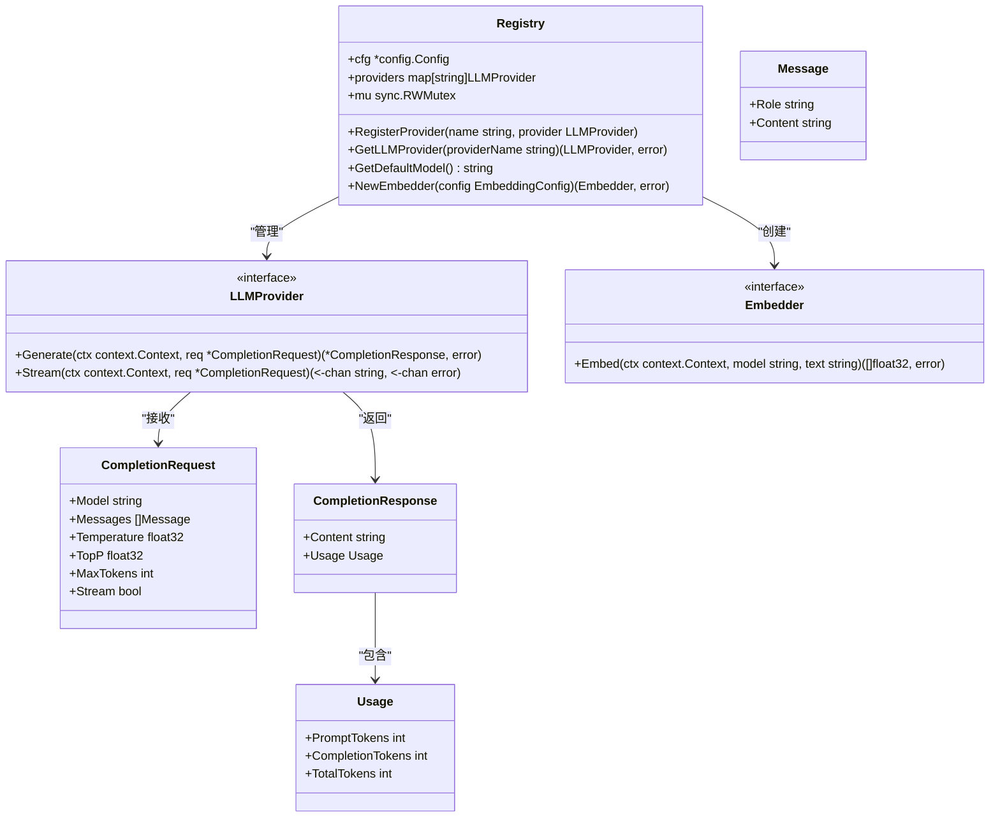
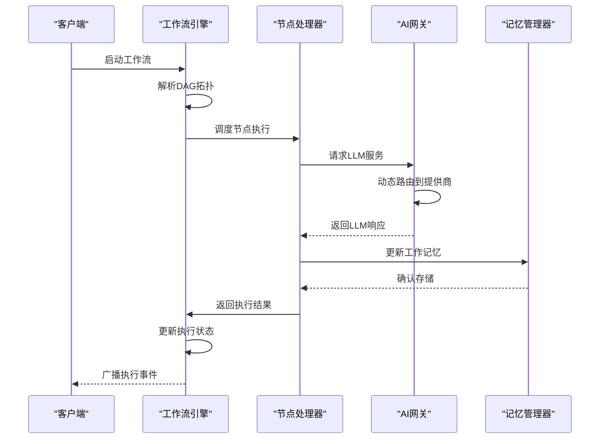

# 核心引擎

<cite>
**本文档中引用的文件**  
- [engine.go](file://internal/core/workflow/engine.go)
- [types.go](file://internal/core/workflow/types.go)
- [context.go](file://internal/core/workflow/context.go)
- [session.go](file://internal/core/workflow/session.go)
- [factory.go](file://internal/core/workflow/nodes/factory.go)
- [agent.go](file://internal/core/workflow/nodes/agent.go)
- [vote.go](file://internal/core/workflow/nodes/vote.go)
- [loop.go](file://internal/core/workflow/nodes/loop.go)
- [fact_check.go](file://internal/core/workflow/nodes/fact_check.go)
- [router.go](file://internal/infrastructure/llm/router.go)
- [llm.go](file://internal/infrastructure/llm/llm.go)
- [openai.go](file://internal/infrastructure/llm/openai.go)
- [gemini.go](file://internal/infrastructure/llm/gemini.go)
- [service.go](file://internal/core/memory/service.go)
- [types.go](file://internal/core/memory/types.go)
</cite>

## 目录
1. [引言](#引言)
2. [工作流引擎](#工作流引擎)
3. [AI网关](#ai网关)
4. [记忆管理器](#记忆管理器)
5. [节点工厂与上下文构建](#节点工厂与上下文构建)
6. [组件协同机制](#组件协同机制)
7. [结论](#结论)

## 引言
本项目的核心引擎由三大关键组件构成：工作流引擎、AI网关和记忆管理器。工作流引擎负责解析DAG拓扑结构、调度节点执行、处理分支逻辑（并行、投票、循环）及状态持久化。AI网关通过LLM路由器实现多提供商（如OpenAI、Gemini等）的动态路由、负载均衡与故障转移。记忆管理器采用三层架构（隔离区、工作记忆、长期记忆）来管理数据流转与检索。这些组件通过节点工厂模式和上下文构建器协同工作，实现复杂AI工作流的高效执行。

## 工作流引擎

工作流引擎是整个系统的核心调度器，负责解析DAG（有向无环图）拓扑结构并调度节点执行。它通过`Engine`结构体管理执行状态，利用`GraphDefinition`定义工作流的静态结构，包括节点和它们之间的连接关系。引擎支持多种控制流节点，如并行、投票和循环，以实现复杂的业务逻辑。

```mermaid
classDiagram
class Engine {
+Graph *GraphDefinition
+Status map[string]NodeStatus
+NodeFactory func(*Node) (NodeProcessor, error)
+StreamChannel chan StreamEvent
+Middlewares []Middleware
+Session *Session
+Run(ctx context.Context)
+executeNode(ctx context.Context, nodeID string, input map[string]interface{})
+handleParallel(ctx context.Context, node *Node, input map[string]interface{})
+updateStatus(nodeID string, status NodeStatus)
+GetStatus(nodeID string) NodeStatus
+emitError(nodeID string, err error)
+ResumeNode(ctx context.Context, nodeID string, output map[string]interface{}) error
}
class GraphDefinition {
+ID string
+Name string
+Description string
+Nodes map[string]*Node
+StartNodeID string
+Validate() error
}
class Node {
+ID string
+Type NodeType
+Name string
+NextIDs []string
+Properties map[string]interface{}
}
class Session {
+ID string
+Graph *GraphDefinition
+Status SessionStatus
+StartTime time.Time
+EndTime time.Time
+Inputs map[string]interface{}
+Outputs map[string]interface{}
+Error error
+Start(parentCtx context.Context)
+Complete()
+Pause()
+Resume()
+WaitIfPaused(ctx context.Context) error
+GetSignalChannel(nodeID string) chan interface{}
+SendSignal(nodeID string, payload interface{}) error
+Stop()
+Context() context.Context
}
class StreamEvent {
+Type string
+Timestamp time.Time
+NodeID string
+Data map[string]interface{}
}
Engine --> GraphDefinition : "包含"
Engine --> Session : "引用"
GraphDefinition --> Node : "包含"
Session --> StreamEvent : "广播"
```

**图示来源**
- [engine.go](file://internal/core/workflow/engine.go#L11-L246)
- [types.go](file://internal/core/workflow/types.go#L8-L67)
- [session.go](file://internal/core/workflow/session.go#L12-L165)
- [context.go](file://internal/core/workflow/context.go#L8-L14)

**节来源**
- [engine.go](file://internal/core/workflow/engine.go#L11-L246)
- [types.go](file://internal/core/workflow/types.go#L8-L67)

## AI网关

AI网关通过LLM路由器实现多提供商的动态路由、负载均衡与故障转移。`Registry`结构体管理所有LLM提供商，根据配置和请求动态选择合适的提供商。它支持OpenAI、Gemini、DeepSeek等多种提供商，并能根据提供商的可用性和性能进行智能路由。



**图示来源**
- [router.go](file://internal/infrastructure/llm/router.go#L11-L177)
- [llm.go](file://internal/infrastructure/llm/llm.go#L7-L64)
- [openai.go](file://internal/infrastructure/llm/openai.go#L11-L154)
- [gemini.go](file://internal/infrastructure/llm/gemini.go)

**节来源**
- [router.go](file://internal/infrastructure/llm/router.go#L11-L177)
- [llm.go](file://internal/infrastructure/llm/llm.go#L7-L64)

## 记忆管理器

记忆管理器采用三层架构来管理数据流转与检索。第一层是隔离区（Quarantine），用于存储未经验证的内容；第二层是工作记忆（Working Memory），使用Redis存储近期活跃的信息；第三层是长期记忆（Long-term Memory），使用PostgreSQL和向量数据库存储持久化知识。这种分层设计确保了数据的安全性和高效检索。

```mermaid
classDiagram
class Service {
+Embedder llm.Embedder
+pool db.DB
+cache cache.Cache
+LogQuarantine(ctx context.Context, sessionID string, nodeID string, content string, metadata map[string]interface{}) error
+UpdateWorkingMemory(ctx context.Context, groupID string, content string, metadata map[string]interface{}) error
+CleanupWorkingMemory(ctx context.Context) error
+Promote(ctx context.Context, groupID string, content string) error
+Retrieve(ctx context.Context, query string, groupID string) ([]ContextItem, error)
}
class MemoryManager {
<<interface>>
+LogQuarantine(ctx context.Context, sessionID string, nodeID string, content string, metadata map[string]interface{}) error
+UpdateWorkingMemory(ctx context.Context, groupID string, content string, metadata map[string]interface{}) error
+Promote(ctx context.Context, groupID string, digest string) error
+Retrieve(ctx context.Context, query string, groupID string) ([]ContextItem, error)
}
class ContextItem {
+Content string
+Source string
+Score float64
}
Service --> MemoryManager : "实现"
Service --> ContextItem : "返回"
```

**图示来源**
- [service.go](file://internal/core/memory/service.go#L14-L209)
- [types.go](file://internal/core/memory/types.go#L7-L27)

**节来源**
- [service.go](file://internal/core/memory/service.go#L14-L209)
- [types.go](file://internal/core/memory/types.go#L7-L27)

## 节点工厂与上下文构建

节点工厂模式允许系统扩展自定义节点。`NewNodeFactory`函数根据节点类型创建相应的处理器，如`AgentProcessor`、`VoteProcessor`等。上下文构建器在跨节点信息传递中起关键作用，确保每个节点都能访问必要的上下文信息。

```mermaid
classDiagram
class NodeDependencies {
+Registry *llm.Registry
+AgentRepo agent.Repository
+MemoryService *memory.Service
}
class NodeProcessor {
<<interface>>
+Process(ctx context.Context, input map[string]interface{}, stream chan<- StreamEvent) (map[string]interface{}, error)
}
class AgentProcessor {
+NodeID string
+AgentID string
+AgentRepo agent.Repository
+Registry *llm.Registry
+Process(ctx context.Context, input map[string]interface{}, stream chan<- StreamEvent) (map[string]interface{}, error)
}
class VoteProcessor {
+Threshold float64
+VoteType string
+Process(ctx context.Context, input map[string]interface{}, stream chan<- StreamEvent) (map[string]interface{}, error)
}
class LoopProcessor {
+MaxRounds int
+ExitOnScore int
+Process(ctx context.Context, input map[string]interface{}, stream chan<- StreamEvent) (map[string]interface{}, error)
}
class FactCheckProcessor {
+LLM llm.LLMProvider
+SearchClient search.SearchClient
+VerifyThreshold float64
+Process(ctx context.Context, input map[string]interface{}, stream chan<- StreamEvent) (map[string]interface{}, error)
}
NodeDependencies --> NodeProcessor : "创建"
NodeProcessor <|-- AgentProcessor : "实现"
NodeProcessor <|-- VoteProcessor : "实现"
NodeProcessor <|-- LoopProcessor : "实现"
NodeProcessor <|-- FactCheckProcessor : "实现"
```

**图示来源**
- [factory.go](file://internal/core/workflow/nodes/factory.go#L12-L106)
- [agent.go](file://internal/core/workflow/nodes/agent.go#L16-L130)
- [vote.go](file://internal/core/workflow/nodes/vote.go#L10-L70)
- [loop.go](file://internal/core/workflow/nodes/loop.go#L10-L67)
- [fact_check.go](file://internal/core/workflow/nodes/fact_check.go#L14-L114)

**节来源**
- [factory.go](file://internal/core/workflow/nodes/factory.go#L12-L106)
- [agent.go](file://internal/core/workflow/nodes/agent.go#L16-L130)

## 组件协同机制

工作流引擎、AI网关和记忆管理器通过节点工厂和上下文构建器紧密协同。工作流引擎调度节点执行，AI网关提供LLM服务，记忆管理器处理数据存储与检索。这种协同机制确保了系统的高效性和可扩展性。



**图示来源**
- [engine.go](file://internal/core/workflow/engine.go#L41-L245)
- [router.go](file://internal/infrastructure/llm/router.go#L37-L108)
- [service.go](file://internal/core/memory/service.go#L61-L97)

**节来源**
- [engine.go](file://internal/core/workflow/engine.go#L41-L245)
- [router.go](file://internal/infrastructure/llm/router.go#L37-L108)
- [service.go](file://internal/core/memory/service.go#L61-L97)

## 结论
核心引擎通过工作流引擎、AI网关和记忆管理器的协同工作，实现了复杂AI工作流的高效执行。工作流引擎负责调度和状态管理，AI网关提供多提供商支持，记忆管理器确保数据的安全存储与高效检索。节点工厂模式和上下文构建器进一步增强了系统的可扩展性和灵活性。这种架构设计为构建复杂的AI应用提供了坚实的基础。