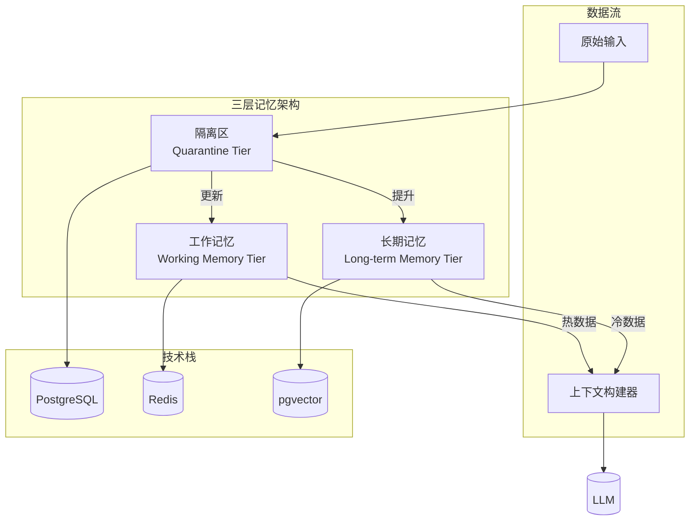
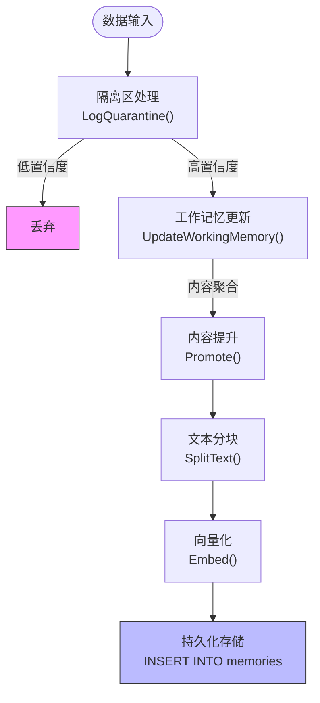
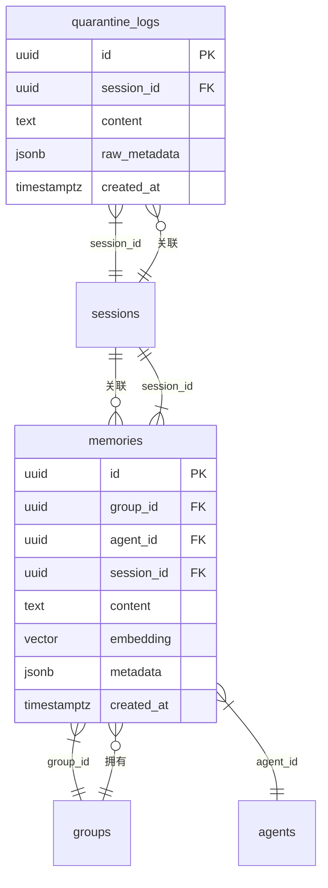

# 记忆系统

<cite>
**本文档引用文件**  
- [service.go](file://internal/core/memory/service.go)
- [splitter.go](file://internal/core/memory/splitter.go)
- [types.go](file://internal/core/memory/types.go)
- [memory_retrieval.go](file://internal/core/workflow/nodes/memory_retrieval.go)
- [context.go](file://internal/core/workflow/context.go)
- [postgres.go](file://internal/infrastructure/db/postgres.go)
- [redis.go](file://internal/infrastructure/cache/redis.go)
- [llm.go](file://internal/infrastructure/llm/llm.go)
- [memory.go](file://internal/api/handler/memory.go)
- [001_init_schema.up.sql](file://internal/infrastructure/db/migrations/001_init_schema.up.sql)
- [002_add_quarantine_logs.up.sql](file://internal/infrastructure/db/migrations/002_add_quarantine_logs.up.sql)
- [main.go](file://cmd/council/main.go)
</cite>

## 目录
1. [引言](#引言)
2. [三层记忆系统架构](#三层记忆系统架构)
3. [核心组件分析](#核心组件分析)
4. [数据流转机制](#数据流转机制)
5. [上下文构建器](#上下文构建器)
6. [记忆检索实现](#记忆检索实现)
7. [数据模型与生命周期管理](#数据模型与生命周期管理)
8. [结论](#结论)

## 引言
本系统实现了三层记忆架构，包括隔离区（Quarantine）、工作记忆（Working Memory）和长期记忆（Long-term Memory），通过MemoryService协调数据在不同层级间的流动。系统利用文本分块器（splitter）对内容进行预处理，结合pgvector实现向量化存储，并通过PostgreSQL与Redis实现持久化集成。上下文构建器从多层记忆中检索相关信息，动态构建上下文注入LLM请求。

## 三层记忆系统架构



**图示来源**  
- [service.go](file://internal/core/memory/service.go#L28-L157)
- [memory_retrieval.go](file://internal/core/workflow/nodes/memory_retrieval.go#L53-L63)

## 核心组件分析

### MemoryService
MemoryService是记忆系统的核心服务，负责协调三层记忆的数据流转。它通过Embedder接口与LLM集成，使用pgvector进行向量化处理，并通过DB和Cache接口与PostgreSQL和Redis交互。

**组件来源**  
- [service.go](file://internal/core/memory/service.go#L14-L25)

### 文本分块器（Splitter）
递归字符分块器（RecursiveCharacterSplitter）按照预定义的分隔符层级（"\n\n" > "\n" > " " > ""）对文本进行分块处理，确保语义完整性。默认配置为500字符块大小和50字符重叠。

**组件来源**  
- [splitter.go](file://internal/core/memory/splitter.go#L7-L27)

### 记忆管理接口
MemoryManager接口定义了三层记忆协议的标准操作，包括隔离区日志记录、工作记忆更新、内容提升和混合检索等功能。

**组件来源**  
- [types.go](file://internal/core/memory/types.go#L7-L20)

## 数据流转机制



**图示来源**  
- [service.go](file://internal/core/memory/service.go#L28-L157)
- [splitter.go](file://internal/core/memory/splitter.go#L22-L26)

### 隔离区（Quarantine）
隔离区作为第一层过滤机制，将原始输入写入PostgreSQL的quarantine_logs表。该层主要作用是暂存未经验证的数据，防止低质量内容直接进入记忆系统。

**处理来源**  
- [service.go](file://internal/core/memory/service.go#L28-L57)
- [002_add_quarantine_logs.up.sql](file://internal/infrastructure/db/migrations/002_add_quarantine_logs.up.sql#L1-L10)

### 工作记忆（Working Memory）
工作记忆层使用Redis列表结构存储近期重要信息，具有24小时TTL和最多50条记录的容量限制。入站过滤器会检查置信度分数（阈值0.8）和内容长度（至少50字符）来决定是否接受内容。

**处理来源**  
- [service.go](file://internal/core/memory/service.go#L60-L97)
- [redis.go](file://internal/infrastructure/cache/redis.go#L16-L51)

### 长期记忆（Long-term Memory）
长期记忆通过Promote方法将工作记忆中的内容提升到PostgreSQL的memories表中。内容首先被分块器分割成500字符的片段，然后通过Embedder生成向量嵌入，最后与元数据一起存储。

**处理来源**  
- [service.go](file://internal/core/memory/service.go#L115-L157)
- [001_init_schema.up.sql](file://internal/infrastructure/db/migrations/001_init_schema.up.sql#L80-L96)

## 上下文构建器

```mermaid
classDiagram
class ContextBuilder {
+Retrieve(query : string, groupID : string) ContextItem[]
+BuildContext(input : map[string]interface{}) map[string]interface{}
}
class MemoryService {
+Retrieve(ctx : Context, query : string, groupID : string) []ContextItem
}
class MemoryRetrievalProcessor {
+Process(input : map[string]interface{}) map[string]interface{}
}
ContextBuilder --> MemoryService : "调用"
MemoryRetrievalProcessor --> ContextBuilder : "实现"
MemoryService --> PGVector : "查询"
MemoryService --> Redis : "查询"
```

**图示来源**  
- [memory_retrieval.go](file://internal/core/workflow/nodes/memory_retrieval.go#L24-L83)
- [service.go](file://internal/core/memory/service.go#L159-L208)

上下文构建器通过MemoryRetrievalProcessor实现，负责从不同记忆层检索相关信息并构建动态上下文。它首先尝试从输入中提取主题或查询内容，然后调用MemoryService的Retrieve方法获取相关记忆项。

## 记忆检索实现

### 检索流程
记忆检索采用混合策略，同时查询热数据（工作记忆）和冷数据（长期记忆）：
1. 从Redis获取最近10条工作记忆记录
2. 使用查询内容生成嵌入向量
3. 在PostgreSQL中执行向量相似度搜索（余弦距离）
4. 合并结果并按相关度排序

**实现来源**  
- [service.go](file://internal/core/memory/service.go#L159-L208)

### 触发条件
记忆检索节点在以下条件下被触发：
- 输入包含"topic"、"content"或"document"字段
- 配置了有效的MemoryService实例
- 提供了有效的group_id用于范围限定

**实现来源**  
- [memory_retrieval.go](file://internal/core/workflow/nodes/memory_retrieval.go#L36-L45)

### 查询优化策略
系统采用多种优化策略提高检索效率：
- 使用IVF Flat索引加速向量搜索
- 限制返回结果数量（最多5条长期记忆）
- 并行查询热数据和冷数据源
- 缓存频繁查询的结果

**实现来源**  
- [001_init_schema.up.sql](file://internal/infrastructure/db/migrations/001_init_schema.up.sql#L95)
- [service.go](file://internal/core/memory/service.go#L163-L207)

## 数据模型与生命周期管理



**图示来源**  
- [001_init_schema.up.sql](file://internal/infrastructure/db/migrations/001_init_schema.up.sql#L80-L96)
- [002_add_quarantine_logs.up.sql](file://internal/infrastructure/db/migrations/002_add_quarantine_logs.up.sql#L1-L10)

### 表结构设计
**memories表**：存储长期记忆，包含向量嵌入字段和多维度索引
- 主键：id (UUID)
- 外键：group_id, agent_id, session_id
- 核心字段：content, embedding(VECTOR(1536)), metadata(JSONB)

**quarantine_logs表**：存储待验证的原始输入
- 主键：id (UUID)
- 核心字段：content, raw_metadata(JSONB), created_at

### 索引策略
- **idx_memories_group**：按group_id索引，支持按组查询
- **idx_memories_embedding**：IVF Flat向量索引，加速相似度搜索
- **idx_quarantine_logs_session**：按session_id索引，支持会话关联查询

**实现来源**  
- [001_init_schema.up.sql](file://internal/infrastructure/db/migrations/001_init_schema.up.sql#L91-L95)
- [002_add_quarantine_logs.up.sql](file://internal/infrastructure/db/migrations/002_add_quarantine_logs.up.sql#L9)

### 生命周期管理
系统通过以下机制管理记忆数据生命周期：
- **工作记忆**：自动TTL（24小时）和LRU修剪（保留最新50条）
- **长期记忆**：无自动过期，依赖业务逻辑清理
- **隔离区**：短期暂存，由业务流程决定后续处理

**实现来源**  
- [service.go](file://internal/core/memory/service.go#L90-L94)
- [postgres.go](file://internal/infrastructure/db/postgres.go#L12-L66)

## 结论
本记忆系统通过三层架构实现了高效的数据管理和上下文构建。隔离区提供了安全的数据入口，工作记忆支持快速访问近期信息，而长期记忆则通过向量化技术实现了语义级别的知识存储。系统与PostgreSQL和Redis深度集成，确保了数据的持久性和高性能访问。上下文构建器能够智能地从多源检索相关信息，为LLM提供丰富的上下文支持，显著提升了对话质量和决策能力。