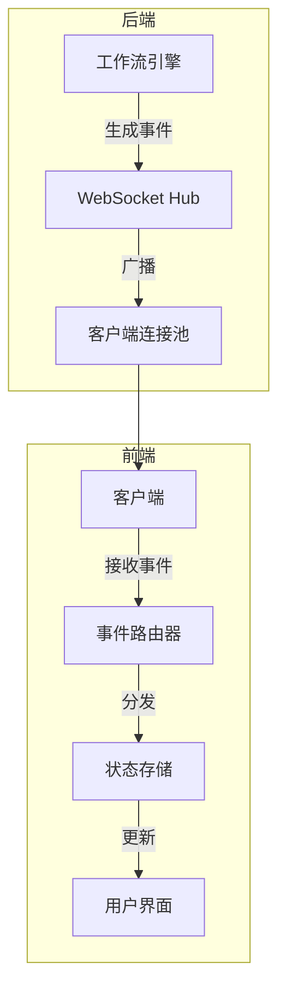
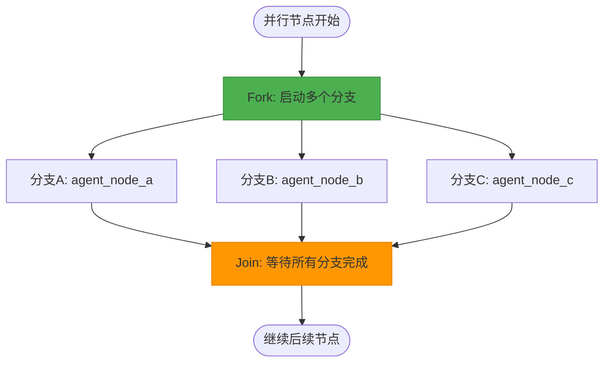
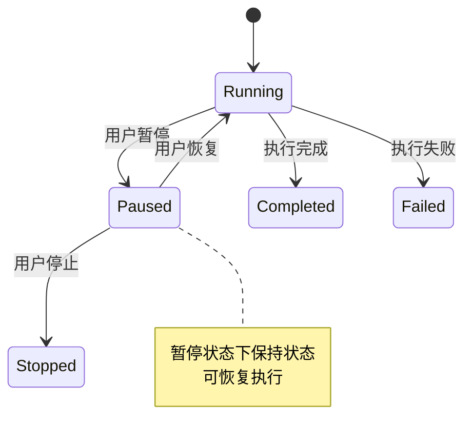
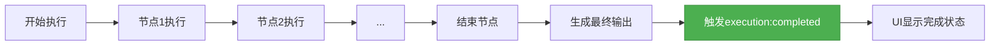
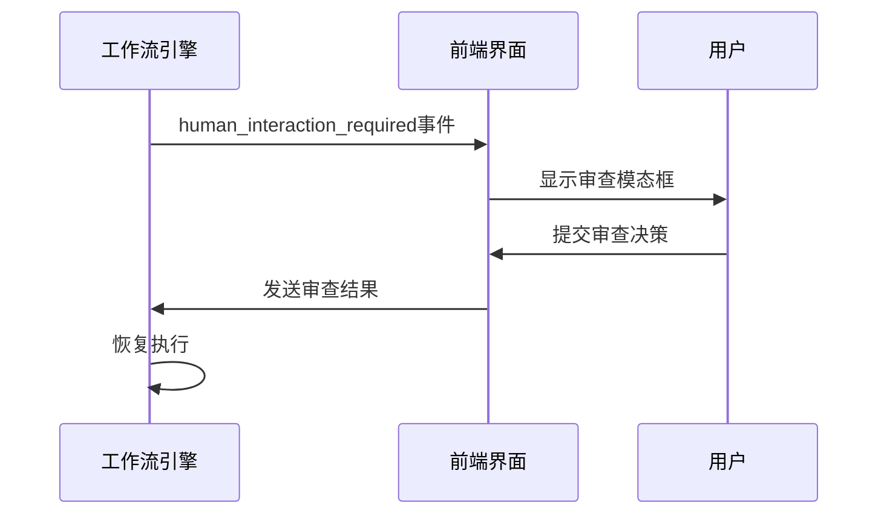
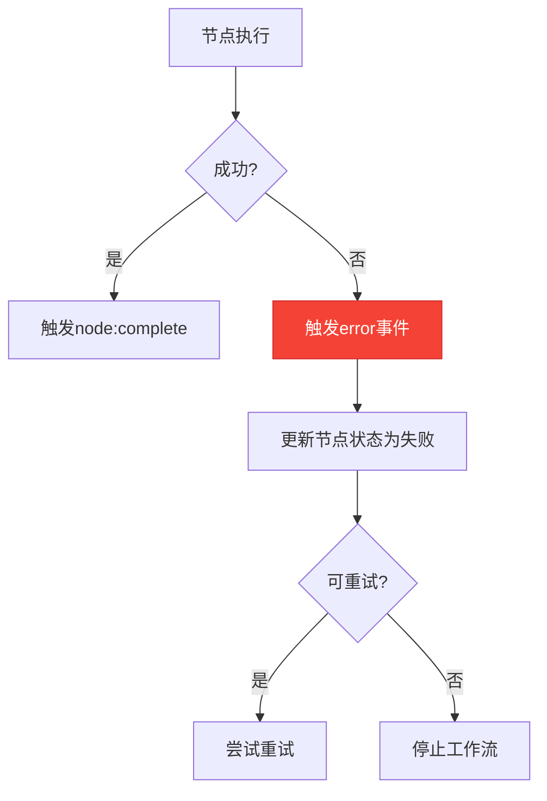
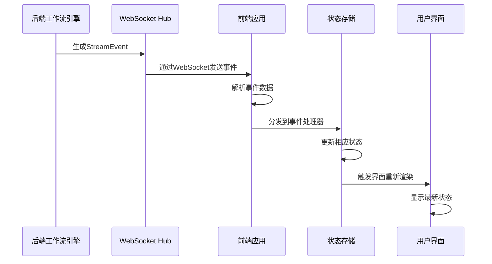
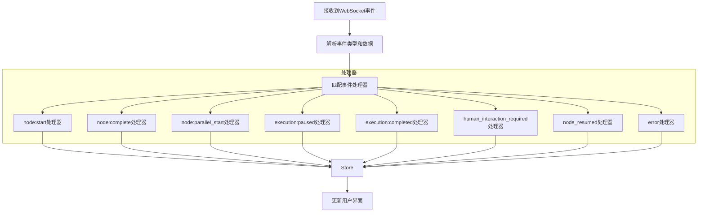
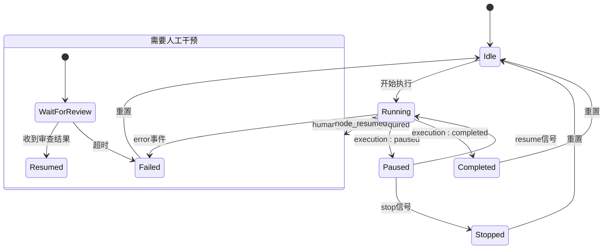

# 事件类型参考

<cite>
**本文档中引用的文件**  
- [context.go](file://internal/core/workflow/context.go)
- [engine.go](file://internal/core/workflow/engine.go)
- [hub.go](file://internal/api/ws/hub.go)
- [workflow.go](file://internal/api/handler/workflow.go)
- [useWorkflowEvents.ts](file://frontend/src/hooks/useWorkflowEvents.ts)
- [useWebSocketRouter.ts](file://frontend/src/hooks/useWebSocketRouter.ts)
- [useWorkflowRunStore.ts](file://frontend/src/stores/useWorkflowRunStore.ts)
- [CustomNodes.tsx](file://frontend/src/components/workflow/nodes/CustomNodes.tsx)
- [HumanReviewNodeForm.tsx](file://frontend/src/features/editor/components/PropertyPanel/NodeForms/HumanReviewNodeForm.tsx)
- [seeder.go](file://internal/resources/seeder.go)
</cite>

## 目录
1. [简介](#简介)
2. [事件系统架构](#事件系统架构)
3. [核心事件类型详解](#核心事件类型详解)
   - [node:start](#nodestart)
   - [node:complete](#nodecomplete)
   - [node:parallel_start](#nodeparallel_start)
   - [execution:paused](#executionpaused)
   - [execution:completed](#executioncompleted)
   - [human_interaction_required](#human_interaction_required)
   - [node_resumed](#node_resumed)
   - [error](#error)
4. [前后端事件处理流程](#前后端事件处理流程)
5. [UI状态更新机制](#ui状态更新机制)
6. [工作流执行影响分析](#工作流执行影响分析)
7. [故障排查指南](#故障排查指南)

## 简介
The Council系统采用基于WebSocket的实时事件流架构，用于在工作流执行过程中向客户端推送状态更新。本参考文档系统化地列出并解释了系统中所有StreamEvent类型，详细描述每种事件的触发条件、数据结构和业务含义。事件系统是连接后端工作流引擎与前端用户界面的核心通信机制，确保用户能够实时感知工作流的执行状态和进度变化。

## 事件系统架构
The Council系统的事件系统采用发布-订阅模式，通过WebSocket实现实时双向通信。后端工作流引擎在执行过程中生成各种事件，通过Hub广播到所有连接的客户端。



**Diagram sources**
- [hub.go](file://internal/api/ws/hub.go#L21-L67)
- [useWebSocketRouter.ts](file://frontend/src/hooks/useWebSocketRouter.ts#L70-L101)

**Section sources**
- [hub.go](file://internal/api/ws/hub.go#L1-L125)
- [main.go](file://cmd/council/main.go#L70-L73)

## 核心事件类型详解

### node:start
`node:start`事件表示工作流中的某个节点开始执行。该事件由工作流引擎在节点执行前触发，用于通知前端界面更新节点状态为"运行中"。

**触发条件**：
- 工作流引擎开始执行特定节点时
- 节点状态从"待执行"变为"运行中"

**数据结构**：
```json
{
  "event": "node:start",
  "timestamp": "2025-12-21T10:30:00Z",
  "node_id": "agent_node_1",
  "data": {
    "session_id": "sess_12345",
    "start_time": "2025-12-21T10:30:00Z"
  }
}
```

**业务含义**：
- 标志着工作流执行进入新阶段
- 触发前端UI更新，显示节点正在处理中
- 启动相关计时器和性能监控

**Section sources**
- [engine.go](file://internal/core/workflow/engine.go#L76-L77)
- [useWorkflowEvents.ts](file://frontend/src/hooks/useWorkflowEvents.ts#L27-L34)

### node:complete
`node:complete`事件表示工作流中的某个节点已完成执行。该事件由工作流引擎在节点成功执行后触发，用于通知前端界面更新节点状态为"已完成"。

**触发条件**：
- 节点处理器成功完成处理并返回输出
- 节点状态从"运行中"变为"已完成"

**数据结构**：
```json
{
  "event": "node:complete",
  "timestamp": "2025-12-21T10:31:30Z",
  "node_id": "agent_node_1",
  "data": {
    "session_id": "sess_12345",
    "output": {
      "result": "Generated content...",
      "metrics": {
        "processing_time": 90,
        "token_count": 1500
      }
    }
  }
}
```

**业务含义**：
- 标志着节点任务成功完成
- 触发前端UI更新，显示节点完成状态
- 启动后续节点的执行流程
- 更新工作流统计信息

**Section sources**
- [engine.go](file://internal/core/workflow/engine.go#L122-L123)
- [useWorkflowEvents.ts](file://frontend/src/hooks/useWorkflowEvents.ts#L27-L34)

### node:parallel_start
`node:parallel_start`事件表示并行执行节点开始分支执行。该事件在并行节点（如NodeTypeParallel）被触发时生成，通知前端即将开始多个分支的同时执行。

**触发条件**：
- 执行到并行节点类型时
- 需要同时启动多个后续节点分支

**数据结构**：
```json
{
  "event": "node:parallel_start",
  "timestamp": "2025-12-21T10:32:00Z",
  "node_id": "parallel_node_1",
  "data": {
    "branches": ["branch_a", "branch_b", "branch_c"],
    "concurrency": 3,
    "strategy": "fan_out"
  }
}
```

**业务含义**：
- 标志着工作流进入并行处理阶段
- 通知前端界面准备显示多个并行执行的分支
- 更新UI以反映并发执行的状态
- 为性能监控提供并行度信息



**Diagram sources**
- [engine.go](file://internal/core/workflow/engine.go#L142-L147)
- [useWorkflowEvents.ts](file://frontend/src/hooks/useWorkflowEvents.ts#L37-L42)

**Section sources**
- [engine.go](file://internal/core/workflow/engine.go#L141-L158)
- [useWorkflowEvents.ts](file://frontend/src/hooks/useWorkflowEvents.ts#L37-L43)

### execution:paused
`execution:paused`事件表示整个工作流执行被暂停。该事件在用户主动暂停或系统自动暂停时触发，用于通知前端界面更新整体执行状态。

**触发条件**：
- 用户通过控制栏点击"暂停"按钮
- 工作流引擎检测到暂停状态
- 会话状态变为SessionPaused

**数据结构**：
```json
{
  "event": "execution:paused",
  "timestamp": "2025-12-21T10:35:00Z",
  "node_id": "current_node_id",
  "data": {
    "reason": "user_request",
    "pause_time": "2025-12-21T10:35:00Z",
    "next_node": "next_node_id"
  }
}
```

**业务含义**：
- 标志着工作流执行暂时停止
- 保持当前执行状态以便后续恢复
- 允许用户审查中间结果
- 节省计算资源



**Diagram sources**
- [engine.go](file://internal/core/workflow/engine.go#L55-L61)
- [useWebSocketRouter.ts](file://frontend/src/hooks/useWebSocketRouter.ts#L70-L73)

**Section sources**
- [engine.go](file://internal/core/workflow/engine.go#L52-L67)
- [useWorkflowEvents.ts](file://frontend/src/hooks/useWorkflowEvents.ts#L60-L63)
- [useWebSocketRouter.ts](file://frontend/src/hooks/useWebSocketRouter.ts#L70-L73)

### execution:completed
`execution:completed`事件表示整个工作流执行成功完成。该事件在工作流最后一个节点成功完成后触发，标志着整个流程的结束。

**触发条件**：
- 所有节点都已成功执行完毕
- 到达结束节点且处理完成
- 工作流状态变为"completed"

**数据结构**：
```json
{
  "event": "execution:completed",
  "timestamp": "2025-12-21T10:40:00Z",
  "data": {
    "session_id": "sess_12345",
    "completion_time": "2025-12-21T10:40:00Z",
    "total_duration": 600,
    "final_output": {
      "report": "Final report content...",
      "summary": "Execution summary"
    },
    "statistics": {
      "nodes_executed": 8,
      "total_cost_usd": 0.45,
      "total_tokens": 12500
    }
  }
}
```

**业务含义**：
- 标志着工作流成功完成
- 触发最终结果的展示
- 停止所有计时器和监控
- 允许用户导出或分享结果



**Diagram sources**
- [useWorkflowEvents.ts](file://frontend/src/hooks/useWorkflowEvents.ts#L65-L68)
- [useWebSocketRouter.ts](file://frontend/src/hooks/useWebSocketRouter.ts#L75-L78)

**Section sources**
- [engine.go](file://internal/core/workflow/engine.go#L98-L99)
- [useWorkflowEvents.ts](file://frontend/src/hooks/useWorkflowEvents.ts#L64-L68)
- [useWebSocketRouter.ts](file://frontend/src/hooks/useWebSocketRouter.ts#L75-L78)

### human_interaction_required
`human_interaction_required`事件表示需要人工干预。该事件在遇到需要人类审查或决策的节点时触发，暂停自动执行流程等待用户输入。

**触发条件**：
- 执行到human_review类型的节点
- 系统需要人工验证或修改输出
- 达到需要人工介入的决策点

**数据结构**：
```json
{
  "event": "human_interaction_required",
  "timestamp": "2025-12-21T10:33:00Z",
  "node_id": "human_review_1",
  "data": {
    "interaction_type": "content_approval",
    "required_action": "approve_reject",
    "timeout": 1800,
    "instructions": "Please review the generated content and approve or reject.",
    "suggested_actions": ["approve", "reject", "modify"],
    "context": {
      "previous_output": "Generated content...",
      "criteria": "Quality, accuracy, compliance"
    }
  }
}
```

**业务含义**：
- 标志着自动化流程需要人工介入
- 暂停工作流执行等待用户响应
- 提供审查界面和操作选项
- 确保关键决策的质量和合规性



**Diagram sources**
- [human_review_test.go](file://internal/core/workflow/nodes/human_review_test.go#L31-L36)
- [useWebSocketRouter.ts](file://frontend/src/hooks/useWebSocketRouter.ts#L80-L89)

**Section sources**
- [human_review.go](file://internal/core/workflow/nodes/human_review.go)
- [HumanReviewNodeForm.tsx](file://frontend/src/features/editor/components/PropertyPanel/NodeForms/HumanReviewNodeForm.tsx#L1-L28)
- [useWebSocketRouter.ts](file://frontend/src/hooks/useWebSocketRouter.ts#L80-L89)

### node_resumed
`node_resumed`事件表示被暂停的节点已恢复执行。该事件在人工审查完成后恢复工作流执行时触发，通知前端界面更新状态。

**触发条件**：
- 人工审查节点收到用户响应
- 调用ResumeNode方法恢复执行
- 节点从暂停状态恢复

**数据结构**：
```json
{
  "event": "node_resumed",
  "timestamp": "2025-12-21T10:34:00Z",
  "node_id": "human_review_1",
  "data": {
    "review_action": "approved",
    "reviewer": "user_123",
    "timestamp": "2025-12-21T10:34:00Z",
    "comments": "Content looks good",
    "resumed_by": "system"
  }
}
```

**业务含义**：
- 标志着人工干预阶段结束
- 工作流恢复自动执行
- 记录审查决策和元数据
- 触发后续节点的执行

**Section sources**
- [engine.go](file://internal/core/workflow/engine.go#L206-L211)
- [useWebSocketRouter.ts](file://frontend/src/hooks/useWebSocketRouter.ts#L92-L94)

### error
`error`事件表示工作流执行过程中发生错误。该事件在节点处理失败或系统异常时触发，用于通知前端界面显示错误状态。

**触发条件**：
- 节点处理器返回错误
- 系统异常或资源不足
- 验证失败或外部服务不可用

**数据结构**：
```json
{
  "event": "error",
  "timestamp": "2025-12-21T10:32:30Z",
  "node_id": "agent_node_2",
  "data": {
    "error": "LLM service timeout after 30s",
    "error_type": "timeout",
    "severity": "high",
    "context": {
      "node_type": "agent",
      "attempt": 3,
      "retryable": true
    },
    "trace_id": "trace_67890"
  }
}
```

**业务含义**：
- 标志着执行过程中出现问题
- 触发错误处理和恢复机制
- 提供调试信息和上下文
- 允许用户采取纠正措施



**Diagram sources**
- [engine.go](file://internal/core/workflow/engine.go#L176-L180)
- [useWorkflowEvents.ts](file://frontend/src/hooks/useWorkflowEvents.ts#L75-L78)

**Section sources**
- [engine.go](file://internal/core/workflow/engine.go#L173-L182)
- [useWorkflowEvents.ts](file://frontend/src/hooks/useWorkflowEvents.ts#L75-L78)
- [useWebSocketRouter.ts](file://frontend/src/hooks/useWebSocketRouter.ts#L97-L101)

## 前后端事件处理流程
The Council系统的事件处理流程涉及后端工作流引擎生成事件，通过WebSocket广播到前端，前端接收后更新状态存储和用户界面。



**Diagram sources**
- [workflow.go](file://internal/api/handler/workflow.go#L106-L110)
- [useWorkflowEvents.ts](file://frontend/src/hooks/useWorkflowEvents.ts#L25-L81)

**Section sources**
- [workflow.go](file://internal/api/handler/workflow.go#L102-L112)
- [useWorkflowEvents.ts](file://frontend/src/hooks/useWorkflowEvents.ts#L11-L82)

## UI状态更新机制
前端通过状态存储（Store）集中管理工作流执行状态，事件处理器根据接收到的事件类型更新相应的状态属性。

**状态更新映射表**：

| WebSocket事件 | 状态更新操作 | 影响的UI组件 |
|---------------|-------------|------------|
| `node:start` | updateNodeStatus(nodeId, 'running') | 节点状态指示器、活动节点列表 |
| `node:complete` | updateNodeStatus(nodeId, 'completed') | 节点状态指示器、进度条 |
| `node:parallel_start` | setActiveNodes(branches) | 并行分支可视化、活动节点列表 |
| `execution:paused` | setExecutionStatus('paused') | 执行控制栏、状态指示器 |
| `execution:completed` | setExecutionStatus('completed') | 执行控制栏、完成状态显示 |
| `human_interaction_required` | setHumanReview(info) | 人工审查模态框、状态指示器 |
| `node_resumed` | setHumanReview(null) | 关闭审查模态框、恢复执行状态 |
| `error` | updateNodeStatus(nodeId, 'failed', error) | 错误提示、节点状态指示器 |



**Diagram sources**
- [useWorkflowEvents.ts](file://frontend/src/hooks/useWorkflowEvents.ts#L25-L81)
- [useWorkflowRunStore.ts](file://frontend/src/stores/useWorkflowRunStore.ts#L259-L288)

**Section sources**
- [useWorkflowEvents.ts](file://frontend/src/hooks/useWorkflowEvents.ts#L11-L82)
- [useWorkflowRunStore.ts](file://frontend/src/stores/useWorkflowRunStore.ts#L259-L300)

## 工作流执行影响分析
不同事件类型对工作流执行流程产生不同的影响，这些影响决定了系统的整体行为和用户体验。

**事件对执行流程的影响**：

1. **控制流事件**：
   - `node:parallel_start`：改变执行模式，从串行变为并行
   - `execution:paused`：中断执行流程，等待恢复信号
   - `execution:completed`：终止执行流程，清理资源

2. **节点状态事件**：
   - `node:start`：启动节点执行，可能触发资源分配
   - `node:complete`：完成节点执行，触发后续节点
   - `error`：中断当前执行路径，可能触发错误处理

3. **交互事件**：
   - `human_interaction_required`：暂停自动化流程，等待用户输入
   - `node_resumed`：恢复自动化流程，继续执行

**执行状态转换图**：



**Diagram sources**
- [engine.go](file://internal/core/workflow/engine.go#L41-L139)
- [workflow.go](file://internal/api/handler/workflow.go#L152-L159)

**Section sources**
- [engine.go](file://internal/core/workflow/engine.go#L40-L246)
- [workflow.go](file://internal/api/handler/workflow.go#L129-L165)

## 故障排查指南
当事件系统出现问题时，可以按照以下步骤进行排查和诊断。

**常见问题及解决方案**：

1. **事件未收到**：
   - 检查WebSocket连接是否正常
   - 验证前端事件处理器是否正确注册
   - 确认后端Hub是否正常运行

2. **事件顺序错误**：
   - 检查事件生成的时序逻辑
   - 验证并发执行中的事件同步
   - 确认事件处理的原子性

3. **状态不一致**：
   - 检查状态更新的完整性
   - 验证事件数据的准确性
   - 确认前后端状态同步机制

**调试工具和方法**：

- 启用详细的日志记录
- 使用WebSocket调试工具监控事件流
- 在关键点添加断言和验证
- 实现事件追溯和审计功能

**Section sources**
- [hub.go](file://internal/api/ws/hub.go#L110-L124)
- [useWorkflowEvents.ts](file://frontend/src/hooks/useWorkflowEvents.ts#L15-L24)
- [engine.go](file://internal/core/workflow/engine.go#L94-L97)