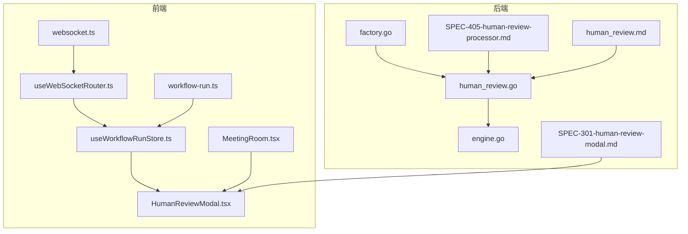
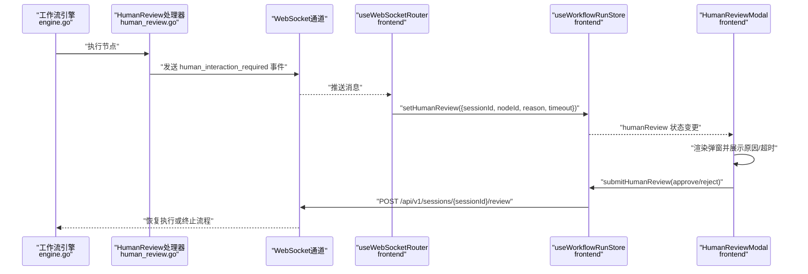
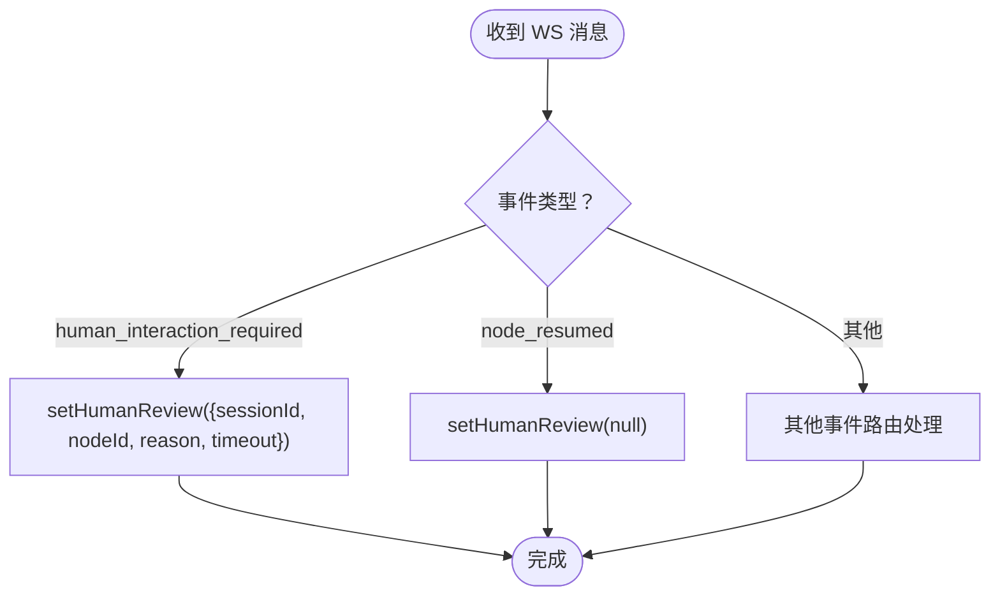
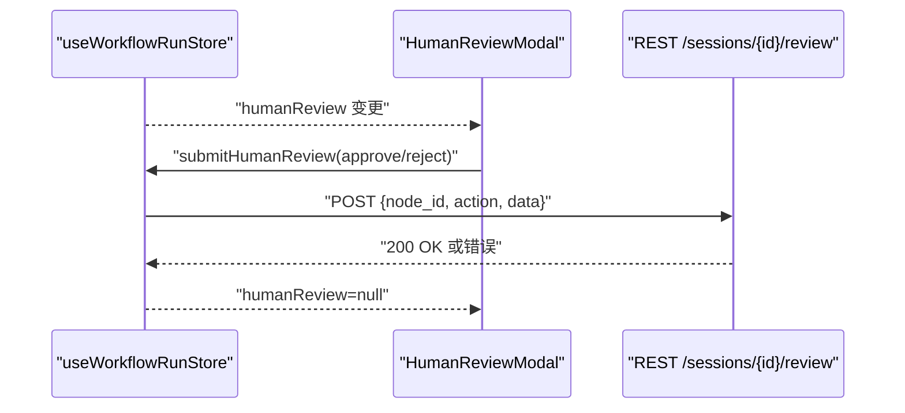
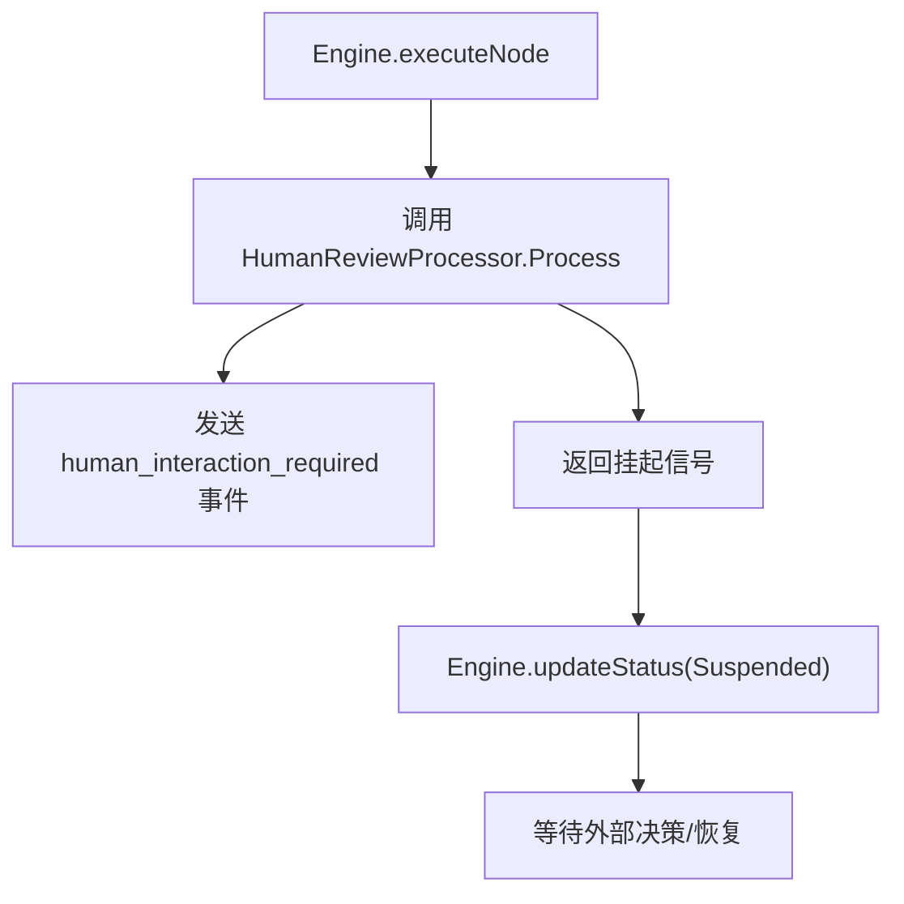
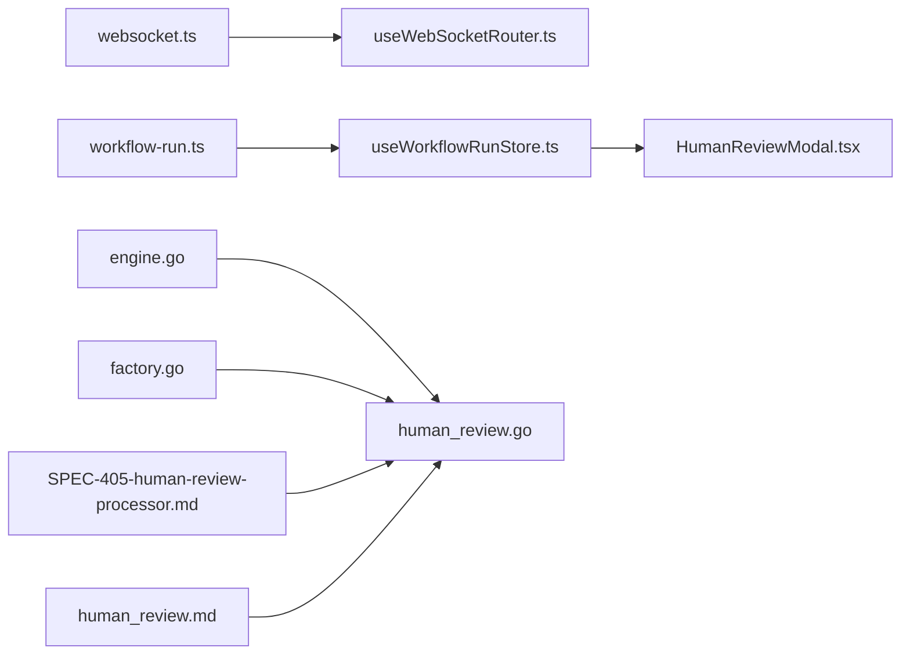

# 人类交互请求事件 (human_interaction_required)

<cite>
**本文引用的文件**
- [useWebSocketRouter.ts](file://frontend/src/hooks/useWebSocketRouter.ts)
- [useWorkflowRunStore.ts](file://frontend/src/stores/useWorkflowRunStore.ts)
- [HumanReviewModal.tsx](file://frontend/src/features/execution/components/HumanReviewModal.tsx)
- [MeetingRoom.tsx](file://frontend/src/features/meeting/MeetingRoom.tsx)
- [websocket.ts](file://frontend/src/types/websocket.ts)
- [workflow-run.ts](file://frontend/src/types/workflow-run.ts)
- [human_review.go](file://internal/core/workflow/nodes/human_review.go)
- [factory.go](file://internal/core/workflow/nodes/factory.go)
- [engine.go](file://internal/core/workflow/engine.go)
- [SPEC-405-human-review-processor.md](file://docs/specs/backend/SPEC-405-human-review-processor.md)
- [SPEC-301-human-review-modal.md](file://docs/specs/sprint4/SPEC-301-human-review-modal.md)
- [human_review.md](file://docs/api/human_review.md)
</cite>

## 目录
1. [引言](#引言)
2. [项目结构](#项目结构)
3. [核心组件](#核心组件)
4. [架构总览](#架构总览)
5. [详细组件分析](#详细组件分析)
6. [依赖关系分析](#依赖关系分析)
7. [性能考量](#性能考量)
8. [故障排查指南](#故障排查指南)
9. [结论](#结论)
10. [附录](#附录)

## 引言
本技术文档聚焦于“人类交互请求事件”（human_interaction_required），阐述当工作流遇到HumanReview节点或需要人工干预时，系统如何生成并传播该事件，以及前端如何基于该事件更新状态并弹出模态框以展示待审内容。文档同时说明该事件在强制人机回环、确保决策安全方面的核心价值，并给出从后端触发到前端响应的端到端流程示例。

## 项目结构
围绕 human_interaction_required 事件，涉及前后端的关键文件分布如下：
- 前端
  - WebSocket 路由与消息分发：useWebSocketRouter.ts
  - 运行时状态与人类裁决请求：useWorkflowRunStore.ts、workflow-run.ts
  - 人类裁决弹窗组件：HumanReviewModal.tsx
  - 会话房间集成与全屏模式：MeetingRoom.tsx
  - WebSocket 事件类型定义：websocket.ts
- 后端
  - HumanReview 节点处理器：human_review.go、factory.go
  - 工作流引擎与挂起/恢复机制：engine.go
  - 规格与接口文档：SPEC-405-human-review-processor.md、SPEC-301-human-review-modal.md、human_review.md

图表来源
- [useWebSocketRouter.ts](file://frontend/src/hooks/useWebSocketRouter.ts#L1-L126)
- [useWorkflowRunStore.ts](file://frontend/src/stores/useWorkflowRunStore.ts#L1-L301)
- [HumanReviewModal.tsx](file://frontend/src/features/execution/components/HumanReviewModal.tsx#L1-L91)
- [MeetingRoom.tsx](file://frontend/src/features/meeting/MeetingRoom.tsx#L128-L162)
- [websocket.ts](file://frontend/src/types/websocket.ts#L1-L52)
- [workflow-run.ts](file://frontend/src/types/workflow-run.ts#L1-L41)
- [human_review.go](file://internal/core/workflow/nodes/human_review.go#L1-L47)
- [factory.go](file://internal/core/workflow/nodes/factory.go#L78-L105)
- [engine.go](file://internal/core/workflow/engine.go#L1-L246)
- [SPEC-405-human-review-processor.md](file://docs/specs/backend/SPEC-405-human-review-processor.md#L1-L77)
- [SPEC-301-human-review-modal.md](file://docs/specs/sprint4/SPEC-301-human-review-modal.md#L1-L125)
- [human_review.md](file://docs/api/human_review.md#L1-L406)

章节来源
- [useWebSocketRouter.ts](file://frontend/src/hooks/useWebSocketRouter.ts#L1-L126)
- [useWorkflowRunStore.ts](file://frontend/src/stores/useWorkflowRunStore.ts#L1-L301)
- [HumanReviewModal.tsx](file://frontend/src/features/execution/components/HumanReviewModal.tsx#L1-L91)
- [MeetingRoom.tsx](file://frontend/src/features/meeting/MeetingRoom.tsx#L128-L162)
- [websocket.ts](file://frontend/src/types/websocket.ts#L1-L52)
- [workflow-run.ts](file://frontend/src/types/workflow-run.ts#L1-L41)
- [human_review.go](file://internal/core/workflow/nodes/human_review.go#L1-L47)
- [factory.go](file://internal/core/workflow/nodes/factory.go#L78-L105)
- [engine.go](file://internal/core/workflow/engine.go#L1-L246)
- [SPEC-405-human-review-processor.md](file://docs/specs/backend/SPEC-405-human-review-processor.md#L1-L77)
- [SPEC-301-human-review-modal.md](file://docs/specs/sprint4/SPEC-301-human-review-modal.md#L1-L125)
- [human_review.md](file://docs/api/human_review.md#L1-L406)

## 核心组件
- 前端 WebSocket 路由器：监听 WebSocket 消息，识别 human_interaction_required 事件，调用运行时状态更新函数设置人类裁决请求。
- 运行时状态存储：维护 humanReview 字段，供 HumanReviewModal 读取并渲染。
- 人类裁决弹窗：根据 humanReview 展示原因、超时等信息，允许用户批准或拒绝；提交后清空状态。
- 会话房间：在全屏模式下渲染 HumanReviewModal，确保用户可见。
- 后端 HumanReview 节点处理器：在节点执行时发出 human_interaction_required 事件，并将执行挂起等待人工决策。
- 工作流引擎：识别处理器返回的挂起信号，维持节点状态为 Suspended，等待后续恢复。

章节来源
- [useWebSocketRouter.ts](file://frontend/src/hooks/useWebSocketRouter.ts#L1-L126)
- [useWorkflowRunStore.ts](file://frontend/src/stores/useWorkflowRunStore.ts#L1-L301)
- [HumanReviewModal.tsx](file://frontend/src/features/execution/components/HumanReviewModal.tsx#L1-L91)
- [MeetingRoom.tsx](file://frontend/src/features/meeting/MeetingRoom.tsx#L128-L162)
- [human_review.go](file://internal/core/workflow/nodes/human_review.go#L1-L47)
- [engine.go](file://internal/core/workflow/engine.go#L1-L246)

## 架构总览
以下序列图展示了从后端 HumanReview 节点触发 human_interaction_required 事件，到前端 useWebSocketRouter 路由并更新运行时状态，再到 HumanReviewModal 展示与用户交互的完整链路。

图表来源
- [engine.go](file://internal/core/workflow/engine.go#L1-L246)
- [human_review.go](file://internal/core/workflow/nodes/human_review.go#L1-L47)
- [useWebSocketRouter.ts](file://frontend/src/hooks/useWebSocketRouter.ts#L1-L126)
- [useWorkflowRunStore.ts](file://frontend/src/stores/useWorkflowRunStore.ts#L1-L301)
- [HumanReviewModal.tsx](file://frontend/src/features/execution/components/HumanReviewModal.tsx#L1-L91)

## 详细组件分析

### 前端 useWebSocketRouter 中 human_interaction_required 的处理
- 路由逻辑：useWebSocketRouter 订阅连接存储中的最后一条消息，按事件类型进行分支处理。
- human_interaction_required 分支：将事件数据转换为运行时状态所需的 HumanReviewRequest 形式（包含 sessionId、nodeId、reason、timeout），并调用 setHumanReview 更新状态。
- 互补分支：node_resumed 事件用于清除 humanReview 状态，确保弹窗只在需要时出现。

图表来源
- [useWebSocketRouter.ts](file://frontend/src/hooks/useWebSocketRouter.ts#L1-L126)
- [websocket.ts](file://frontend/src/types/websocket.ts#L1-L52)
- [workflow-run.ts](file://frontend/src/types/workflow-run.ts#L1-L41)

章节来源
- [useWebSocketRouter.ts](file://frontend/src/hooks/useWebSocketRouter.ts#L1-L126)
- [websocket.ts](file://frontend/src/types/websocket.ts#L1-L52)
- [workflow-run.ts](file://frontend/src/types/workflow-run.ts#L1-L41)

### 运行时状态与 HumanReviewModal 的联动
- 状态字段：useWorkflowRunStore.humanReview 保存当前待处理的人类裁决请求。
- 渲染条件：HumanReviewModal 仅在 humanReview 存在时显示。
- 用户交互：弹窗提供批准/拒绝操作；批准后调用 submitHumanReview，内部发起 REST 请求并清空 humanReview 状态；拒绝则直接清空状态。

图表来源
- [useWorkflowRunStore.ts](file://frontend/src/stores/useWorkflowRunStore.ts#L1-L301)
- [HumanReviewModal.tsx](file://frontend/src/features/execution/components/HumanReviewModal.tsx#L1-L91)

章节来源
- [useWorkflowRunStore.ts](file://frontend/src/stores/useWorkflowRunStore.ts#L1-L301)
- [HumanReviewModal.tsx](file://frontend/src/features/execution/components/HumanReviewModal.tsx#L1-L91)

### 后端 HumanReview 节点处理器与工作流引擎
- HumanReview 节点处理器：在 Process 中先发出节点运行状态，再发送 human_interaction_required 事件，随后返回挂起信号，使工作流在此节点停止推进。
- 工作流引擎：在执行节点时捕获挂起信号，将节点状态置为 Suspended，等待后续恢复。
- 节点工厂：根据节点属性（如 timeout_minutes、allow_skip）构造 HumanReviewProcessor。

图表来源
- [engine.go](file://internal/core/workflow/engine.go#L1-L246)
- [human_review.go](file://internal/core/workflow/nodes/human_review.go#L1-L47)
- [factory.go](file://internal/core/workflow/nodes/factory.go#L78-L105)

章节来源
- [human_review.go](file://internal/core/workflow/nodes/human_review.go#L1-L47)
- [engine.go](file://internal/core/workflow/engine.go#L1-L246)
- [factory.go](file://internal/core/workflow/nodes/factory.go#L78-L105)

### 业务场景与核心价值
- 强制人机回环：在关键决策点插入 HumanReview 节点，确保最终决策由人类把关，避免自动化流程绕过重要判断。
- 决策安全：通过超时控制与提醒机制，保障人类在合理时间内完成决策；若超时可按策略自动处理（如允许跳过或暂停）。
- 透明与可追溯：前端弹窗展示草案、投票结果与超时信息，帮助人类快速理解上下文并做出知情决策。

章节来源
- [SPEC-405-human-review-processor.md](file://docs/specs/backend/SPEC-405-human-review-processor.md#L1-L77)
- [SPEC-301-human-review-modal.md](file://docs/specs/sprint4/SPEC-301-human-review-modal.md#L1-L125)
- [human_review.md](file://docs/api/human_review.md#L1-L406)

## 依赖关系分析
- 前端依赖
  - websocket.ts 定义了事件类型枚举，useWebSocketRouter 依据该枚举进行分支处理。
  - workflow-run.ts 定义了 HumanReviewRequest 类型，useWorkflowRunStore 以该类型维护 humanReview 状态。
  - MeetingRoom.tsx 在全屏模式下渲染 HumanReviewModal，保证用户体验。
- 后端依赖
  - engine.go 在执行节点时识别挂起信号，维持节点状态。
  - factory.go 将节点类型映射到 HumanReviewProcessor，后者负责事件发送与挂起逻辑。
  - SPEC-405-human-review-processor.md 与 human_review.md 提供了事件格式与 API 行为规范。

图表来源
- [websocket.ts](file://frontend/src/types/websocket.ts#L1-L52)
- [useWebSocketRouter.ts](file://frontend/src/hooks/useWebSocketRouter.ts#L1-L126)
- [workflow-run.ts](file://frontend/src/types/workflow-run.ts#L1-L41)
- [useWorkflowRunStore.ts](file://frontend/src/stores/useWorkflowRunStore.ts#L1-L301)
- [HumanReviewModal.tsx](file://frontend/src/features/execution/components/HumanReviewModal.tsx#L1-L91)
- [engine.go](file://internal/core/workflow/engine.go#L1-L246)
- [human_review.go](file://internal/core/workflow/nodes/human_review.go#L1-L47)
- [factory.go](file://internal/core/workflow/nodes/factory.go#L78-L105)
- [SPEC-405-human-review-processor.md](file://docs/specs/backend/SPEC-405-human-review-processor.md#L1-L77)
- [human_review.md](file://docs/api/human_review.md#L1-L406)

章节来源
- [websocket.ts](file://frontend/src/types/websocket.ts#L1-L52)
- [useWebSocketRouter.ts](file://frontend/src/hooks/useWebSocketRouter.ts#L1-L126)
- [workflow-run.ts](file://frontend/src/types/workflow-run.ts#L1-L41)
- [useWorkflowRunStore.ts](file://frontend/src/stores/useWorkflowRunStore.ts#L1-L301)
- [HumanReviewModal.tsx](file://frontend/src/features/execution/components/HumanReviewModal.tsx#L1-L91)
- [engine.go](file://internal/core/workflow/engine.go#L1-L246)
- [human_review.go](file://internal/core/workflow/nodes/human_review.go#L1-L47)
- [factory.go](file://internal/core/workflow/nodes/factory.go#L78-L105)
- [SPEC-405-human-review-processor.md](file://docs/specs/backend/SPEC-405-human-review-processor.md#L1-L77)
- [human_review.md](file://docs/api/human_review.md#L1-L406)

## 性能考量
- 事件去重：前端 useWebSocketRouter 使用消息 ID 集合避免重复处理，降低 UI 与状态更新开销。
- 弹窗最小化：仅在 humanReview 存在时渲染 HumanReviewModal，减少不必要的 DOM 与重绘。
- 引擎挂起：后端在 HumanReview 节点挂起执行，避免无效计算与资源占用。
- 超时与提醒：后端可配置超时与提醒事件，前端据此提示用户，提升交互效率。

章节来源
- [useWebSocketRouter.ts](file://frontend/src/hooks/useWebSocketRouter.ts#L1-L126)
- [HumanReviewModal.tsx](file://frontend/src/features/execution/components/HumanReviewModal.tsx#L1-L91)
- [SPEC-405-human-review-processor.md](file://docs/specs/backend/SPEC-405-human-review-processor.md#L1-L77)

## 故障排查指南
- 事件未触发
  - 检查后端 HumanReview 节点是否正确发出 human_interaction_required 事件。
  - 确认前端 websocket.ts 是否包含该事件类型，useWebSocketRouter 是否已添加相应分支。
- 弹窗不显示
  - 确认 useWorkflowRunStore.humanReview 是否被 setHumanReview 设置。
  - 检查 HumanReviewModal 的渲染条件与 MeetingRoom 的全屏模式集成。
- 提交失败
  - 查看 useWorkflowRunStore.submitHumanReview 的网络请求与错误日志。
  - 确认 REST 端点 /api/v1/sessions/{sessionId}/review 的响应状态与语义。
- 超时处理
  - 后端应按 SPEC-405 发送超时提醒与超时事件；前端需正确展示并引导用户操作。

章节来源
- [useWebSocketRouter.ts](file://frontend/src/hooks/useWebSocketRouter.ts#L1-L126)
- [useWorkflowRunStore.ts](file://frontend/src/stores/useWorkflowRunStore.ts#L1-L301)
- [SPEC-405-human-review-processor.md](file://docs/specs/backend/SPEC-405-human-review-processor.md#L1-L77)
- [human_review.md](file://docs/api/human_review.md#L1-L406)

## 结论
human_interaction_required 事件是实现强制人机回环与决策安全的关键纽带。后端在 HumanReview 节点处发出事件并挂起执行，前端通过 useWebSocketRouter 路由事件更新运行时状态，进而驱动 HumanReviewModal 展示待审内容。该机制在保障自动化效率的同时，确保人类在关键时刻拥有最终决定权，从而提升整体系统的可控性与安全性。

## 附录

### 端到端流程示例（从后端触发到前端响应）
- 后端
  - HumanReview 节点处理器在 Process 中发送 human_interaction_required 事件，并返回挂起信号。
  - 工作流引擎将节点状态置为 Suspended，等待外部决策。
- 前端
  - useWebSocketRouter 接收事件，调用 setHumanReview 设置 humanReview。
  - HumanReviewModal 渲染弹窗，展示原因与超时。
  - 用户选择批准或拒绝，前端调用 submitHumanReview 提交决策，成功后清空 humanReview。
- 后端（恢复）
  - 根据用户决策恢复执行或终止流程，必要时发送 node_resumed 事件清理前端状态。

章节来源
- [human_review.go](file://internal/core/workflow/nodes/human_review.go#L1-L47)
- [engine.go](file://internal/core/workflow/engine.go#L1-L246)
- [useWebSocketRouter.ts](file://frontend/src/hooks/useWebSocketRouter.ts#L1-L126)
- [useWorkflowRunStore.ts](file://frontend/src/stores/useWorkflowRunStore.ts#L1-L301)
- [HumanReviewModal.tsx](file://frontend/src/features/execution/components/HumanReviewModal.tsx#L1-L91)
- [SPEC-405-human-review-processor.md](file://docs/specs/backend/SPEC-405-human-review-processor.md#L1-L77)
- [SPEC-301-human-review-modal.md](file://docs/specs/sprint4/SPEC-301-human-review-modal.md#L1-L125)
- [human_review.md](file://docs/api/human_review.md#L1-L406)