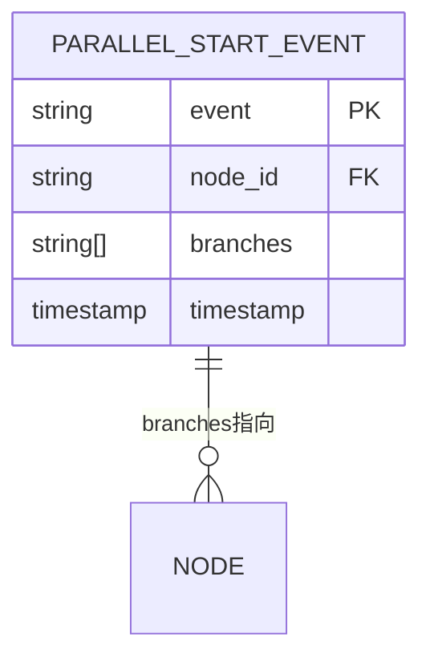
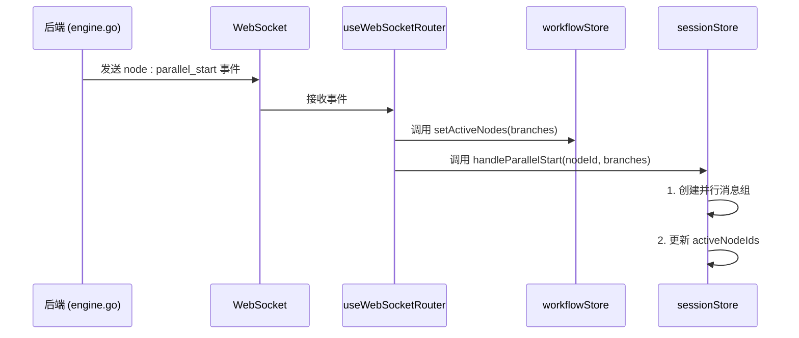
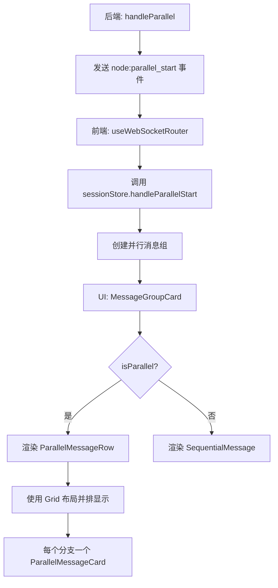

# 并行分支启动事件 (node:parallel_start)

<cite>
**本文档引用的文件**   
- [engine.go](file://internal/core/workflow/engine.go#L141-L159)
- [useWebSocketRouter.ts](file://frontend/src/hooks/useWebSocketRouter.ts#L48-L52)
- [useSessionStore.ts](file://frontend/src/stores/useSessionStore.ts#L280-L300)
- [useWorkflowRunStore.ts](file://frontend/src/stores/useWorkflowRunStore.ts#L162-L166)
- [websocket.ts](file://frontend/src/types/websocket.ts#L40-L43)
- [SPEC-001-session-store.md](file://docs/specs/sprint1/SPEC-001-session-store.md#L312-L333)
- [SPEC-004-parallel-message-ui.md](file://docs/specs/sprint1/SPEC-004-parallel-message-ui.md#L99-L111)
</cite>

## 目录
1. [引言](#引言)
2. [后端实现：handleParallel 方法](#后端实现handleparallel-方法)
3. [事件数据结构](#事件数据结构)
4. [前端响应机制](#前端响应机制)
5. [UI 层并行路径展示](#ui-层并行路径展示)
6. [总结](#总结)

## 引言
当工作流引擎遇到类型为 Parallel 的节点时，系统需要启动多个并行执行分支。为了协调后端执行与前端展示，系统会发出一个名为 `node:parallel_start` 的事件。本文档深入解析该事件的完整生命周期，从后端 `handleParallel` 方法的触发，到事件数据中 `branches` 字段的结构，再到前端 `workflowStore.setActiveNodes` 和 `sessionStore.handleParallelStart` 的调用逻辑，最终展示 UI 层如何直观地呈现并发任务的启动状态。

## 后端实现：handleParallel 方法
在工作流引擎中，当执行到一个 Parallel 类型的节点时，`executeNode` 方法会调用 `handleParallel` 函数来处理并行逻辑。该函数是并行分支启动事件的源头。

`handleParallel` 方法首先通过 `StreamChannel` 发送一个 `node:parallel_start` 事件，通知前端即将开始并行执行。随后，它使用 `sync.WaitGroup` 和 goroutine 并发地执行该节点的所有下游分支（`node.NextIDs`），确保所有分支都接收到相同的输入数据，并在所有分支完成后才将 Parallel 节点标记为完成。

**Section sources**
- [engine.go](file://internal/core/workflow/engine.go#L141-L159)

## 事件数据结构
`node:parallel_start` 事件的数据（`Data`）是一个包含 `branches` 字段的 JSON 对象。`branches` 字段的值是一个字符串数组，其中每个字符串是即将并发执行的下游节点的唯一标识符（`nodeID`）。

该数据结构在前端被定义为 `ParallelStartData` 类型，明确指定了 `node_id` 和 `branches` 两个字段，确保了前后端通信的类型安全。

**Diagram sources **
- [engine.go](file://internal/core/workflow/engine.go#L146)
- [websocket.ts](file://frontend/src/types/websocket.ts#L40-L43)

## 前端响应机制
前端通过 `useWebSocketRouter` Hook 监听来自后端的 WebSocket 消息。当收到 `node:parallel_start` 事件时，会触发一系列状态更新，以同步 UI 与后端执行状态。

### 事件路由
`useWebSocketRouter` 接收到消息后，根据 `event` 字段进行路由。对于 `node:parallel_start` 事件，它会从 `data` 中提取 `branches` 数组，并调用两个关键的 Store 方法。

### 状态更新
1.  **更新工作流运行状态 (workflowStore.setActiveNodes)**: `workflowStore.setActiveNodes(branches)` 方法被调用，将 `workflowRunStore` 中的 `activeNodeIds` 集合更新为当前正在并行执行的节点 ID 列表。这直接影响了工作流画布上哪些节点被高亮显示。

2.  **更新会话状态 (sessionStore.handleParallelStart)**: `sessionStore.handleParallelStart(data.node_id, data.branches)` 方法被调用，执行两个核心操作：
    *   **创建并行消息组**: 在 `sessionStore` 的 `messageGroups` 数组中添加一个新的消息组。该组的 `nodeId` 为 Parallel 节点的 ID，`nodeType` 为 `'parallel'`，`isParallel` 为 `true`，并且其 `messages` 数组初始为空，用于后续收集并行分支的消息。
    *   **标记活跃节点**: 将 `currentSession` 中的 `activeNodeIds` 更新为 `branchIds`，与 `workflowStore` 保持一致。

**Diagram sources **
- [useWebSocketRouter.ts](file://frontend/src/hooks/useWebSocketRouter.ts#L48-L52)
- [useSessionStore.ts](file://frontend/src/stores/useSessionStore.ts#L280-L300)
- [useWorkflowRunStore.ts](file://frontend/src/stores/useWorkflowRunStore.ts#L162-L166)

**Section sources**
- [useWebSocketRouter.ts](file://frontend/src/hooks/useWebSocketRouter.ts#L48-L52)
- [useSessionStore.ts](file://frontend/src/stores/useSessionStore.ts#L280-L300)

## UI 层并行路径展示
UI 层通过组合使用多个组件来直观地展示并行执行路径。

### 组件结构
*   **MessageGroupCard**: 这是消息组的容器。当 `group.isParallel` 为 `true` 时，它会渲染 `ParallelMessageRow` 组件，而不是逐条渲染消息。
*   **ParallelMessageRow**: 该组件使用 CSS Grid 布局，根据 `messages` 数组的长度动态创建列，将多个并行消息卡片并排显示。它通过 `maxColumns` 属性限制最大列数，防止在分支过多时 UI 拥挤。
*   **ParallelMessageCard**: 这是单个并行消息的展示单元。它包含代理头像、名称、消息内容和成本信息。不同卡片通过 `accentColor` 属性使用不同的顶部边框颜色进行区分，增强视觉辨识度。

### 数据流
UI 组件通过 `useSessionStore` 订阅 `messageGroups` 状态。当 `handleParallelStart` 创建了新的并行消息组后，`MessageGroupCard` 会检测到 `isParallel` 标志，并渲染 `ParallelMessageRow`。随着各个并行分支产生消息，这些消息会被追加到对应节点的消息组中，`ParallelMessageRow` 会自动将它们排列在各自的列中，形成清晰的并行执行视图。

**Diagram sources **
- [SPEC-004-parallel-message-ui.md](file://docs/specs/sprint1/SPEC-004-parallel-message-ui.md#L99-L111)
- [SPEC-003-chat-panel-grouped.md](file://docs/specs/sprint1/SPEC-003-chat-panel-grouped.md#L140-L142)

## 总结
`node:parallel_start` 事件是连接工作流并行执行逻辑与用户界面的关键桥梁。后端的 `handleParallel` 方法在启动并行分支时发出此事件，其 `branches` 字段精确描述了并发执行的节点。前端通过 `useWebSocketRouter` 捕获该事件，并协调 `workflowStore` 和 `sessionStore` 更新状态。`workflowStore` 负责高亮工作流画布上的活跃节点，而 `sessionStore` 则负责创建并行消息组以组织 UI 展示。最终，`ParallelMessageRow` 和 `ParallelMessageCard` 等组件将这些并行执行的路径以直观、美观的方式呈现给用户，使用户能够清晰地感知到多个任务正在同时进行。这一系列紧密协作的机制确保了系统执行状态与用户感知的高度一致。