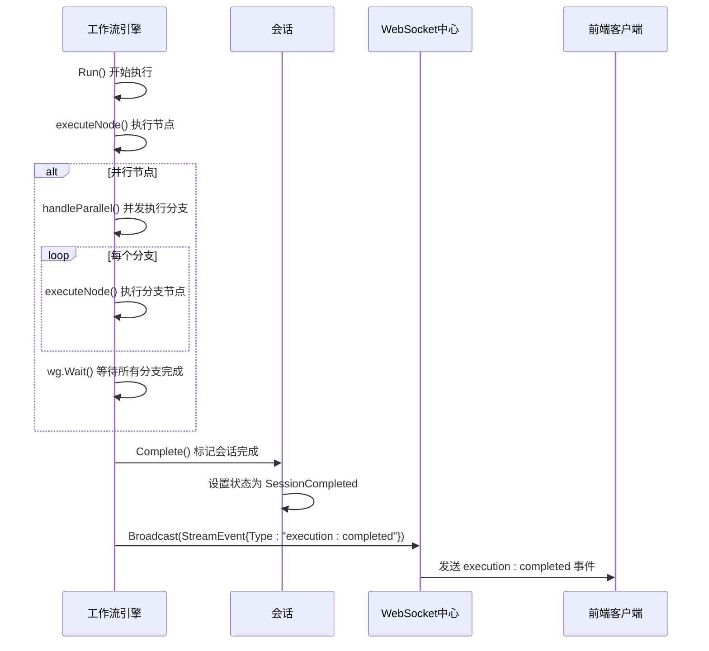
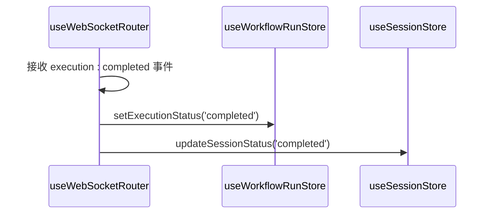

# 执行完成事件 (execution:completed)

<cite>
**本文档引用文件**   
- [engine.go](file://internal/core/workflow/engine.go)
- [session.go](file://internal/core/workflow/session.go)
- [workflow.go](file://internal/api/handler/workflow.go)
- [hub.go](file://internal/api/ws/hub.go)
- [useWorkflowEvents.ts](file://frontend/src/hooks/useWorkflowEvents.ts)
- [useWebSocketRouter.ts](file://frontend/src/hooks/useWebSocketRouter.ts)
- [useWorkflowRunStore.ts](file://frontend/src/stores/useWorkflowRunStore.ts)
- [context.go](file://internal/core/workflow/context.go)
</cite>

## 目录
1. [引言](#引言)
2. [执行完成事件的触发机制](#执行完成事件的触发机制)
3. [前端对执行完成事件的响应](#前端对执行完成事件的响应)
4. [架构设计原则与事件重要性](#架构设计原则与事件重要性)
5. [用户体验影响](#用户体验影响)
6. [结论](#结论)

## 引言

在本系统中，工作流（Workflow）的执行是一个由多个节点组成的复杂过程，这些节点可以是顺序执行、并行执行或包含条件分支。当整个工作流图谱的所有分支均成功终止时，系统需要一个明确的信号来标志整个流程的结束。这个信号就是 `execution:completed` 事件。该事件并非由某个具体的节点直接发出，而是由工作流引擎的顶层逻辑在确认所有节点都已完成执行后触发。本文档将详细阐述 `execution:completed` 事件的触发机制、前端如何响应此事件，以及该事件在整体架构设计中的重要性和对用户体验的影响。

## 执行完成事件的触发机制

`execution:completed` 事件的触发是工作流引擎在完成所有节点执行后的一个关键步骤。虽然代码中没有直接显示事件的发射点，但通过分析工作流引擎的执行逻辑，我们可以推断出其触发机制。

工作流引擎的核心是 `Engine` 结构体，它负责协调整个工作流的执行。当工作流开始执行时，`Engine.Run` 方法被调用，该方法首先进行基本的验证，然后从起始节点开始执行。每个节点的执行都是通过 `executeNode` 方法完成的，该方法会检查节点的状态，执行相应的处理器，并将结果传递给下一个节点。

对于并行节点，`handleParallel` 方法会被调用，它会并发地执行所有分支，并使用 `sync.WaitGroup` 等待所有分支完成。一旦所有分支都完成，`handleParallel` 方法会更新并行节点的状态为 `StatusCompleted`。

当所有节点都完成执行后，工作流引擎会调用 `Session.Complete` 方法，该方法会将会话状态设置为 `SessionCompleted`，并记录结束时间。此时，工作流引擎的执行逻辑已经完成，但 `execution:completed` 事件尚未发出。

事件的最终发射是通过 WebSocket 服务完成的。`Hub` 结构体负责管理所有 WebSocket 客户端的连接，并广播事件。当工作流引擎完成执行后，它会通过 `StreamChannel` 发送一个 `StreamEvent`，其类型为 `execution:completed`。`Hub` 会监听这个通道，并将事件广播给所有连接的客户端。



**Diagram sources**
- [engine.go](file://internal/core/workflow/engine.go#L40-L246)
- [session.go](file://internal/core/workflow/session.go#L64-L72)
- [hub.go](file://internal/api/ws/hub.go#L70-L73)

**Section sources**
- [engine.go](file://internal/core/workflow/engine.go#L40-L246)
- [session.go](file://internal/core/workflow/session.go#L64-L72)
- [hub.go](file://internal/api/ws/hub.go#L70-L73)

## 前端对执行完成事件的响应

前端通过 WebSocket 连接接收来自后端的实时事件，并根据事件类型更新应用状态。`useWorkflowEvents` 钩子负责监听和处理这些事件。

当 `useWorkflowEvents` 接收到 `execution:completed` 事件时，它会调用 `useWorkflowRunStore` 中的 `setExecutionStatus` 方法，将执行状态设置为 `completed`。同时，它还会调用 `stopTimer` 方法，停止计时器。

```mermaid
flowchart TD
A[WebSocket消息] --> B{事件类型}
B --> |execution:completed| C[setExecutionStatus('completed')]
B --> |execution:completed| D[stopTimer()]
C --> E[更新UI状态]
D --> E
```

**Diagram sources**
- [useWorkflowEvents.ts](file://frontend/src/hooks/useWorkflowEvents.ts#L65-L68)
- [useWorkflowRunStore.ts](file://frontend/src/stores/useWorkflowRunStore.ts#L191-L195)

**Section sources**
- [useWorkflowEvents.ts](file://frontend/src/hooks/useWorkflowEvents.ts#L65-L68)
- [useWorkflowRunStore.ts](file://frontend/src/stores/useWorkflowRunStore.ts#L191-L195)

此外，`useWebSocketRouter` 钩子也会处理 `execution:completed` 事件，它不仅会更新工作流的执行状态，还会更新会话的状态，确保整个应用的状态一致性。



**Diagram sources**
- [useWebSocketRouter.ts](file://frontend/src/hooks/useWebSocketRouter.ts#L75-L78)

**Section sources**
- [useWebSocketRouter.ts](file://frontend/src/hooks/useWebSocketRouter.ts#L75-L78)

## 架构设计原则与事件重要性

`execution:completed` 事件在系统架构中扮演着至关重要的角色。它不仅是工作流生命周期的终结标志，也是前后端通信的关键环节。

首先，该事件体现了事件驱动架构的设计原则。通过事件，后端可以异步地通知前端工作流的执行状态，而无需前端主动轮询。这不仅提高了系统的响应性，还减少了不必要的网络请求。

其次，该事件确保了状态的一致性。当工作流完成时，后端和前端的状态需要同步更新。`execution:completed` 事件提供了一个可靠的机制，确保所有相关组件都能及时收到通知并更新状态。

最后，该事件为后续操作提供了基础。例如，前端可以根据此事件启用结果导出功能，允许用户下载或分享工作流的最终结果。

## 用户体验影响

`execution:completed` 事件对用户体验有着直接而积极的影响。当用户启动一个工作流后，他们需要知道工作流何时完成。通过此事件，前端可以实时更新界面，向用户展示工作流的完成状态。

此外，该事件还允许前端禁用控制按钮，防止用户在工作流完成后进行无效操作。同时，启用结果导出功能可以让用户方便地获取工作流的输出，提升用户的满意度和工作效率。

## 结论

`execution:completed` 事件是工作流系统中一个关键的生命周期事件。它由工作流引擎在所有节点完成后触发，并通过 WebSocket 服务广播给前端。前端接收到此事件后，会更新执行状态、停止计时器、禁用控制按钮并启用结果导出功能。该事件不仅体现了事件驱动架构的设计原则，还确保了状态的一致性，并对用户体验产生了积极的影响。