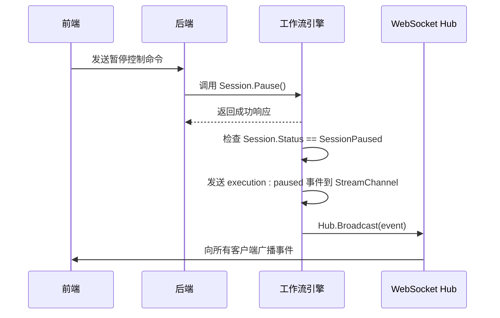
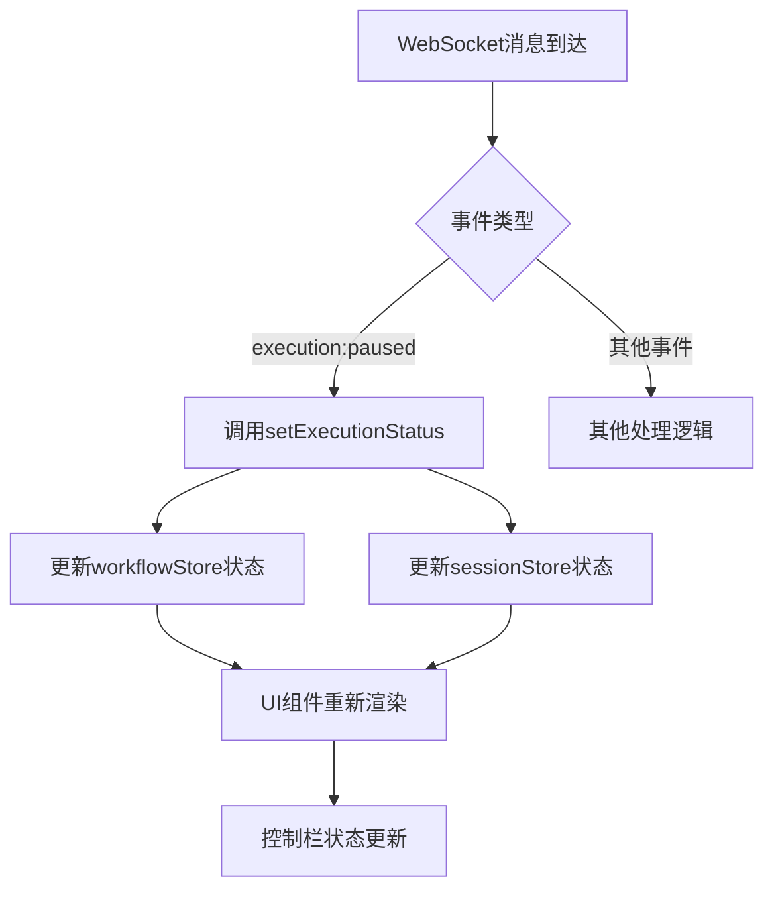

# 执行暂停事件 (execution:paused)

<cite>
**本文档引用文件**   
- [engine.go](file://internal/core/workflow/engine.go)
- [session.go](file://internal/core/workflow/session.go)
- [useWebSocketRouter.ts](file://frontend/src/hooks/useWebSocketRouter.ts)
- [hub.go](file://internal/api/ws/hub.go)
- [workflow.go](file://internal/api/handler/workflow.go)
- [useSessionStore.ts](file://frontend/src/stores/useSessionStore.ts)
- [useWorkflowRunStore.ts](file://frontend/src/stores/useWorkflowRunStore.ts)
- [context.go](file://internal/core/workflow/context.go)
</cite>

## 目录
1. [简介](#简介)
2. [事件触发机制](#事件触发机制)
3. [后端处理流程](#后端处理流程)
4. [前端处理流程](#前端处理流程)
5. [控制流程与用户交互](#控制流程与用户交互)
6. [系统架构与数据流](#系统架构与数据流)
7. [关键作用与应用场景](#关键作用与应用场景)
8. [代码路径参考](#代码路径参考)

## 简介

执行暂停事件（`execution:paused`）是工作流引擎中的一个核心控制信号，用于在会话状态被设置为暂停时通知前端系统。该事件在长周期任务管理和人机协同决策中扮演着关键角色。当用户通过控制栏触发暂停操作时，后端工作流引擎会在`executeNode`方法中检测到`SessionPaused`状态，并通过WebSocket向所有连接的客户端广播`execution:paused`事件。前端通过`useWebSocketRouter`捕获该事件，并调用`setExecutionStatus`和`updateSessionStatus`来更新全局执行状态，从而实现UI的实时同步。

## 事件触发机制

执行暂停事件的触发始于会话状态的变化。当用户点击“暂停”按钮时，前端发送控制命令到后端，后端调用`Session.Pause()`方法将会话状态设置为`SessionPaused`。工作流引擎在每次执行节点前都会检查当前会话状态，一旦发现状态为`SessionPaused`，立即发出`execution:paused`事件。

该机制确保了即使在复杂的并行或循环节点执行过程中，也能及时响应暂停指令，为用户提供精确的控制能力。暂停事件不仅是一个状态通知，更是实现细粒度任务控制的基础。

**事件触发机制**
- [engine.go](file://internal/core/workflow/engine.go#L53-L62)
- [session.go](file://internal/core/workflow/session.go#L74-L89)

## 后端处理流程

后端处理流程始于`WorkflowHandler.Control`方法接收暂停指令。该方法通过会话ID查找对应的引擎实例，并调用`Session.Pause()`方法。`Pause()`方法在加锁保护下将状态设置为`SessionPaused`，并创建一个新的阻塞通道`resumeCh`，为后续的恢复操作做准备。

随后，在`Engine.executeNode`方法中，引擎首先检查`e.Session.Status`是否为`SessionPaused`。如果是，则通过`StreamChannel`发送`execution:paused`事件。该事件包含事件类型、时间戳、节点ID和暂停原因等信息。事件随后被`hub`广播到所有WebSocket客户端。



**后端处理流程**
- [workflow.go](file://internal/api/handler/workflow.go#L153-L154)
- [session.go](file://internal/core/workflow/session.go#L74-L89)
- [engine.go](file://internal/core/workflow/engine.go#L53-L62)
- [hub.go](file://internal/api/ws/hub.go#L70-L73)

## 前端处理流程

前端处理流程由`useWebSocketRouter`钩子函数驱动。该钩子订阅`useConnectStore`中的`_lastMessage`状态，每当收到新的WebSocket消息时，根据消息的`event`字段进行路由分发。当接收到`execution:paused`事件时，执行以下操作：

1. 调用`workflowStore.setExecutionStatus('paused')`更新工作流运行状态
2. 调用`sessionStore.updateSessionStatus('paused')`更新会话状态

这两个状态更新会触发UI组件的重新渲染，使控制栏的按钮状态从“暂停”变为“继续”，并更新会话状态指示器。这种基于状态管理的架构确保了整个应用界面的一致性和响应性。



**前端处理流程**
- [useWebSocketRouter.ts](file://frontend/src/hooks/useWebSocketRouter.ts#L70-L73)
- [useWorkflowRunStore.ts](file://frontend/src/stores/useWorkflowRunStore.ts#L191-L195)
- [useSessionStore.ts](file://frontend/src/stores/useSessionStore.ts#L131-L143)

## 控制流程与用户交互

用户的控制流程通过`ExecutionControlBar`组件实现。该组件根据当前执行状态动态渲染控制按钮。当状态为“running”时，显示“暂停”按钮；当状态为“paused”时，显示“继续”按钮。

点击“暂停”按钮会调用`sendControl(sessionId, 'pause')`，向后端发送暂停指令。后端处理完成后，前端通过WebSocket接收到`execution:paused`事件，完成状态同步。点击“继续”按钮则发送`resume`指令，后端调用`Session.Resume()`方法恢复执行。

这种双向通信机制确保了用户操作与系统状态的高度一致性，为用户提供直观、可靠的控制体验。

**控制流程与用户交互**
- [ExecutionControlBar.tsx](file://frontend/src/components/meeting/ExecutionControlBar.tsx#L35-L50)
- [useWorkflowRunStore.ts](file://frontend/src/stores/useWorkflowRunStore.ts#L197-L225)

## 系统架构与数据流

系统的整体架构采用前后端分离模式，通过WebSocket实现双向实时通信。后端工作流引擎负责核心逻辑执行，WebSocket Hub负责消息广播，前端通过状态管理库（Zustand）维护应用状态。

数据流从用户操作开始，经由HTTP API传递到后端，触发会话状态变更。工作流引擎检测状态变更后，通过`StreamChannel`发送事件，由Hub广播到所有客户端。前端路由器接收事件后，更新相应的状态存储，驱动UI更新。

```mermaid
graph TB
subgraph 前端
A[ExecutionControlBar] --> B[useWorkflowRunStore]
B --> C[useWebSocketRouter]
C --> D[useConnectStore]
D --> E[WebSocket]
end
subgraph 后端
F[HTTP API] --> G[WorkflowHandler]
G --> H[Session]
H --> I[Engine]
I --> J[StreamChannel]
J --> K[Hub]
K --> E
end
E < --> K
```

**系统架构与数据流**
- [hub.go](file://internal/api/ws/hub.go)
- [useConnectStore.ts](file://frontend/src/stores/useConnectStore.ts)
- [workflow.go](file://internal/api/handler/workflow.go)

## 关键作用与应用场景

执行暂停事件在系统中具有多重关键作用：

1. **长周期任务控制**：允许用户在长时间运行的任务中随时暂停，检查中间结果或调整参数。
2. **人机协同决策**：在关键决策点暂停执行，等待人工审核和输入，确保决策质量。
3. **资源管理**：在系统资源紧张时暂停非关键任务，优化资源分配。
4. **调试与监控**：为开发者提供在特定节点暂停执行的能力，便于调试和性能分析。

典型应用场景包括：在“人类审查”节点等待审批、在成本估算超过阈值时暂停执行、在模型生成内容后进行人工校验等。

## 代码路径参考

以下是执行暂停事件相关的核心代码路径：

- **后端事件触发**：`internal/core/workflow/engine.go` 的 `executeNode` 方法中检查 `SessionPaused` 状态并发送事件
- **会话状态管理**：`internal/core/workflow/session.go` 的 `Pause()` 和 `Resume()` 方法
- **WebSocket广播**：`internal/api/ws/hub.go` 的 `Broadcast` 方法
- **前端事件路由**：`frontend/src/hooks/useWebSocketRouter.ts` 的 `routeMessage` 函数处理 `execution:paused` 事件
- **状态更新**：`frontend/src/stores/useWorkflowRunStore.ts` 的 `setExecutionStatus` 和 `useSessionStore.ts` 的 `updateSessionStatus` 方法
- **控制接口**：`internal/api/handler/workflow.go` 的 `Control` 方法处理暂停/恢复请求

这些代码路径共同构成了一个完整、可靠的执行控制机制，为复杂工作流的管理和监控提供了坚实基础。