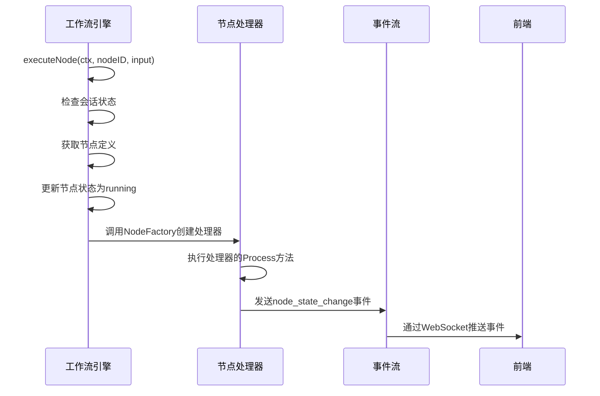
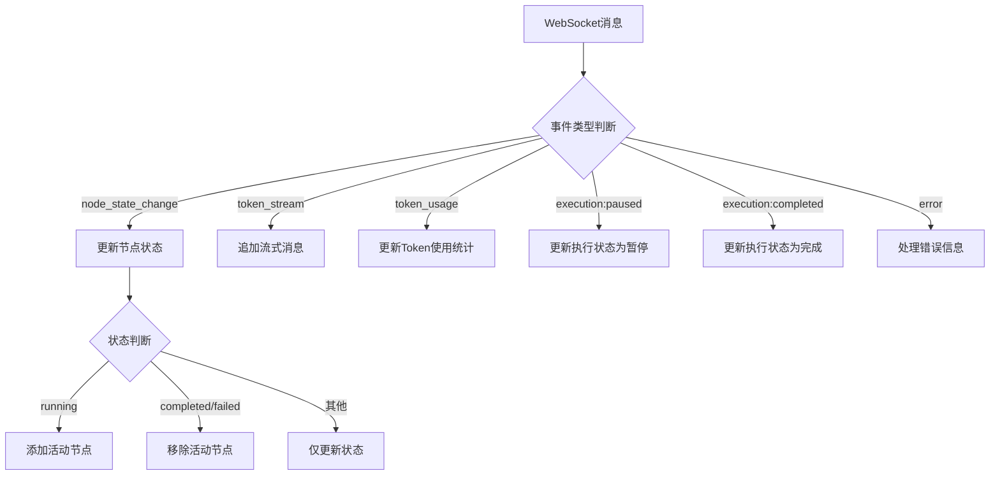

# 节点启动事件 (node:start)

<cite>
**本文档引用的文件**  
- [engine.go](file://internal/core/workflow/engine.go)
- [context.go](file://internal/core/workflow/context.go)
- [useWebSocketRouter.ts](file://frontend/src/hooks/useWebSocketRouter.ts)
- [useWorkflowEvents.ts](file://frontend/src/hooks/useWorkflowEvents.ts)
- [websocket.ts](file://frontend/src/types/websocket.ts)
- [types.go](file://internal/core/workflow/types.go)
- [start.go](file://internal/core/workflow/nodes/start.go)
</cite>

## 目录
1. [引言](#引言)
2. [节点启动事件概述](#节点启动事件概述)
3. [后端实现机制](#后端实现机制)
4. [前端事件处理](#前端事件处理)
5. [事件数据结构分析](#事件数据结构分析)
6. [可视化执行流程中的作用](#可视化执行流程中的作用)
7. [相关代码示例](#相关代码示例)
8. [总结](#总结)

## 引言

在The Council系统中，工作流引擎的执行过程需要实时向用户界面反馈各个节点的执行状态。其中，节点启动事件（node:start）是整个工作流执行过程中最关键的事件之一，它标志着某个节点开始执行，为前端提供了更新UI状态的重要时机。本文档将详细解释该事件的触发时机、业务含义以及前后端的实现机制。

## 节点启动事件概述

节点启动事件（node:start）是The Council系统中工作流执行过程中的核心事件之一。当工作流引擎开始执行某个节点时，会通过StreamEvent发出此事件，通知前端界面更新相应的UI状态。

该事件的主要业务含义包括：
- 标志着工作流中某个节点的执行开始
- 为前端提供实时更新UI的机会
- 作为可视化执行流程的重要组成部分
- 用于监控和调试工作流的执行过程

在系统中，节点启动事件通过WebSocket实时推送给前端，确保用户能够即时看到工作流的执行进度。

**Section sources**
- [engine.go](file://internal/core/workflow/engine.go#L52-L77)
- [start.go](file://internal/core/workflow/nodes/start.go#L13-L19)

## 后端实现机制

工作流引擎在执行节点时，会通过`executeNode`方法处理节点的执行逻辑。当确定要执行某个节点时，引擎会先更新节点状态为"running"，然后通过StreamChannel发送节点状态变更事件。

在`engine.go`文件中，`executeNode`方法负责处理节点的执行流程。该方法首先检查会话是否暂停，然后获取节点定义并更新其状态为运行中。虽然直接的"node:start"事件没有在代码中显式命名，但通过"node_state_change"事件类型实现了相同的功能。

对于特定类型的节点，如Start节点，有专门的处理器来处理其执行逻辑。在`start.go`文件中，`StartProcessor`的`Process`方法会在开始处理时发送一个状态变更事件，表明节点已开始运行。



**Diagram sources**
- [engine.go](file://internal/core/workflow/engine.go#L52-L77)
- [start.go](file://internal/core/workflow/nodes/start.go#L13-L19)

**Section sources**
- [engine.go](file://internal/core/workflow/engine.go#L52-L77)
- [start.go](file://internal/core/workflow/nodes/start.go#L13-L19)

## 前端事件处理

前端通过WebSocket接收后端推送的事件，并使用`useWebSocketRouter`和`useWorkflowEvents`等Hook来处理这些事件。当接收到节点状态变更事件时，前端会更新相应的状态存储，从而触发UI的重新渲染。

在`useWebSocketRouter.ts`文件中，定义了消息路由机制，根据不同的事件类型调用相应的处理函数。对于"node_state_change"事件，会调用`workflowStore.updateNodeStatus`方法更新节点状态，并根据状态变化添加或移除活动节点。



**Diagram sources**
- [useWebSocketRouter.ts](file://frontend/src/hooks/useWebSocketRouter.ts#L17-L111)
- [useWorkflowEvents.ts](file://frontend/src/hooks/useWorkflowEvents.ts#L11-L82)

**Section sources**
- [useWebSocketRouter.ts](file://frontend/src/hooks/useWebSocketRouter.ts#L17-L111)
- [useWorkflowEvents.ts](file://frontend/src/hooks/useWorkflowEvents.ts#L11-L82)

## 事件数据结构分析

节点启动事件的数据结构定义在`StreamEvent`类型中，包含了事件类型、时间戳、节点ID和附加数据等关键字段。

```go
type StreamEvent struct {
    Type      string                 `json:"event"`
    Timestamp time.Time              `json:"timestamp"`
    NodeID    string                 `json:"node_id,omitempty"`
    Data      map[string]interface{} `json:"data,omitempty"`
}
```

各字段的具体用途如下：
- **Type**: 事件类型，对于节点启动事件通常为"node_state_change"
- **Timestamp**: 事件发生的时间戳，用于记录事件发生的具体时间
- **NodeID**: 触发事件的节点ID，用于标识是哪个节点的状态发生了变化
- **Data**: 附加数据，包含节点状态等详细信息

在实际使用中，当节点开始执行时，Data字段会包含类似`{"node_id": "start", "status": "running"}`的结构，明确指示了节点ID和新的状态。

**Section sources**
- [context.go](file://internal/core/workflow/context.go#L9-L14)
- [types.go](file://internal/core/workflow/types.go#L8-L18)
- [websocket.ts](file://frontend/src/types/websocket.ts#L27-L30)

## 可视化执行流程中的作用

节点启动事件在可视化执行流程中扮演着至关重要的角色。当用户在前端界面启动一个工作流时，系统会通过WebSocket连接接收各种事件，其中节点启动事件是最早被接收到的事件之一。

这些事件使得前端能够实时更新工作流画布上的节点状态，让用户清楚地看到哪些节点正在执行、哪些节点已经完成。这种实时反馈机制极大地提升了用户体验，使用户能够直观地了解工作流的执行进度。

此外，通过记录每个节点的启动时间，系统还可以计算出各个节点的执行耗时，为性能分析和优化提供数据支持。

**Section sources**
- [useWebSocketRouter.ts](file://frontend/src/hooks/useWebSocketRouter.ts#L32-L46)
- [useWorkflowEvents.ts](file://frontend/src/hooks/useWorkflowEvents.ts#L25-L35)

## 相关代码示例

### 后端事件发送示例

```mermaid
classDiagram
class StreamEvent {
+string Type
+time.Time Timestamp
+string NodeID
+map[string]interface{} Data
}
class Engine {
-Graph *GraphDefinition
-Status map[string]NodeStatus
-StreamChannel chan StreamEvent
+executeNode(ctx context.Context, nodeID string, input map[string]interface{})
+updateStatus(nodeID string, status NodeStatus)
}
class StartProcessor {
+Process(ctx context.Context, input map[string]interface{}, stream chan<- StreamEvent) (map[string]interface{}, error)
}
Engine --> StreamEvent : 发送
StartProcessor --> StreamEvent : 发送
Engine --> StartProcessor : 使用
```

**Diagram sources**
- [engine.go](file://internal/core/workflow/engine.go#L11-L23)
- [context.go](file://internal/core/workflow/context.go#L9-L14)
- [start.go](file://internal/core/workflow/nodes/start.go#L11-L13)

### 前端事件处理示例

```mermaid
classDiagram
class WSMessage {
+WSEventType event
+T data
+string timestamp
+string node_id
}
class useWebSocketRouter {
+routeMessage(msg : WSMessage)
}
class useWorkflowEvents {
+useEffect(() => { ... })
}
class useWorkflowRunStore {
+updateNodeStatus(nodeId : string, status : NodeStatus)
+addActiveNode(nodeId : string)
+removeActiveNode(nodeId : string)
}
useWebSocketRouter --> WSMessage : 处理
useWorkflowEvents --> WSMessage : 处理
useWebSocketRouter --> useWorkflowRunStore : 调用
useWorkflowEvents --> useWorkflowRunStore : 调用
```

**Diagram sources**
- [websocket.ts](file://frontend/src/types/websocket.ts#L12-L17)
- [useWebSocketRouter.ts](file://frontend/src/hooks/useWebSocketRouter.ts#L17-L111)
- [useWorkflowEvents.ts](file://frontend/src/hooks/useWorkflowEvents.ts#L11-L82)
- [useWorkflowRunStore.ts](file://frontend/src/stores/useWorkflowRunStore.ts)

## 总结

节点启动事件（node:start）是The Council系统中工作流执行过程的关键组成部分。通过后端工作流引擎与前端界面的紧密协作，该事件实现了工作流执行状态的实时同步，为用户提供了直观的执行进度反馈。

后端通过`StreamEvent`结构体将节点状态变更信息推送给前端，而前端则通过WebSocket接收这些事件并更新相应的状态存储。这种设计模式不仅保证了系统的响应性，还为后续的功能扩展提供了良好的基础。

通过对这一机制的深入理解，开发者可以更好地把握The Council系统的工作流执行流程，为系统的维护和优化提供有力支持。