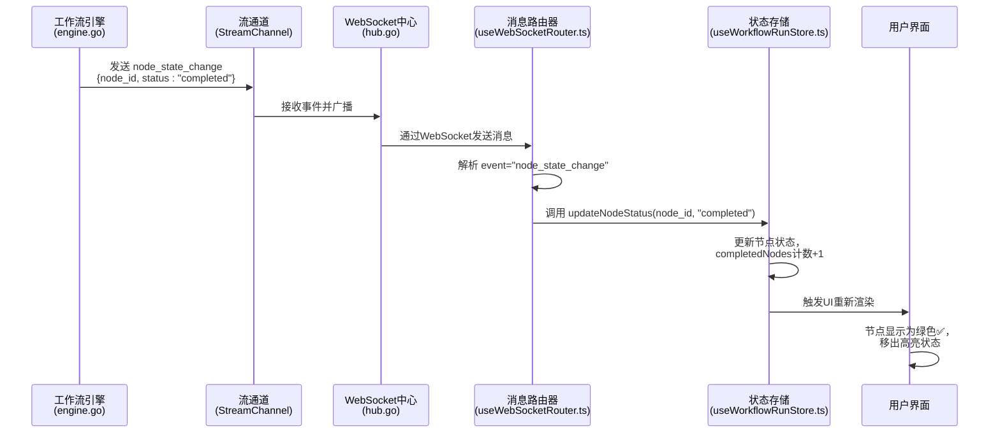

# 节点完成事件 (node:complete)

<cite>
**本文档引用的文件**   
- [useWorkflowRunStore.ts](file://frontend/src/stores/useWorkflowRunStore.ts)
- [useWebSocketRouter.ts](file://frontend/src/hooks/useWebSocketRouter.ts)
- [useConnectStore.ts](file://frontend/src/stores/useConnectStore.ts)
- [session.ts](file://frontend/src/types/session.ts)
- [websocket.ts](file://frontend/src/types/websocket.ts)
- [engine.go](file://internal/core/workflow/engine.go)
- [types.go](file://internal/core/workflow/types.go)
- [start.go](file://internal/core/workflow/nodes/start.go)
- [end.go](file://internal/core/workflow/nodes/end.go)
- [SPEC-002-workflow-run-store.md](file://docs/specs/sprint1/SPEC-002-workflow-run-store.md)
- [SPEC-005-websocket-optimization.md](file://docs/specs/sprint1/SPEC-005-websocket-optimization.md)
</cite>

## 目录
1. [引言](#引言)
2. [后端事件触发逻辑](#后端事件触发逻辑)
3. [前端事件处理与状态同步](#前端事件处理与状态同步)
4. [节点状态枚举与UI映射](#节点状态枚举与ui映射)
5. [事件对工作流的关键作用](#事件对工作流的关键作用)
6. [序列图：节点完成事件流](#序列图节点完成事件流)
7. [总结](#总结)

## 引言

节点完成事件（`node:complete`）是工作流执行过程中的核心状态变更事件，标志着一个工作流节点已成功执行完毕。该事件通过WebSocket实时广播，驱动前端UI状态更新和后续节点的调度。本技术文档详细阐述了从后端`updateStatus`和中间件处理完成到前端`useWebSocketRouter`接收并更新节点状态为'completed'的完整逻辑路径，分析了该事件在工作流进度追踪、UI状态同步和后续节点调度中的关键作用，并解释了其与`NodeStatus`枚举值的映射关系。

## 后端事件触发逻辑

节点完成事件的触发发生在工作流引擎（Engine）成功执行一个节点的处理器（Processor）并完成所有中间件（Middleware）的后置处理之后。其核心逻辑路径如下：

1.  **节点执行**：`Engine.executeNode`方法调用特定节点类型的`NodeProcessor.Process`方法。
2.  **中间件后置处理**：节点执行成功后，引擎会按顺序调用所有注册的中间件的`AfterNodeExecution`方法，以进行后置处理（如内存持久化、成本估算等）。
3.  **状态更新与事件广播**：当中间件处理全部成功后，引擎调用`e.updateStatus(nodeID, StatusCompleted)`将节点状态更新为`completed`，并立即通过`StreamChannel`广播一个`node_state_change`事件，其数据包含节点ID和`completed`状态。

```go
// internal/core/workflow/engine.go
// Execute Processor
output, err := processor.Process(ctx, input, e.StreamChannel)
if err != nil {
    // ... 错误处理
    return
}

// Middleware: After Execution
for _, mw := range e.Middlewares {
    var mwErr error
    output, mwErr = mw.AfterNodeExecution(ctx, e.Session, node, output)
    if mwErr != nil {
        e.emitError(nodeID, fmt.Errorf("middleware %s failed post-processing: %w", mw.Name(), mwErr))
        return
    }
}

// 节点成功完成，更新状态并广播事件
e.updateStatus(nodeID, StatusCompleted)
```

此逻辑在所有节点类型（如`start`、`end`、`agent`等）中通用。例如，在`start.go`和`end.go`中，节点处理器在完成其核心逻辑后，都会显式地向`stream`通道发送一个状态为`completed`的`node_state_change`事件。

**Section sources**
- [engine.go](file://internal/core/workflow/engine.go#L100-L123)
- [start.go](file://internal/core/workflow/nodes/start.go#L44-L49)
- [end.go](file://internal/core/workflow/nodes/end.go#L106-L110)

## 前端事件处理与状态同步

前端通过`useWebSocketRouter`这一核心Hook来监听和路由所有来自后端的WebSocket消息。当`node:complete`事件（在代码中为`node_state_change`事件，状态为`completed`）到达时，前端的处理流程如下：

1.  **消息订阅**：`useWebSocketRouter`通过`useConnectStore.subscribe`订阅`_lastMessage`状态的变化，确保能捕获到每一个WebSocket消息。
2.  **事件路由**：收到消息后，`routeMessage`函数根据`event`字段进行分发。对于`node_state_change`事件，它会提取`node_id`和`status`。
3.  **状态更新**：
    *   调用`useWorkflowRunStore.updateNodeStatus()`将指定节点的运行时状态更新为`completed`。
    *   调用`useSessionStore.updateNodeStatus()`同步更新会话状态中的节点状态。
    *   由于状态变为`completed`，还会调用`removeActiveNode`将该节点从活跃节点集合中移除，并调用`finalizeMessage`完成该节点对应的消息流渲染。

```typescript
// frontend/src/hooks/useWebSocketRouter.ts
case 'node_state_change': {
    const data = msg.data as NodeStateChangeData;
    workflowStore.updateNodeStatus(data.node_id, data.status);
    sessionStore.updateNodeStatus(data.node_id, data.status);

    if (data.status === 'running') {
        workflowStore.addActiveNode(data.node_id);
    } else if (data.status === 'completed' || data.status === 'failed') {
        workflowStore.removeActiveNode(data.node_id);
        sessionStore.finalizeMessage(data.node_id);
    }
    break;
}
```

`useWorkflowRunStore`是一个Zustand状态管理Store，它集中管理了工作流的运行时状态，包括所有节点的状态、执行状态和统计数据。`updateNodeStatus`操作会触发UI组件的重新渲染，从而实现UI状态的即时同步。

**Section sources**
- [useWebSocketRouter.ts](file://frontend/src/hooks/useWebSocketRouter.ts#L32-L45)
- [useWorkflowRunStore.ts](file://frontend/src/stores/useWorkflowRunStore.ts#L149-L159)
- [useConnectStore.ts](file://frontend/src/stores/useConnectStore.ts#L113-L124)

## 节点状态枚举与UI映射

`NodeStatus`是一个关键的枚举类型，它定义了节点可能处于的所有状态，并与前端的UI表现直接映射。

### NodeStatus 枚举定义

```typescript
// frontend/src/types/session.ts
export type NodeStatus = 'pending' | 'running' | 'completed' | 'failed';
```

```go
// internal/core/workflow/types.go
const (
    StatusPending   NodeStatus = "pending"
    StatusRunning   NodeStatus = "running"
    StatusCompleted NodeStatus = "completed"
    StatusFailed    NodeStatus = "failed"
    // ... 其他状态
)
```

### UI 样式与图标映射

前端通过`utils/nodeStyles.ts`中的`getNodeStatusStyles`和`getNodeStatusIcon`函数，将`NodeStatus`值映射为具体的CSS样式和图标，实现直观的视觉反馈。

| NodeStatus | UI 样式描述 | 图标 |
| :--- | :--- | :--- |
| `pending` | 透明度降低，表示待处理 | ⏳ |
| `running` | 蓝色脉冲光晕，表示正在执行 | 🔄 |
| `completed` | 绿色边框和阴影，表示成功完成 | ✅ |
| `failed` | 红色边框和阴影，表示执行失败 | ❌ |

这种映射关系确保了用户能够一目了然地了解每个节点的执行状态。

**Section sources**
- [session.ts](file://frontend/src/types/session.ts#L5)
- [types.go](file://internal/core/workflow/types.go#L11-L18)
- [SPEC-002-workflow-run-store.md](file://docs/specs/sprint1/SPEC-002-workflow-run-store.md#L179-L215)

## 事件对工作流的关键作用

`node:complete`事件是驱动整个工作流系统前进的“齿轮”，其作用至关重要：

1.  **工作流进度追踪**：该事件是工作流进度的核心指标。`useWorkflowRunStore`中的`stats.completedNodes`计数器会在每次节点完成时递增，从而精确地追踪工作流的整体完成进度。
2.  **UI状态同步**：如前所述，该事件直接驱动前端UI的更新。节点的视觉状态（颜色、图标、边框）会立即变为“已完成”，为用户提供即时反馈。
3.  **后续节点调度**：在后端，节点状态更新为`completed`是触发后续节点执行的关键信号。`Engine.executeNode`方法在完成当前节点后，会遍历`node.NextIDs`并并发地启动所有后续节点的执行，从而实现工作流的自动推进。

**Section sources**
- [useWorkflowRunStore.ts](file://frontend/src/stores/useWorkflowRunStore.ts#L156-L157)
- [engine.go](file://internal/core/workflow/engine.go#L124-L138)

## 序列图：节点完成事件流

以下序列图详细描述了从后端节点执行完成到前端UI更新的完整事件流。



**Diagram sources**
- [engine.go](file://internal/core/workflow/engine.go#L122)
- [hub.go](file://internal/api/ws/hub.go)
- [useWebSocketRouter.ts](file://frontend/src/hooks/useWebSocketRouter.ts#L32)
- [useWorkflowRunStore.ts](file://frontend/src/stores/useWorkflowRunStore.ts#L149)

## 总结

`node:complete`事件（通过`node_state_change`消息实现）是连接后端工作流引擎与前端用户界面的核心桥梁。它在后端由`Engine`在节点成功执行并完成中间件处理后触发，通过WebSocket实时推送到前端。前端的`useWebSocketRouter`负责接收和路由该事件，进而更新`useWorkflowRunStore`中的节点状态。这一机制不仅实现了UI的实时同步，提供了清晰的视觉反馈（通过`NodeStatus`枚举与UI样式的映射），更是工作流能够自动、可靠地从一个节点推进到下一个节点的关键所在，确保了整个工作流系统的流畅运行。