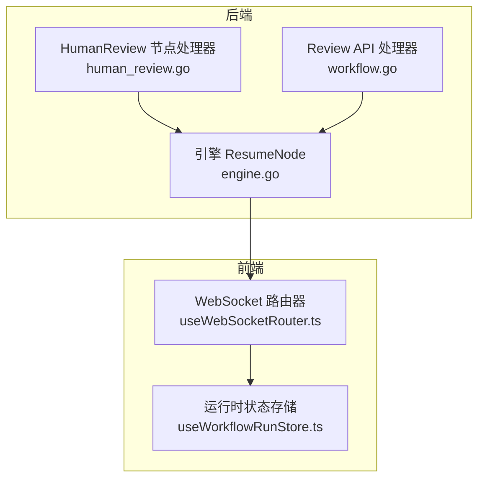
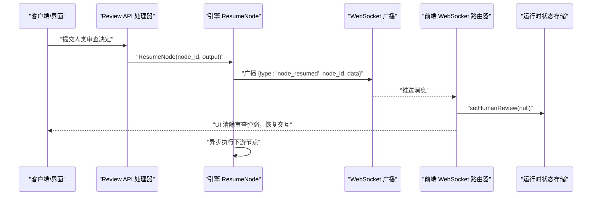
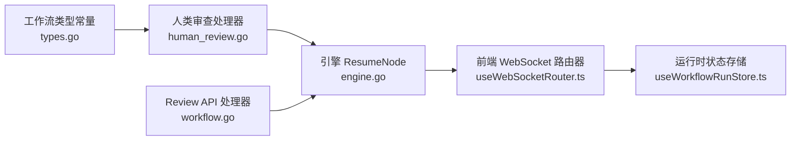

# 节点恢复事件（node_resumed）

<cite>
**本文引用的文件**
- [internal/core/workflow/engine.go](file://internal/core/workflow/engine.go)
- [internal/api/handler/workflow.go](file://internal/api/handler/workflow.go)
- [internal/core/workflow/nodes/human_review.go](file://internal/core/workflow/nodes/human_review.go)
- [internal/core/workflow/types.go](file://internal/core/workflow/types.go)
- [frontend/src/hooks/useWebSocketRouter.ts](file://frontend/src/hooks/useWebSocketRouter.ts)
- [frontend/src/stores/useWorkflowRunStore.ts](file://frontend/src/stores/useWorkflowRunStore.ts)
- [docs/api/human_review.md](file://docs/api/human_review.md)
- [docs/specs/backend/SPEC-405-human-review-processor.md](file://docs/specs/backend/SPEC-405-human-review-processor.md)
</cite>

## 目录
1. [简介](#简介)
2. [项目结构](#项目结构)
3. [核心组件](#核心组件)
4. [架构总览](#架构总览)
5. [详细组件分析](#详细组件分析)
6. [依赖关系分析](#依赖关系分析)
7. [性能考量](#性能考量)
8. [故障排查指南](#故障排查指南)
9. [结论](#结论)

## 简介
本指南聚焦“节点恢复事件（node_resumed）”，解释当用户通过API或界面确认人类审查后，后端引擎如何发出该事件，以及前端如何据此清除人类审查状态并恢复UI交互能力。文档以代码为依据，展示该事件作为人机协同闭环的最后一环，如何确保系统从暂停状态平滑过渡到继续执行，并维持状态一致性。

## 项目结构
围绕“节点恢复事件”的关键文件分布于后端引擎、API处理器、前端事件路由与状态管理模块之间，形成一条清晰的端到端链路：后端节点处理器触发暂停，前端监听到“人类干预所需”事件并弹出审查弹窗；用户提交决定后，后端API接收请求并调用引擎恢复节点，引擎广播“节点恢复”事件，前端收到事件后清除审查状态并恢复UI交互。

图表来源
- [internal/core/workflow/nodes/human_review.go](file://internal/core/workflow/nodes/human_review.go#L1-L46)
- [internal/core/workflow/engine.go](file://internal/core/workflow/engine.go#L200-L246)
- [internal/api/handler/workflow.go](file://internal/api/handler/workflow.go#L209-L245)
- [frontend/src/hooks/useWebSocketRouter.ts](file://frontend/src/hooks/useWebSocketRouter.ts#L80-L101)
- [frontend/src/stores/useWorkflowRunStore.ts](file://frontend/src/stores/useWorkflowRunStore.ts#L233-L257)

章节来源
- [internal/core/workflow/nodes/human_review.go](file://internal/core/workflow/nodes/human_review.go#L1-L46)
- [internal/core/workflow/engine.go](file://internal/core/workflow/engine.go#L200-L246)
- [internal/api/handler/workflow.go](file://internal/api/handler/workflow.go#L209-L245)
- [frontend/src/hooks/useWebSocketRouter.ts](file://frontend/src/hooks/useWebSocketRouter.ts#L80-L101)
- [frontend/src/stores/useWorkflowRunStore.ts](file://frontend/src/stores/useWorkflowRunStore.ts#L233-L257)

## 核心组件
- 后端节点处理器：在人类审查节点触发暂停，向流通道发送“人类干预所需”事件，并返回挂起错误，使引擎暂停执行。
- 引擎 ResumeNode：接收API请求，向流通道广播“节点恢复”事件，随后异步启动后续节点继续执行。
- API Review 处理器：接收用户提交的审查动作，构造输出载荷并调用引擎恢复节点。
- 前端 WebSocket 路由器：订阅并分发“节点恢复”事件，清除人类审查状态，恢复UI交互。
- 前端运行时状态存储：维护节点状态、执行状态与人类审查弹窗状态，配合路由器完成UI一致性。

章节来源
- [internal/core/workflow/nodes/human_review.go](file://internal/core/workflow/nodes/human_review.go#L1-L46)
- [internal/core/workflow/engine.go](file://internal/core/workflow/engine.go#L200-L246)
- [internal/api/handler/workflow.go](file://internal/api/handler/workflow.go#L209-L245)
- [frontend/src/hooks/useWebSocketRouter.ts](file://frontend/src/hooks/useWebSocketRouter.ts#L80-L101)
- [frontend/src/stores/useWorkflowRunStore.ts](file://frontend/src/stores/useWorkflowRunStore.ts#L233-L257)

## 架构总览
下图展示了“节点恢复事件”的端到端流程：从人类审查节点暂停，到用户提交决定，再到引擎恢复并广播事件，最后前端清除审查状态并继续执行。

图表来源
- [internal/api/handler/workflow.go](file://internal/api/handler/workflow.go#L209-L245)
- [internal/core/workflow/engine.go](file://internal/core/workflow/engine.go#L200-L246)
- [frontend/src/hooks/useWebSocketRouter.ts](file://frontend/src/hooks/useWebSocketRouter.ts#L92-L95)
- [frontend/src/stores/useWorkflowRunStore.ts](file://frontend/src/stores/useWorkflowRunStore.ts#L233-L257)

## 详细组件分析

### 后端：人类审查节点处理器
- 行为要点
  - 发送“节点状态变更”事件，标记节点进入“运行中”。
  - 发送“人类干预所需”事件，携带超时等上下文信息。
  - 返回挂起错误，使引擎暂停在此节点，等待用户决定。
- 作用
  - 将“人类审查”纳入工作流生命周期，通过事件驱动前端弹窗与交互。

章节来源
- [internal/core/workflow/nodes/human_review.go](file://internal/core/workflow/nodes/human_review.go#L1-L46)

### 后端：引擎 ResumeNode
- 行为要点
  - 从图中定位目标节点，向流通道广播“节点恢复”事件，包含节点ID与输出载荷。
  - 异步启动下游节点继续执行，避免阻塞API响应。
- 作用
  - 作为人机协同闭环的关键一步，将用户决策转化为引擎继续执行的信号。

章节来源
- [internal/core/workflow/engine.go](file://internal/core/workflow/engine.go#L200-L246)

### 后端：Review API 处理器
- 行为要点
  - 解析请求，构造输出载荷（含动作、评审者、时间戳等）。
  - 调用引擎恢复指定节点，返回“已恢复”状态。
- 作用
  - 将前端/界面的用户确认转化为引擎恢复指令。

章节来源
- [internal/api/handler/workflow.go](file://internal/api/handler/workflow.go#L209-L245)

### 前端：WebSocket 路由器
- 行为要点
  - 监听“节点恢复”事件，清除人类审查状态，从而关闭审查弹窗并恢复UI交互。
  - 其他事件（如“节点状态变更”“执行暂停/完成”等）也在此统一处理。
- 作用
  - 保证前端UI与后端事件流保持一致，实现状态一致性。

章节来源
- [frontend/src/hooks/useWebSocketRouter.ts](file://frontend/src/hooks/useWebSocketRouter.ts#L80-L101)

### 前端：运行时状态存储
- 行为要点
  - 维护节点状态、执行状态与人类审查弹窗状态。
  - 提供提交人类审查的方法，在成功后清空审查状态。
- 作用
  - 作为UI状态的单一事实来源，支撑事件驱动的状态更新。

章节来源
- [frontend/src/stores/useWorkflowRunStore.ts](file://frontend/src/stores/useWorkflowRunStore.ts#L233-L257)

### 事件与协议补充
- 事件类型
  - “人类干预所需”：用于前端弹出审查弹窗。
  - “节点恢复”：用于前端清除审查状态并恢复交互。
- API
  - Review API：接收用户决定并触发恢复。
- 文档参考
  - 人类审查API设计文档与SPEC-405人类审查处理器文档，明确了事件与API契约。

章节来源
- [docs/api/human_review.md](file://docs/api/human_review.md#L1-L200)
- [docs/specs/backend/SPEC-405-human-review-processor.md](file://docs/specs/backend/SPEC-405-human-review-processor.md#L1-L77)

## 依赖关系分析
- 节点处理器依赖工作流类型常量，明确“人类审查”节点类型。
- 引擎依赖图结构信息，根据节点ID定位并广播事件。
- API处理器依赖引擎实例，负责接收用户输入并调用恢复逻辑。
- 前端路由器依赖WebSocket消息格式约定，接收并分发事件。
- 前端状态存储依赖路由器的事件分发，实现UI状态更新。

图表来源
- [internal/core/workflow/types.go](file://internal/core/workflow/types.go#L1-L67)
- [internal/core/workflow/nodes/human_review.go](file://internal/core/workflow/nodes/human_review.go#L1-L46)
- [internal/core/workflow/engine.go](file://internal/core/workflow/engine.go#L200-L246)
- [internal/api/handler/workflow.go](file://internal/api/handler/workflow.go#L209-L245)
- [frontend/src/hooks/useWebSocketRouter.ts](file://frontend/src/hooks/useWebSocketRouter.ts#L80-L101)
- [frontend/src/stores/useWorkflowRunStore.ts](file://frontend/src/stores/useWorkflowRunStore.ts#L233-L257)

章节来源
- [internal/core/workflow/types.go](file://internal/core/workflow/types.go#L1-L67)
- [internal/core/workflow/nodes/human_review.go](file://internal/core/workflow/nodes/human_review.go#L1-L46)
- [internal/core/workflow/engine.go](file://internal/core/workflow/engine.go#L200-L246)
- [internal/api/handler/workflow.go](file://internal/api/handler/workflow.go#L209-L245)
- [frontend/src/hooks/useWebSocketRouter.ts](file://frontend/src/hooks/useWebSocketRouter.ts#L80-L101)
- [frontend/src/stores/useWorkflowRunStore.ts](file://frontend/src/stores/useWorkflowRunStore.ts#L233-L257)

## 性能考量
- 异步执行：引擎在广播“节点恢复”事件后，通过并发方式启动下游节点，避免阻塞API响应，提升用户体验。
- 事件驱动：前端通过事件路由统一处理，减少重复监听与状态同步成本。
- 资源隔离：人类审查节点暂停后，引擎仅在收到恢复指令时才继续执行，降低不必要的计算开销。

## 故障排查指南
- 问题：前端未收到“节点恢复”事件
  - 检查WebSocket消息字段映射是否正确（事件字段名与后端序列化标签需一致）。
  - 确认前端路由器已注册“节点恢复”事件分支。
- 问题：审查弹窗未关闭或UI未恢复
  - 确认前端状态存储在收到事件后正确调用清除逻辑。
  - 检查是否存在其他事件覆盖了人类审查状态。
- 问题：API返回冲突或失败
  - 确认节点处于暂停状态且节点ID有效。
  - 检查输出载荷是否符合预期。

章节来源
- [frontend/src/hooks/useWebSocketRouter.ts](file://frontend/src/hooks/useWebSocketRouter.ts#L92-L95)
- [frontend/src/stores/useWorkflowRunStore.ts](file://frontend/src/stores/useWorkflowRunStore.ts#L233-L257)
- [internal/api/handler/workflow.go](file://internal/api/handler/workflow.go#L209-L245)

## 结论
“节点恢复事件（node_resumed）”是人机协同闭环的关键环节。它将用户确认转化为引擎继续执行的信号，并通过前端事件路由与状态存储实现UI的一致性恢复。后端通过异步执行保障性能，前端通过事件驱动实现低耦合、高内聚的状态更新。遵循本文所述流程与检查点，可确保系统从暂停状态平滑过渡到继续执行，并维持状态一致性。