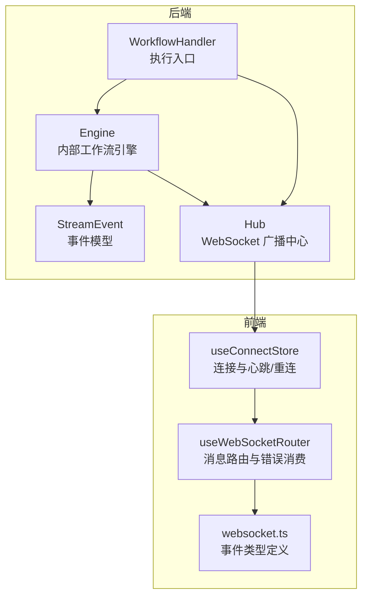
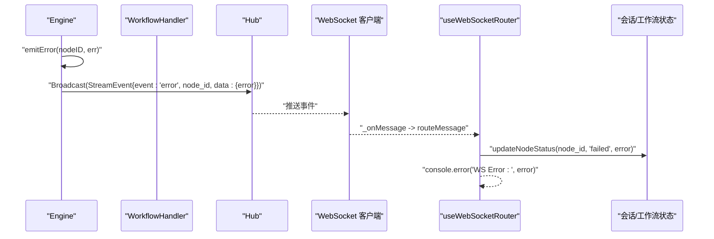
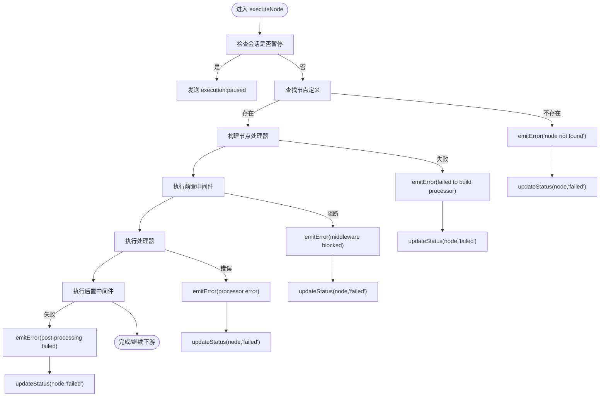
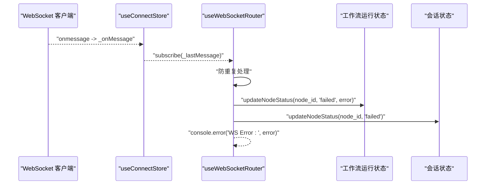
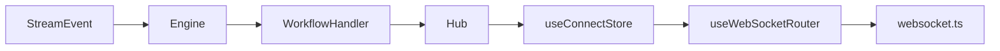

# 错误事件 (error)

<cite>
**本文引用的文件**
- [engine.go](file://internal/core/workflow/engine.go)
- [context.go](file://internal/core/workflow/context.go)
- [workflow.go](file://internal/api/handler/workflow.go)
- [hub.go](file://internal/api/ws/hub.go)
- [useWebSocketRouter.ts](file://frontend/src/hooks/useWebSocketRouter.ts)
- [websocket.ts](file://frontend/src/types/websocket.ts)
- [useConnectStore.ts](file://frontend/src/stores/useConnectStore.ts)
- [SPEC-005-websocket-optimization.md](file://docs/specs/sprint1/SPEC-005-websocket-optimization.md)
- [2025-12-21-websocket-debugging-report.md](file://docs/reports/debugging/2025-12-21-websocket-debugging-report.md)
- [SPEC-409-circuit-breaker.md](file://docs/specs/backend/SPEC-409-circuit-breaker.md)
</cite>

## 目录
1. [简介](#简介)
2. [项目结构](#项目结构)
3. [核心组件](#核心组件)
4. [架构总览](#架构总览)
5. [详细组件分析](#详细组件分析)
6. [依赖关系分析](#依赖关系分析)
7. [性能考量](#性能考量)
8. [故障排查指南](#故障排查指南)
9. [结论](#结论)

## 简介
本文件系统化梳理“错误事件（error）”在本项目中的触发场景、传播路径与前端消费方式，重点覆盖以下方面：
- 错误事件的触发来源与典型场景：节点未找到、中间件阻断、处理器执行失败、会话暂停导致的错误、验证失败等
- emitError 函数的调用链与对节点状态的影响
- StreamChannel 的作用与广播机制
- 前端通过 useWebSocketRouter 捕获错误并更新节点状态为“failed”的流程
- 错误传播机制、日志记录策略与用户提示方式
- 强调该事件在系统可观测性与故障排查中的关键地位

## 项目结构
围绕“错误事件（error）”，涉及后端工作流引擎、WebSocket 广播、前端路由与状态管理的关键文件如下图所示。

图表来源
- [engine.go](file://internal/core/workflow/engine.go#L173-L182)
- [context.go](file://internal/core/workflow/context.go#L8-L14)
- [workflow.go](file://internal/api/handler/workflow.go#L102-L117)
- [hub.go](file://internal/api/ws/hub.go#L70-L74)
- [useWebSocketRouter.ts](file://frontend/src/hooks/useWebSocketRouter.ts#L97-L109)
- [websocket.ts](file://frontend/src/types/websocket.ts#L1-L10)
- [useConnectStore.ts](file://frontend/src/stores/useConnectStore.ts#L130-L203)

章节来源
- [engine.go](file://internal/core/workflow/engine.go#L173-L182)
- [workflow.go](file://internal/api/handler/workflow.go#L102-L117)
- [hub.go](file://internal/api/ws/hub.go#L70-L74)
- [useWebSocketRouter.ts](file://frontend/src/hooks/useWebSocketRouter.ts#L97-L109)
- [websocket.ts](file://frontend/src/types/websocket.ts#L1-L10)
- [useConnectStore.ts](file://frontend/src/stores/useConnectStore.ts#L130-L203)

## 核心组件
- 工作流引擎（Engine）：负责节点执行、中间件链、状态管理与错误发射
- 事件模型（StreamEvent）：统一的事件载体，包含事件类型、时间戳、节点ID与数据
- 执行入口（WorkflowHandler）：桥接引擎输出与 WebSocket 广播
- WebSocket 广播（Hub）：向所有客户端广播事件
- 前端路由（useWebSocketRouter）：根据事件类型分派到会话与工作流状态管理
- 连接与心跳（useConnectStore）：负责连接生命周期与自动重连

章节来源
- [engine.go](file://internal/core/workflow/engine.go#L11-L23)
- [context.go](file://internal/core/workflow/context.go#L8-L14)
- [workflow.go](file://internal/api/handler/workflow.go#L58-L123)
- [hub.go](file://internal/api/ws/hub.go#L21-L36)
- [useWebSocketRouter.ts](file://frontend/src/hooks/useWebSocketRouter.ts#L13-L125)
- [useConnectStore.ts](file://frontend/src/stores/useConnectStore.ts#L130-L203)

## 架构总览
下图展示从引擎产生错误事件到前端消费的完整链路。

图表来源
- [engine.go](file://internal/core/workflow/engine.go#L173-L182)
- [workflow.go](file://internal/api/handler/workflow.go#L102-L117)
- [hub.go](file://internal/api/ws/hub.go#L70-L74)
- [useWebSocketRouter.ts](file://frontend/src/hooks/useWebSocketRouter.ts#L97-L109)

## 详细组件分析

### 1) 错误事件的触发场景
- 节点未找到：当执行节点不存在时，引擎发出错误事件并标记节点为失败
- 中间件阻断：前置中间件返回错误时，引擎发出错误事件并标记节点为失败
- 处理器执行失败：节点处理器返回错误时，引擎发出错误事件并标记节点为失败
- 会话暂停：等待会话恢复时被取消，引擎发出错误事件并标记节点为失败
- 图验证失败：工作流图校验失败时，引擎发出错误事件并终止执行
- 人类干预/暂停：在特定条件下触发的人类交互需求，前端可据此弹窗或提示

章节来源
- [engine.go](file://internal/core/workflow/engine.go#L40-L49)
- [engine.go](file://internal/core/workflow/engine.go#L52-L138)
- [engine.go](file://internal/core/workflow/engine.go#L173-L182)

### 2) emitError 调用链与对节点状态的影响
- 调用链
  - Engine.Run：若图校验失败，直接发射错误事件
  - Engine.executeNode：在多种失败路径中调用 emitError
  - Engine.emitError：记录日志、构造错误事件、更新节点状态为失败
- 对 StreamChannel 的影响
  - emitError 将错误事件写入 Engine.StreamChannel
  - WorkflowHandler 在独立 goroutine 中遍历 StreamChannel 并通过 Hub 广播
  - Hub 将事件推送给所有已注册客户端
- 对节点状态的影响
  - emitError 显式将节点状态置为失败，便于前端与会话层感知

图表来源
- [engine.go](file://internal/core/workflow/engine.go#L40-L49)
- [engine.go](file://internal/core/workflow/engine.go#L52-L138)
- [engine.go](file://internal/core/workflow/engine.go#L173-L182)

章节来源
- [engine.go](file://internal/core/workflow/engine.go#L40-L49)
- [engine.go](file://internal/core/workflow/engine.go#L52-L138)
- [engine.go](file://internal/core/workflow/engine.go#L173-L182)

### 3) StreamChannel 与 Hub 的广播机制
- StreamChannel
  - Engine 暴露的通道，用于承载实时事件
  - WorkflowHandler 在独立 goroutine 中遍历该通道并将事件增强后广播
- Hub
  - 维护客户端集合，支持注册/注销与广播
  - Broadcast 将事件推送到所有客户端的发送队列
- 关键点
  - 事件增强：WorkflowHandler 会在事件数据中附加会话ID，便于前端按会话聚合
  - 缓冲与背压：StreamChannel 默认带缓冲，Hub 的发送通道也有限容量，避免内存暴涨

章节来源
- [engine.go](file://internal/core/workflow/engine.go#L11-L23)
- [workflow.go](file://internal/api/handler/workflow.go#L102-L117)
- [hub.go](file://internal/api/ws/hub.go#L21-L36)
- [hub.go](file://internal/api/ws/hub.go#L70-L74)

### 4) 前端消费：useWebSocketRouter 如何捕获错误并更新节点状态
- 消息路由
  - useConnectStore 订阅最近一条消息，useWebSocketRouter 接收并分派
  - 对于事件类型为 error 的消息，提取 node_id 与 error 字段
- 状态更新
  - 若存在 node_id，则调用工作流运行状态与会话状态的失败更新接口
  - 控制台打印错误信息
- 重复消息防护
  - 使用消息ID去重，避免重复处理

图表来源
- [useConnectStore.ts](file://frontend/src/stores/useConnectStore.ts#L130-L203)
- [useWebSocketRouter.ts](file://frontend/src/hooks/useWebSocketRouter.ts#L97-L109)
- [websocket.ts](file://frontend/src/types/websocket.ts#L1-L10)

章节来源
- [useWebSocketRouter.ts](file://frontend/src/hooks/useWebSocketRouter.ts#L97-L109)
- [websocket.ts](file://frontend/src/types/websocket.ts#L1-L10)
- [useConnectStore.ts](file://frontend/src/stores/useConnectStore.ts#L130-L203)

### 5) 错误传播机制与协议一致性
- 后端事件模型
  - StreamEvent 的事件字段为 event（与前端类型定义一致）
- 前后端契约
  - 事件类型枚举与数据结构在前后端保持一致
  - 通过文档规范与类型定义确保消息格式稳定

章节来源
- [context.go](file://internal/core/workflow/context.go#L8-L14)
- [websocket.ts](file://frontend/src/types/websocket.ts#L1-L10)
- [SPEC-005-websocket-optimization.md](file://docs/specs/sprint1/SPEC-005-websocket-optimization.md#L107-L355)

### 6) 日志记录策略
- 后端日志
  - emitError 会记录错误日志，包含节点ID与错误文本
  - WorkflowHandler 在执行开始/结束处记录会话级别的日志
- 建议
  - 结合安全硬核文档中的日志脱敏与审计日志实践，对敏感字段进行脱敏
  - 在生产环境启用结构化日志与采样，避免日志风暴

章节来源
- [engine.go](file://internal/core/workflow/engine.go#L173-L182)
- [workflow.go](file://internal/api/handler/workflow.go#L92-L100)
- [SPEC-504-security-hardening.md](file://docs/specs/sprint5/SPEC-504-security-hardening.md#L168-L221)

### 7) 用户提示方式
- 控制台错误输出：前端在收到 error 事件时打印错误
- Toast 提示：前端具备 Toast 能力，可在需要时将错误以 Toast 形式展示
- 连接状态与重连：useConnectStore 提供连接状态与自动重连逻辑，有助于在瞬时网络波动后恢复

章节来源
- [useWebSocketRouter.ts](file://frontend/src/hooks/useWebSocketRouter.ts#L103-L109)
- [Toast.tsx](file://frontend/src/components/ui/Toast.tsx#L1-L83)
- [useConnectStore.ts](file://frontend/src/stores/useConnectStore.ts#L130-L203)

### 8) 与其他安全/可观测机制的关系
- 电路保护（Circuit Breaker）
  - 通过监控 token 使用与熵值等指标，在异常情况下触发保护事件
  - 与 error 事件共同构成系统的安全与可观测体系
- 会话暂停/恢复
  - 会话暂停时会发送 execution:paused 事件；取消等待时会触发错误事件

章节来源
- [SPEC-409-circuit-breaker.md](file://docs/specs/backend/SPEC-409-circuit-breaker.md#L36-L133)
- [engine.go](file://internal/core/workflow/engine.go#L52-L61)

## 依赖关系分析
- 后端
  - Engine 依赖 StreamEvent 作为事件载体
  - WorkflowHandler 依赖 Hub 将事件广播给客户端
- 前端
  - useConnectStore 依赖 WebSocket API 与本地状态
  - useWebSocketRouter 依赖会话与工作流运行状态
  - websocket.ts 定义事件类型，保证前后端契约一致

图表来源
- [context.go](file://internal/core/workflow/context.go#L8-L14)
- [engine.go](file://internal/core/workflow/engine.go#L11-L23)
- [workflow.go](file://internal/api/handler/workflow.go#L58-L123)
- [hub.go](file://internal/api/ws/hub.go#L21-L36)
- [useWebSocketRouter.ts](file://frontend/src/hooks/useWebSocketRouter.ts#L13-L125)
- [websocket.ts](file://frontend/src/types/websocket.ts#L1-L10)

章节来源
- [context.go](file://internal/core/workflow/context.go#L8-L14)
- [engine.go](file://internal/core/workflow/engine.go#L11-L23)
- [workflow.go](file://internal/api/handler/workflow.go#L58-L123)
- [hub.go](file://internal/api/ws/hub.go#L21-L36)
- [useWebSocketRouter.ts](file://frontend/src/hooks/useWebSocketRouter.ts#L13-L125)
- [websocket.ts](file://frontend/src/types/websocket.ts#L1-L10)

## 性能考量
- StreamChannel 缓冲：默认缓冲大小适配大多数场景，建议结合实际吞吐量评估
- Hub 发送通道：默认容量有限，避免大量并发事件导致阻塞
- 前端去重：useWebSocketRouter 使用消息ID去重，减少重复渲染与状态更新
- 心跳与重连：useConnectStore 的心跳与指数退避重连，降低网络抖动对用户体验的影响

章节来源
- [engine.go](file://internal/core/workflow/engine.go#L11-L23)
- [hub.go](file://internal/api/ws/hub.go#L21-L36)
- [useWebSocketRouter.ts](file://frontend/src/hooks/useWebSocketRouter.ts#L13-L125)
- [useConnectStore.ts](file://frontend/src/stores/useConnectStore.ts#L130-L203)

## 故障排查指南
- 常见问题定位
  - 节点未找到：检查工作流图定义与节点ID一致性
  - 中间件阻断：查看中间件前置检查逻辑与返回错误
  - 处理器执行失败：关注处理器返回的错误信息与上下文
  - 会话暂停：确认会话状态与取消原因
- 协议一致性
  - 事件字段名与类型需前后端一致，避免消息静默丢失
- 日志与审计
  - 后端日志包含节点ID与错误文本，结合审计日志定位问题
- 用户侧提示
  - 前端控制台打印错误；必要时通过 Toast 展示用户可见提示

章节来源
- [engine.go](file://internal/core/workflow/engine.go#L52-L138)
- [2025-12-21-websocket-debugging-report.md](file://docs/reports/debugging/2025-12-21-websocket-debugging-report.md#L1-L70)
- [SPEC-005-websocket-optimization.md](file://docs/specs/sprint1/SPEC-005-websocket-optimization.md#L107-L355)

## 结论
错误事件（error）是本系统可观测性的关键支点：它贯穿后端引擎、执行入口、广播中心与前端路由，形成从“错误产生—事件传播—状态更新—用户提示”的闭环。通过严格的触发场景覆盖、清晰的调用链与协议契约、完善的日志与审计策略，以及前端的去重与提示机制，能够有效提升系统的稳定性与可维护性。建议在后续迭代中进一步完善错误分类、告警与回放能力，持续强化可观测性。