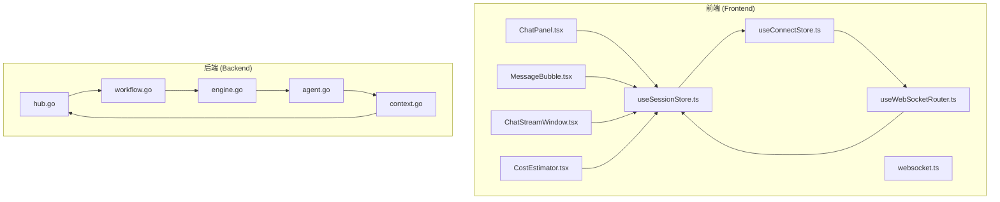
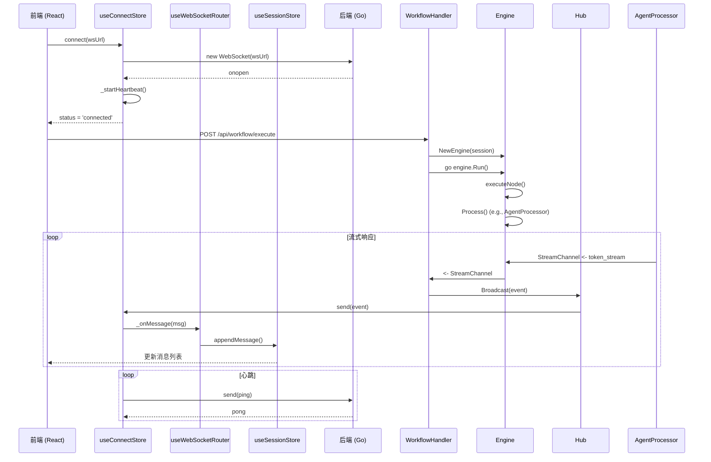
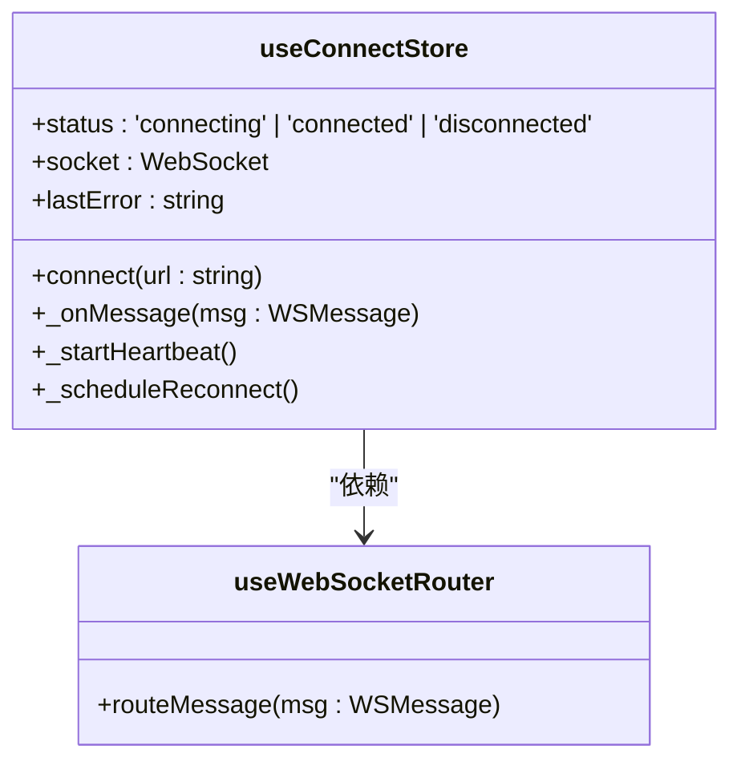
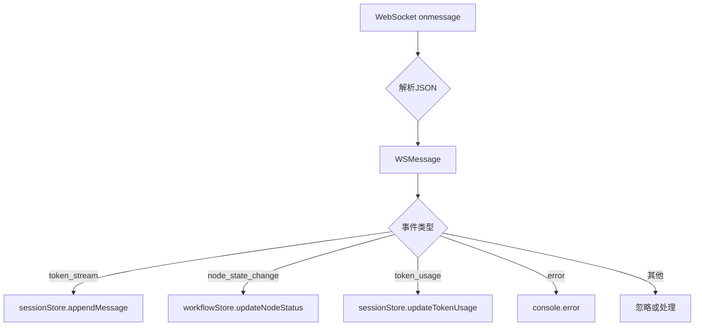
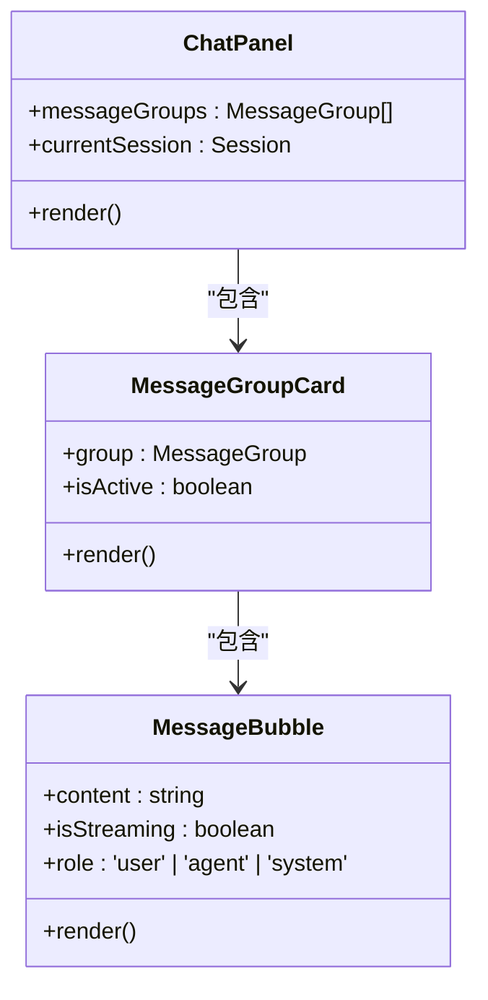

# 实时流式传输

<cite>
**本文档中引用的文件**   
- [main.go](file://cmd/council/main.go)
- [hub.go](file://internal/api/ws/hub.go)
- [useConnectStore.ts](file://frontend/src/stores/useConnectStore.ts)
- [useWebSocketRouter.ts](file://frontend/src/hooks/useWebSocketRouter.ts)
- [websocket.ts](file://frontend/src/types/websocket.ts)
- [context.go](file://internal/core/workflow/context.go)
- [engine.go](file://internal/core/workflow/engine.go)
- [agent.go](file://internal/core/workflow/nodes/agent.go)
- [workflow.go](file://internal/api/handler/workflow.go)
- [useSessionStore.ts](file://frontend/src/stores/useSessionStore.ts)
- [MessageBubble.tsx](file://frontend/src/components/chat/MessageBubble.tsx)
- [ChatPanel.tsx](file://frontend/src/components/chat/ChatPanel.tsx)
- [ChatStreamWindow.tsx](file://frontend/src/components/modules/ChatStreamWindow.tsx)
- [CostEstimator.tsx](file://frontend/src/components/modules/CostEstimator.tsx)
- [websocket-contract.spec.ts](file://e2e/tests/websocket-contract.spec.ts)
</cite>

## 目录
1. [引言](#引言)
2. [项目结构](#项目结构)
3. [核心组件](#核心组件)
4. [架构概述](#架构概述)
5. [详细组件分析](#详细组件分析)
6. [依赖分析](#依赖分析)
7. [性能考虑](#性能考虑)
8. [故障排除指南](#故障排除指南)
9. [结论](#结论)
10. [附录](#附录) (如有必要)

## 引言
本文档详细分析了“Council”项目中的实时流式传输机制。该系统通过WebSocket协议实现服务器与客户端之间的实时、双向通信，支持AI代理的流式响应、节点状态更新、成本估算等关键功能。文档将深入探讨WebSocket连接管理、消息协议设计、前后端事件处理流程以及相关UI组件的实现。

## 项目结构
项目采用典型的前后端分离架构。后端使用Go语言实现，核心流式传输逻辑位于`internal/api/ws`包中，通过`hub.go`管理WebSocket连接。工作流引擎`internal/core/workflow`负责生成实时事件。前端使用React + TypeScript构建，`frontend/src/stores`中的Zustand store负责管理WebSocket连接和消息路由，`frontend/src/components/chat`中的组件负责渲染流式内容。



**图表来源**
- [ChatPanel.tsx](file://frontend/src/components/chat/ChatPanel.tsx)
- [MessageBubble.tsx](file://frontend/src/components/chat/MessageBubble.tsx)
- [ChatStreamWindow.tsx](file://frontend/src/components/modules/ChatStreamWindow.tsx)
- [CostEstimator.tsx](file://frontend/src/components/modules/CostEstimator.tsx)
- [useSessionStore.ts](file://frontend/src/stores/useSessionStore.ts)
- [useConnectStore.ts](file://frontend/src/stores/useConnectStore.ts)
- [useWebSocketRouter.ts](file://frontend/src/hooks/useWebSocketRouter.ts)
- [websocket.ts](file://frontend/src/types/websocket.ts)
- [hub.go](file://internal/api/ws/hub.go)
- [workflow.go](file://internal/api/handler/workflow.go)
- [engine.go](file://internal/core/workflow/engine.go)
- [agent.go](file://internal/core/workflow/nodes/agent.go)
- [context.go](file://internal/core/workflow/context.go)

**章节来源**
- [hub.go](file://internal/api/ws/hub.go)
- [useConnectStore.ts](file://frontend/src/stores/useConnectStore.ts)
- [useWebSocketRouter.ts](file://frontend/src/hooks/useWebSocketRouter.ts)

## 核心组件
实时流式传输的核心是WebSocket连接的建立、维护和消息的双向传递。后端的`Hub`结构体管理所有客户端连接，并广播来自工作流引擎的`StreamEvent`。前端的`useConnectStore`负责连接的生命周期管理，包括重连和心跳机制。`useWebSocketRouter`则根据消息类型将事件分发到不同的状态更新函数，如`useSessionStore`用于更新UI状态。

**章节来源**
- [hub.go](file://internal/api/ws/hub.go#L1-L125)
- [useConnectStore.ts](file://frontend/src/stores/useConnectStore.ts#L40-L127)
- [useWebSocketRouter.ts](file://frontend/src/hooks/useWebSocketRouter.ts#L1-L182)

## 架构概述
系统采用发布-订阅模式。当工作流开始执行时，`WorkflowHandler`创建一个`Engine`实例。该引擎在执行过程中通过`StreamChannel`发送各种`StreamEvent`（如token流、节点状态变更）。`WorkflowHandler`中的goroutine监听此通道，并通过`Hub.Broadcast`将事件广播给所有连接的客户端。前端接收到消息后，由`useWebSocketRouter`根据`event`类型进行路由，最终更新相应的状态存储，触发UI重新渲染。



**图表来源**
- [hub.go](file://internal/api/ws/hub.go#L1-L125)
- [workflow.go](file://internal/api/handler/workflow.go#L52-L190)
- [engine.go](file://internal/core/workflow/engine.go#L49-L355)
- [agent.go](file://internal/core/workflow/nodes/agent.go#L30-L202)
- [useConnectStore.ts](file://frontend/src/stores/useConnectStore.ts#L40-L127)
- [useWebSocketRouter.ts](file://frontend/src/hooks/useWebSocketRouter.ts#L14-L167)
- [useSessionStore.ts](file://frontend/src/stores/useSessionStore.ts#L281-L300)

## 详细组件分析

### WebSocket 连接管理
前端使用`useConnectStore`管理WebSocket连接。`connect`方法负责建立连接，处理`onopen`、`onclose`、`onerror`和`onmessage`事件。`_startHeartbeat`方法定期发送ping命令以保持连接活跃，防止因超时而断开。`_scheduleReconnect`方法在非正常断开时尝试重连。

#### 对于API/服务组件：


**图表来源**
- [useConnectStore.ts](file://frontend/src/stores/useConnectStore.ts#L40-L127)

**章节来源**
- [useConnectStore.ts](file://frontend/src/stores/useConnectStore.ts#L40-L127)

### 消息协议与事件路由
系统定义了严格的WebSocket消息协议。所有消息都符合`WSMessage`接口，包含`event`、`data`、`timestamp`和可选的`node_id`。前端通过`useWebSocketRouter`中的`switch`语句根据`event`类型分发消息。例如，`token_stream`事件会调用`sessionStore.appendMessage`来更新UI。

#### 对于API/服务组件：


**图表来源**
- [websocket.ts](file://frontend/src/types/websocket.ts#L1-L61)
- [useWebSocketRouter.ts](file://frontend/src/hooks/useWebSocketRouter.ts#L14-L167)

**章节来源**
- [useWebSocketRouter.ts](file://frontend/src/hooks/useWebSocketRouter.ts#L14-L167)

### 流式响应处理
当AI代理生成响应时，`AgentProcessor`会通过`StreamChannel`发送`token_stream`事件。前端接收到此事件后，在`MessageGroup`中为对应的代理创建或更新一条`isStreaming`为`true`的消息。`MessageBubble`组件会为`isStreaming`的消息显示一个闪烁的光标，表示内容正在流式传输。当代理完成响应时，`node_state_change`事件将节点状态设为`completed`，触发`finalizeMessage`将`isStreaming`设为`false`。

#### 对于复杂逻辑组件：
```mermaid
flowchart TD
A[AgentProcessor.Process] --> B[provider.Stream]
B --> C{收到chunk}
C --> |content| D[StreamChannel <- token_stream]
D --> E[Hub.Broadcast]
E --> F[前端收到消息]
F --> G[useWebSocketRouter.routeMessage]
G --> H[sessionStore.appendMessage]
H --> I[MessageBubble显示光标]
C --> |完成| J[StreamChannel <- token_usage]
J --> K[...]
L[AgentProcessor完成] --> M[updateStatus(completed)]
M --> N[StreamChannel <- node_state_change]
N --> O[...]
O --> P[sessionStore.finalizeMessage]
P --> Q[MessageBubble光标消失]
```

**图表来源**
- [agent.go](file://internal/core/workflow/nodes/agent.go#L30-L202)
- [context.go](file://internal/core/workflow/context.go#L8-L14)
- [useSessionStore.ts](file://frontend/src/stores/useSessionStore.ts#L281-L300)
- [MessageBubble.tsx](file://frontend/src/components/chat/MessageBubble.tsx#L1-L125)

**章节来源**
- [agent.go](file://internal/core/workflow/nodes/agent.go#L30-L202)
- [useSessionStore.ts](file://frontend/src/stores/useSessionStore.ts#L281-L300)
- [MessageBubble.tsx](file://frontend/src/components/chat/MessageBubble.tsx#L1-L125)

### UI 组件渲染
`ChatPanel`是消息区域的容器，它订阅`useSessionStore`中的`messageGroups`并渲染`MessageGroupCard`。`MessageGroupCard`根据`node_id`和`isActive`状态决定是否显示。`MessageBubble`是实际显示消息内容的组件，它接收`content`、`isStreaming`和`role`等属性。当`isStreaming`为`true`时，它会渲染一个闪烁的光标。

#### 对于对象导向的组件：


**图表来源**
- [ChatPanel.tsx](file://frontend/src/components/chat/ChatPanel.tsx#L1-L77)
- [MessageGroupCard.tsx](file://frontend/src/components/chat/MessageGroupCard.tsx)
- [MessageBubble.tsx](file://frontend/src/components/chat/MessageBubble.tsx#L1-L125)

**章节来源**
- [ChatPanel.tsx](file://frontend/src/components/chat/ChatPanel.tsx#L1-L77)
- [MessageBubble.tsx](file://frontend/src/components/chat/MessageBubble.tsx#L1-L125)

## 依赖分析
系统依赖关系清晰。后端`internal/api/ws/hub.go`依赖`internal/core/workflow`的`StreamEvent`结构体。`internal/api/handler/workflow.go`依赖`hub.go`的`Hub`来广播消息。前端`frontend/src/hooks/useWebSocketRouter.ts`依赖`frontend/src/stores/useSessionStore.ts`和`useWorkflowRunStore.ts`来更新状态。`frontend/src/components/chat/MessageBubble.tsx`依赖`useLayoutStore`来处理布局。这些依赖通过Go的包导入和TypeScript的模块导入实现。

```mermaid
graph TD
internal/api/ws@hub.go --> internal/core/workflow@StreamEvent
internal/api/handler@workflow.go --> internal/api/ws@Hub
frontend/src/hooks@useWebSocketRouter.ts --> frontend/src/stores@useSessionStore.ts
frontend/src/hooks@useWebSocketRouter.ts --> frontend/src/stores@useWorkflowRunStore.ts
frontend/src/components/chat@MessageBubble.tsx --> frontend/src/stores@useLayoutStore.ts
```

**图表来源**
- [hub.go](file://internal/api/ws/hub.go#L1-L125)
- [workflow.go](file://internal/api/handler/workflow.go#L1-L366)
- [useWebSocketRouter.ts](file://frontend/src/hooks/useWebSocketRouter.ts#L1-L182)
- [useSessionStore.ts](file://frontend/src/stores/useSessionStore.ts)
- [useWorkflowRunStore.ts](file://frontend/src/stores/useWorkflowRunStore.ts)
- [MessageBubble.tsx](file://frontend/src/components/chat/MessageBubble.tsx#L1-L125)
- [useLayoutStore.ts](file://frontend/src/stores/useLayoutStore.ts)

**章节来源**
- [hub.go](file://internal/api/ws/hub.go#L1-L125)
- [workflow.go](file://internal/api/handler/workflow.go#L1-L366)
- [useWebSocketRouter.ts](file://frontend/src/hooks/useWebSocketRouter.ts#L1-L182)

## 性能考虑
为了保证流式传输的性能和稳定性，系统实现了多项优化。后端`Hub`使用带缓冲的`StreamChannel`（容量100）来防止因网络延迟导致的goroutine阻塞。前端`useConnectStore`实现了心跳机制（`_startHeartbeat`）和自动重连（`_scheduleReconnect`），确保长连接的可靠性。`MessageBubble`组件使用`useLayoutEffect`检查内容溢出，并提供展开/收起功能，避免渲染过长文本影响性能。此外，`useSessionStore`中的`useEffect`使用`[messageGroups, messageGroups.length]`作为依赖项，确保仅在消息列表变化时触发滚动。

## 故障排除指南
当实时流式传输出现问题时，可以按照以下步骤排查：
1.  **检查WebSocket连接**：在浏览器开发者工具的“Network”选项卡中，查看WebSocket连接是否成功建立（状态为101）。检查`onopen`事件是否被触发。
2.  **验证消息协议**：检查WebSocket消息是否符合`WSMessage`格式。使用`websocket-contract.spec.ts`中的测试用例验证`event`、`timestamp`等字段是否存在且类型正确。
3.  **检查后端事件生成**：确认`Engine`的`StreamChannel`是否有数据输出。检查`AgentProcessor`的`streamResponse`方法是否正常工作。
4.  **检查前端路由**：在`useWebSocketRouter`的`routeMessage`函数中设置断点，确认消息是否被正确路由到相应的处理函数。
5.  **查看错误日志**：检查后端日志中是否有`emitError`产生的错误，以及前端控制台是否有`Failed to parse WS message`等错误。

**章节来源**
- [websocket-contract.spec.ts](file://e2e/tests/websocket-contract.spec.ts#L55-L299)
- [hub.go](file://internal/api/ws/hub.go#L71-L73)
- [useWebSocketRouter.ts](file://frontend/src/hooks/useWebSocketRouter.ts#L67-L73)
- [useConnectStore.ts](file://frontend/src/stores/useConnectStore.ts#L63-L65)

## 结论
“Council”项目的实时流式传输系统设计精良，通过WebSocket实现了高效、可靠的实时通信。其架构清晰地分离了连接管理、消息路由和状态更新的职责。通过心跳、重连、缓冲等机制保证了系统的健壮性。前端组件能够准确地反映后端的执行状态，为用户提供流畅的实时交互体验。未来可以考虑增加消息压缩、更精细的错误处理和更丰富的流式事件类型来进一步提升用户体验。