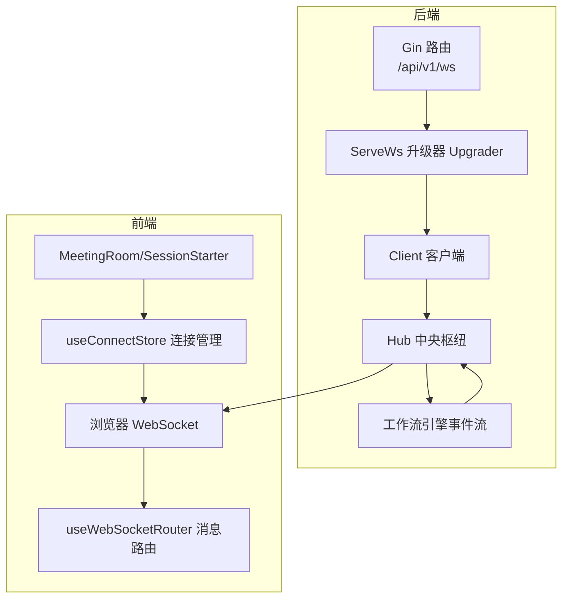
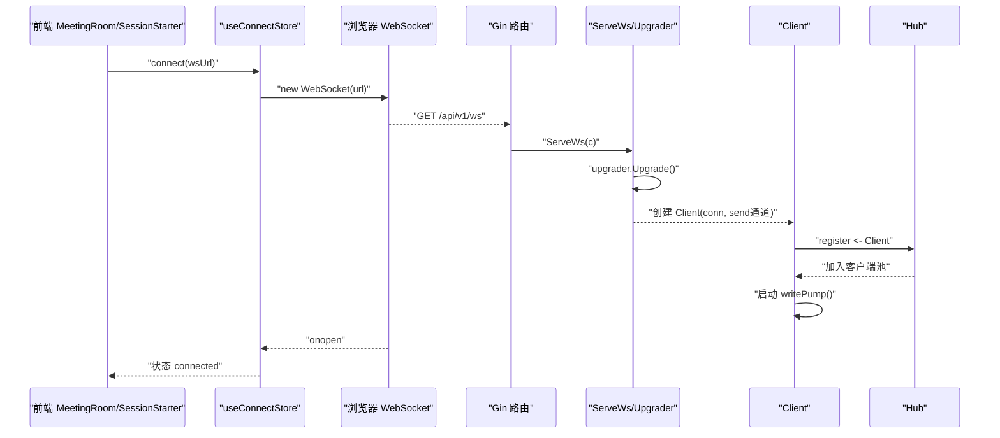
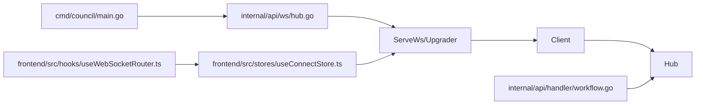

# WebSocket连接建立

<cite>
**本文引用的文件**
- [hub.go](file://internal/api/ws/hub.go)
- [main.go](file://cmd/council/main.go)
- [workflow.go](file://internal/api/handler/workflow.go)
- [useConnectStore.ts](file://frontend/src/stores/useConnectStore.ts)
- [useWebSocketRouter.ts](file://frontend/src/hooks/useWebSocketRouter.ts)
- [SPEC-703-session-ws-connect-fix.md](file://docs/specs/sprint7/SPEC-703-session-ws-connect-fix.md)
- [2025-12-21-websocket-debugging-report.md](file://docs/reports/debugging/2025-12-21-websocket-debugging-report.md)
</cite>

## 目录
1. [引言](#引言)
2. [项目结构](#项目结构)
3. [核心组件](#核心组件)
4. [架构总览](#架构总览)
5. [详细组件分析](#详细组件分析)
6. [依赖关系分析](#依赖关系分析)
7. [性能考量](#性能考量)
8. [故障排查指南](#故障排查指南)
9. [结论](#结论)

## 引言
本文件围绕“WebSocket连接建立机制”展开，系统性阐述从客户端发起连接到服务端完成注册的完整流程，包括：
- Gin路由如何通过ServeWs函数处理升级请求
- upgrader配置的跨域策略与缓冲区设置
- Client结构体初始化时创建带缓冲的send通道，并注册到Hub的客户端池
- 前端useWebSocketRouter的调用时机与消息路由
- 会议启动时的连接触发逻辑
- 连接失败处理、并发注册的互斥锁保护机制，以及Goroutine泄漏防范措施

## 项目结构
WebSocket相关代码分布在后端Go服务与前端TypeScript应用中：
- 后端
  - Gin路由注册WebSocket端点
  - WebSocket升级与Hub/Client模型
  - 工作流执行阶段向Hub广播事件
- 前端
  - 连接状态管理与心跳重连
  - WebSocket消息路由与UI更新

图表来源
- [main.go](file://cmd/council/main.go#L98-L100)
- [hub.go](file://internal/api/ws/hub.go#L14-L19)
- [hub.go](file://internal/api/ws/hub.go#L109-L124)
- [workflow.go](file://internal/api/handler/workflow.go#L102-L112)
- [useConnectStore.ts](file://frontend/src/stores/useConnectStore.ts#L40-L77)
- [useWebSocketRouter.ts](file://frontend/src/hooks/useWebSocketRouter.ts#L1-L126)

章节来源
- [main.go](file://cmd/council/main.go#L98-L100)
- [hub.go](file://internal/api/ws/hub.go#L14-L19)
- [hub.go](file://internal/api/ws/hub.go#L109-L124)
- [workflow.go](file://internal/api/handler/workflow.go#L102-L112)
- [useConnectStore.ts](file://frontend/src/stores/useConnectStore.ts#L40-L77)
- [useWebSocketRouter.ts](file://frontend/src/hooks/useWebSocketRouter.ts#L1-L126)

## 核心组件
- Upgrader与跨域策略
  - 读写缓冲区均为1024字节
  - CheckOrigin允许所有来源（开发环境）
- Hub与Client
  - Hub维护活跃客户端集合，提供注册/注销/广播
  - Client持有连接与带缓冲send通道，负责写泵
- ServeWs
  - 将HTTP升级为WebSocket，创建Client并注册到Hub，启动写泵
- 前端连接与路由
  - useConnectStore管理连接生命周期、心跳与重连
  - useWebSocketRouter根据事件类型驱动UI状态

章节来源
- [hub.go](file://internal/api/ws/hub.go#L14-L19)
- [hub.go](file://internal/api/ws/hub.go#L21-L36)
- [hub.go](file://internal/api/ws/hub.go#L75-L80)
- [hub.go](file://internal/api/ws/hub.go#L109-L124)
- [useConnectStore.ts](file://frontend/src/stores/useConnectStore.ts#L40-L77)
- [useWebSocketRouter.ts](file://frontend/src/hooks/useWebSocketRouter.ts#L1-L126)

## 架构总览
下图展示从客户端发起连接到服务端完成注册的关键交互序列。

图表来源
- [main.go](file://cmd/council/main.go#L98-L100)
- [hub.go](file://internal/api/ws/hub.go#L109-L124)
- [useConnectStore.ts](file://frontend/src/stores/useConnectStore.ts#L40-L77)

## 详细组件分析

### Gin路由与ServeWs升级流程
- 路由注册
  - 后端在根路由下挂载/ws路径，实际使用/api/v1/ws作为WebSocket端点
- ServeWs处理
  - 通过upgrader.Upgrade完成HTTP到WebSocket的协议升级
  - 升级失败时记录错误并返回
  - 创建Client实例，包含连接对象与带缓冲send通道（容量256）
  - 将Client发送到Hub.register通道以注册到Hub
  - 启动Client.writePump协程，持续从send通道读取并写入WebSocket

章节来源
- [main.go](file://cmd/council/main.go#L98-L100)
- [hub.go](file://internal/api/ws/hub.go#L109-L124)

### Upgrader配置与缓冲区
- ReadBufferSize/WriteBufferSize
  - 读写缓冲区均为1024字节，满足典型文本消息传输需求
- CheckOrigin
  - 开发环境允许所有来源，便于本地联调；生产环境建议限制来源以增强安全

章节来源
- [hub.go](file://internal/api/ws/hub.go#L14-L19)

### Client结构体与写泵
- Client字段
  - hub：指向Hub指针
  - conn：底层WebSocket连接
  - send：带缓冲通道，容量256，用于背压与异步发送
- writePump
  - 循环从send通道读取事件
  - 使用NextWriter写入TextMessage
  - JSON编码事件并关闭writer
  - 若通道关闭或写入错误，关闭连接并退出

章节来源
- [hub.go](file://internal/api/ws/hub.go#L75-L80)
- [hub.go](file://internal/api/ws/hub.go#L82-L107)

### Hub运行与并发注册
- Hub.Run
  - select监听register/unregister/broadcast三类通道
  - 注册：加锁后将Client加入clients映射
  - 注销：加锁后删除Client并关闭其send通道
  - 广播：加锁遍历clients，尝试向每个Client.send发送事件；若阻塞则关闭该Client.send并移除
- 互斥锁保护
  - 对clients集合与广播发送过程加锁，避免并发读写冲突

章节来源
- [hub.go](file://internal/api/ws/hub.go#L39-L68)

### 工作流执行到WebSocket广播
- WorkflowHandler.Execute
  - 启动工作流执行的Goroutine
  - 从引擎的StreamChannel读取事件，附加session_id后通过Hub.Broadcast广播
  - 关闭StreamChannel后结束

章节来源
- [workflow.go](file://internal/api/handler/workflow.go#L90-L118)

### 前端连接与消息路由
- useConnectStore.connect
  - 若当前socket处于OPEN状态则直接返回，防止重复连接导致的资源泄漏
  - 建立WebSocket连接，设置onopen/onclose/onerror/onmessage回调
  - onopen后启动心跳定时器
  - onclose中清理心跳定时器，必要时调度重连
  - onmessage解析JSON并写入_store._lastMessage，供useWebSocketRouter订阅
- useWebSocketRouter
  - 订阅_connectStore._lastMessage，按事件类型分派到会话与工作流状态管理
  - 支持token_stream、node_state_change、token_usage等事件

章节来源
- [useConnectStore.ts](file://frontend/src/stores/useConnectStore.ts#L40-L77)
- [useConnectStore.ts](file://frontend/src/stores/useConnectStore.ts#L116-L124)
- [useWebSocketRouter.ts](file://frontend/src/hooks/useWebSocketRouter.ts#L1-L126)

### 会议启动时的连接触发逻辑
- 问题背景
  - 在Meeting启动流程中，SessionStarter成功调用后端API后，曾未主动调用useConnectStore.connect()建立WebSocket连接，导致ChatPanel无消息显示
- 修复方案
  - 在SessionStarter成功初始化会话后，立即调用connect(wsUrl)建立连接
  - 在MeetingRoom中增加连接状态检查，若存在会话且连接断开则自动重连
- URL构建
  - 使用window.location动态拼接ws/wss协议与主机地址，确保不同环境一致

章节来源
- [SPEC-703-session-ws-connect-fix.md](file://docs/specs/sprint7/SPEC-703-session-ws-connect-fix.md#L1-L196)

### 连接失败处理与重连
- 前端
  - onerror记录lastError
  - onclose非干净关闭时触发_scheduleReconnect，按指数退避延迟重连，最多5次
  - 心跳定时器在onopen启动，在onclose清理
- 后端
  - ServeWs升级失败时记录日志并返回
  - Hub在广播阻塞时自动清理阻塞Client，避免内存泄漏

章节来源
- [useConnectStore.ts](file://frontend/src/stores/useConnectStore.ts#L40-L77)
- [useConnectStore.ts](file://frontend/src/stores/useConnectStore.ts#L101-L114)
- [useConnectStore.ts](file://frontend/src/stores/useConnectStore.ts#L116-L124)
- [hub.go](file://internal/api/ws/hub.go#L111-L115)
- [hub.go](file://internal/api/ws/hub.go#L55-L66)

### 并发注册的互斥锁保护
- Hub.clients集合访问均在加锁范围内
- register/unregister/broadcast三类操作分别在select分支中加锁，避免竞态
- 广播时对每个Client.send发送前先加锁，发送后释放

章节来源
- [hub.go](file://internal/api/ws/hub.go#L39-L68)

### Goroutine泄漏防范
- 后端
  - Client.writePump在通道关闭或写入错误时主动关闭连接并退出
  - Hub在注销时关闭Client.send，避免写阻塞导致协程泄漏
- 前端
  - useConnectStore.connect在已连接状态下直接返回，避免重复创建WebSocket实例
  - onclose清理心跳定时器与重连定时器，防止定时器泄漏

章节来源
- [hub.go](file://internal/api/ws/hub.go#L82-L107)
- [hub.go](file://internal/api/ws/hub.go#L47-L54)
- [useConnectStore.ts](file://frontend/src/stores/useConnectStore.ts#L40-L77)
- [useConnectStore.ts](file://frontend/src/stores/useConnectStore.ts#L79-L86)

## 依赖关系分析
- 后端依赖链
  - main.go注册路由并创建Hub，启动Hub.Run
  - ServeWs依赖Upgrader完成升级并创建Client
  - Hub.Run依赖clients集合与互斥锁
  - WorkflowHandler.Execute通过Hub.Broadcast向所有Client推送事件
- 前端依赖链
  - MeetingRoom/SessionStarter依赖useConnectStore.connect建立连接
  - useConnectStore依赖浏览器WebSocket API
  - useWebSocketRouter依赖_connectStore订阅_lastMessage并更新UI

图表来源
- [main.go](file://cmd/council/main.go#L98-L100)
- [hub.go](file://internal/api/ws/hub.go#L109-L124)
- [workflow.go](file://internal/api/handler/workflow.go#L102-L112)
- [useConnectStore.ts](file://frontend/src/stores/useConnectStore.ts#L40-L77)
- [useWebSocketRouter.ts](file://frontend/src/hooks/useWebSocketRouter.ts#L1-L126)

## 性能考量
- 缓冲区设置
  - Upgrader读写缓冲区为1024字节，适合文本消息；如需传输大块数据可适当增大
- 发送通道容量
  - Client.send通道容量256，可在上游事件速率较高时缓解瞬时压力
- 广播背压
  - Hub在广播时对每个Client.send采用非阻塞发送，若阻塞则清理该Client，避免广播风暴
- 心跳与重连
  - 前端心跳周期30秒，重连采用指数退避，降低服务器压力

[本节为通用指导，不直接分析具体文件]

## 故障排查指南
- WebSocket消息静默丢失
  - 根因：后端事件字段名与前端期望不一致
  - 修复：调整后端事件字段名为event，前端对应解析
- 会议启动后无消息
  - 根因：前端未在启动后调用connect建立连接
  - 修复：在SessionStarter成功初始化会话后调用connect；在MeetingRoom中检测并自动重连
- 连接频繁失败
  - 检查前端onerror与onclose日志，确认是否触发重连
  - 确认URL协议与主机地址正确（ws/wss）

章节来源
- [2025-12-21-websocket-debugging-report.md](file://docs/reports/debugging/2025-12-21-websocket-debugging-report.md#L1-L40)
- [SPEC-703-session-ws-connect-fix.md](file://docs/specs/sprint7/SPEC-703-session-ws-connect-fix.md#L1-L196)

## 结论
本文梳理了从客户端发起连接到服务端完成注册的完整流程，明确了：
- Gin路由通过ServeWs与Upgrader完成协议升级
- Client初始化时创建带缓冲send通道并注册到Hub
- Hub通过互斥锁保护并发注册与广播
- 前端通过useConnectStore与useWebSocketRouter实现连接生命周期管理与消息路由
- 会议启动时的连接触发逻辑已在规范中明确修复
- 连接失败处理、心跳重连与Goroutine泄漏防范措施均已具备