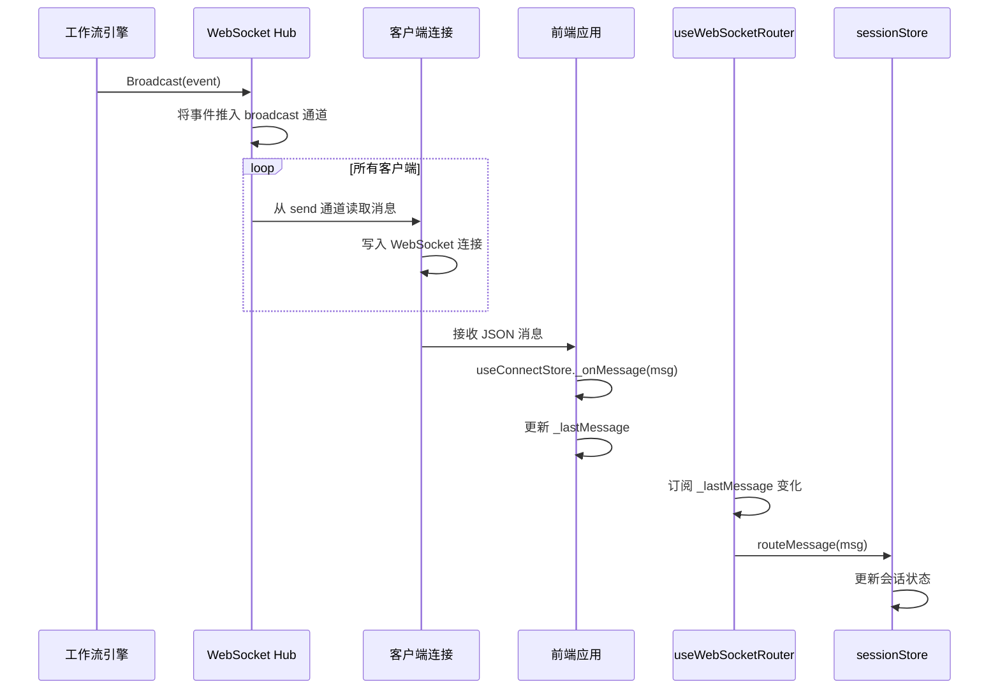
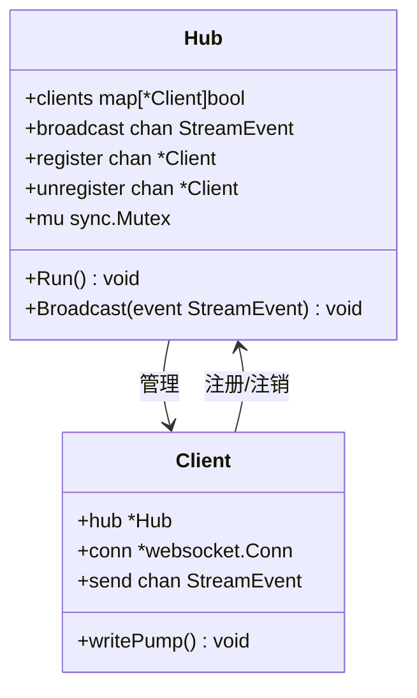
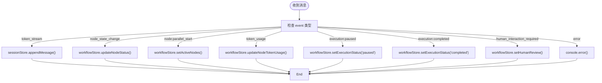
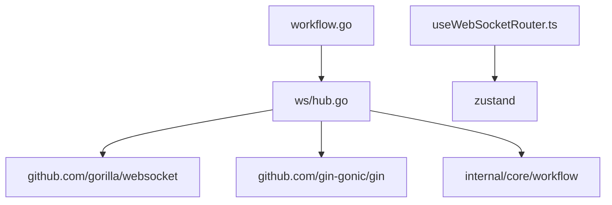

# 实时通信协议

<cite>
**本文档引用的文件**  
- [hub.go](file://internal/api/ws/hub.go)
- [useWebSocketRouter.ts](file://frontend/src/hooks/useWebSocketRouter.ts)
- [useConnectStore.ts](file://frontend/src/stores/useConnectStore.ts)
- [websocket.ts](file://frontend/src/types/websocket.ts)
- [main.go](file://cmd/council/main.go)
- [workflow.go](file://internal/api/handler/workflow.go)
- [session.go](file://internal/core/workflow/session.go)
- [engine.go](file://internal/core/workflow/engine.go)
- [SPEC-005-websocket-optimization.md](file://docs/specs/sprint1/SPEC-005-websocket-optimization.md)
- [2025-12-21-websocket-debugging-report.md](file://docs/reports/debugging/2025-12-21-websocket-debugging-report.md)
</cite>

## 目录
1. [引言](#引言)
2. [项目结构](#项目结构)
3. [核心组件](#核心组件)
4. [架构概述](#架构概述)
5. [详细组件分析](#详细组件分析)
6. [依赖分析](#依赖分析)
7. [性能考虑](#性能考虑)
8. [故障排除指南](#故障排除指南)
9. [结论](#结论)

## 引言
The Council 系统采用 WebSocket 协议实现前后端之间的实时通信，支持工作流执行过程中的动态状态更新、流式内容传输和用户交互反馈。本协议文档深入解析了基于 Go 语言的 WebSocket 服务端实现机制，以及前端 React 应用中的消息路由与连接管理策略。系统通过 Hub 结构体集中管理客户端连接池，利用广播通道实现高效的消息分发，并结合前端的 useWebSocketRouter 钩子完成不同类型事件的订阅与路由。

## 项目结构
The Council 项目的实时通信功能主要分布在后端 `internal/api/ws` 目录和前端 `frontend/src/hooks` 与 `frontend/src/stores` 目录中。后端使用 Gorilla WebSocket 库处理连接升级与消息传输，前端则通过 Zustand 状态管理库维护 WebSocket 连接状态并实现消息订阅机制。

```mermaid
graph TB
subgraph "后端 (Go)"
A[main.go] --> B[ws/hub.go]
B --> C[Client]
B --> D[Hub]
E[workflow.go] --> B
end
subgraph "前端 (TypeScript)"
F[useConnectStore.ts] --> G[WebSocket]
H[useWebSocketRouter.ts] --> I[消息路由]
F --> H
end
D < --> G
```

**图示来源**  
- [main.go](file://cmd/council/main.go#L71-L73)
- [hub.go](file://internal/api/ws/hub.go#L21-L27)
- [useConnectStore.ts](file://frontend/src/stores/useConnectStore.ts#L5-L10)

**本节来源**  
- [main.go](file://cmd/council/main.go#L71-L73)
- [hub.go](file://internal/api/ws/hub.go#L21-L27)
- [useConnectStore.ts](file://frontend/src/stores/useConnectStore.ts#L5-L10)

## 核心组件
The Council 系统的实时通信核心由后端的 `Hub` 和 `Client` 结构体，以及前端的 `useConnectStore` 和 `useWebSocketRouter` 钩子构成。`Hub` 负责管理所有活跃的客户端连接，并通过广播通道将工作流事件分发给所有订阅者。`Client` 作为 WebSocket 连接与 `Hub` 之间的中间人，通过 `send` 通道接收消息并写入连接。前端通过 `useWebSocketRouter` 钩子订阅来自 `useConnectStore` 的最新消息，并根据事件类型进行路由处理。

**本节来源**  
- [hub.go](file://internal/api/ws/hub.go#L21-L80)
- [useWebSocketRouter.ts](file://frontend/src/hooks/useWebSocketRouter.ts#L13-L112)
- [useConnectStore.ts](file://frontend/src/stores/useConnectStore.ts#L5-L21)

## 架构概述
The Council 系统的实时通信架构采用经典的发布-订阅模式。后端 `Hub` 作为消息中心，接收来自工作流引擎的事件流，并将其广播给所有注册的客户端。每个客户端连接被封装为 `Client` 实例，通过独立的 `writePump` 协程将消息写入 WebSocket 连接。前端应用通过 `useConnectStore` 建立和维护 WebSocket 连接，并将接收到的原始消息通过 Zustand 的订阅机制传递给 `useWebSocketRouter`，后者根据事件类型更新相应的状态存储（如 `sessionStore` 和 `workflowStore`）。



**图示来源**  
- [hub.go](file://internal/api/ws/hub.go#L70-L73)
- [workflow.go](file://internal/api/handler/workflow.go#L109-L111)
- [useConnectStore.ts](file://frontend/src/stores/useConnectStore.ts#L97-L99)
- [useWebSocketRouter.ts](file://frontend/src/hooks/useWebSocketRouter.ts#L115-L119)

## 详细组件分析

### Hub 与 Client 结构体分析
后端 `Hub` 结构体是实时通信的核心，它维护了一个 `clients` 映射来跟踪所有活跃的客户端连接，并通过 `register`、`unregister` 和 `broadcast` 三个通道实现线程安全的连接管理与消息广播。`Client` 结构体则代表一个具体的 WebSocket 连接，包含指向其所属 `Hub` 的指针、`*websocket.Conn` 连接对象和一个缓冲的 `send` 通道。当 `Hub` 收到广播事件时，它会遍历所有客户端，并尝试将消息发送到各自的 `send` 通道。如果发送失败（例如通道已满），则关闭该客户端连接并从 `clients` 映射中移除。



**图示来源**  
- [hub.go](file://internal/api/ws/hub.go#L21-L35)
- [hub.go](file://internal/api/ws/hub.go#L75-L80)

**本节来源**  
- [hub.go](file://internal/api/ws/hub.go#L21-L80)

### 前端消息路由分析
前端的 `useWebSocketRouter` 钩子是消息处理的中枢。它通过 `useConnectStore.subscribe` 订阅 `_lastMessage` 状态的变化，每当有新的 WebSocket 消息到达时，`routeMessage` 回调函数就会被触发。该函数使用 `switch` 语句根据消息的 `event` 类型进行路由，将不同类型的数据更新到相应的状态存储中。例如，`token_stream` 事件会调用 `sessionStore.appendMessage` 来追加流式生成的文本，而 `node_state_change` 事件则会同时更新 `workflowStore` 和 `sessionStore` 中的节点状态。



**图示来源**  
- [useWebSocketRouter.ts](file://frontend/src/hooks/useWebSocketRouter.ts#L17-L111)

**本节来源**  
- [useWebSocketRouter.ts](file://frontend/src/hooks/useWebSocketRouter.ts#L13-L112)
- [websocket.ts](file://frontend/src/types/websocket.ts#L1-L52)

## 依赖分析
The Council 系统的实时通信模块依赖于多个外部库和内部组件。后端依赖 `github.com/gorilla/websocket` 处理底层 WebSocket 协议，依赖 `github.com/gin-gonic/gin` 提供 HTTP 路由以升级连接。`Hub` 与 `workflow` 包紧密耦合，`WorkflowHandler` 持有 `Hub` 的引用，以便在工作流执行时将事件广播出去。前端依赖 `zustand` 进行状态管理，并通过 `subscribeWithSelector` 中间件实现细粒度的状态订阅。



**图示来源**  
- [hub.go](file://internal/api/ws/hub.go#L9-L11)
- [main.go](file://cmd/council/main.go#L8-L10)
- [workflow.go](file://internal/api/handler/workflow.go#L37-L41)

**本节来源**  
- [hub.go](file://internal/api/ws/hub.go#L9-L11)
- [main.go](file://cmd/council/main.go#L8-L10)
- [workflow.go](file://internal/api/handler/workflow.go#L37-L41)

## 性能考虑
系统在设计时考虑了实时通信的性能和稳定性。`Hub` 的 `broadcast` 通道和每个 `Client` 的 `send` 通道都设置了缓冲区，以避免因单个客户端响应缓慢而阻塞整个广播过程。前端实现了心跳机制（`_startHeartbeat`），每隔 30 秒发送一次 `ping` 命令，以保持连接活跃并检测网络故障。同时，系统实现了断线重连逻辑，当连接意外关闭时，客户端会按照指数退避策略尝试重新连接，最多重试 5 次。

## 故障排除指南
根据历史调试报告，最常见的问题是前后端消息格式不匹配。例如，在 v0.15.0 版本之前，后端 `StreamEvent` 结构体的 JSON tag 为 `type`，而前端期望的是 `event`，这导致消息被静默丢弃。此类问题可通过检查后端日志和前端控制台的解析错误来诊断。对于连接问题，应检查 `useConnectStore` 的状态（`disconnected`, `connecting`, `connected`）和 `lastError` 信息，并确认 WebSocket URL 是否正确。

**本节来源**  
- [2025-12-21-websocket-debugging-report.md](file://docs/reports/debugging/2025-12-21-websocket-debugging-report.md#L18-L40)
- [useConnectStore.ts](file://frontend/src/stores/useConnectStore.ts#L7-L9)

## 结论
The Council 系统的实时通信协议设计合理，通过 `Hub` 和 `Client` 模型实现了高效、可扩展的消息广播。结合前端的 Zustand 状态管理和精细化的消息路由，系统能够为用户提供流畅、实时的工作流执行体验。未来可考虑增加对上行命令（如 `start_session`）的支持，并优化连接管理以支持更复杂的会话恢复场景。