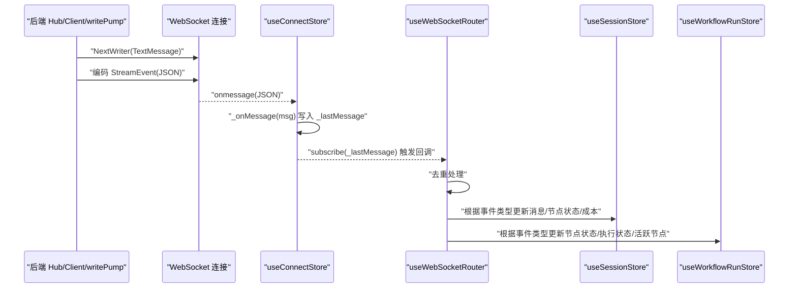
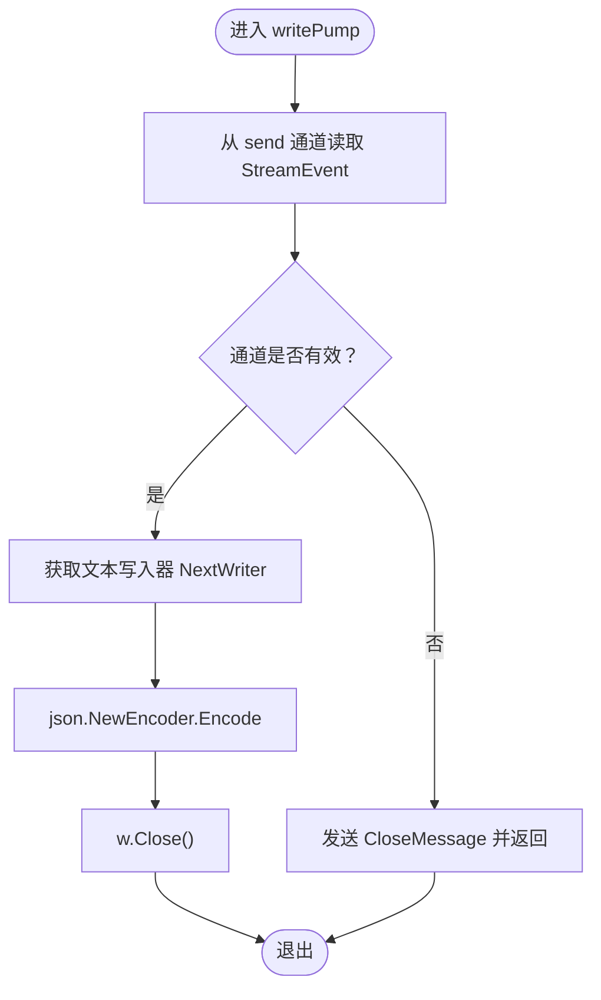
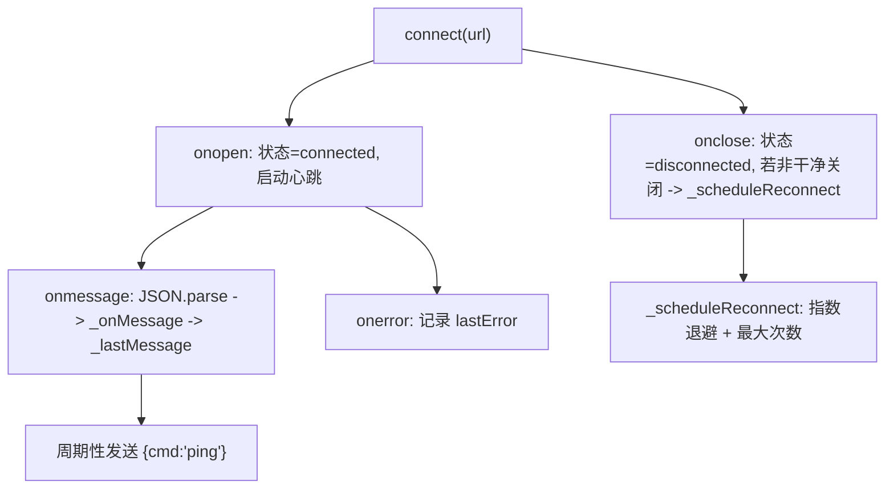
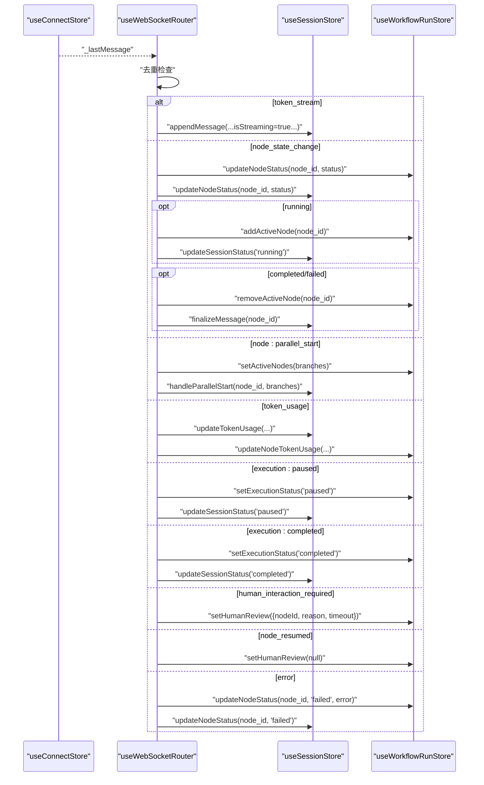
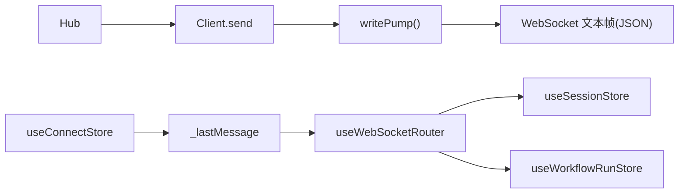

# 客户端消息处理

<cite>
**本文引用的文件**
- [internal/api/ws/hub.go](file://internal/api/ws/hub.go)
- [internal/core/workflow/nodes/agent.go](file://internal/core/workflow/nodes/agent.go)
- [internal/core/workflow/nodes/human_review_test.go](file://internal/core/workflow/nodes/human_review_test.go)
- [frontend/src/stores/useConnectStore.ts](file://frontend/src/stores/useConnectStore.ts)
- [frontend/src/hooks/useWebSocketRouter.ts](file://frontend/src/hooks/useWebSocketRouter.ts)
- [frontend/src/types/websocket.ts](file://frontend/src/types/websocket.ts)
- [frontend/src/stores/useSessionStore.ts](file://frontend/src/stores/useSessionStore.ts)
- [frontend/src/stores/useWorkflowRunStore.ts](file://frontend/src/stores/useWorkflowRunStore.ts)
- [docs/specs/sprint1/SPEC-005-websocket-optimization.md](file://docs/specs/sprint1/SPEC-005-websocket-optimization.md)
- [docs/reports/debugging/2025-12-21-websocket-debugging-report.md](file://docs/reports/debugging/2025-12-21-websocket-debugging-report.md)
- [docs/specs/sprint7/SPEC-703-session-ws-connect-fix.md](file://docs/specs/sprint7/SPEC-703-session-ws-connect-fix.md)
</cite>

## 目录
1. [引言](#引言)
2. [项目结构](#项目结构)
3. [核心组件](#核心组件)
4. [架构总览](#架构总览)
5. [详细组件分析](#详细组件分析)
6. [依赖关系分析](#依赖关系分析)
7. [性能考量](#性能考量)
8. [故障排查指南](#故障排查指南)
9. [结论](#结论)

## 引言
本文围绕“客户端消息处理的双向机制”展开，系统阐述后端通过 WebSocket Hub 的 writePump 如何从 send 通道读取 StreamEvent 并写入连接，以及前端通过 useWebSocketRouter 基于 Zustand 的 useConnectStore 订阅_lastMessage 实现事件路由分发。重点覆盖以下事件类型及其 UI 状态更新路径：token_stream、node_state_change、node:parallel_start、token_usage、execution:paused、execution:completed、error、human_interaction_required、node_resumed。同时给出错误处理、重连机制与消息顺序保证的最佳实践建议。

## 项目结构
- 后端 WebSocket Hub 位于 internal/api/ws，负责升级连接、维护客户端集合、广播事件、以及写泵 writePump 的实现。
- 前端 WebSocket 连接与消息路由位于 frontend/src，包括 useConnectStore（连接管理）、useWebSocketRouter（消息路由）及若干类型定义。
- 事件类型与数据结构定义集中在前端 types/websocket.ts，确保前后端协议一致。

```mermaid
graph TB
subgraph "后端"
Hub["Hub<br/>维护客户端集合与广播"]
Client["Client<br/>持有 send 通道"]
WritePump["writePump()<br/>从 send 读取并写入连接"]
end
subgraph "前端"
ConnStore["useConnectStore<br/>连接/心跳/重连/_lastMessage"]
Router["useWebSocketRouter<br/>订阅_lastMessage并路由"]
SessionStore["useSessionStore<br/>消息流/节点状态/成本"]
WorkflowStore["useWorkflowRunStore<br/>节点状态/画布/执行状态"]
end
Hub --> Client
Client --> WritePump
ConnStore <- --> Router
Router --> SessionStore
Router --> WorkflowStore
```

图表来源
- [internal/api/ws/hub.go](file://internal/api/ws/hub.go#L70-L124)
- [frontend/src/stores/useConnectStore.ts](file://frontend/src/stores/useConnectStore.ts#L1-L128)
- [frontend/src/hooks/useWebSocketRouter.ts](file://frontend/src/hooks/useWebSocketRouter.ts#L1-L126)
- [frontend/src/stores/useSessionStore.ts](file://frontend/src/stores/useSessionStore.ts#L60-L259)
- [frontend/src/stores/useWorkflowRunStore.ts](file://frontend/src/stores/useWorkflowRunStore.ts#L120-L301)

章节来源
- [internal/api/ws/hub.go](file://internal/api/ws/hub.go#L1-L125)
- [frontend/src/stores/useConnectStore.ts](file://frontend/src/stores/useConnectStore.ts#L1-L128)
- [frontend/src/hooks/useWebSocketRouter.ts](file://frontend/src/hooks/useWebSocketRouter.ts#L1-L126)
- [frontend/src/types/websocket.ts](file://frontend/src/types/websocket.ts#L1-L52)

## 核心组件
- 后端 writePump：从 Client.send 通道读取 StreamEvent，通过 NextWriter 写入 WebSocket 文本帧，编码失败或写入失败即返回，从而触发连接关闭与清理。
- 前端 useConnectStore：封装 WebSocket 生命周期、心跳、重连、消息解析与_lastMessage存储，供路由层订阅。
- 前端 useWebSocketRouter：订阅_lastMessage，去重处理，按事件类型分发至 useSessionStore 与 useWorkflowRunStore。
- 事件类型定义：WSMessage.event 与各事件数据结构，确保前后端协议一致性。

章节来源
- [internal/api/ws/hub.go](file://internal/api/ws/hub.go#L82-L107)
- [frontend/src/stores/useConnectStore.ts](file://frontend/src/stores/useConnectStore.ts#L40-L124)
- [frontend/src/hooks/useWebSocketRouter.ts](file://frontend/src/hooks/useWebSocketRouter.ts#L1-L126)
- [frontend/src/types/websocket.ts](file://frontend/src/types/websocket.ts#L1-L52)

## 架构总览
后端以 Hub 为中心，Client 持有 send 通道，writePump 循环消费 send 并写入连接；前端以 useConnectStore 管理连接与消息，useWebSocketRouter 作为统一路由中枢，将事件分发到会话与工作流两个状态域。



图表来源
- [internal/api/ws/hub.go](file://internal/api/ws/hub.go#L82-L107)
- [frontend/src/stores/useConnectStore.ts](file://frontend/src/stores/useConnectStore.ts#L67-L99)
- [frontend/src/hooks/useWebSocketRouter.ts](file://frontend/src/hooks/useWebSocketRouter.ts#L113-L125)
- [frontend/src/stores/useSessionStore.ts](file://frontend/src/stores/useSessionStore.ts#L172-L234)
- [frontend/src/stores/useWorkflowRunStore.ts](file://frontend/src/stores/useWorkflowRunStore.ts#L149-L188)

## 详细组件分析

### 后端 writePump：从 send 通道读取并写入 WebSocket
- 通道读取：循环从 Client.send 读取 StreamEvent，若通道关闭则发送 CloseMessage 并返回。
- 写入流程：通过 conn.NextWriter 获取文本写入器，使用 json.NewEncoder 编码消息，随后 w.Close。
- 异常处理：当 NextWriter、编码或 w.Close 失败时立即返回，导致连接被关闭，避免阻塞。



图表来源
- [internal/api/ws/hub.go](file://internal/api/ws/hub.go#L82-L107)

章节来源
- [internal/api/ws/hub.go](file://internal/api/ws/hub.go#L82-L107)

### 前端 useConnectStore：连接管理、心跳与重连
- 连接生命周期：connect 创建 WebSocket，onopen 更新状态并启动心跳；onclose 若非干净关闭则调度重连；onerror 记录 lastError；onmessage 解析 JSON 并写入 _lastMessage。
- 心跳：定时发送 ping 命令，维持连接活性。
- 重连：指数退避延迟，最多尝试固定次数，超过上限记录 lastError。



图表来源
- [frontend/src/stores/useConnectStore.ts](file://frontend/src/stores/useConnectStore.ts#L40-L124)
- [docs/specs/sprint1/SPEC-005-websocket-optimization.md](file://docs/specs/sprint1/SPEC-005-websocket-optimization.md#L107-L204)

章节来源
- [frontend/src/stores/useConnectStore.ts](file://frontend/src/stores/useConnectStore.ts#L1-L128)
- [docs/specs/sprint1/SPEC-005-websocket-optimization.md](file://docs/specs/sprint1/SPEC-005-websocket-optimization.md#L107-L204)

### 前端 useWebSocketRouter：基于 Zustand 的事件路由
- 订阅_lastMessage：使用 subscribeWithSelector 订阅 _lastMessage，避免全局广播导致的不必要重渲染。
- 去重策略：使用消息 event+timestamp 组合生成唯一键，防止重复处理。
- 事件路由：根据事件类型分发到 useSessionStore 与 useWorkflowRunStore，更新消息流、节点状态、执行状态、活跃节点、成本统计等。



图表来源
- [frontend/src/hooks/useWebSocketRouter.ts](file://frontend/src/hooks/useWebSocketRouter.ts#L1-L126)
- [frontend/src/stores/useSessionStore.ts](file://frontend/src/stores/useSessionStore.ts#L145-L234)
- [frontend/src/stores/useWorkflowRunStore.ts](file://frontend/src/stores/useWorkflowRunStore.ts#L149-L188)

章节来源
- [frontend/src/hooks/useWebSocketRouter.ts](file://frontend/src/hooks/useWebSocketRouter.ts#L1-L126)
- [frontend/src/stores/useSessionStore.ts](file://frontend/src/stores/useSessionStore.ts#L60-L259)
- [frontend/src/stores/useWorkflowRunStore.ts](file://frontend/src/stores/useWorkflowRunStore.ts#L120-L301)

### 事件类型与 UI 状态更新逻辑

- token_stream
  - 前端：useSessionStore.appendMessage 追加流式片段，合并同节点同 Agent 的流式消息，最终标记为非流式。
  - 后端：Agent 节点在流式输出时持续发送 token_stream 事件，结束时发送 node_state_change completed。
  章节来源
  - [frontend/src/stores/useSessionStore.ts](file://frontend/src/stores/useSessionStore.ts#L172-L234)
  - [internal/core/workflow/nodes/agent.go](file://internal/core/workflow/nodes/agent.go#L80-L124)

- node_state_change
  - 前端：useWorkflowRunStore.updateNodeStatus 更新节点状态；running 时 addActiveNode，completed/failed 时 removeActiveNode 并 finalizeMessage。
  - 后端：Agent 节点在开始与完成时分别发送 pending/running/completed。
  章节来源
  - [frontend/src/stores/useWorkflowRunStore.ts](file://frontend/src/stores/useWorkflowRunStore.ts#L149-L188)
  - [frontend/src/stores/useSessionStore.ts](file://frontend/src/stores/useSessionStore.ts#L225-L234)
  - [internal/core/workflow/nodes/agent.go](file://internal/core/workflow/nodes/agent.go#L80-L124)

- node:parallel_start
  - 前端：useWorkflowRunStore.setActiveNodes 与 useSessionStore.handleParallelStart 启动并行分支。
  章节来源
  - [frontend/src/hooks/useWebSocketRouter.ts](file://frontend/src/hooks/useWebSocketRouter.ts#L48-L52)

- token_usage
  - 前端：useSessionStore.updateTokenUsage 与 useWorkflowRunStore.updateNodeTokenUsage 累计输入/输出/成本。
  章节来源
  - [frontend/src/stores/useSessionStore.ts](file://frontend/src/stores/useSessionStore.ts#L236-L259)
  - [frontend/src/stores/useWorkflowRunStore.ts](file://frontend/src/stores/useWorkflowRunStore.ts#L180-L188)

- execution:paused / execution:completed
  - 前端：useWorkflowRunStore.setExecutionStatus 与 useSessionStore.updateSessionStatus 更新会话与画布执行状态。
  章节来源
  - [frontend/src/hooks/useWebSocketRouter.ts](file://frontend/src/hooks/useWebSocketRouter.ts#L70-L78)

- error
  - 前端：useWorkflowRunStore.updateNodeStatus('failed', error) 与 useSessionStore.updateNodeStatus('failed') 记录错误。
  章节来源
  - [frontend/src/hooks/useWebSocketRouter.ts](file://frontend/src/hooks/useWebSocketRouter.ts#L97-L109)

- human_interaction_required / node_resumed
  - 前端：useWorkflowRunStore.setHumanReview 与清空人类审核状态。
  章节来源
  - [frontend/src/hooks/useWebSocketRouter.ts](file://frontend/src/hooks/useWebSocketRouter.ts#L80-L95)
  - [internal/core/workflow/nodes/human_review_test.go](file://internal/core/workflow/nodes/human_review_test.go#L1-L42)

## 依赖关系分析
- 后端 Hub 与 Client 之间通过 send 通道解耦，writePump 仅关注写入。
- 前端 useConnectStore 仅负责连接与消息存储，useWebSocketRouter 通过订阅 _lastMessage 与状态域解耦。
- 事件类型定义集中于 types/websocket.ts，确保前后端协议一致，避免字段命名差异导致的静默丢失。



图表来源
- [internal/api/ws/hub.go](file://internal/api/ws/hub.go#L70-L107)
- [frontend/src/stores/useConnectStore.ts](file://frontend/src/stores/useConnectStore.ts#L67-L99)
- [frontend/src/hooks/useWebSocketRouter.ts](file://frontend/src/hooks/useWebSocketRouter.ts#L113-L125)

章节来源
- [internal/api/ws/hub.go](file://internal/api/ws/hub.go#L70-L124)
- [frontend/src/stores/useConnectStore.ts](file://frontend/src/stores/useConnectStore.ts#L1-L128)
- [frontend/src/hooks/useWebSocketRouter.ts](file://frontend/src/hooks/useWebSocketRouter.ts#L1-L126)

## 性能考量
- 写泵背压：Client.send 使用带缓冲的通道，合理设置容量以平衡吞吐与内存占用。
- 心跳与重连：心跳周期与重连延迟需权衡网络波动与资源消耗。
- 去重与选择器：useWebSocketRouter 使用 subscribeWithSelector 与去重集合，减少不必要的渲染与重复处理。
- 流式消息合并：useSessionStore 对同节点同 Agent 的流式消息进行合并，降低 UI 重绘频率。

章节来源
- [internal/api/ws/hub.go](file://internal/api/ws/hub.go#L117-L124)
- [frontend/src/stores/useConnectStore.ts](file://frontend/src/stores/useConnectStore.ts#L116-L124)
- [frontend/src/hooks/useWebSocketRouter.ts](file://frontend/src/hooks/useWebSocketRouter.ts#L1-L126)
- [frontend/src/stores/useSessionStore.ts](file://frontend/src/stores/useSessionStore.ts#L172-L234)

## 故障排查指南
- 消息静默丢失
  - 根因：前后端字段命名不一致（后端 type vs 前端 event），导致前端无法识别事件。
  - 修复：统一字段名为 event，确保 JSON 解析成功。
  章节来源
  - [docs/reports/debugging/2025-12-21-websocket-debugging-report.md](file://docs/reports/debugging/2025-12-21-websocket-debugging-report.md#L1-L40)

- ID 不一致
  - 根因：事件 data 中 node_id 使用了 Agent UUID 而非节点 ID。
  - 修复：改为使用节点逻辑 ID，确保前端 UI 与后端节点一致。
  章节来源
  - [docs/reports/debugging/2025-12-21-websocket-debugging-report.md](file://docs/reports/debugging/2025-12-21-websocket-debugging-report.md#L55-L90)

- 自动重连与连接状态
  - 场景：页面刷新或会话存在但 WS 断开时自动重连。
  - 实现：MeetingRoom 页面监听 currentSession 与 wsStatus，满足条件时调用 connect。
  章节来源
  - [docs/specs/sprint7/SPEC-703-session-ws-connect-fix.md](file://docs/specs/sprint7/SPEC-703-session-ws-connect-fix.md#L134-L181)

- 事件路由与去重
  - 现象：重复消息导致 UI 闪烁或状态异常。
  - 处理：useWebSocketRouter 使用消息 event+timestamp 去重，避免重复处理。
  章节来源
  - [frontend/src/hooks/useWebSocketRouter.ts](file://frontend/src/hooks/useWebSocketRouter.ts#L113-L125)

## 结论
该双向消息处理机制通过后端 Hub 的 writePump 与前端 useConnectStore 的统一连接管理，结合 useWebSocketRouter 的事件路由与去重策略，实现了稳定、可扩展的实时通信。针对不同事件类型，分别更新会话消息流与工作流节点状态，辅以心跳与重连保障连接可靠性。建议持续完善类型同步与测试覆盖，确保协议一致性与端到端行为正确。