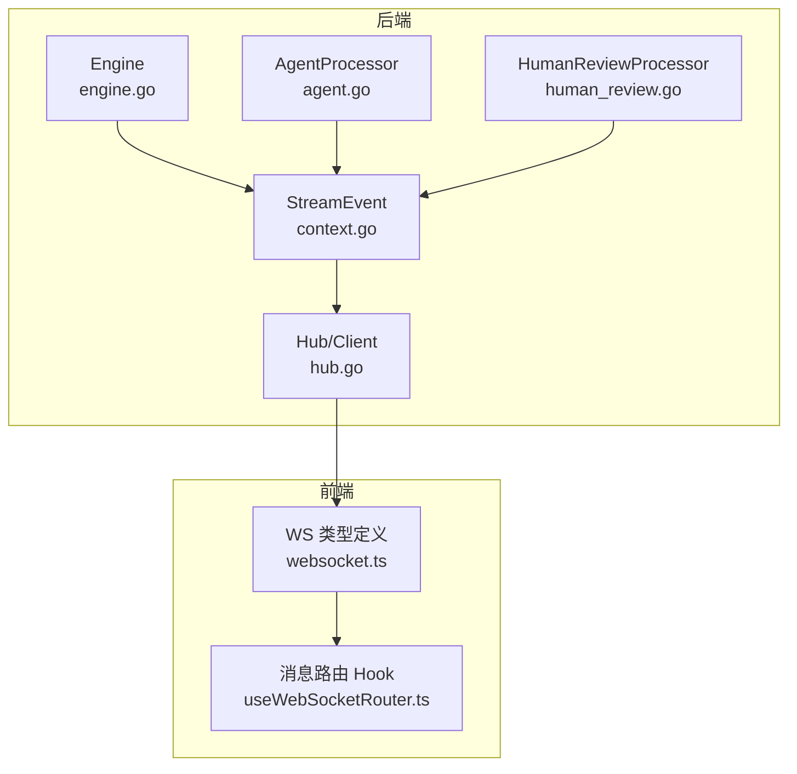
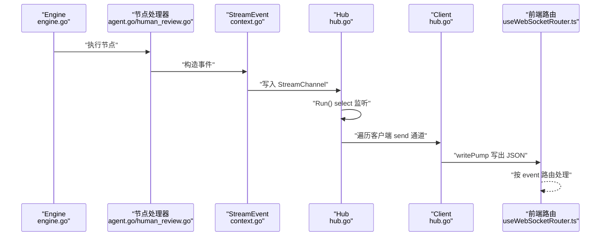
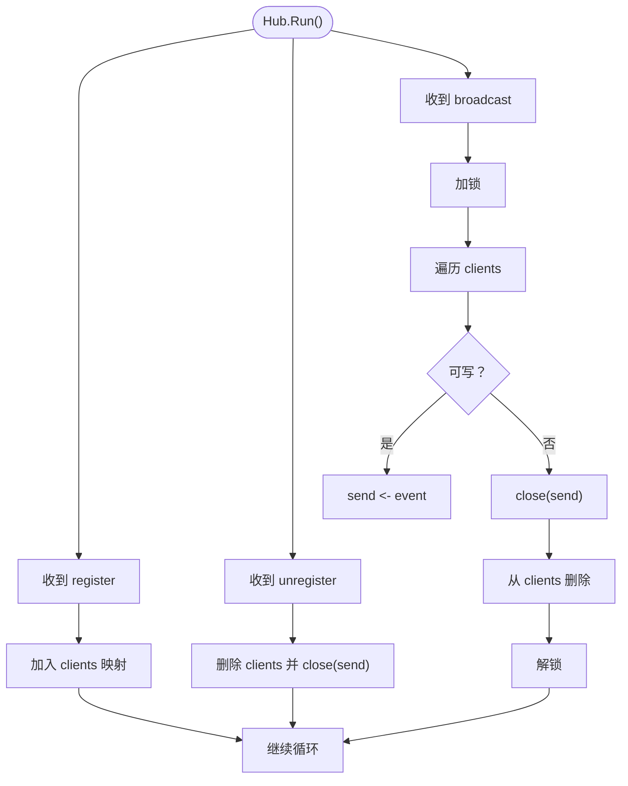
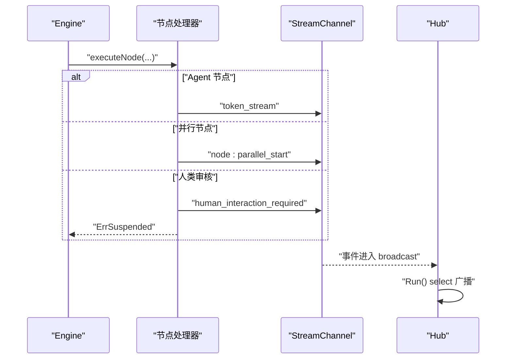
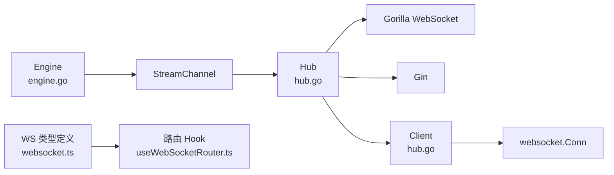

# 消息广播机制

<cite>
**本文引用的文件列表**
- [hub.go](file://internal/api/ws/hub.go)
- [engine.go](file://internal/core/workflow/engine.go)
- [context.go](file://internal/core/workflow/context.go)
- [agent.go](file://internal/core/workflow/nodes/agent.go)
- [human_review.go](file://internal/core/workflow/nodes/human_review.go)
- [websocket.ts](file://frontend/src/types/websocket.ts)
- [useWebSocketRouter.ts](file://frontend/src/hooks/useWebSocketRouter.ts)
- [SPEC-005-websocket-optimization.md](file://docs/specs/sprint1/SPEC-005-websocket-optimization.md)
- [2025-12-21-websocket-debugging-report.md](file://docs/reports/debugging/2025-12-21-websocket-debugging-report.md)
</cite>

## 目录
1. [引言](#引言)
2. [项目结构](#项目结构)
3. [核心组件](#核心组件)
4. [架构总览](#架构总览)
5. [详细组件分析](#详细组件分析)
6. [依赖关系分析](#依赖关系分析)
7. [性能考量](#性能考量)
8. [故障排查指南](#故障排查指南)
9. [结论](#结论)

## 引言
本文件围绕 WebSocket 消息广播机制展开，系统性解析 Hub 结构体中的 broadcast 通道如何接收来自工作流引擎的 StreamEvent 事件；Run 方法中的 select 监听循环如何将消息分发给所有活跃客户端；当 send 通道阻塞时（default 分支）的优雅处理策略（关闭连接并从客户端池中移除）；并结合工作流执行过程中 engine.go 触发事件的代码路径，说明不同类型事件（如 token_stream、node_state_change）的生成时机。最后给出性能优化建议，包括广播通道缓冲区大小调优与大规模连接下的分片广播策略。

## 项目结构
WebSocket 广播相关的核心代码分布在后端 Go 与前端 TS 两端：
- 后端
  - Hub/Client：负责 WebSocket 连接管理与广播分发
  - Engine：工作流引擎，向 StreamChannel 发送事件
  - StreamEvent：事件载体
  - Agent/HumanReview 节点处理器：具体事件的生成点
- 前端
  - WebSocket 类型与路由：定义事件类型、数据结构与路由逻辑

图表来源
- [engine.go](file://internal/core/workflow/engine.go#L1-L246)
- [context.go](file://internal/core/workflow/context.go#L1-L36)
- [hub.go](file://internal/api/ws/hub.go#L1-L125)
- [agent.go](file://internal/core/workflow/nodes/agent.go#L1-L130)
- [human_review.go](file://internal/core/workflow/nodes/human_review.go#L1-L47)
- [websocket.ts](file://frontend/src/types/websocket.ts#L1-L51)
- [useWebSocketRouter.ts](file://frontend/src/hooks/useWebSocketRouter.ts#L210-L319)

章节来源
- [hub.go](file://internal/api/ws/hub.go#L1-L125)
- [engine.go](file://internal/core/workflow/engine.go#L1-L246)
- [context.go](file://internal/core/workflow/context.go#L1-L36)
- [agent.go](file://internal/core/workflow/nodes/agent.go#L1-L130)
- [human_review.go](file://internal/core/workflow/nodes/human_review.go#L1-L47)
- [websocket.ts](file://frontend/src/types/websocket.ts#L1-L51)
- [useWebSocketRouter.ts](file://frontend/src/hooks/useWebSocketRouter.ts#L210-L319)

## 核心组件
- Hub：维护活跃客户端集合，持有三个通道（broadcast/register/unregister），Run 循环统一调度
- Client：每个 WebSocket 连接的“中间人”，持有 send 通道，writePump 负责出站写入
- Engine：工作流执行器，内部维护 StreamChannel，并在关键节点发出事件
- StreamEvent：事件载体，包含 event、timestamp、node_id、data 等字段
- 节点处理器：Agent/HumanReview 等在执行过程中向 StreamChannel 发送事件
- 前端类型与路由：定义事件类型枚举、数据结构与消息路由逻辑

章节来源
- [hub.go](file://internal/api/ws/hub.go#L21-L125)
- [engine.go](file://internal/core/workflow/engine.go#L1-L246)
- [context.go](file://internal/core/workflow/context.go#L1-L36)
- [agent.go](file://internal/core/workflow/nodes/agent.go#L1-L130)
- [human_review.go](file://internal/core/workflow/nodes/human_review.go#L1-L47)
- [websocket.ts](file://frontend/src/types/websocket.ts#L1-L51)
- [useWebSocketRouter.ts](file://frontend/src/hooks/useWebSocketRouter.ts#L210-L319)

## 架构总览
后端通过 Hub 将 Engine/HumanReview/Agent 等产生的 StreamEvent 广播至所有活跃客户端；前端通过路由 Hook 对不同事件进行差异化处理，驱动 UI 状态更新。

图表来源
- [engine.go](file://internal/core/workflow/engine.go#L1-L246)
- [agent.go](file://internal/core/workflow/nodes/agent.go#L1-L130)
- [human_review.go](file://internal/core/workflow/nodes/human_review.go#L1-L47)
- [context.go](file://internal/core/workflow/context.go#L1-L36)
- [hub.go](file://internal/api/ws/hub.go#L39-L124)
- [useWebSocketRouter.ts](file://frontend/src/hooks/useWebSocketRouter.ts#L210-L319)

## 详细组件分析

### Hub 与 Client：广播与分发
- Hub 结构体
  - clients：活跃客户端映射
  - broadcast/register/unregister：三类通道，分别用于广播、注册、注销
  - mu：互斥锁保护 clients
- Run 循环
  - register：加入客户端
  - unregister：删除客户端并关闭其 send 通道
  - broadcast：遍历 clients，尝试向每个客户端 send 通道发送事件；若阻塞（default），则关闭该客户端 send 通道并从 clients 中移除，避免 goroutine 泄漏与资源占用
- Client
  - send 通道容量为 256，作为背压缓冲
  - writePump 循环从 send 读取事件并写出，若通道关闭或写入错误则关闭底层连接

图表来源
- [hub.go](file://internal/api/ws/hub.go#L39-L124)

章节来源
- [hub.go](file://internal/api/ws/hub.go#L21-L125)

### Engine：事件生成与传播
- Engine 维护 StreamChannel，容量为 100，作为事件缓冲
- 执行流程中：
  - 节点开始/结束：发出 node_state_change
  - Agent 节点流式输出：发出 token_stream
  - 人类审核节点：发出 human_interaction_required，并返回 ErrSuspended 以暂停执行
  - 并行节点开始：发出 node:parallel_start
  - 执行暂停/恢复：发出 execution:paused 或 execution:completed
  - 错误：发出 error
- 事件均通过 StreamChannel 发送，Hub 的 Run 循环从 broadcast 通道接收并广播

图表来源
- [engine.go](file://internal/core/workflow/engine.go#L1-L246)
- [agent.go](file://internal/core/workflow/nodes/agent.go#L1-L130)
- [human_review.go](file://internal/core/workflow/nodes/human_review.go#L1-L47)

章节来源
- [engine.go](file://internal/core/workflow/engine.go#L1-L246)
- [agent.go](file://internal/core/workflow/nodes/agent.go#L1-L130)
- [human_review.go](file://internal/core/workflow/nodes/human_review.go#L1-L47)

### StreamEvent：事件载体与前后端契约
- 后端 StreamEvent 字段：event、timestamp、node_id、data
- 前端 WSMessage 字段：event、data、timestamp、node_id
- 历史问题：后端曾使用 "type" 字段，前端期望 "event"，导致消息静默丢失；修复后统一为 "event"

章节来源
- [context.go](file://internal/core/workflow/context.go#L1-L36)
- [websocket.ts](file://frontend/src/types/websocket.ts#L1-L51)
- [2025-12-21-websocket-debugging-report.md](file://docs/reports/debugging/2025-12-21-websocket-debugging-report.md#L1-L109)

### 前端路由：事件类型与 UI 更新
- 事件类型枚举：token_stream、node_state_change、node:parallel_start、token_usage、execution:paused、execution:completed、error、human_interaction_required、node_resumed
- 路由逻辑：根据 event 分派到不同处理器，更新会话与工作流运行状态

章节来源
- [websocket.ts](file://frontend/src/types/websocket.ts#L1-L51)
- [useWebSocketRouter.ts](file://frontend/src/hooks/useWebSocketRouter.ts#L210-L319)

## 依赖关系分析
- Hub 依赖 Gorilla WebSocket 与 Gin，负责升级 HTTP 到 WebSocket 并管理客户端
- Engine 依赖节点工厂与中间件，节点处理器通过 StreamChannel 与 Engine 解耦
- StreamEvent 是跨进程边界的数据契约，前后端约定一致
- 前端路由依赖事件类型枚举与数据结构，确保 UI 状态与事件一一对应

图表来源
- [hub.go](file://internal/api/ws/hub.go#L1-L125)
- [engine.go](file://internal/core/workflow/engine.go#L1-L246)
- [websocket.ts](file://frontend/src/types/websocket.ts#L1-L51)
- [useWebSocketRouter.ts](file://frontend/src/hooks/useWebSocketRouter.ts#L210-L319)

章节来源
- [hub.go](file://internal/api/ws/hub.go#L1-L125)
- [engine.go](file://internal/core/workflow/engine.go#L1-L246)
- [websocket.ts](file://frontend/src/types/websocket.ts#L1-L51)
- [useWebSocketRouter.ts](file://frontend/src/hooks/useWebSocketRouter.ts#L210-L319)

## 性能考量
- 广播通道缓冲区大小调优
  - Hub 的 broadcast 通道为无缓冲通道，事件生产者（Engine/节点处理器）与 Hub.Run 的消费者之间存在强耦合。建议：
    - 将 Hub.broadcast 改为带缓冲通道，缓冲大小依据峰值并发与平均事件速率估算
    - 为 Hub.broadcast 设置合理的上限，避免在高负载下阻塞生产者
- 客户端 send 通道缓冲区
  - 当前为 256，适合一般场景；在高吞吐或弱网环境下可适当增大，但需权衡内存占用
- 分片广播策略（大规模连接）
  - 当连接数达到数千级别时，单 Hub 的线性遍历与逐个 send 会成为瓶颈
  - 推荐方案：
    - 按会话/房间分片：将客户端按会话 ID 哈希到多个 Hub 实例，降低单实例压力
    - 使用分区队列：将事件按目标会话分区投递，减少不必要的广播
    - 限速与背压：对慢客户端实施限速或降级，必要时主动断开
- 选择器优化
  - Hub.Run 的 select 仅处理三类事件，保持简单高效；可在事件聚合阶段引入批处理，减少锁竞争
- 前端连接健康
  - 建议启用心跳与重连策略（已在前端实现），并为 Hub 增加心跳检测（例如 ping/pong），及时发现半开连接

[本节为通用性能建议，不直接分析具体文件，故不附“章节来源”]

## 故障排查指南
- 消息静默丢失
  - 症状：后端发送正常，前端无响应
  - 根因：后端字段名为 "type"，前端期望 "event"
  - 处理：统一为 "event" 字段，确保前后端一致
- 客户端未被及时移除
  - 症状：连接断开后 Hub 仍持有客户端
  - 根因：当前 Hub 仅在 send 通道阻塞时关闭并移除；未实现 readPump 检测 EOF
  - 处理：在 Client 增加 readPump，检测 EOF 或错误时触发注销；或在 Hub 中增加心跳/超时检测
- 广播阻塞导致资源泄漏
  - 症状：大量慢客户端导致 Hub.Run 阻塞
  - 根因：Hub.Run 的 default 分支已处理阻塞并移除客户端，但仍可能造成 goroutine 积压
  - 处理：为 Hub.broadcast 增加缓冲；限制最大客户端数量；对慢客户端降级或断开

章节来源
- [2025-12-21-websocket-debugging-report.md](file://docs/reports/debugging/2025-12-21-websocket-debugging-report.md#L1-L109)
- [hub.go](file://internal/api/ws/hub.go#L39-L124)
- [SPEC-005-websocket-optimization.md](file://docs/specs/sprint1/SPEC-005-websocket-optimization.md#L107-L208)

## 结论
- Hub 的广播模型简洁高效：通过 Hub.broadcast 接收事件，Run 循环统一分发至所有活跃客户端；default 分支优雅处理阻塞，避免资源泄漏
- Engine 与节点处理器通过 StreamChannel 与 Hub 解耦，事件类型丰富且覆盖工作流全生命周期
- 前后端通过统一的事件字段契约（event/timestamp/node_id/data）协同，前端路由按事件类型驱动 UI
- 面向大规模连接，建议引入分片广播、缓冲区调优与心跳/超时检测等优化手段，持续提升稳定性与吞吐