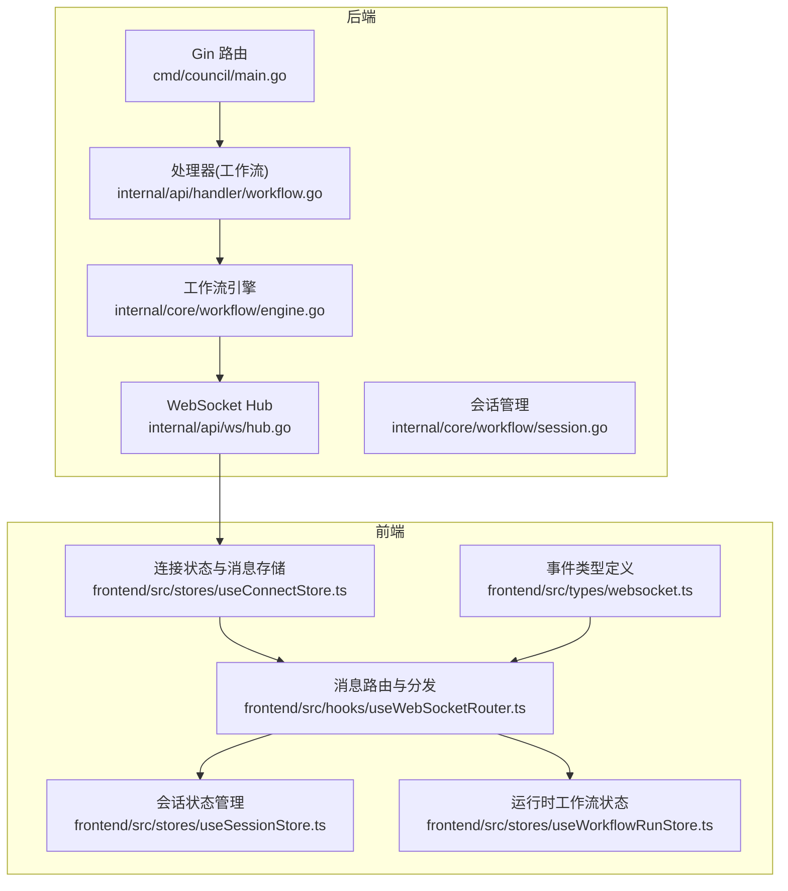
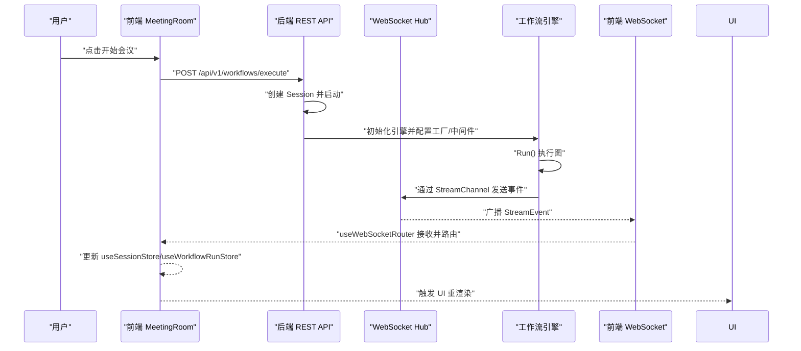
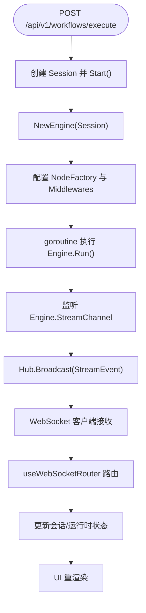
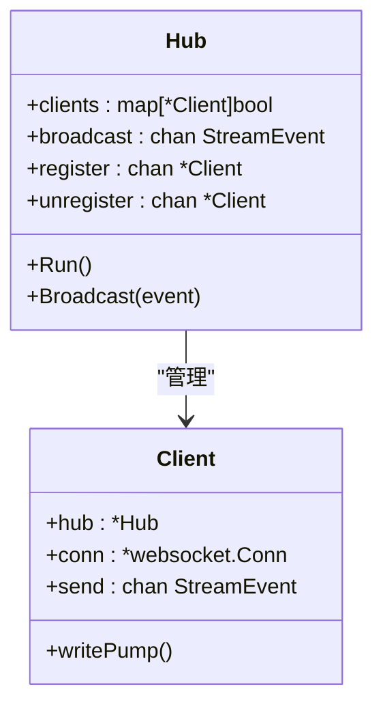
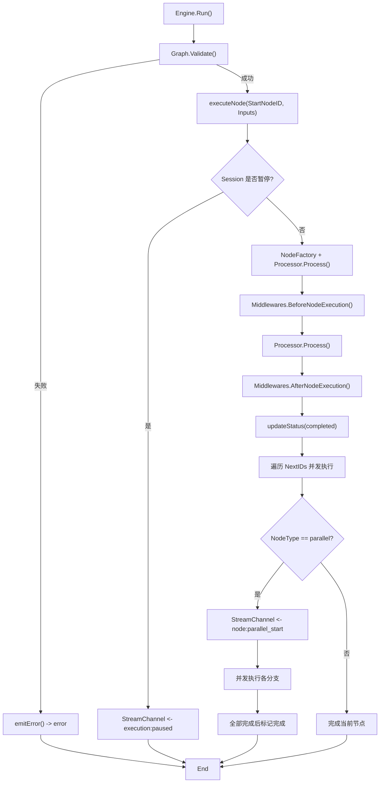
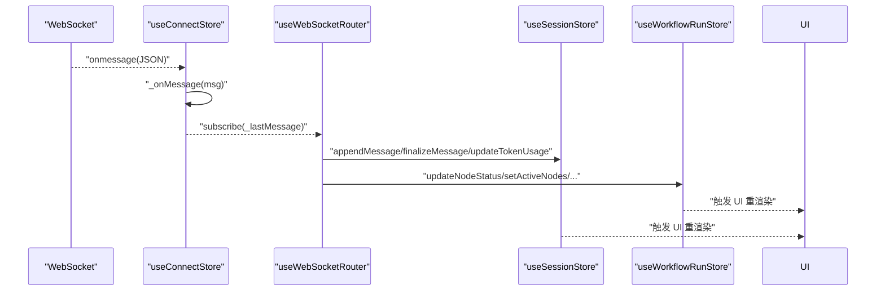
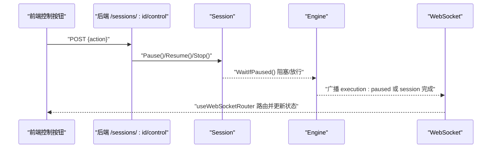
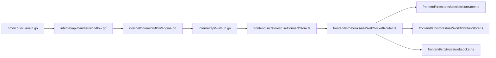

# 数据流与通信

<cite>
**本文引用的文件**
- [main.go](file://cmd/council/main.go)
- [hub.go](file://internal/api/ws/hub.go)
- [engine.go](file://internal/core/workflow/engine.go)
- [context.go](file://internal/core/workflow/context.go)
- [session.go](file://internal/core/workflow/session.go)
- [workflow.go](file://internal/api/handler/workflow.go)
- [websocket.ts](file://frontend/src/types/websocket.ts)
- [useWebSocketRouter.ts](file://frontend/src/hooks/useWebSocketRouter.ts)
- [useWorkflowEvents.ts](file://frontend/src/hooks/useWorkflowEvents.ts)
- [useConnectStore.ts](file://frontend/src/stores/useConnectStore.ts)
- [useSessionStore.ts](file://frontend/src/stores/useSessionStore.ts)
- [useWorkflowRunStore.ts](file://frontend/src/stores/useWorkflowRunStore.ts)
- [SPEC-005-websocket-optimization.md](file://docs/specs/sprint1/SPEC-005-websocket-optimization.md)
- [2025-12-21-websocket-debugging-report.md](file://docs/reports/debugging/2025-12-21-websocket-debugging-report.md)
</cite>

## 目录
1. [简介](#简介)
2. [项目结构](#项目结构)
3. [核心组件](#核心组件)
4. [架构总览](#架构总览)
5. [详细组件分析](#详细组件分析)
6. [依赖关系分析](#依赖关系分析)
7. [性能考量](#性能考量)
8. [故障排查指南](#故障排查指南)
9. [结论](#结论)

## 简介
本文围绕 The Council 系统的数据流与通信展开，聚焦“开始会议”到“工作流执行”的全链路：REST API 如何创建会话与启动工作流引擎，WebSocket 如何建立并广播事件，前端如何接收并驱动 UI 重渲染。重点梳理 StreamEvent 事件类型（如 node:start、node:complete、error、execution:paused 等）在前后端之间的传递机制，以及状态更新、错误处理与会话恢复的数据流路径。

## 项目结构
系统采用前后端分离架构：
- 后端基于 Gin 提供 REST API，WebSocket Hub 负责事件广播。
- 前端使用 Zustand 管理状态，通过 WebSocket 连接与后端交互，使用 Hook 路由消息并驱动 UI。

图表来源
- [main.go](file://cmd/council/main.go#L98-L148)
- [hub.go](file://internal/api/ws/hub.go#L1-L125)
- [engine.go](file://internal/core/workflow/engine.go#L1-L246)
- [session.go](file://internal/core/workflow/session.go#L1-L165)
- [workflow.go](file://internal/api/handler/workflow.go#L58-L123)
- [useConnectStore.ts](file://frontend/src/stores/useConnectStore.ts#L1-L127)
- [useWebSocketRouter.ts](file://frontend/src/hooks/useWebSocketRouter.ts#L1-L126)
- [useSessionStore.ts](file://frontend/src/stores/useSessionStore.ts#L1-L332)
- [useWorkflowRunStore.ts](file://frontend/src/stores/useWorkflowRunStore.ts#L1-L301)
- [websocket.ts](file://frontend/src/types/websocket.ts#L1-L52)

章节来源
- [main.go](file://cmd/council/main.go#L98-L148)
- [SPEC-005-websocket-optimization.md](file://docs/specs/sprint1/SPEC-005-websocket-optimization.md#L36-L106)

## 核心组件
- REST API 会话与执行入口：POST /api/v1/workflows/execute 创建会话并启动引擎；控制接口 /sessions/:id/control 与 /sessions/:id/review 支持暂停/恢复/终止与人工审核。
- WebSocket Hub：统一维护客户端连接，广播工作流事件。
- 工作流引擎：负责节点执行、中间件、并发分支、暂停/恢复、错误上报。
- 前端连接与路由：useConnectStore 建立连接与心跳；useWebSocketRouter 路由事件并更新状态；useSessionStore/useWorkflowRunStore 驱动 UI。

章节来源
- [workflow.go](file://internal/api/handler/workflow.go#L58-L123)
- [hub.go](file://internal/api/ws/hub.go#L1-L125)
- [engine.go](file://internal/core/workflow/engine.go#L1-L246)
- [useConnectStore.ts](file://frontend/src/stores/useConnectStore.ts#L1-L127)
- [useWebSocketRouter.ts](file://frontend/src/hooks/useWebSocketRouter.ts#L1-L126)
- [useSessionStore.ts](file://frontend/src/stores/useSessionStore.ts#L1-L332)
- [useWorkflowRunStore.ts](file://frontend/src/stores/useWorkflowRunStore.ts#L1-L301)

## 架构总览
从“开始会议”到“实时数据推送”的端到端流程如下：

图表来源
- [workflow.go](file://internal/api/handler/workflow.go#L58-L123)
- [engine.go](file://internal/core/workflow/engine.go#L40-L139)
- [hub.go](file://internal/api/ws/hub.go#L1-L125)
- [useWebSocketRouter.ts](file://frontend/src/hooks/useWebSocketRouter.ts#L1-L126)
- [useSessionStore.ts](file://frontend/src/stores/useSessionStore.ts#L1-L332)
- [useWorkflowRunStore.ts](file://frontend/src/stores/useWorkflowRunStore.ts#L1-L301)

## 详细组件分析

### REST API：会话创建与工作流启动
- 入口：POST /api/v1/workflows/execute
  - 解析请求体包含图定义与输入参数，创建 Session 并启动。
  - 初始化引擎，注入节点工厂与中间件（熔断、事实核查、内存持久化）。
  - 启动 goroutine 执行引擎，同时监听 StreamChannel 并广播至 Hub。
  - 返回 202，包含 session_id 与状态。
- 控制与恢复：
  - /sessions/:id/control：支持 pause/resume/stop，内部通过 Session 的上下文与通道实现暂停/恢复/停止。
  - /sessions/:id/review：人工审核节点恢复，构造输出并调用引擎 ResumeNode。

图表来源
- [workflow.go](file://internal/api/handler/workflow.go#L58-L123)
- [engine.go](file://internal/core/workflow/engine.go#L40-L139)
- [hub.go](file://internal/api/ws/hub.go#L1-L125)
- [useWebSocketRouter.ts](file://frontend/src/hooks/useWebSocketRouter.ts#L1-L126)

章节来源
- [workflow.go](file://internal/api/handler/workflow.go#L58-L123)
- [session.go](file://internal/core/workflow/session.go#L51-L108)

### WebSocket Hub：连接管理与事件广播
- Hub 维护客户端集合，提供 register/unregister/broadcast。
- ServeWs 升级 HTTP 请求为 WebSocket，注册客户端并启动写泵协程。
- 事件以 JSON 文本消息形式发送，字段包含 event、timestamp、node_id、data。

图表来源
- [hub.go](file://internal/api/ws/hub.go#L1-L125)

章节来源
- [hub.go](file://internal/api/ws/hub.go#L1-L125)

### 工作流引擎：事件生成与状态流转
- Engine.Run() 从起始节点开始执行，支持并行分支、中间件前后置钩子、暂停/恢复、错误上报。
- 事件类型包括：
  - node:parallel_start：并行开始
  - execution:paused：会话暂停
  - error：节点错误
  - node_resumed：节点恢复
  - execution:completed：执行完成
- 引擎通过 StreamChannel 发出事件，处理器将其广播到前端。

图表来源
- [engine.go](file://internal/core/workflow/engine.go#L40-L159)
- [engine.go](file://internal/core/workflow/engine.go#L173-L182)
- [engine.go](file://internal/core/workflow/engine.go#L184-L245)

章节来源
- [engine.go](file://internal/core/workflow/engine.go#L40-L159)
- [engine.go](file://internal/core/workflow/engine.go#L173-L182)
- [engine.go](file://internal/core/workflow/engine.go#L184-L245)

### StreamEvent 事件类型与传递机制
- 事件结构：event（字符串）、timestamp（时间戳）、node_id（可选）、data（对象）。
- 事件类型（前端路由已覆盖）：
  - token_stream：流式输出片段
  - node_state_change：节点状态变更（pending/running/completed/failed）
  - node:parallel_start：并行分支开始
  - token_usage：Token 使用统计
  - execution:paused：执行暂停
  - execution:completed：执行完成
  - error：错误
  - human_interaction_required：人工介入请求
  - node_resumed：节点恢复
- 后端事件字段使用 event，前端消息结构也使用 event，二者保持一致。

章节来源
- [context.go](file://internal/core/workflow/context.go#L8-L15)
- [websocket.ts](file://frontend/src/types/websocket.ts#L1-L52)
- [useWebSocketRouter.ts](file://frontend/src/hooks/useWebSocketRouter.ts#L1-L126)
- [2025-12-21-websocket-debugging-report.md](file://docs/reports/debugging/2025-12-21-websocket-debugging-report.md#L18-L40)

### 前端：连接、路由与 UI 更新
- 连接管理：useConnectStore 负责 WebSocket 建立、心跳、自动重连、消息入队（_lastMessage）。
- 消息路由：useWebSocketRouter 根据 event 分派到会话与运行时状态更新，并触发 UI 重渲染。
- 状态存储：
  - useSessionStore：会话级状态（节点状态、消息组、Token 统计、连接状态）。
  - useWorkflowRunStore：运行时工作流状态（节点状态、活跃节点、执行状态、人工审核、统计）。
- 事件路由覆盖：
  - token_stream：追加消息片段，标记流式状态
  - node_state_change：更新节点状态，管理活跃节点，完成时终结流式消息
  - node:parallel_start：设置并行活跃节点
  - token_usage：累计 Token 与费用
  - execution:paused/completed：更新执行状态
  - error：标记节点失败
  - human_interaction_required/node_resumed：弹窗/关闭人工审核

图表来源
- [useConnectStore.ts](file://frontend/src/stores/useConnectStore.ts#L1-L127)
- [useWebSocketRouter.ts](file://frontend/src/hooks/useWebSocketRouter.ts#L1-L126)
- [useSessionStore.ts](file://frontend/src/stores/useSessionStore.ts#L1-L332)
- [useWorkflowRunStore.ts](file://frontend/src/stores/useWorkflowRunStore.ts#L1-L301)

章节来源
- [useConnectStore.ts](file://frontend/src/stores/useConnectStore.ts#L1-L127)
- [useWebSocketRouter.ts](file://frontend/src/hooks/useWebSocketRouter.ts#L1-L126)
- [useSessionStore.ts](file://frontend/src/stores/useSessionStore.ts#L1-L332)
- [useWorkflowRunStore.ts](file://frontend/src/stores/useWorkflowRunStore.ts#L1-L301)

### 会话控制与恢复：暂停/恢复/终止与人工审核
- 控制接口：
  - /sessions/:id/control：pause/resume/stop，内部通过 Session 的上下文与通道实现暂停/恢复/停止。
  - /sessions/:id/review：人工审核节点恢复，构造输出并调用引擎 ResumeNode。
- 前端控制：
  - useWorkflowRunStore.sendControl：向后端发送控制命令，更新本地执行状态。
  - useWorkflowRunStore.submitHumanReview：提交人工审核结果，清空弹窗状态。

图表来源
- [workflow.go](file://internal/api/handler/workflow.go#L125-L166)
- [session.go](file://internal/core/workflow/session.go#L74-L108)
- [engine.go](file://internal/core/workflow/engine.go#L52-L67)
- [useWorkflowRunStore.ts](file://frontend/src/stores/useWorkflowRunStore.ts#L197-L225)

章节来源
- [workflow.go](file://internal/api/handler/workflow.go#L125-L166)
- [session.go](file://internal/core/workflow/session.go#L74-L108)
- [useWorkflowRunStore.ts](file://frontend/src/stores/useWorkflowRunStore.ts#L197-L225)

## 依赖关系分析
- 后端：
  - main.go 注册路由与 WebSocket 端点，注入 Hub、仓库与服务。
  - workflow handler 依赖 Hub、Agent 仓库、LLM 注册表、MemoryService。
  - engine 依赖 graph、session、中间件、节点工厂。
- 前端：
  - useConnectStore 依赖 WebSocket API 与心跳/重连策略。
  - useWebSocketRouter 依赖前端状态存储与事件类型定义。
  - useWorkflowEvents 为早期路由实现（SPEC-005 之后主要由 useWebSocketRouter 负责）。

图表来源
- [main.go](file://cmd/council/main.go#L98-L148)
- [workflow.go](file://internal/api/handler/workflow.go#L37-L51)
- [engine.go](file://internal/core/workflow/engine.go#L1-L38)
- [hub.go](file://internal/api/ws/hub.go#L1-L125)
- [useConnectStore.ts](file://frontend/src/stores/useConnectStore.ts#L1-L127)
- [useWebSocketRouter.ts](file://frontend/src/hooks/useWebSocketRouter.ts#L1-L126)
- [useSessionStore.ts](file://frontend/src/stores/useSessionStore.ts#L1-L332)
- [useWorkflowRunStore.ts](file://frontend/src/stores/useWorkflowRunStore.ts#L1-L301)
- [websocket.ts](file://frontend/src/types/websocket.ts#L1-L52)

章节来源
- [main.go](file://cmd/council/main.go#L98-L148)
- [workflow.go](file://internal/api/handler/workflow.go#L37-L51)
- [engine.go](file://internal/core/workflow/engine.go#L1-L38)
- [hub.go](file://internal/api/ws/hub.go#L1-L125)
- [useConnectStore.ts](file://frontend/src/stores/useConnectStore.ts#L1-L127)
- [useWebSocketRouter.ts](file://frontend/src/hooks/useWebSocketRouter.ts#L1-L126)
- [useSessionStore.ts](file://frontend/src/stores/useSessionStore.ts#L1-L332)
- [useWorkflowRunStore.ts](file://frontend/src/stores/useWorkflowRunStore.ts#L1-L301)
- [websocket.ts](file://frontend/src/types/websocket.ts#L1-L52)

## 性能考量
- 事件广播与写泵：Hub 的广播循环与 Client 的写泵均使用带缓冲的 channel，避免阻塞；默认缓冲大小需结合吞吐量评估。
- 并发执行：引擎对分支节点采用并发执行，注意下游节点数量与资源限制，避免过度并发导致上下文切换开销。
- 中间件：熔断、事实核查、内存持久化等中间件可能引入额外延迟，建议在关键路径做指标埋点与限流。
- 前端渲染：Zustand 的不可变更新与 Immer 优化了状态更新，但仍需避免频繁小粒度更新导致的重渲染风暴。

[本节为通用指导，无需特定文件来源]

## 故障排查指南
- WebSocket 消息静默丢失
  - 根因：后端 StreamEvent 字段名为 event，前端消息结构也使用 event，二者一致；若出现消息未被路由，检查前端路由是否正确匹配 event 字段。
  - 参考：调试报告指出后端字段曾使用 type，前端使用 event，修复后两端一致。
- node_id 使用 Agent UUID 而非 Graph Node ID
  - 根因：事件 data 中 node_id 应为图节点 ID，而非 Agent 实体 ID；修复后确保事件携带正确的 node_id。
- NodeStateSnapshot 缺少 name/type 字段
  - 影响：即使 node_id 正确，前端仍可能显示“未知节点”，需在初始化时存储节点名称与类型。
- 连接与重连
  - useConnectStore 提供心跳与指数退避重连；若连接异常，检查网络与后端日志。
- 会话恢复
  - 人工审核后需确保前端清除人工审核弹窗状态；后端 ResumeNode 成功后会广播 node_resumed，前端路由应清空人工审核状态。

章节来源
- [2025-12-21-websocket-debugging-report.md](file://docs/reports/debugging/2025-12-21-websocket-debugging-report.md#L18-L40)
- [2025-12-21-websocket-debugging-report.md](file://docs/reports/debugging/2025-12-21-websocket-debugging-report.md#L55-L89)
- [2025-12-21-websocket-debugging-report.md](file://docs/reports/debugging/2025-12-21-websocket-debugging-report.md#L92-L109)
- [useConnectStore.ts](file://frontend/src/stores/useConnectStore.ts#L1-L127)
- [useWorkflowRunStore.ts](file://frontend/src/stores/useWorkflowRunStore.ts#L227-L257)
- [useWebSocketRouter.ts](file://frontend/src/hooks/useWebSocketRouter.ts#L80-L100)

## 结论
The Council 的数据流以“REST API + WebSocket Hub + 前端状态存储”为核心，形成从会话创建、引擎执行、事件广播到前端路由与 UI 重渲染的闭环。StreamEvent 的标准化与前后端一致的字段约定是保障数据通顺的关键；会话控制与人工审核通过 Session 与引擎的协作实现，配合前端路由与状态存储，最终驱动用户体验的实时反馈。后续可在事件类型扩展、中间件性能与前端渲染优化方面持续演进。