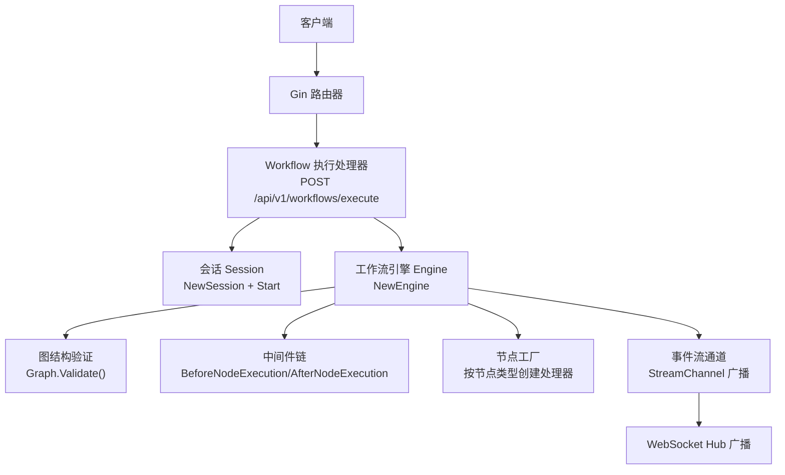
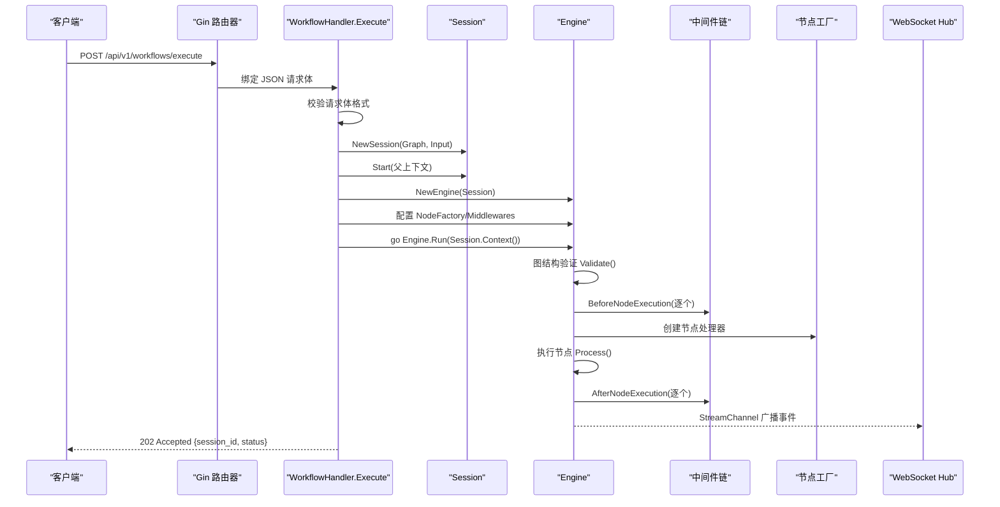
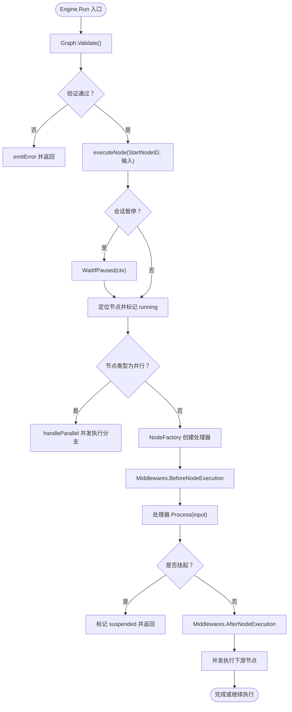
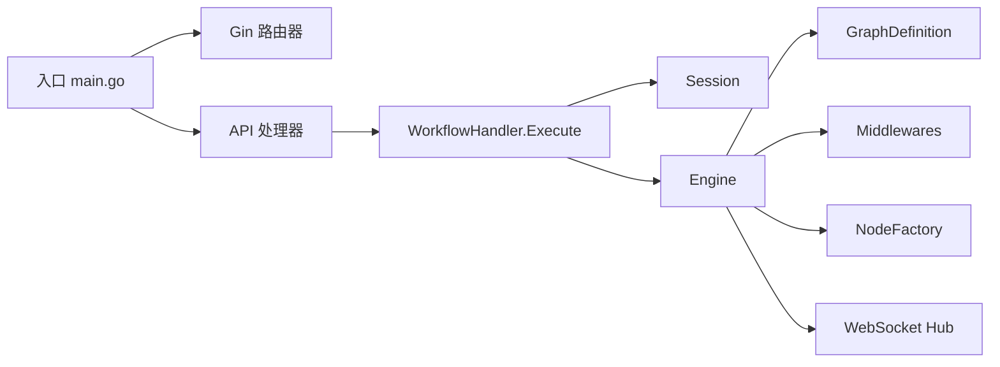

# 请求处理流程

<cite>
**本文引用的文件**
- [cmd/council/main.go](file://cmd/council/main.go)
- [internal/api/handler/workflow.go](file://internal/api/handler/workflow.go)
- [internal/core/workflow/engine.go](file://internal/core/workflow/engine.go)
- [internal/core/workflow/session.go](file://internal/core/workflow/session.go)
- [internal/core/workflow/validation.go](file://internal/core/workflow/validation.go)
- [internal/core/workflow/types.go](file://internal/core/workflow/types.go)
- [internal/core/middleware/circuit_breaker.go](file://internal/core/middleware/circuit_breaker.go)
- [internal/core/middleware/fact_check.go](file://internal/core/middleware/fact_check.go)
- [internal/core/middleware/memory.go](file://internal/core/middleware/memory.go)
- [internal/api/handler/workflow_mgmt.go](file://internal/api/handler/workflow_mgmt.go)
</cite>

## 目录
1. [引言](#引言)
2. [项目结构](#项目结构)
3. [核心组件](#核心组件)
4. [架构总览](#架构总览)
5. [详细组件分析](#详细组件分析)
6. [依赖关系分析](#依赖关系分析)
7. [性能考量](#性能考量)
8. [故障排查指南](#故障排查指南)
9. [结论](#结论)

## 引言
本文件围绕“开始会议”请求（即触发工作流执行）的完整请求处理路径进行深入解析，覆盖从用户通过 REST API 发起请求，到会话与工作流引擎的创建、初始化、执行以及中间件链拦截的全过程。文档特别强调：
- REST API 端点如何接收请求、校验输入参数；
- 如何创建会话与工作流引擎实例；
- Engine.Run 的执行逻辑：图结构验证、状态初始化、执行上下文创建；
- 中间件链在节点执行前后的拦截与处理；
- 请求生命周期中的关键检查点与错误处理机制。

## 项目结构
后端采用 Gin 框架作为 HTTP 入口，路由注册于入口程序中；业务处理器位于 internal/api/handler；核心执行引擎位于 internal/core/workflow；中间件位于 internal/core/middleware；会话状态管理位于 internal/core/workflow/session.go。

图表来源
- [cmd/council/main.go](file://cmd/council/main.go#L98-L143)
- [internal/api/handler/workflow.go](file://internal/api/handler/workflow.go#L58-L123)
- [internal/core/workflow/engine.go](file://internal/core/workflow/engine.go#L40-L139)
- [internal/core/workflow/validation.go](file://internal/core/workflow/validation.go#L8-L52)
- [internal/core/workflow/session.go](file://internal/core/workflow/session.go#L42-L62)

章节来源
- [cmd/council/main.go](file://cmd/council/main.go#L98-L143)

## 核心组件
- HTTP 入口与路由：在入口程序中注册 API 分组与路由，绑定到各处理器。
- Workflow 执行处理器：负责接收请求体、创建会话、构建引擎、配置中间件与节点工厂，并异步运行引擎。
- 工作流引擎 Engine：负责图结构验证、节点执行、并发分支、暂停/恢复、错误广播等。
- 会话 Session：负责状态机（运行/暂停/完成/失败）、取消上下文、信号通道等。
- 中间件链：提供安全与可观测性拦截，如电路保护、反幻觉扫描、内存持久化等。

章节来源
- [internal/api/handler/workflow.go](file://internal/api/handler/workflow.go#L58-L123)
- [internal/core/workflow/engine.go](file://internal/core/workflow/engine.go#L11-L38)
- [internal/core/workflow/session.go](file://internal/core/workflow/session.go#L12-L41)
- [internal/core/middleware/circuit_breaker.go](file://internal/core/middleware/circuit_breaker.go#L9-L40)
- [internal/core/middleware/fact_check.go](file://internal/core/middleware/fact_check.go#L10-L53)
- [internal/core/middleware/memory.go](file://internal/core/middleware/memory.go#L11-L73)

## 架构总览
下图展示了从 HTTP 请求到引擎执行的关键交互与数据流。

图表来源
- [cmd/council/main.go](file://cmd/council/main.go#L98-L143)
- [internal/api/handler/workflow.go](file://internal/api/handler/workflow.go#L58-L123)
- [internal/core/workflow/engine.go](file://internal/core/workflow/engine.go#L40-L139)
- [internal/core/workflow/validation.go](file://internal/core/workflow/validation.go#L8-L52)

## 详细组件分析

### HTTP 入口与路由
- 入口程序加载环境变量、初始化数据库与缓存、构建 LLM 注册表与内存服务、启动 WebSocket Hub，并注册 API 分组与路由。
- 关键路由：
  - POST /api/v1/workflows/execute：触发工作流执行。
  - POST /api/v1/sessions/:id/control：控制会话（暂停/恢复/停止）。
  - POST /api/v1/sessions/:id/signal：向指定节点发送信号。
  - POST /api/v1/sessions/:id/review：人类评审后恢复节点。

章节来源
- [cmd/council/main.go](file://cmd/council/main.go#L98-L143)

### Workflow 执行处理器（Execute）
- 请求体绑定与校验：使用 ShouldBindJSON 对 ExecuteRequest 进行绑定，若失败返回 400。
- 会话创建与启动：
  - 使用 GraphDefinition 与输入参数创建 Session。
  - 调用 Start 以设置运行状态、时间戳、可取消上下文与非阻塞的 resumeCh。
- 引擎创建与配置：
  - NewEngine(session) 复用会话的图与输入。
  - 设置 NodeFactory（按节点类型创建处理器）。
  - 配置 Middlewares：电路保护、反幻觉、内存协议。
- 引擎执行：
  - 在 goroutine 中运行 Engine.Run，并将 StreamChannel 事件广播至 WebSocket Hub。
  - 返回 202 Accepted，包含 session_id 与状态。

章节来源
- [internal/api/handler/workflow.go](file://internal/api/handler/workflow.go#L58-L123)

### 会话 Session 生命周期
- 状态机：pending → running → paused → completed/failed/cancelled。
- 上下文：Start 时创建可取消上下文；Complete/Stop 时清理资源。
- 暂停/恢复：通过 resumeCh 控制 WaitIfPaused；暂停时阻塞节点执行。
- 信号通道：为每个节点维护单向缓冲通道，支持发送信号。

章节来源
- [internal/core/workflow/session.go](file://internal/core/workflow/session.go#L12-L41)
- [internal/core/workflow/session.go](file://internal/core/workflow/session.go#L51-L108)
- [internal/core/workflow/session.go](file://internal/core/workflow/session.go#L110-L142)

### 工作流引擎 Engine 执行逻辑
- 图结构验证：Engine.Run 首先调用 Graph.Validate()，若不合法则发出错误事件并返回。
- 节点执行：
  - 检查会话是否暂停，若是则发出暂停事件并等待恢复或取消。
  - 定位节点并标记状态为 running。
  - 特殊控制流节点（如 parallel）单独处理。
  - 通过 NodeFactory 创建处理器，执行 BeforeNodeExecution 中间件链。
  - 调用处理器 Process，处理 ErrSuspended、错误与输出。
  - 执行 AfterNodeExecution 中间件链，更新状态并并发推进下游节点。
- 错误处理：emitError 将错误事件写入 StreamChannel 并标记节点失败。
- 恢复节点：ResumeNode 将 suspended 节点标记为 completed，并并发推进其下游节点。

图表来源
- [internal/core/workflow/engine.go](file://internal/core/workflow/engine.go#L40-L139)
- [internal/core/workflow/validation.go](file://internal/core/workflow/validation.go#L8-L52)

章节来源
- [internal/core/workflow/engine.go](file://internal/core/workflow/engine.go#L40-L139)

### 中间件链（Middleware）
- 接口契约：Name()、BeforeNodeExecution()、AfterNodeExecution()。
- 电路保护（CircuitBreaker）：提供深度限制钩子，当前实现为占位，便于后续扩展。
- 反幻觉（FactCheckTrigger）：扫描输出内容，检测未验证指标与外部引用，注入元数据标记。
- 内存协议（MemoryMiddleware）：在节点执行后记录隔离日志与工作记忆，忽略非关键错误以避免中断执行。

章节来源
- [internal/core/workflow/types.go](file://internal/core/workflow/types.go#L61-L67)
- [internal/core/middleware/circuit_breaker.go](file://internal/core/middleware/circuit_breaker.go#L9-L40)
- [internal/core/middleware/fact_check.go](file://internal/core/middleware/fact_check.go#L10-L53)
- [internal/core/middleware/memory.go](file://internal/core/middleware/memory.go#L11-L73)

### 图结构验证（GraphDefinition.Validate）
- 校验项：
  - 起始节点存在；
  - 所有 NextIDs 指向存在的节点；
  - 可允许环（循环），但需保证所有节点可达；
  - 使用访问标记检测可达性。
- 该验证在 Engine.Run 开始前执行，确保执行阶段不会遇到非法图结构。

章节来源
- [internal/core/workflow/validation.go](file://internal/core/workflow/validation.go#L8-L52)

### 会话控制与信号（Control/Signal/Review）
- 控制（/sessions/:id/control）：根据 action 切换会话状态（pause/resume/stop），并返回当前状态。
- 信号（/sessions/:id/signal）：向指定节点发送 payload，节点可通过 Session.GetSignalChannel 接收。
- 评审（/sessions/:id/review）：人类评审后恢复节点，构造输出并调用 Engine.ResumeNode。

章节来源
- [internal/api/handler/workflow.go](file://internal/api/handler/workflow.go#L129-L201)
- [internal/api/handler/workflow.go](file://internal/api/handler/workflow.go#L203-L246)
- [internal/core/workflow/session.go](file://internal/core/workflow/session.go#L110-L142)

## 依赖关系分析
- 入口程序依赖 Gin、配置、数据库、缓存、LLM 注册表与内存服务，组装处理器并注册路由。
- Workflow 执行处理器依赖 Session、Engine、NodeFactory、Middlewares、WebSocket Hub。
- Engine 依赖 GraphDefinition、Session、Middleware 接口、节点工厂函数。
- 中间件依赖 Session 与 Node，用于前置拦截与后置处理。

图表来源
- [cmd/council/main.go](file://cmd/council/main.go#L98-L143)
- [internal/api/handler/workflow.go](file://internal/api/handler/workflow.go#L58-L123)
- [internal/core/workflow/engine.go](file://internal/core/workflow/engine.go#L11-L38)

章节来源
- [cmd/council/main.go](file://cmd/council/main.go#L98-L143)
- [internal/api/handler/workflow.go](file://internal/api/handler/workflow.go#L58-L123)
- [internal/core/workflow/engine.go](file://internal/core/workflow/engine.go#L11-L38)

## 性能考量
- 并发执行：Engine 在标准节点与并行节点场景均采用 goroutine 并发推进下游节点，提高吞吐。
- 缓冲通道：StreamChannel 默认容量为 100，有助于缓解上游事件洪峰。
- 中间件开销：Before/After 钩子顺序执行，建议保持轻量，避免阻塞主执行路径。
- 会话上下文：使用可取消上下文，便于在暂停/停止时快速释放资源。

## 故障排查指南
- 请求体绑定失败：Execute 中对 ShouldBindJSON 的错误直接返回 400，检查 JSON 结构与字段类型。
- 图结构非法：Graph.Validate 报错将导致 Engine.Run 提前返回错误事件，检查 StartNodeID、NextIDs 与节点可达性。
- 节点不存在：executeNode 会在节点映射中找不到节点时发出错误事件并终止。
- 中间件拦截：若 BeforeNodeExecution 返回错误，将发出错误事件并阻止节点执行；检查中间件实现与配置。
- 节点挂起：处理器返回 ErrSuspended 将使节点进入 suspended 状态，需通过 Review 接口恢复。
- 会话控制异常：Control/Signal/Review 均依赖 activeEngines 映射与 Session 状态，确认会话已创建且处于活动状态。

章节来源
- [internal/api/handler/workflow.go](file://internal/api/handler/workflow.go#L58-L123)
- [internal/core/workflow/engine.go](file://internal/core/workflow/engine.go#L173-L182)
- [internal/core/workflow/validation.go](file://internal/core/workflow/validation.go#L8-L52)

## 结论
“开始会议”请求从 HTTP 入口到引擎执行的路径清晰、职责分明：Gin 负责路由与请求体绑定，WorkflowHandler 负责会话与引擎装配，Engine 负责图验证与节点执行，中间件链贯穿前后置拦截，Session 提供状态与上下文支撑。通过并发执行与事件广播，系统实现了高吞吐与可观测的工作流执行能力。建议在生产环境中进一步完善会话注册与全局状态管理，确保控制与信号接口的稳定性。