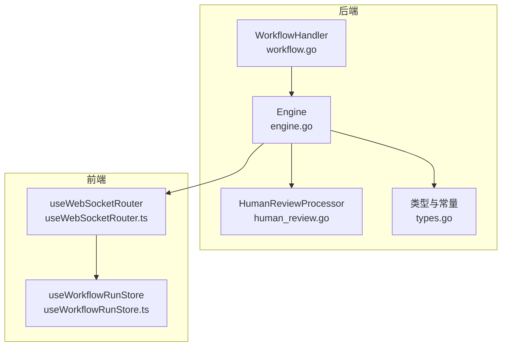
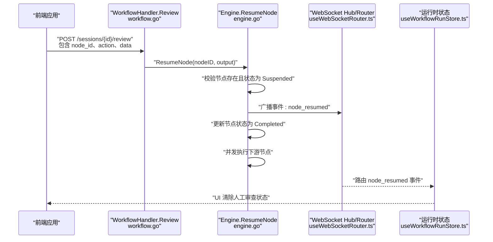
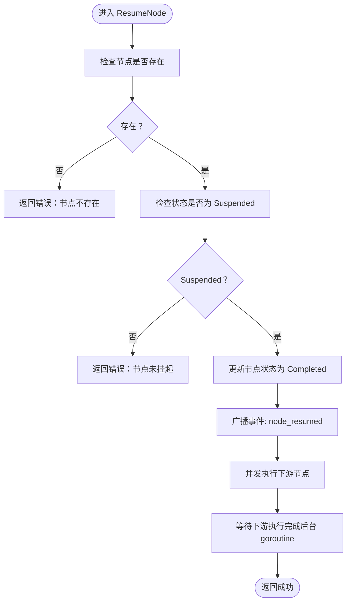
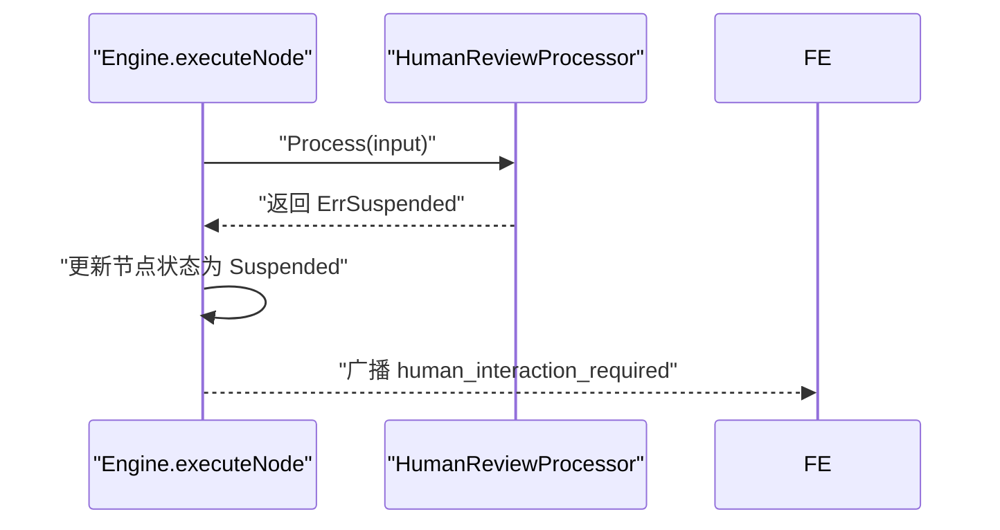
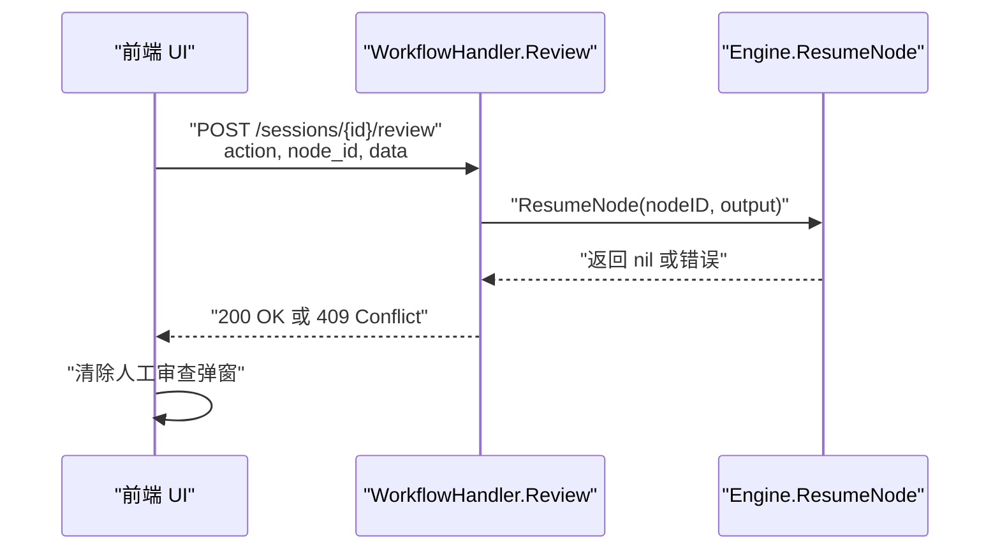
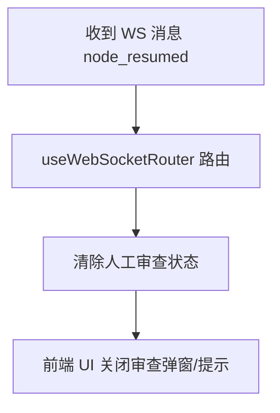
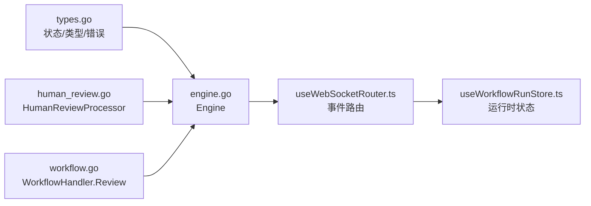

# 恢复执行机制

<cite>
**本文引用的文件**
- [engine.go](file://internal/core/workflow/engine.go)
- [types.go](file://internal/core/workflow/types.go)
- [human_review.go](file://internal/core/workflow/nodes/human_review.go)
- [workflow.go](file://internal/api/handler/workflow.go)
- [useWebSocketRouter.ts](file://frontend/src/hooks/useWebSocketRouter.ts)
- [useWorkflowRunStore.ts](file://frontend/src/stores/useWorkflowRunStore.ts)
- [engine_test.go](file://internal/core/workflow/engine_test.go)
- [2025-12-21-websocket-debugging-report.md](file://docs/reports/debugging/2025-12-21-websocket-debugging-report.md)
</cite>

## 目录
1. [简介](#简介)
2. [项目结构](#项目结构)
3. [核心组件](#核心组件)
4. [架构总览](#架构总览)
5. [详细组件分析](#详细组件分析)
6. [依赖关系分析](#依赖关系分析)
7. [性能考量](#性能考量)
8. [故障排查指南](#故障排查指南)
9. [结论](#结论)

## 简介
本文系统性阐述 The Council 工作流引擎在“暂停后的人工干预与恢复执行”方面的实现机制。重点覆盖：
- ResumeNode 方法如何验证节点处于 Suspended 状态并注入人工提供的输出结果；
- 该方法如何触发后续节点的执行流程（事件广播与异步任务调度）；
- 结合 WorkflowMgmtHandler 的 Review 接口，说明前端如何通过 REST 接口触发恢复操作；
- useWebSocketRouter 如何处理 node_resumed 事件以清除人工审查状态。

## 项目结构
围绕恢复执行机制的关键代码分布在以下模块：
- 后端工作流引擎与节点处理器：internal/core/workflow/engine.go、internal/core/workflow/nodes/human_review.go、internal/core/workflow/types.go
- 后端 API 处理器：internal/api/handler/workflow.go
- 前端 WebSocket 路由与运行时状态：frontend/src/hooks/useWebSocketRouter.ts、frontend/src/stores/useWorkflowRunStore.ts
- 单元测试与调试报告：internal/core/workflow/engine_test.go、docs/reports/debugging/2025-12-21-websocket-debugging-report.md

图表来源
- [engine.go](file://internal/core/workflow/engine.go#L1-L246)
- [human_review.go](file://internal/core/workflow/nodes/human_review.go#L1-L47)
- [types.go](file://internal/core/workflow/types.go#L1-L67)
- [workflow.go](file://internal/api/handler/workflow.go#L1-L246)
- [useWebSocketRouter.ts](file://frontend/src/hooks/useWebSocketRouter.ts#L1-L126)
- [useWorkflowRunStore.ts](file://frontend/src/stores/useWorkflowRunStore.ts#L1-L301)

章节来源
- [engine.go](file://internal/core/workflow/engine.go#L1-L246)
- [workflow.go](file://internal/api/handler/workflow.go#L1-L246)

## 核心组件
- 引擎 Engine：负责工作流执行、状态管理、事件广播与后续节点并发调度。
- 节点处理器 HumanReviewProcessor：在人类审查节点返回“挂起”信号，使引擎将节点标记为 Suspended。
- 类型与常量：定义节点状态、节点类型、挂起错误等。
- API 处理器 WorkflowHandler：提供 Review 接口，接收前端人工审查结果并调用 Engine.ResumeNode。
- 前端 useWebSocketRouter：订阅并路由 WebSocket 事件，处理 node_resumed 以清除人工审查状态；useWorkflowRunStore 提供运行时 UI 状态。

章节来源
- [engine.go](file://internal/core/workflow/engine.go#L1-L246)
- [human_review.go](file://internal/core/workflow/nodes/human_review.go#L1-L47)
- [types.go](file://internal/core/workflow/types.go#L1-L67)
- [workflow.go](file://internal/api/handler/workflow.go#L1-L246)
- [useWebSocketRouter.ts](file://frontend/src/hooks/useWebSocketRouter.ts#L1-L126)
- [useWorkflowRunStore.ts](file://frontend/src/stores/useWorkflowRunStore.ts#L1-L301)

## 架构总览
下图展示从前端提交人工审查结果到引擎恢复执行、事件广播与后续节点并发执行的整体流程。

图表来源
- [workflow.go](file://internal/api/handler/workflow.go#L209-L245)
- [engine.go](file://internal/core/workflow/engine.go#L184-L245)
- [useWebSocketRouter.ts](file://frontend/src/hooks/useWebSocketRouter.ts#L92-L95)
- [useWorkflowRunStore.ts](file://frontend/src/stores/useWorkflowRunStore.ts#L227-L257)

## 详细组件分析

### ResumeNode 方法：状态校验与恢复执行
- 状态校验
  - 通过内部状态映射检查节点是否存在且当前状态为 Suspended，否则返回错误。
- 注入人工输出
  - 将前端传入的审查动作、审查人、时间戳及附加数据合并为输出对象。
- 更新状态与事件广播
  - 将节点状态置为 Completed，并向 StreamChannel 发送 node_resumed 事件，携带输出数据。
- 触发后续节点执行
  - 遍历下游节点列表，为每个下游节点启动独立 goroutine 并行执行 executeNode。
  - 为保证生命周期可控，ResumeNode 内部再启动一个 goroutine 等待下游执行完成，避免阻塞 API 请求返回。

图表来源
- [engine.go](file://internal/core/workflow/engine.go#L184-L245)

章节来源
- [engine.go](file://internal/core/workflow/engine.go#L184-L245)

### 人类审查节点与挂起机制
- HumanReviewProcessor 在执行时发出“human_interaction_required”事件，并返回挂起错误，使引擎将该节点标记为 Suspended。
- 挂起错误与状态常量由类型定义提供，确保引擎在执行路径中识别挂起状态。

图表来源
- [human_review.go](file://internal/core/workflow/nodes/human_review.go#L1-L47)
- [types.go](file://internal/core/workflow/types.go#L1-L67)
- [engine.go](file://internal/core/workflow/engine.go#L92-L110)

章节来源
- [human_review.go](file://internal/core/workflow/nodes/human_review.go#L1-L47)
- [types.go](file://internal/core/workflow/types.go#L1-L67)
- [engine.go](file://internal/core/workflow/engine.go#L92-L110)

### 前端 REST 接口与恢复流程
- Review 接口
  - WorkflowHandler.Review 接收 node_id、action、data，构造输出对象并调用 Engine.ResumeNode。
  - 若 ResumeNode 返回错误（如节点非 Suspended），返回冲突状态码；成功则返回已恢复状态。
- 前端交互
  - useWorkflowRunStore.submitHumanReview 发送 POST 请求至 /sessions/{id}/review，并在成功后清除人工审查弹窗状态。
  - useWorkflowRunStore.sendControl 用于会话级控制（pause/resume/stop），与节点级恢复相辅相成。

图表来源
- [workflow.go](file://internal/api/handler/workflow.go#L209-L245)
- [useWorkflowRunStore.ts](file://frontend/src/stores/useWorkflowRunStore.ts#L233-L257)

章节来源
- [workflow.go](file://internal/api/handler/workflow.go#L209-L245)
- [useWorkflowRunStore.ts](file://frontend/src/stores/useWorkflowRunStore.ts#L233-L257)

### WebSocket 事件路由与人工审查状态清理
- useWebSocketRouter 路由 node_resumed 事件，将其转换为运行时状态变更。
- 当收到 node_resumed 时，前端运行时状态清除当前人工审查请求，从而关闭审查弹窗或提示。
- 该行为与前端 Review 成功后的状态一致，确保 UI 与后端事件保持同步。

图表来源
- [useWebSocketRouter.ts](file://frontend/src/hooks/useWebSocketRouter.ts#L92-L95)
- [useWorkflowRunStore.ts](file://frontend/src/stores/useWorkflowRunStore.ts#L227-L257)

章节来源
- [useWebSocketRouter.ts](file://frontend/src/hooks/useWebSocketRouter.ts#L92-L95)
- [useWorkflowRunStore.ts](file://frontend/src/stores/useWorkflowRunStore.ts#L227-L257)

### 单元测试验证
- engine_test.go 中的 TestEngine_ResumeNode 展示了：
  - 先运行到挂起，确认节点状态为 Suspended；
  - 调用 ResumeNode 注入输出；
  - 等待下游节点完成后，断言节点状态变为 Completed。

章节来源
- [engine_test.go](file://internal/core/workflow/engine_test.go#L73-L117)

## 依赖关系分析
- 引擎对节点类型与状态的依赖：通过 NodeTypeHumanReview 与 StatusSuspended、ErrSuspended 实现挂起识别与状态转换。
- API 对引擎的依赖：Review 接口直接调用 Engine.ResumeNode。
- WebSocket 路由对运行时状态的依赖：node_resumed 事件驱动 useWorkflowRunStore 清除人工审查状态。

图表来源
- [types.go](file://internal/core/workflow/types.go#L1-L67)
- [engine.go](file://internal/core/workflow/engine.go#L1-L246)
- [human_review.go](file://internal/core/workflow/nodes/human_review.go#L1-L47)
- [workflow.go](file://internal/api/handler/workflow.go#L1-L246)
- [useWebSocketRouter.ts](file://frontend/src/hooks/useWebSocketRouter.ts#L1-L126)
- [useWorkflowRunStore.ts](file://frontend/src/stores/useWorkflowRunStore.ts#L1-L301)

## 性能考量
- 并发执行下游节点：ResumeNode 对下游节点采用 goroutine 并行执行，有助于缩短整体恢复时间。
- 生命周期与上下文：ResumeNode 注释中指出应使用 Session 的上下文或后台上下文，避免短生命周期请求上下文影响后台执行。
- 事件广播与 UI 响应：WebSocket 路由在前端快速响应 node_resumed，提升用户体验。

章节来源
- [engine.go](file://internal/core/workflow/engine.go#L213-L245)

## 故障排查指南
- WebSocket 事件字段不匹配
  - 调试报告指出后端 StreamEvent 字段名为 event，而前端期望字段名亦为 event，需确保序列化标签一致，避免消息静默丢失。
- 前端路由未处理 node_resumed
  - 确认 useWebSocketRouter 是否包含 node_resumed 的分支处理，以及是否正确调用运行时状态清除函数。
- API 返回 409 冲突
  - 可能原因：节点不存在或状态不是 Suspended。检查节点 ID 与当前状态映射。
- 会话状态不一致
  - Review 成功后 UI 仍显示审查弹窗，检查前端运行时状态是否被正确清除。

章节来源
- [2025-12-21-websocket-debugging-report.md](file://docs/reports/debugging/2025-12-21-websocket-debugging-report.md#L1-L40)
- [useWebSocketRouter.ts](file://frontend/src/hooks/useWebSocketRouter.ts#L92-L95)
- [workflow.go](file://internal/api/handler/workflow.go#L209-L245)

## 结论
The Council 的恢复执行机制通过“人类审查节点挂起 + API 恢复 + 事件广播 + 并发下游执行”的组合，实现了暂停后的人工干预与无缝恢复。ResumeNode 在状态校验、输出注入与后续执行方面职责清晰；前端通过 Review 接口与 WebSocket 路由实现闭环交互，确保 UI 与后端状态一致。建议在生产环境中关注上下文生命周期与事件字段一致性，以保障稳定性与可维护性。