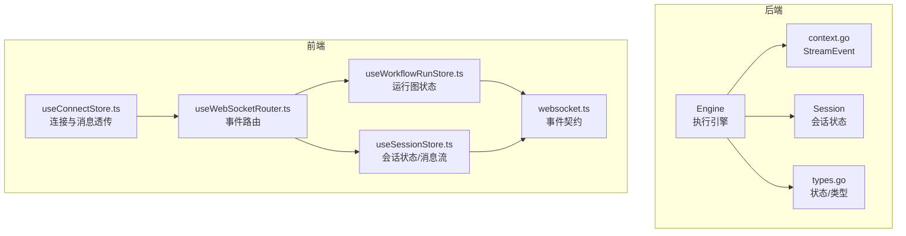
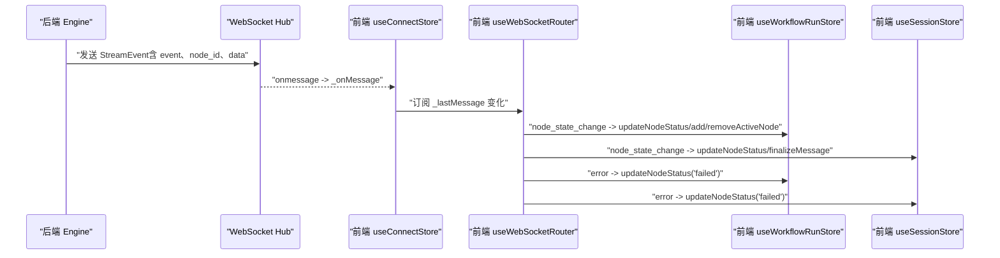
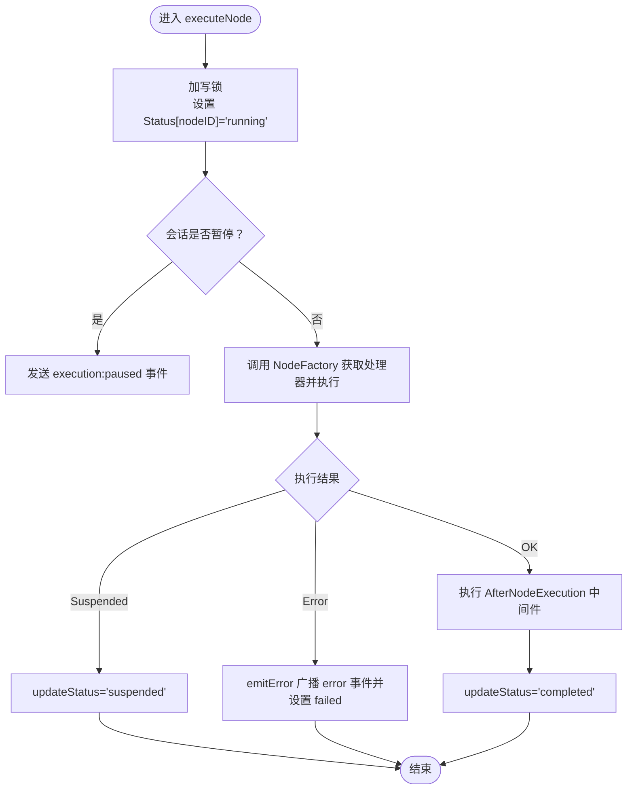
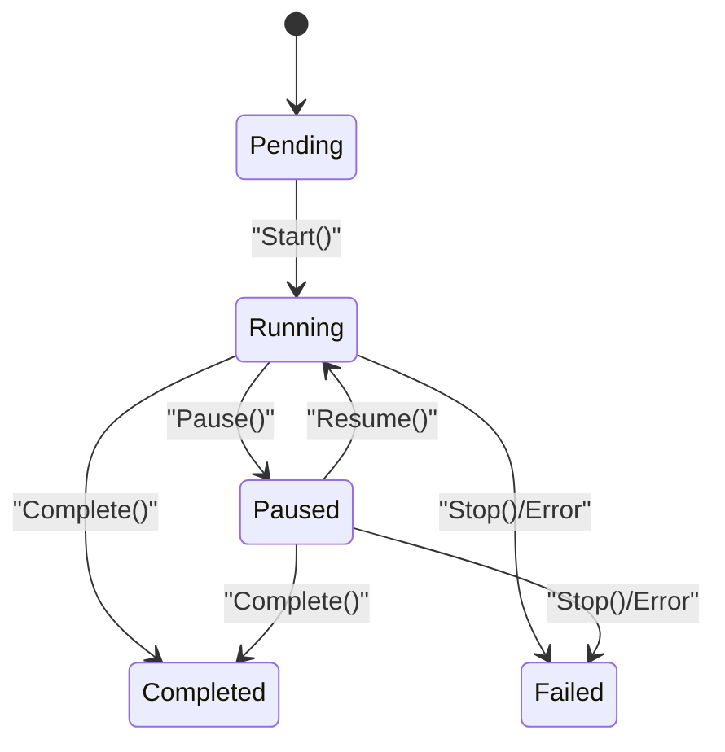
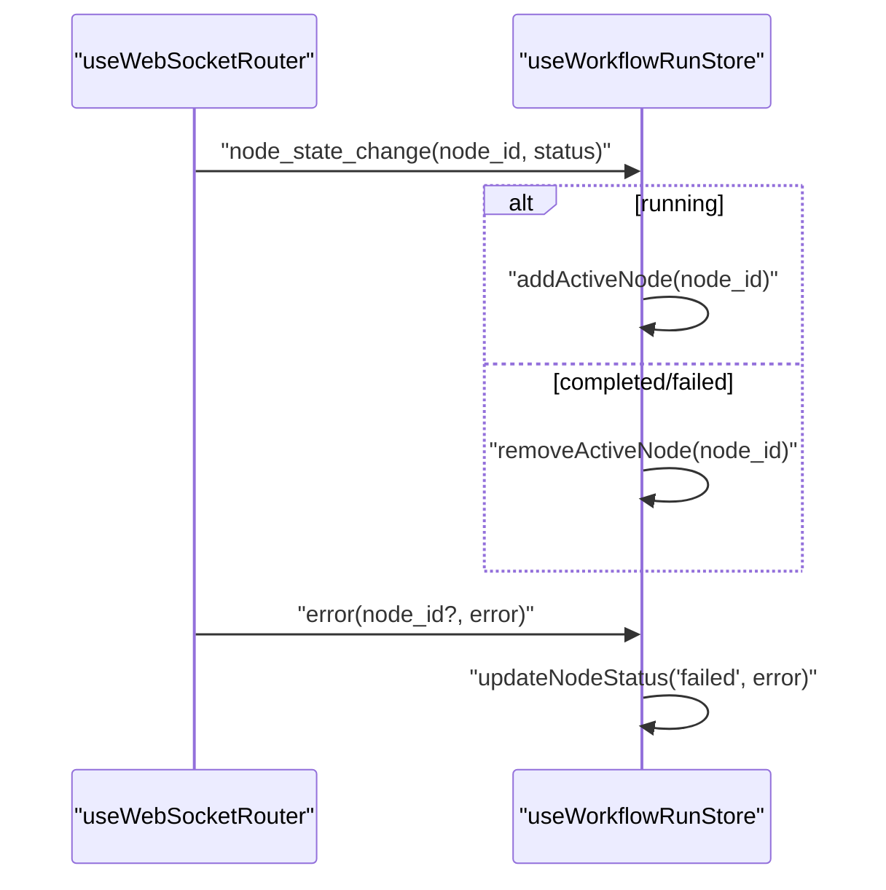
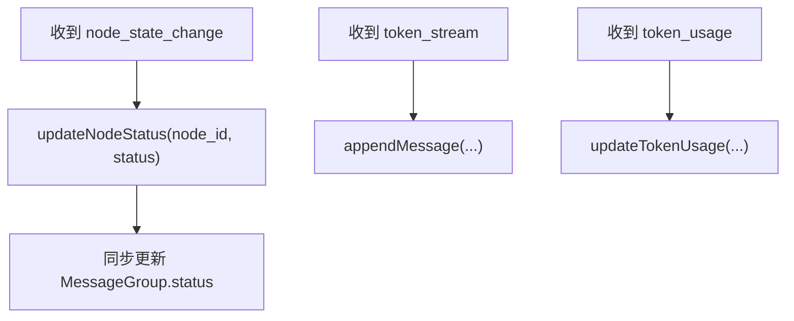
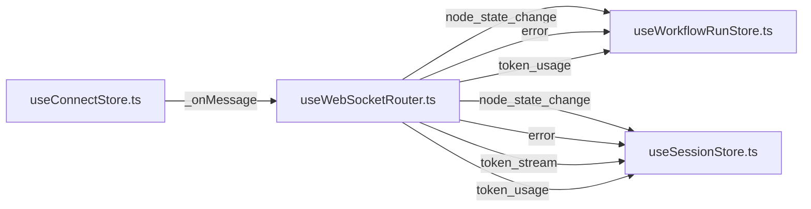
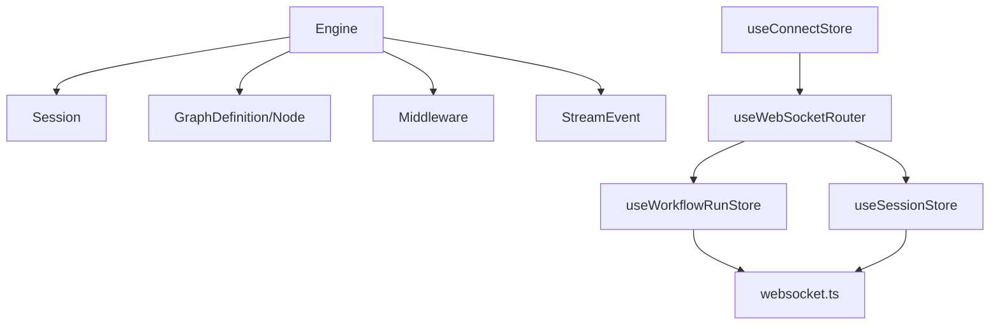

# 状态一致性管理

<cite>
**本文引用的文件**
- [engine.go](file://internal/core/workflow/engine.go)
- [types.go](file://internal/core/workflow/types.go)
- [session.go](file://internal/core/workflow/session.go)
- [context.go](file://internal/core/workflow/context.go)
- [useSessionStore.ts](file://frontend/src/stores/useSessionStore.ts)
- [useWorkflowRunStore.ts](file://frontend/src/stores/useWorkflowRunStore.ts)
- [useWebSocketRouter.ts](file://frontend/src/hooks/useWebSocketRouter.ts)
- [useConnectStore.ts](file://frontend/src/stores/useConnectStore.ts)
- [websocket.ts](file://frontend/src/types/websocket.ts)
- [SPEC-005-websocket-optimization.md](file://docs/specs/sprint1/SPEC-005-websocket-optimization.md)
- [SPEC-002-workflow-run-store.md](file://docs/specs/sprint1/SPEC-002-workflow-run-store.md)
- [2025-12-21-websocket-debugging-report.md](file://docs/reports/debugging/2025-12-21-websocket-debugging-report.md)
</cite>

## 目录
1. [引言](#引言)
2. [项目结构](#项目结构)
3. [核心组件](#核心组件)
4. [架构总览](#架构总览)
5. [详细组件分析](#详细组件分析)
6. [依赖关系分析](#依赖关系分析)
7. [性能考量](#性能考量)
8. [故障排查指南](#故障排查指南)
9. [结论](#结论)

## 引言
本文件聚焦 The Council 系统在故障发生时如何维护会话与节点状态的一致性，围绕以下目标展开：
- 解释 Engine 结构体中 Status 映射与 sync.RWMutex 如何保证并发安全的状态更新
- 描述 executeNode 与 updateStatus 如何协同工作，在节点开始、完成或失败时同步修改状态
- 说明前端 useSessionStore 与 useWorkflowRunStore 如何响应后端的 node_state_change 与 error 事件，确保 UI 状态与执行引擎保持一致

## 项目结构
围绕状态一致性管理的关键文件分布如下：
- 后端执行引擎与状态模型
  - internal/core/workflow/engine.go：执行引擎、并发状态更新、错误事件广播
  - internal/core/workflow/types.go：节点状态枚举、节点类型等
  - internal/core/workflow/session.go：会话状态与暂停/恢复控制
  - internal/core/workflow/context.go：WebSocket 事件结构体
- 前端状态管理与事件路由
  - frontend/src/stores/useSessionStore.ts：会话级状态与消息流
  - frontend/src/stores/useWorkflowRunStore.ts：运行图状态与节点状态
  - frontend/src/hooks/useWebSocketRouter.ts：WebSocket 消息路由与 UI 同步
  - frontend/src/stores/useConnectStore.ts：WebSocket 连接与消息透传
  - frontend/src/types/websocket.ts：WebSocket 事件契约类型
- 设计与调试文档
  - docs/specs/sprint1/SPEC-005-websocket-optimization.md：WebSocket 规约与路由
  - docs/specs/sprint1/SPEC-002-workflow-run-store.md：运行图 Store 行为规范
  - docs/reports/debugging/2025-12-21-websocket-debugging-report.md：消息格式与 ID 语义问题及修复

图表来源
- [engine.go](file://internal/core/workflow/engine.go#L1-L246)
- [session.go](file://internal/core/workflow/session.go#L1-L165)
- [types.go](file://internal/core/workflow/types.go#L1-L67)
- [context.go](file://internal/core/workflow/context.go#L1-L36)
- [useConnectStore.ts](file://frontend/src/stores/useConnectStore.ts#L1-L114)
- [useWebSocketRouter.ts](file://frontend/src/hooks/useWebSocketRouter.ts#L1-L125)
- [useWorkflowRunStore.ts](file://frontend/src/stores/useWorkflowRunStore.ts#L1-L301)
- [useSessionStore.ts](file://frontend/src/stores/useSessionStore.ts#L1-L332)
- [websocket.ts](file://frontend/src/types/websocket.ts#L1-L52)

章节来源
- [engine.go](file://internal/core/workflow/engine.go#L1-L246)
- [session.go](file://internal/core/workflow/session.go#L1-L165)
- [types.go](file://internal/core/workflow/types.go#L1-L67)
- [context.go](file://internal/core/workflow/context.go#L1-L36)
- [useConnectStore.ts](file://frontend/src/stores/useConnectStore.ts#L1-L114)
- [useWebSocketRouter.ts](file://frontend/src/hooks/useWebSocketRouter.ts#L1-L125)
- [useWorkflowRunStore.ts](file://frontend/src/stores/useWorkflowRunStore.ts#L1-L301)
- [useSessionStore.ts](file://frontend/src/stores/useSessionStore.ts#L1-L332)
- [websocket.ts](file://frontend/src/types/websocket.ts#L1-L52)

## 核心组件
- 后端 Engine：负责工作流执行、并发安全的状态更新、错误事件广播、并行分支处理
- 后端 Session：负责会话生命周期、暂停/恢复、上下文管理
- 前端 useWorkflowRunStore：维护运行图节点状态、活跃节点集合、执行状态、统计数据
- 前端 useSessionStore：维护会话级节点快照、消息分组、Token 使用统计
- 前端 useWebSocketRouter：将 WebSocket 事件路由到相应 Store，驱动 UI 状态
- 前端 useConnectStore：统一管理 WebSocket 连接、消息透传与重连策略
- 前端 websocket.ts：定义 WebSocket 事件契约，确保前后端消息字段一致

章节来源
- [engine.go](file://internal/core/workflow/engine.go#L1-L246)
- [session.go](file://internal/core/workflow/session.go#L1-L165)
- [useWorkflowRunStore.ts](file://frontend/src/stores/useWorkflowRunStore.ts#L1-L301)
- [useSessionStore.ts](file://frontend/src/stores/useSessionStore.ts#L1-L332)
- [useWebSocketRouter.ts](file://frontend/src/hooks/useWebSocketRouter.ts#L1-L125)
- [useConnectStore.ts](file://frontend/src/stores/useConnectStore.ts#L1-L114)
- [websocket.ts](file://frontend/src/types/websocket.ts#L1-L52)

## 架构总览
后端通过 Engine 在执行过程中持续向 StreamChannel 发送事件，前端通过 useConnectStore 接收消息，再由 useWebSocketRouter 路由到 useWorkflowRunStore 与 useSessionStore，实现 UI 与执行引擎的状态一致性。

图表来源
- [engine.go](file://internal/core/workflow/engine.go#L1-L246)
- [context.go](file://internal/core/workflow/context.go#L1-L36)
- [useConnectStore.ts](file://frontend/src/stores/useConnectStore.ts#L1-L114)
- [useWebSocketRouter.ts](file://frontend/src/hooks/useWebSocketRouter.ts#L1-L125)
- [useWorkflowRunStore.ts](file://frontend/src/stores/useWorkflowRunStore.ts#L1-L301)
- [useSessionStore.ts](file://frontend/src/stores/useSessionStore.ts#L1-L332)

## 详细组件分析

### 后端 Engine：并发安全的状态映射与事件广播
- Status 映射与互斥保护
  - Engine 内部维护 map[string]NodeStatus，并以 sync.RWMutex 保护读写
  - updateStatus 与 GetStatus 均在临界区内操作，避免竞态
  - 并行分支 handleParallel 使用 WaitGroup 等待所有子节点完成后再标记自身完成
- 执行流程与状态更新
  - executeNode 在进入节点前先加写锁，设置 Status 为 running，随后执行处理器
  - 处理器返回成功时，AfterNodeExecution 后置中间件处理完成后，updateStatus 设置为 completed
  - 处理器返回 ErrSuspended 时，updateStatus 设置为 suspended，等待外部恢复
  - 处理器返回其他错误时，emitError 广播 error 事件并设置为 failed
- 事件广播
  - emitError 将错误封装为 StreamEvent，包含 event、node_id、data.error
  - executeNode 在节点暂停时发送 execution:paused 事件，handleParallel 在并行开始时发送 node:parallel_start 事件

图表来源
- [engine.go](file://internal/core/workflow/engine.go#L52-L139)
- [engine.go](file://internal/core/workflow/engine.go#L161-L182)

章节来源
- [engine.go](file://internal/core/workflow/engine.go#L1-L246)
- [types.go](file://internal/core/workflow/types.go#L1-L67)

### 会话状态与暂停/恢复控制
- Session 提供 Start、Pause、Resume、Stop 等方法，内部以 RWMutex 保护
- WaitIfPaused 在会话处于 paused 时阻塞当前 goroutine，直到 resume 或上下文取消
- Context 返回可取消的会话上下文，便于引擎在执行链路中传播取消信号

图表来源
- [session.go](file://internal/core/workflow/session.go#L1-L165)

章节来源
- [session.go](file://internal/core/workflow/session.go#L1-L165)

### 前端 useWorkflowRunStore：运行图节点状态与活跃节点
- 维护运行图节点数据（含 status、error、tokenUsage）、活跃节点集合、执行状态与统计数据
- 收到 node_state_change 事件时：
  - updateNodeStatus 更新节点状态，必要时附加 error
  - 若状态为 running，addActiveNode；若为 completed 或 failed，removeActiveNode
- 收到 error 事件时：
  - updateNodeStatus('failed', data.error)，驱动节点与会话状态一致

图表来源
- [useWebSocketRouter.ts](file://frontend/src/hooks/useWebSocketRouter.ts#L245-L318)
- [useWorkflowRunStore.ts](file://frontend/src/stores/useWorkflowRunStore.ts#L149-L160)

章节来源
- [useWorkflowRunStore.ts](file://frontend/src/stores/useWorkflowRunStore.ts#L1-L301)
- [useWebSocketRouter.ts](file://frontend/src/hooks/useWebSocketRouter.ts#L1-L125)

### 前端 useSessionStore：会话级节点快照与消息流
- 维护当前会话的节点 Map（含 status、startedAt、completedAt、tokenUsage）、消息分组、连接状态
- 收到 node_state_change 事件时：
  - updateNodeStatus 更新节点状态并记录时间戳
  - 同步更新对应 MessageGroup 的状态
- 收到 token_stream 事件时：
  - appendMessage 追加/创建消息，支持流式拼接
- 收到 token_usage 事件时：
  - updateTokenUsage 累计会话与节点的 Token 使用

图表来源
- [useSessionStore.ts](file://frontend/src/stores/useSessionStore.ts#L145-L162)
- [useSessionStore.ts](file://frontend/src/stores/useSessionStore.ts#L172-L223)
- [useSessionStore.ts](file://frontend/src/stores/useSessionStore.ts#L236-L266)

章节来源
- [useSessionStore.ts](file://frontend/src/stores/useSessionStore.ts#L1-L332)

### WebSocket 消息路由与契约一致性
- useConnectStore 负责连接、心跳、消息解析与透传，将最新消息保存到 _lastMessage
- useWebSocketRouter 订阅 _lastMessage，按事件类型路由：
  - node_state_change：更新运行图与会话节点状态，管理活跃节点集合
  - error：标记节点与会话为 failed
  - token_stream/token_usage：更新消息流与 Token 统计
- websocket.ts 定义了事件契约（event、data、node_id 等），SPEC-005 与调试报告强调了前后端字段一致性的重要性

图表来源
- [useConnectStore.ts](file://frontend/src/stores/useConnectStore.ts#L1-L114)
- [useWebSocketRouter.ts](file://frontend/src/hooks/useWebSocketRouter.ts#L245-L318)
- [websocket.ts](file://frontend/src/types/websocket.ts#L1-L52)

章节来源
- [useConnectStore.ts](file://frontend/src/stores/useConnectStore.ts#L1-L114)
- [useWebSocketRouter.ts](file://frontend/src/hooks/useWebSocketRouter.ts#L1-L125)
- [websocket.ts](file://frontend/src/types/websocket.ts#L1-L52)
- [SPEC-005-websocket-optimization.md](file://docs/specs/sprint1/SPEC-005-websocket-optimization.md#L107-L204)

## 依赖关系分析
- 后端
  - Engine 依赖 Session、Graph、NodeFactory、StreamChannel、Middleware
  - StreamEvent 由 context.go 定义，作为 WebSocket 广播载体
- 前端
  - useConnectStore 依赖 WebSocket API 与 Zustand 订阅
  - useWebSocketRouter 依赖 useConnectStore 的 _lastMessage 与两个 Store
  - useWorkflowRunStore 与 useSessionStore 依赖 websocket.ts 的事件契约

图表来源
- [engine.go](file://internal/core/workflow/engine.go#L1-L246)
- [session.go](file://internal/core/workflow/session.go#L1-L165)
- [context.go](file://internal/core/workflow/context.go#L1-L36)
- [useConnectStore.ts](file://frontend/src/stores/useConnectStore.ts#L1-L114)
- [useWebSocketRouter.ts](file://frontend/src/hooks/useWebSocketRouter.ts#L1-L125)
- [useWorkflowRunStore.ts](file://frontend/src/stores/useWorkflowRunStore.ts#L1-L301)
- [useSessionStore.ts](file://frontend/src/stores/useSessionStore.ts#L1-L332)
- [websocket.ts](file://frontend/src/types/websocket.ts#L1-L52)

章节来源
- [engine.go](file://internal/core/workflow/engine.go#L1-L246)
- [session.go](file://internal/core/workflow/session.go#L1-L165)
- [context.go](file://internal/core/workflow/context.go#L1-L36)
- [useConnectStore.ts](file://frontend/src/stores/useConnectStore.ts#L1-L114)
- [useWebSocketRouter.ts](file://frontend/src/hooks/useWebSocketRouter.ts#L1-L125)
- [useWorkflowRunStore.ts](file://frontend/src/stores/useWorkflowRunStore.ts#L1-L301)
- [useSessionStore.ts](file://frontend/src/stores/useSessionStore.ts#L1-L332)
- [websocket.ts](file://frontend/src/types/websocket.ts#L1-L52)

## 性能考量
- 并发安全
  - 使用 sync.RWMutex 保护 Status 映射，读多写少场景下 RLock 提升读取吞吐
- 并行执行
  - executeNode 对分支节点采用 goroutine 并行执行，WaitGroup 等待全部完成，避免主线程阻塞
- 事件通道
  - StreamChannel 使用带缓冲的通道，降低高频事件下的阻塞风险
- 前端渲染
  - 使用 Zustand 与 Immer，减少不必要的状态深拷贝；路由层仅做必要字段更新

[本节为通用指导，无需列出具体文件来源]

## 故障排查指南
- WebSocket 消息静默丢失
  - 根因：后端 StreamEvent.Type 与前端 WSMessage.event 字段不一致
  - 修复：将后端 JSON tag 从 "type" 改为 "event"，确保前后端字段一致
  - 参考：调试报告与 SPEC-005
- node_id 语义错误
  - 根因：事件 data 中使用了 AgentID 而非 Graph Node ID
  - 修复：在事件 data 中使用正确的 node_id（图节点 ID）
  - 参考：调试报告与前端类型扩展
- 会话状态未显式更新
  - 根因：前端期望显式的 execution:started/execution:completed 事件，但后端未发送
  - 建议：在执行开始与完成时发送对应事件，或在前端显式初始化会话状态
  - 参考：SPEC-002 与调试报告

章节来源
- [2025-12-21-websocket-debugging-report.md](file://docs/reports/debugging/2025-12-21-websocket-debugging-report.md#L1-L109)
- [SPEC-005-websocket-optimization.md](file://docs/specs/sprint1/SPEC-005-websocket-optimization.md#L107-L204)
- [SPEC-002-workflow-run-store.md](file://docs/specs/sprint1/SPEC-002-workflow-run-store.md#L68-L171)

## 结论
The Council 系统通过后端 Engine 的并发安全状态映射与中间件化的执行流程，结合前端 Store 的事件路由与状态同步，实现了在节点开始、完成、失败以及错误等关键时刻的 UI 与执行引擎状态一致性。针对历史问题，建议进一步完善事件契约与 ID 语义，确保前后端消息格式与标识符一致，从而提升系统的可靠性与可观测性。