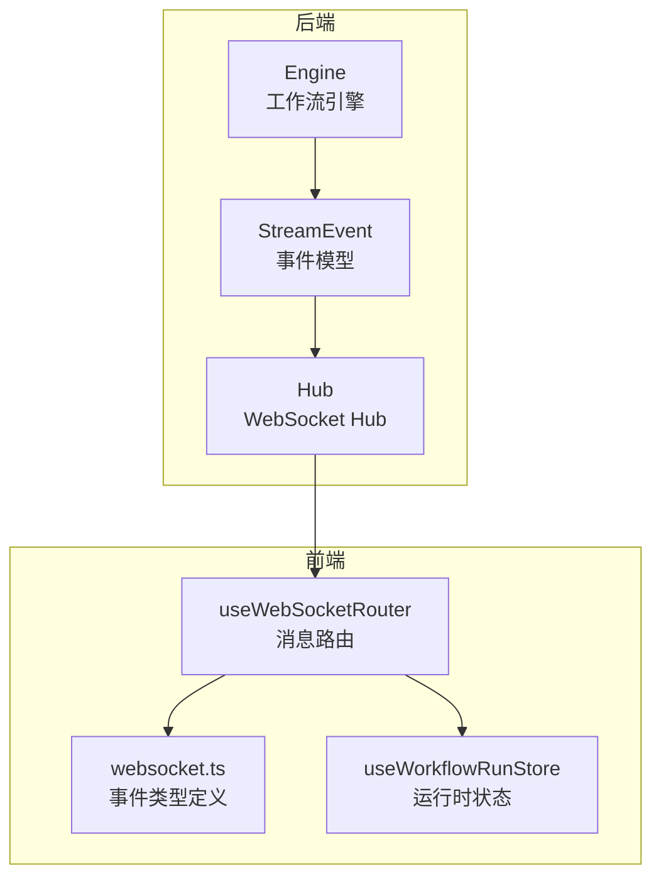
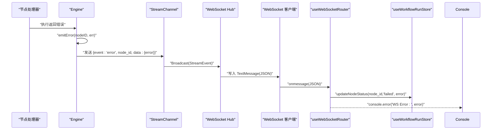
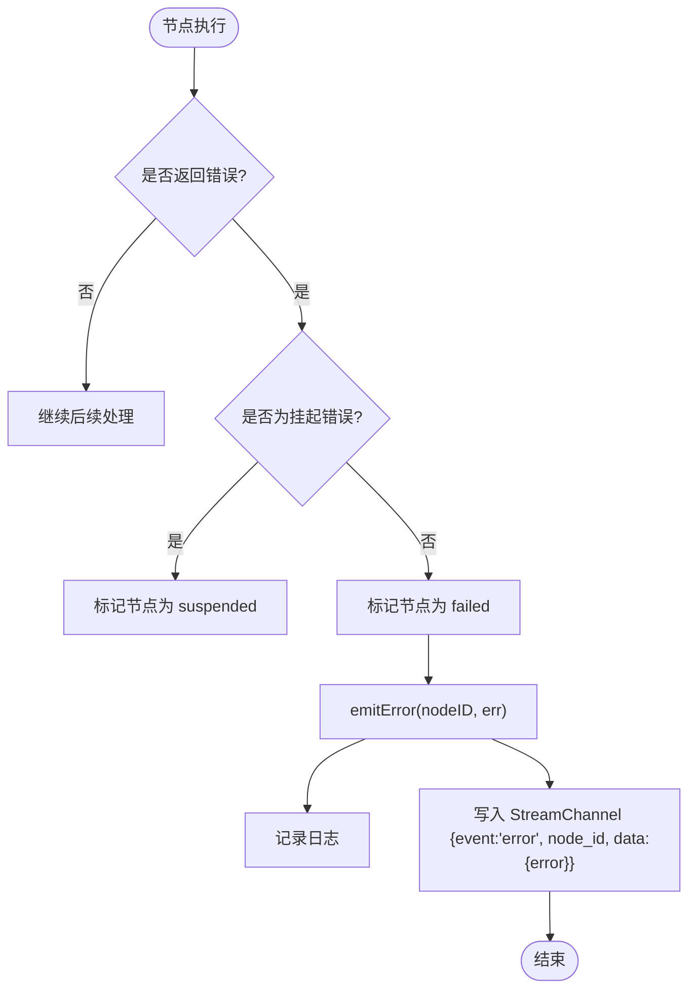
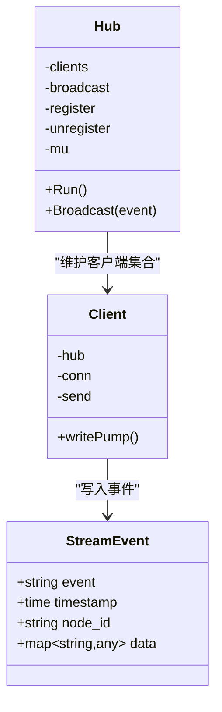
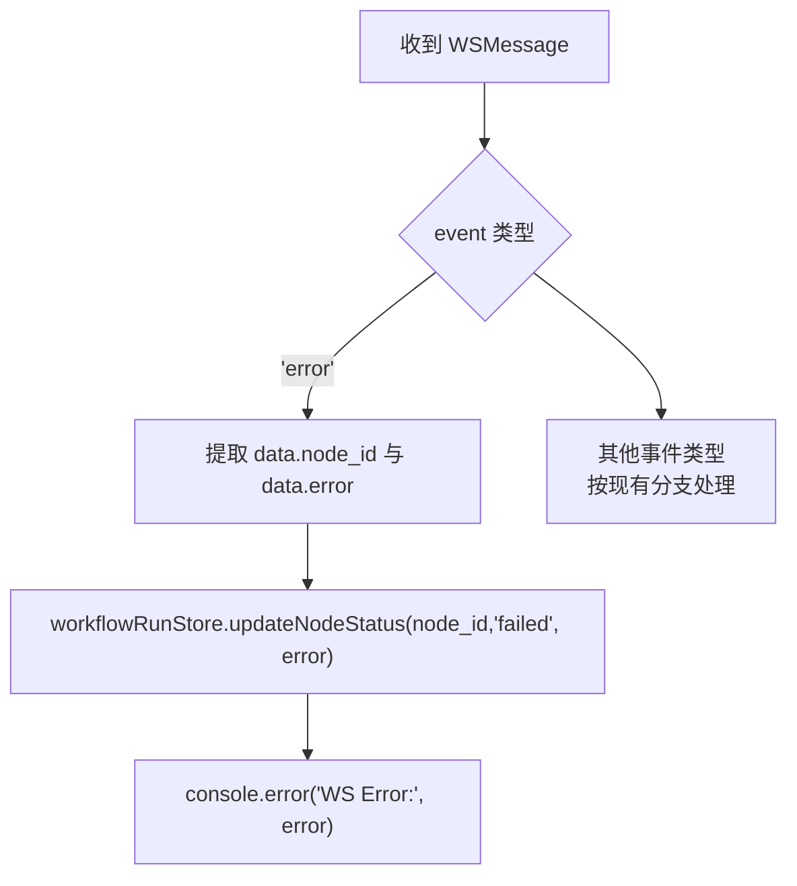
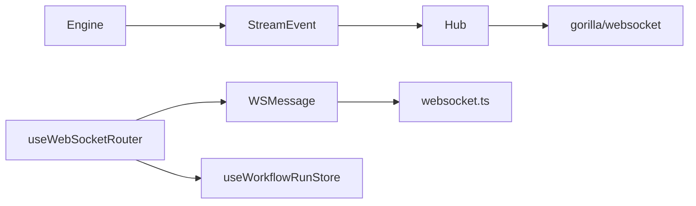

# 错误传播机制

<cite>
**本文引用的文件**
- [engine.go](file://internal/core/workflow/engine.go)
- [context.go](file://internal/core/workflow/context.go)
- [hub.go](file://internal/api/ws/hub.go)
- [useWebSocketRouter.ts](file://frontend/src/hooks/useWebSocketRouter.ts)
- [websocket.ts](file://frontend/src/types/websocket.ts)
- [useWorkflowRunStore.ts](file://frontend/src/stores/useWorkflowRunStore.ts)
- [SPEC-005-websocket-optimization.md](file://docs/specs/sprint1/SPEC-005-websocket-optimization.md)
- [SPEC-703-session-ws-connect-fix.md](file://docs/specs/sprint7/SPEC-703-session-ws-connect-fix.md)
- [2025-12-21-websocket-debugging-report.md](file://docs/reports/debugging/2025-12-21-websocket-debugging-report.md)
</cite>

## 目录
1. [简介](#简介)
2. [项目结构](#项目结构)
3. [核心组件](#核心组件)
4. [架构总览](#架构总览)
5. [详细组件分析](#详细组件分析)
6. [依赖关系分析](#依赖关系分析)
7. [性能考量](#性能考量)
8. [故障排查指南](#故障排查指南)
9. [结论](#结论)

## 简介
本文件聚焦The Council系统中“错误传播机制”的完整闭环：从前端通过WebSocket接收错误事件，到后端工作流引擎在节点执行失败时通过emitError捕获并广播错误事件，再到StreamChannel将错误以WebSocket消息推送到前端，最终由前端useWebSocketRouter监听'error'事件并更新sessionStore与workflowRunStore中的节点状态。文档同时梳理错误日志记录、用户界面反馈机制及错误信息的数据结构定义，并给出可视化流程图帮助理解。

## 项目结构
围绕错误传播的关键文件分布如下：
- 后端工作流引擎与事件模型：internal/core/workflow/engine.go、internal/core/workflow/context.go
- WebSocket Hub与客户端写入泵：internal/api/ws/hub.go
- 前端消息路由与类型定义：frontend/src/hooks/useWebSocketRouter.ts、frontend/src/types/websocket.ts
- 前端运行时状态管理（节点状态、统计等）：frontend/src/stores/useWorkflowRunStore.ts
- 规范与问题修复文档：docs/specs/sprint1/SPEC-005-websocket-optimization.md、docs/specs/sprint7/SPEC-703-session-ws-connect-fix.md、docs/reports/debugging/2025-12-21-websocket-debugging-report.md

图表来源
- [engine.go](file://internal/core/workflow/engine.go#L1-L246)
- [context.go](file://internal/core/workflow/context.go#L1-L36)
- [hub.go](file://internal/api/ws/hub.go#L1-L125)
- [useWebSocketRouter.ts](file://frontend/src/hooks/useWebSocketRouter.ts#L1-L126)
- [websocket.ts](file://frontend/src/types/websocket.ts#L1-L52)
- [useWorkflowRunStore.ts](file://frontend/src/stores/useWorkflowRunStore.ts#L1-L301)

章节来源
- [engine.go](file://internal/core/workflow/engine.go#L1-L246)
- [context.go](file://internal/core/workflow/context.go#L1-L36)
- [hub.go](file://internal/api/ws/hub.go#L1-L125)
- [useWebSocketRouter.ts](file://frontend/src/hooks/useWebSocketRouter.ts#L1-L126)
- [websocket.ts](file://frontend/src/types/websocket.ts#L1-L52)
- [useWorkflowRunStore.ts](file://frontend/src/stores/useWorkflowRunStore.ts#L1-L301)

## 核心组件
- 工作流引擎Engine：负责节点执行、状态管理、错误捕获与广播；关键方法emitError用于统一发出错误事件。
- StreamEvent：后端向客户端推送的统一事件载体，包含事件类型、时间戳、节点ID与数据载荷。
- WebSocket Hub：维护客户端连接集合，提供广播能力，将事件序列化后写入客户端连接。
- 前端useWebSocketRouter：订阅useConnectStore中的_lastMessage，按事件类型路由到不同处理分支，更新运行时状态。
- 前端websocket.ts：定义WSEventType与WSMessage接口，确保前后端消息契约一致。
- 前端useWorkflowRunStore：维护节点状态、活跃节点集合、执行状态与统计信息，提供updateNodeStatus等动作。

章节来源
- [engine.go](file://internal/core/workflow/engine.go#L1-L246)
- [context.go](file://internal/core/workflow/context.go#L1-L36)
- [hub.go](file://internal/api/ws/hub.go#L1-L125)
- [useWebSocketRouter.ts](file://frontend/src/hooks/useWebSocketRouter.ts#L1-L126)
- [websocket.ts](file://frontend/src/types/websocket.ts#L1-L52)
- [useWorkflowRunStore.ts](file://frontend/src/stores/useWorkflowRunStore.ts#L1-L301)

## 架构总览
下图展示从节点执行失败到前端错误反馈的完整链路，包括后端错误捕获、事件广播与前端路由更新。

图表来源
- [engine.go](file://internal/core/workflow/engine.go#L173-L182)
- [hub.go](file://internal/api/ws/hub.go#L70-L107)
- [useWebSocketRouter.ts](file://frontend/src/hooks/useWebSocketRouter.ts#L97-L109)
- [websocket.ts](file://frontend/src/types/websocket.ts#L1-L17)
- [useWorkflowRunStore.ts](file://frontend/src/stores/useWorkflowRunStore.ts#L149-L160)

## 详细组件分析

### 后端：Engine错误捕获与广播
- 节点执行失败路径
  - 节点处理器返回错误时，Engine在executeNode中判断错误类型，若为挂起则保持状态，否则更新节点状态为failed并调用emitError。
  - emitError负责：
    - 记录日志（包含节点ID与错误信息）
    - 将事件写入StreamChannel，事件类型为“error”，携带node_id与data.error
    - 更新节点状态为failed
- 关键实现位置
  - 节点执行与错误分支：internal/core/workflow/engine.go
  - 错误事件构造与写入：internal/core/workflow/engine.go
  - 事件模型定义：internal/core/workflow/context.go

图表来源
- [engine.go](file://internal/core/workflow/engine.go#L92-L110)
- [engine.go](file://internal/core/workflow/engine.go#L173-L182)

章节来源
- [engine.go](file://internal/core/workflow/engine.go#L92-L110)
- [engine.go](file://internal/core/workflow/engine.go#L173-L182)
- [context.go](file://internal/core/workflow/context.go#L8-L14)

### 后端：StreamEvent与WebSocket Hub
- StreamEvent字段
  - event：事件类型（例如"error"）
  - timestamp：事件时间
  - node_id：可选，标识触发事件的节点
  - data：可选，事件数据载荷（例如包含error字符串）
- Hub广播流程
  - Hub.Run循环监听注册/注销/广播通道
  - Broadcast将事件写入每个客户端的send缓冲通道
  - Client.writePump循环从send读取事件并序列化为TextMessage写入底层连接

图表来源
- [context.go](file://internal/core/workflow/context.go#L8-L14)
- [hub.go](file://internal/api/ws/hub.go#L21-L68)
- [hub.go](file://internal/api/ws/hub.go#L70-L124)

章节来源
- [context.go](file://internal/core/workflow/context.go#L8-L14)
- [hub.go](file://internal/api/ws/hub.go#L21-L124)

### 前端：useWebSocketRouter与错误事件路由
- 订阅_lastMessage并按事件类型路由
- 对于'error'事件：
  - 从data中提取node_id与error
  - 若存在node_id，则调用workflowRunStore.updateNodeStatus(node_id, 'failed', error)
  - 同步记录到控制台
- 事件类型定义
  - websocket.ts中定义WSEventType包含'error'

图表来源
- [useWebSocketRouter.ts](file://frontend/src/hooks/useWebSocketRouter.ts#L97-L109)
- [websocket.ts](file://frontend/src/types/websocket.ts#L1-L10)
- [useWorkflowRunStore.ts](file://frontend/src/stores/useWorkflowRunStore.ts#L149-L160)

章节来源
- [useWebSocketRouter.ts](file://frontend/src/hooks/useWebSocketRouter.ts#L97-L109)
- [websocket.ts](file://frontend/src/types/websocket.ts#L1-L17)
- [useWorkflowRunStore.ts](file://frontend/src/stores/useWorkflowRunStore.ts#L149-L160)

### 前端：useWorkflowRunStore与节点状态更新
- updateNodeStatus用于设置节点状态与可选错误信息
- 失败节点会更新统计（failedNodes+1），便于UI展示
- 该动作由useWebSocketRouter在'error'事件中触发

章节来源
- [useWorkflowRunStore.ts](file://frontend/src/stores/useWorkflowRunStore.ts#L149-L160)

### 前端：WebSocket连接与消息路由规范
- 规范文档SPEC-005定义了消息路由架构：useConnectStore负责连接管理，useWebSocketRouter负责消息路由与解析，useSessionStore与useWorkflowRunStore负责状态更新
- 连接建立与路由初始化需在页面加载时完成，SPEC-703指出曾出现“未调用connect导致消息丢失”的问题

章节来源
- [SPEC-005-websocket-optimization.md](file://docs/specs/sprint1/SPEC-005-websocket-optimization.md#L1-L355)
- [SPEC-703-session-ws-connect-fix.md](file://docs/specs/sprint7/SPEC-703-session-ws-connect-fix.md#L1-L36)

### 历史问题与修复要点
- 消息静默丢失问题：后端StreamEvent的JSON标签为"type"，前端期望"event"，导致前端无法正确解析；修复将后端标签改为"event"
- 节点ID一致性：后端事件data中使用Agent UUID而非Graph Node ID，前端路由与UI渲染受影响；修复将node_id替换为Graph Node ID

章节来源
- [2025-12-21-websocket-debugging-report.md](file://docs/reports/debugging/2025-12-21-websocket-debugging-report.md#L1-L70)

## 依赖关系分析
- 后端
  - Engine依赖StreamEvent结构体与Session状态机
  - Hub依赖StreamEvent并通过gorilla/websocket库进行消息写入
- 前端
  - useWebSocketRouter依赖websocket.ts中的类型定义
  - useWorkflowRunStore提供updateNodeStatus等动作供路由层调用

图表来源
- [engine.go](file://internal/core/workflow/engine.go#L1-L246)
- [context.go](file://internal/core/workflow/context.go#L1-L36)
- [hub.go](file://internal/api/ws/hub.go#L1-L125)
- [useWebSocketRouter.ts](file://frontend/src/hooks/useWebSocketRouter.ts#L1-L126)
- [websocket.ts](file://frontend/src/types/websocket.ts#L1-L52)
- [useWorkflowRunStore.ts](file://frontend/src/stores/useWorkflowRunStore.ts#L1-L301)

章节来源
- [engine.go](file://internal/core/workflow/engine.go#L1-L246)
- [context.go](file://internal/core/workflow/context.go#L1-L36)
- [hub.go](file://internal/api/ws/hub.go#L1-L125)
- [useWebSocketRouter.ts](file://frontend/src/hooks/useWebSocketRouter.ts#L1-L126)
- [websocket.ts](file://frontend/src/types/websocket.ts#L1-L52)
- [useWorkflowRunStore.ts](file://frontend/src/stores/useWorkflowRunStore.ts#L1-L301)

## 性能考量
- StreamChannel缓冲：Engine.StreamChannel具备容量，有助于避免阻塞；但在高并发错误场景下仍需关注背压与消费速度
- Hub广播：对每个客户端独立写入，注意send缓冲大小与客户端消费能力匹配
- 前端路由：useWebSocketRouter采用防重复处理策略（基于event+timestamp），减少重复渲染与状态更新开销
- 日志记录：emitError使用标准日志输出，建议结合后端日志聚合系统进行集中采集与检索

## 故障排查指南
- 症状：前端未收到'error'事件或UI无错误提示
  - 检查后端StreamEvent的event字段是否为"error"（历史问题曾为"type"）
  - 检查前端useWebSocketRouter是否订阅_lastMessage并正确路由到'error'
  - 确认useConnectStore已建立WebSocket连接（SPEC-703曾出现未调用connect导致消息丢失）
- 症状：节点状态未变为failed
  - 确认Engine在节点执行失败时调用了emitError并更新了节点状态
  - 确认useWorkflowRunStore.updateNodeStatus被调用且传入了错误信息
- 症状：错误信息缺失或node_id不正确
  - 确认StreamEvent.data包含"error"字段
  - 确认StreamEvent.node_id为Graph Node ID而非Agent UUID（历史问题）

章节来源
- [SPEC-703-session-ws-connect-fix.md](file://docs/specs/sprint7/SPEC-703-session-ws-connect-fix.md#L1-L36)
- [2025-12-21-websocket-debugging-report.md](file://docs/reports/debugging/2025-12-21-websocket-debugging-report.md#L1-L70)
- [engine.go](file://internal/core/workflow/engine.go#L173-L182)
- [useWebSocketRouter.ts](file://frontend/src/hooks/useWebSocketRouter.ts#L97-L109)
- [useWorkflowRunStore.ts](file://frontend/src/stores/useWorkflowRunStore.ts#L149-L160)

## 结论
The Council系统的错误传播机制通过“后端统一捕获—事件广播—前端路由更新”形成闭环：Engine在节点执行失败时调用emitError，将错误事件经StreamChannel与Hub推送到前端，前端useWebSocketRouter根据事件类型更新workflowRunStore与sessionStore中的节点状态，并在控制台输出错误信息。为保证稳定性，应遵循SPEC-005的路由规范，确保消息契约一致与连接及时建立，并持续关注StreamChannel与Hub的背压与消费性能。