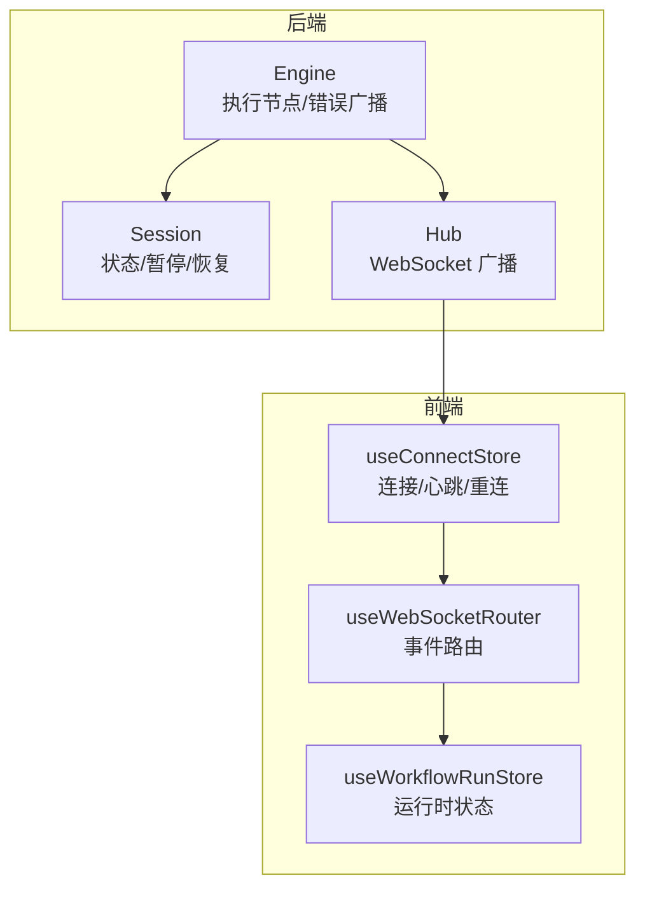
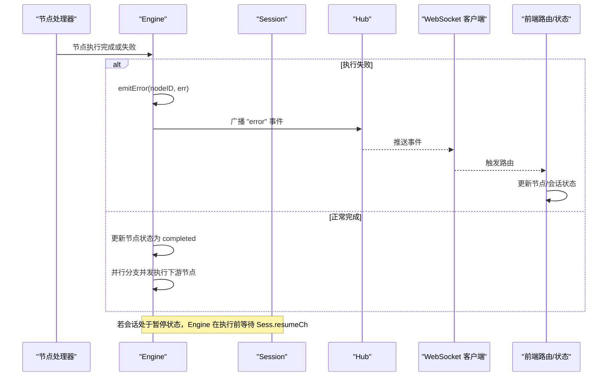
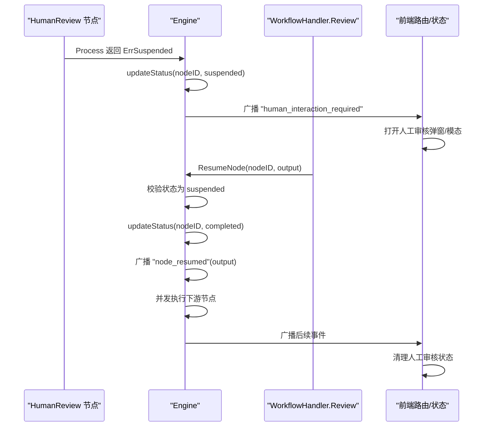
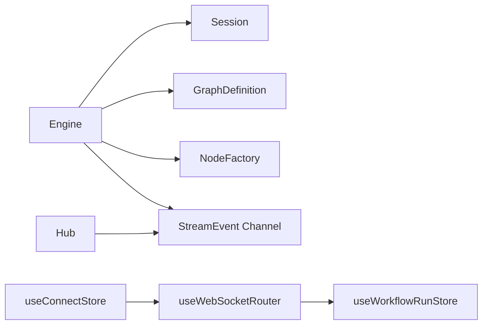

# 错误恢复机制

<cite>
**本文引用的文件**
- [engine.go](file://internal/core/workflow/engine.go)
- [session.go](file://internal/core/workflow/session.go)
- [types.go](file://internal/core/workflow/types.go)
- [factory.go](file://internal/core/workflow/nodes/factory.go)
- [human_review.go](file://internal/core/workflow/nodes/human_review.go)
- [workflow.go](file://internal/api/handler/workflow.go)
- [hub.go](file://internal/api/ws/hub.go)
- [useWebSocketRouter.ts](file://frontend/src/hooks/useWebSocketRouter.ts)
- [useWorkflowRunStore.ts](file://frontend/src/stores/useWorkflowRunStore.ts)
- [useConnectStore.ts](file://frontend/src/stores/useConnectStore.ts)
- [SPEC-409-circuit-breaker.md](file://docs/specs/backend/SPEC-409-circuit-breaker.md)
- [SPEC-703-session-ws-connect-fix.md](file://docs/specs/sprint7/SPEC-703-session-ws-connect-fix.md)
- [2025-12-21-websocket-debugging-report.md](file://docs/reports/debugging/2025-12-21-websocket-debugging-report.md)
</cite>

## 目录
1. [简介](#简介)
2. [项目结构](#项目结构)
3. [核心组件](#核心组件)
4. [架构总览](#架构总览)
5. [详细组件分析](#详细组件分析)
6. [依赖关系分析](#依赖关系分析)
7. [性能考量](#性能考量)
8. [故障排查指南](#故障排查指南)
9. [结论](#结论)

## 简介
本文件系统性阐述 The Council 工作流引擎在遇到各类故障时的错误恢复策略，重点覆盖以下方面：
- 节点执行错误的捕获与处理：包括 LLM 调用失败、超时、验证错误等
- 会话状态一致性保障：在错误发生时如何维持 Session 状态与节点状态的一致
- 前端通过 WebSocket error 事件进行用户反馈的机制
- 会话暂停与人工干预后的恢复执行（ResumeNode）：状态检查、输出注入、后续节点触发的完整流程

## 项目结构
The 错误恢复机制横跨后端工作流引擎、会话管理、WebSocket 广播、以及前端路由与状态管理。关键路径如下：
- 后端：Engine 执行节点、Session 控制暂停/恢复、Hub 广播事件
- 前端：WebSocket 路由、会话与运行时状态管理、控制命令提交

图表来源
- [engine.go](file://internal/core/workflow/engine.go#L40-L120)
- [session.go](file://internal/core/workflow/session.go#L60-L164)
- [hub.go](file://internal/api/ws/hub.go#L39-L125)
- [useWebSocketRouter.ts](file://frontend/src/hooks/useWebSocketRouter.ts#L1-L126)
- [useConnectStore.ts](file://frontend/src/stores/useConnectStore.ts#L1-L127)
- [useWorkflowRunStore.ts](file://frontend/src/stores/useWorkflowRunStore.ts#L1-L301)

章节来源
- [engine.go](file://internal/core/workflow/engine.go#L40-L120)
- [session.go](file://internal/core/workflow/session.go#L60-L164)
- [hub.go](file://internal/api/ws/hub.go#L39-L125)
- [useWebSocketRouter.ts](file://frontend/src/hooks/useWebSocketRouter.ts#L1-L126)
- [useConnectStore.ts](file://frontend/src/stores/useConnectStore.ts#L1-L127)
- [useWorkflowRunStore.ts](file://frontend/src/stores/useWorkflowRunStore.ts#L1-L301)

## 核心组件
- 工作流引擎 Engine：负责节点执行、错误广播、并行分支处理、暂停/恢复、以及 ResumeNode 恢复执行
- 会话 Session：维护会话生命周期、暂停/恢复通道、上下文取消、信号通道
- 节点工厂与处理器：根据节点类型创建处理器；人类审核节点返回“挂起”以触发人工干预
- WebSocket Hub：统一广播 StreamEvent 至所有客户端
- 前端路由与状态：useWebSocketRouter 路由各类事件，useWorkflowRunStore 更新节点/会话状态，useConnectStore 管理连接与重连

章节来源
- [engine.go](file://internal/core/workflow/engine.go#L1-L120)
- [session.go](file://internal/core/workflow/session.go#L1-L165)
- [factory.go](file://internal/core/workflow/nodes/factory.go#L1-L106)
- [human_review.go](file://internal/core/workflow/nodes/human_review.go#L1-L47)
- [hub.go](file://internal/api/ws/hub.go#L1-L125)
- [useWebSocketRouter.ts](file://frontend/src/hooks/useWebSocketRouter.ts#L1-L126)
- [useWorkflowRunStore.ts](file://frontend/src/stores/useWorkflowRunStore.ts#L1-L301)
- [useConnectStore.ts](file://frontend/src/stores/useConnectStore.ts#L1-L127)

## 架构总览
后端通过 Engine 执行节点，遇到错误时通过 StreamChannel 发出 error 事件；Session 提供暂停/恢复能力；Hub 将事件广播给前端；前端通过 useWebSocketRouter 路由事件并更新运行时状态。

图表来源
- [engine.go](file://internal/core/workflow/engine.go#L92-L120)
- [engine.go](file://internal/core/workflow/engine.go#L173-L182)
- [session.go](file://internal/core/workflow/session.go#L92-L108)
- [hub.go](file://internal/api/ws/hub.go#L39-L125)
- [useWebSocketRouter.ts](file://frontend/src/hooks/useWebSocketRouter.ts#L97-L111)

## 详细组件分析

### 工作流引擎：错误捕获与处理
- 图验证失败：Run 开始前先 Validate，失败则发出 error 事件并终止
- 节点不存在：executeNode 未找到节点时发出 error 事件
- 节点处理器错误：Processor 返回错误时，若为“挂起”标记则置节点状态为 suspended；否则置为 failed，并发出 error 事件
- 中间件拦截：Before/After 执行阶段若中间件返回错误，同样发出 error 事件
- 并行分支：handleParallel 对每个分支并发执行，最终汇总完成状态
- 暂停检测：执行前若 Session 处于暂停状态，则发出 execution:paused 事件并等待 resumeCh

章节来源
- [engine.go](file://internal/core/workflow/engine.go#L40-L120)
- [engine.go](file://internal/core/workflow/engine.go#L141-L159)
- [engine.go](file://internal/core/workflow/engine.go#L173-L182)
- [types.go](file://internal/core/workflow/types.go#L1-L24)
- [session.go](file://internal/core/workflow/session.go#L92-L108)

### 会话状态一致性与暂停/恢复
- Session 状态枚举：pending/running/paused/completed/failed/cancelled
- 暂停：将状态置为 paused 并创建新的阻塞通道；WaitIfPaused 在 paused 时阻塞直到 resumeCh 关闭
- 恢复：关闭 resumeCh 解除阻塞；Complete/Stop 时清理上下文
- Engine 在每次执行前检查 Session 状态，确保暂停期间不会推进执行

章节来源
- [session.go](file://internal/core/workflow/session.go#L1-L165)
- [engine.go](file://internal/core/workflow/engine.go#L52-L78)

### 前端错误事件与用户反馈
- 前端 useWebSocketRouter 路由 error 事件：更新节点状态为 failed，记录错误信息
- useWorkflowRunStore 统一维护节点状态与统计；useConnectStore 管理连接、心跳与重连
- SPEC-703 指出早期 WebSocket 连接未建立导致消息丢失的问题，已通过修复确保连接建立后消息可达

章节来源
- [useWebSocketRouter.ts](file://frontend/src/hooks/useWebSocketRouter.ts#L97-L111)
- [useWorkflowRunStore.ts](file://frontend/src/stores/useWorkflowRunStore.ts#L149-L160)
- [useConnectStore.ts](file://frontend/src/stores/useConnectStore.ts#L1-L127)
- [SPEC-703-session-ws-connect-fix.md](file://docs/specs/sprint7/SPEC-703-session-ws-connect-fix.md#L1-L196)

### 会话暂停与人工干预后的恢复执行（ResumeNode）
- 人类审核节点（HumanReview）在执行时发出“human_interaction_required”事件并返回“挂起”标记，Engine 将该节点状态置为 suspended
- API 层提供“review”接口，构造输出载荷（包含审核动作、审核人、时间戳等），调用 Engine.ResumeNode
- ResumeNode 校验节点存在且处于 suspended 状态，更新为 completed，广播“node_resumed”，并向下游并发执行节点

图表来源
- [human_review.go](file://internal/core/workflow/nodes/human_review.go#L1-L47)
- [engine.go](file://internal/core/workflow/engine.go#L100-L110)
- [engine.go](file://internal/core/workflow/engine.go#L184-L245)
- [workflow.go](file://internal/api/handler/workflow.go#L217-L245)
- [useWebSocketRouter.ts](file://frontend/src/hooks/useWebSocketRouter.ts#L80-L95)

章节来源
- [human_review.go](file://internal/core/workflow/nodes/human_review.go#L1-L47)
- [engine.go](file://internal/core/workflow/engine.go#L100-L110)
- [engine.go](file://internal/core/workflow/engine.go#L184-L245)
- [workflow.go](file://internal/api/handler/workflow.go#L217-L245)
- [useWebSocketRouter.ts](file://frontend/src/hooks/useWebSocketRouter.ts#L80-L95)

### LLM 调用失败、超时与验证错误的处理
- LLM 调用失败：节点处理器返回错误时，Engine 捕获并发出 error 事件，节点状态置为 failed
- 超时：工作流层未内置通用超时控制，但可结合中间件或外部 LLM Provider 的超时策略；SPEC-409 提供了电路熔断器的监控与触发机制，可用于检测异常行为并发出“熔断”事件
- 验证错误：Run 开始前 Graph.Validate 执行静态校验，失败即发出 error 事件并终止

章节来源
- [engine.go](file://internal/core/workflow/engine.go#L40-L50)
- [engine.go](file://internal/core/workflow/engine.go#L173-L182)
- [SPEC-409-circuit-breaker.md](file://docs/specs/backend/SPEC-409-circuit-breaker.md#L36-L133)

### WebSocket 事件协议与前端路由
- 事件字段：后端 StreamEvent 的字段名为 event，前端期望字段为 event；SPEC-703 与调试报告指出早期字段不一致导致消息静默丢失，已修正
- 路由规则：useWebSocketRouter 对 token_stream、node_state_change、node:parallel_start、token_usage、execution:paused、execution:completed、human_interaction_required、node_resumed、error 等事件进行路由处理
- 前端状态更新：根据事件更新节点状态、会话状态、并行分支、令牌用量、人工审核状态等

章节来源
- [hub.go](file://internal/api/ws/hub.go#L39-L125)
- [2025-12-21-websocket-debugging-report.md](file://docs/reports/debugging/2025-12-21-websocket-debugging-report.md#L1-L40)
- [useWebSocketRouter.ts](file://frontend/src/hooks/useWebSocketRouter.ts#L1-L126)

## 依赖关系分析
- Engine 依赖 Session 管理暂停/恢复与上下文；依赖 GraphDefinition 进行静态校验；依赖 NodeFactory 创建处理器；依赖 StreamChannel 广播事件
- Hub 依赖 Engine 的 StreamChannel 进行广播
- 前端路由依赖 useConnectStore 的连接状态与消息队列

图表来源
- [engine.go](file://internal/core/workflow/engine.go#L1-L38)
- [hub.go](file://internal/api/ws/hub.go#L39-L125)
- [useWebSocketRouter.ts](file://frontend/src/hooks/useWebSocketRouter.ts#L1-L126)
- [useConnectStore.ts](file://frontend/src/stores/useConnectStore.ts#L1-L127)
- [useWorkflowRunStore.ts](file://frontend/src/stores/useWorkflowRunStore.ts#L1-L301)

章节来源
- [engine.go](file://internal/core/workflow/engine.go#L1-L38)
- [hub.go](file://internal/api/ws/hub.go#L39-L125)
- [useWebSocketRouter.ts](file://frontend/src/hooks/useWebSocketRouter.ts#L1-L126)
- [useConnectStore.ts](file://frontend/src/stores/useConnectStore.ts#L1-L127)
- [useWorkflowRunStore.ts](file://frontend/src/stores/useWorkflowRunStore.ts#L1-L301)

## 性能考量
- 并发执行：Engine 在处理分支时使用 WaitGroup 并发执行下游节点，提升吞吐
- 事件广播：Hub 使用单向广播通道，避免阻塞；前端路由采用防重复处理策略
- 连接健壮性：useConnectStore 提供心跳与指数退避重连，降低网络抖动对体验的影响

章节来源
- [engine.go](file://internal/core/workflow/engine.go#L141-L159)
- [hub.go](file://internal/api/ws/hub.go#L39-L125)
- [useConnectStore.ts](file://frontend/src/stores/useConnectStore.ts#L1-L127)

## 故障排查指南
- WebSocket 消息丢失
  - 现象：后端推送事件，前端未收到
  - 根因：早期字段不一致（后端为 type，前端为 event）
  - 处理：确认后端 StreamEvent 字段与前端期望一致；SPEC-703 与调试报告已定位并修复
- 会话启动后无消息
  - 现象：启动会话后 ChatPanel 无消息
  - 根因：SessionStarter 未调用 connect 建立 WebSocket 连接
  - 处理：在初始化会话后立即建立连接；MeetingRoom 增加连接状态检查与自动重连
- 人工审核节点未恢复
  - 现象：前端弹出人工审核，提交后无后续节点执行
  - 根因：未正确调用 ResumeNode 或节点状态非 suspended
  - 处理：确认节点状态为 suspended，调用 Review API 注入输出并触发下游节点
- 会话暂停后无法继续
  - 现象：执行被暂停，前端无响应
  - 根因：Engine 在执行前等待 resumeCh，需调用 Resume API 或前端控制命令
  - 处理：前端控制命令或 API 调用 Resume，解除阻塞

章节来源
- [2025-12-21-websocket-debugging-report.md](file://docs/reports/debugging/2025-12-21-websocket-debugging-report.md#L1-L40)
- [SPEC-703-session-ws-connect-fix.md](file://docs/specs/sprint7/SPEC-703-session-ws-connect-fix.md#L1-L196)
- [workflow.go](file://internal/api/handler/workflow.go#L217-L245)
- [engine.go](file://internal/core/workflow/engine.go#L52-L78)

## 结论
The Council 的错误恢复机制通过“静态校验 + 执行期错误广播 + 会话暂停/恢复 + 人工干预 + WebSocket 事件路由”的组合，实现了在多种故障场景下的稳健恢复：
- 静态校验失败与节点执行错误均以 error 事件形式反馈给前端，保证可观测性
- 会话暂停/恢复通过通道与上下文管理，确保执行流在暂停期间不会推进
- 人工审核节点通过“挂起”与 ResumeNode 实现可控的人机协作恢复
- 前端通过统一的 WebSocket 路由与状态管理，提供一致的用户反馈与交互