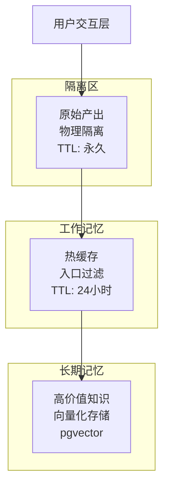

# 三层记忆系统

<cite>
**本文档引用文件**   
- [service.go](file://internal/core/memory/service.go)
- [types.go](file://internal/core/memory/types.go)
- [memory.go](file://internal/core/middleware/memory.go)
- [memory_retrieval.go](file://internal/core/workflow/nodes/memory_retrieval.go)
- [memory_handler.go](file://internal/api/handler/memory.go)
- [001_init_schema.up.sql](file://internal/infrastructure/db/migrations/001_init_schema.up.sql)
- [002_add_quarantine_logs.up.sql](file://internal/infrastructure/db/migrations/002_add_quarantine_logs.up.sql)
- [SPEC-408-memory-protocol.md](file://docs/specs/backend/SPEC-408-memory-protocol.md)
- [SPEC-607-memory-retrieval-node.md](file://docs/specs/sprint6/SPEC-607-memory-retrieval-node.md)
</cite>

## 目录
1. [简介](#简介)
2. [三层记忆架构](#三层记忆架构)
3. [隔离区（Tier 1）](#隔离区tier-1)
4. [工作记忆（Tier 2）](#工作记忆tier-2)
5. [长期记忆（Tier 3）](#长期记忆tier-3)
6. [MemoryService 服务调用](#memoryservice-服务调用)
7. [记忆检索节点](#记忆检索节点)
8. [向量索引与查询优化](#向量索引与查询优化)
9. [结论](#结论)

## 简介
三层记忆系统是本项目的核心组件之一，旨在通过分层机制实现对会议产出内容的高效管理与知识沉淀。该系统由隔离区、工作记忆和长期记忆三个层级构成，分别承担临时数据验证、当前会话上下文存储以及持久化知识存储的功能。通过这一设计，系统能够在保证数据质量的同时，为后续的检索与分析提供可靠支持。

## 三层记忆架构
三层记忆系统采用分层设计，每一层都有明确的职责与生命周期管理策略。整体架构如下图所示：



**图示来源**
- [SPEC-408-memory-protocol.md](file://docs/specs/backend/SPEC-408-memory-protocol.md#架构概述)

## 隔离区（Tier 1）
隔离区作为第一层，主要用于临时存储会议中的原始产出内容。所有生成的内容在未经验证前均被置于隔离状态，防止低质量或潜在有害信息污染核心知识库。

### 功能特点
- **物理隔离**：所有内容写入专用的 `quarantine_logs` 表，不参与任何检索流程。
- **永久保留**：除非手动删除或晋升，否则数据将长期保存。
- **元数据记录**：包含会话ID、节点ID及原始元数据，便于追溯。

### 数据模型
```sql
CREATE TABLE quarantine_logs (
    id UUID PRIMARY KEY,
    session_id UUID,
    content TEXT,
    raw_metadata JSONB,
    created_at TIMESTAMP DEFAULT NOW()
);
```

**本节来源**
- [002_add_quarantine_logs.up.sql](file://internal/infrastructure/db/migrations/002_add_quarantine_logs.up.sql)
- [SPEC-408-memory-protocol.md](file://docs/specs/backend/SPEC-408-memory-protocol.md#layer-1-quarantine-隔离区)

## 工作记忆（Tier 2）
工作记忆层负责存储当前会话的上下文信息，作为短期缓存使用。该层内容经过初步过滤后进入Redis，供实时访问。

### 入口过滤机制
在写入工作记忆前，系统会对内容进行双重校验：
1. **置信度检查**：仅当元数据中 `confidence` 字段大于等于0.8时才允许写入。
2. **长度过滤**：内容长度需超过50字符，避免噪声数据。

### 存储策略
- 使用Redis List结构存储，键名为 `wm:{group_id}`。
- 设置TTL为24小时，自动过期。
- 限制列表长度为50项，保留最新内容。

```go
func (s *Service) UpdateWorkingMemory(ctx context.Context, groupID string, content string, metadata map[string]interface{}) error {
    // 置信度检查
    confidence, ok := metadata["confidence"].(float64)
    if ok && confidence < 0.8 {
        return nil
    }
    // 长度过滤
    if len(content) < 50 {
        return nil
    }
    // 写入Redis
    key := fmt.Sprintf("wm:%s", groupID)
    s.cache.LPush(ctx, key, content)
    s.cache.Expire(ctx, key, 24*time.Hour)
    s.cache.LTrim(ctx, key, 0, 49)
    return nil
}
```

**本节来源**
- [service.go](file://internal/core/memory/service.go#L60-L96)
- [SPEC-408-memory-protocol.md](file://docs/specs/backend/SPEC-408-memory-protocol.md#layer-2-working-memory-工作记忆)

## 长期记忆（Tier 3）
长期记忆层基于PostgreSQL的pgvector扩展实现，用于持久化存储经过验证的高价值知识。内容以向量形式存储，并支持高效的相似性检索。

### 晋升流程
用户可通过API触发“晋升”操作，将隔离区或工作记忆中的内容转化为长期记忆：
1. 文本分割：使用 `RecursiveCharacterSplitter` 将长文本切分为500字符的块。
2. 向量化：调用LLM嵌入模型（如text-embedding-ada-002）生成1536维向量。
3. 存储：将内容与向量一并写入 `memories` 表。

### 数据表结构
```sql
CREATE TABLE memories (
    id UUID PRIMARY KEY,
    group_id UUID REFERENCES groups(id),
    content TEXT NOT NULL,
    embedding VECTOR(1536),
    metadata JSONB DEFAULT '{}',
    created_at TIMESTAMPTZ DEFAULT NOW()
);
```

**本节来源**
- [service.go](file://internal/core/memory/service.go#L115-L157)
- [001_init_schema.up.sql](file://internal/infrastructure/db/migrations/001_init_schema.up.sql#L80-L95)

## MemoryService 服务调用
`MemoryService` 是整个记忆系统的核心服务，被多个组件调用以实现记忆功能。

### 被调用组件
- **工作流引擎**：在每个节点执行后自动调用 `LogQuarantine` 和 `UpdateWorkingMemory`，实现内容的自动归档。
- **API处理器**：提供 `/memory/ingest` 和 `/memory/query` 接口，供前端直接操作记忆数据。
- **中间件**：`MemoryMiddleware` 在节点执行后拦截输出，自动写入记忆系统。

### 调用示例
```go
// 工作流中间件调用
func (mm *MemoryMiddleware) AfterNodeExecution(...) {
    mm.Manager.LogQuarantine(ctx, session.ID, node.ID, content, metadata)
    mm.Manager.UpdateWorkingMemory(ctx, groupID, content, metadata)
}
```

**本节来源**
- [memory.go](file://internal/core/middleware/memory.go#L28-L72)
- [memory_handler.go](file://internal/api/handler/memory.go#L25-L67)

## 记忆检索节点
记忆检索节点（`memory_retrieval`）是工作流中的一种特殊节点类型，用于从长期记忆中提取相关信息并注入上下文。

### 节点配置
| 属性 | 说明 |
|------|------|
| max_results | 最大返回结果数 |
| time_range_days | 时间范围（天） |
| relevance_threshold | 相关性阈值 |

### 检索逻辑
1. 提取输入中的 `topic` 作为查询关键词。
2. 调用 `Retrieve` 方法，结合 `group_id` 进行范围限定。
3. 将检索结果格式化为Markdown摘要，注入 `history_context` 字段。

```go
func (p *MemoryRetrievalProcessor) Process(...) {
    results, err := p.memoryService.Retrieve(ctx, query)
    historySummary := formatHistorySummary(results)
    output["history_context"] = historySummary
    return output, nil
}
```

**本节来源**
- [memory_retrieval.go](file://internal/core/workflow/nodes/memory_retrieval.go#L24-L83)
- [SPEC-607-memory-retrieval-node.md](file://docs/specs/sprint6/SPEC-607-memory-retrieval-node.md#技术实现)

## 向量索引与查询优化
为提升向量检索性能，系统在PostgreSQL中构建了IVF Flat索引，并采用余弦相似度进行排序。

### 索引创建
```sql
CREATE INDEX idx_memories_embedding ON memories 
USING ivfflat (embedding vector_cosine_ops) WITH (lists = 100);
```
- **IVF Flat**：倒排文件扁平化索引，适合大规模向量检索。
- **lists = 100**：聚类中心数量，影响精度与速度平衡。

### 查询优化
检索时使用余弦距离公式 `1 - (embedding <=> $1)` 计算相似度，并按此排序返回前5条最相关记录。

```sql
SELECT content, 1 - (embedding <=> $1) as score 
FROM memories 
WHERE group_id = $2 
ORDER BY embedding <=> $1 
LIMIT 5
```

**本节来源**
- [001_init_schema.up.sql](file://internal/infrastructure/db/migrations/001_init_schema.up.sql#L95)
- [service.go](file://internal/core/memory/service.go#L189-L191)

## 结论
三层记忆系统通过清晰的分层设计，实现了从原始数据到高价值知识的逐步转化。隔离区确保了数据安全性，工作记忆提供了高效的会话上下文管理，而长期记忆则借助pgvector实现了持久化与智能检索能力。该系统不仅提升了信息处理的质量，也为后续的自动化决策与知识复用奠定了坚实基础。