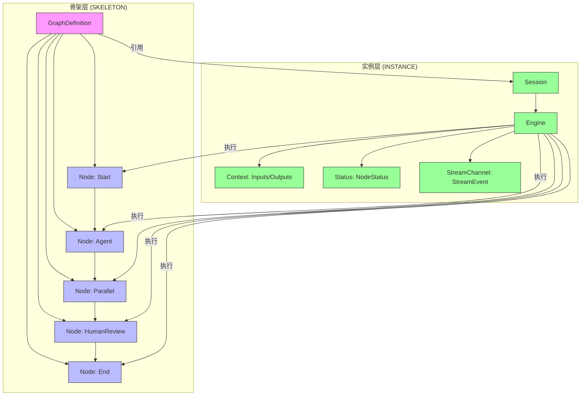

# 分层架构

<cite>
**本文档引用的文件**  
- [engine.go](file://internal/core/workflow/engine.go)
- [types.go](file://internal/core/workflow/types.go)
- [validation.go](file://internal/core/workflow/validation.go)
- [session.go](file://internal/core/workflow/session.go)
- [context.go](file://internal/core/workflow/context.go)
- [template.go](file://internal/core/workflow/template.go)
- [processor.go](file://internal/core/workflow/processor.go)
- [workflow.go](file://internal/api/handler/workflow.go)
- [workflow_mgmt.go](file://internal/api/handler/workflow_mgmt.go)
- [factory.go](file://internal/core/workflow/nodes/factory.go)
- [repository.go](file://internal/core/workflow/repository.go)
- [template_repository.go](file://internal/infrastructure/persistence/template_repository.go)
- [start.go](file://internal/core/workflow/nodes/start.go)
- [end.go](file://internal/core/workflow/nodes/end.go)
</cite>

## 目录
1. [引言](#引言)
2. [骨架层与实例层分离设计](#骨架层与实例层分离设计)
3. [骨架层：工作流结构与逻辑定义](#骨架层工作流结构与逻辑定义)
4. [实例层：运行时状态与数据承载](#实例层运行时状态与数据承载)
5. [验证机制与工作流合法性保障](#验证机制与工作流合法性保障)
6. [模板复用与多会话并发执行](#模板复用与多会话并发执行)
7. [架构图示](#架构图示)
8. [结论](#结论)

## 引言

The Council 系统采用分层架构设计，将工作流的静态结构定义与动态执行实例分离，形成“骨架层（SKELETON）”与“实例层（INSTANCE）”两个核心层次。这种设计不仅提升了系统的可维护性与扩展性，还支持工作流模板的复用和多会话的并发执行。本文档将详细阐述这一设计理念，解释骨架层如何定义工作流的结构与逻辑，实例层如何承载运行时状态与数据，并说明验证机制如何确保工作流定义的合法性。

## 骨架层与实例层分离设计

The Council 系统的核心在于其分层架构，该架构将工作流的“结构”与“执行”明确分离。骨架层（SKELETON）负责定义工作流的拓扑结构、节点类型、连接关系和业务逻辑，是工作流的静态蓝图。实例层（INSTANCE）则是在运行时根据骨架层创建的、承载具体输入、输出、状态和上下文数据的执行单元。这种分离使得系统能够以一个通用的骨架为基础，高效地创建和管理多个独立的执行实例。

## 骨架层：工作流结构与逻辑定义

骨架层由 `GraphDefinition` 结构体（定义于 `types.go`）表示，它是一个包含节点（`Node`）集合的有向无环图（DAG）。每个 `Node` 定义了其类型（`NodeType`）、名称、ID、后继节点ID列表（`NextIDs`）以及特定于节点的配置属性（`Properties`）。

**关键设计点：**
- **通用节点类型**：系统定义了如 `start`、`end`、`agent`、`parallel`、`vote`、`loop`、`human_review` 等通用节点类型。复杂的业务流程（如“辩论”）通过组合这些基础节点来实现，而非创建专用节点，这极大地增强了系统的灵活性。
- **逻辑封装**：节点的执行逻辑由 `NodeProcessor` 接口（定义于 `processor.go`）实现。`NodeFactory`（定义于 `factory.go`）根据节点的 `Type` 和 `Properties` 创建相应的 `NodeProcessor` 实例，将骨架定义与具体行为解耦。
- **配置驱动**：节点的行为由 `Properties` 字段中的配置决定。例如，`agent` 节点通过 `agent_id` 属性指定要调用的AI代理，`loop` 节点通过 `max_rounds` 和 `exit_on_score` 属性控制循环逻辑。

**Section sources**
- [types.go](file://internal/core/workflow/types.go#L43-L67)
- [processor.go](file://internal/core/workflow/processor.go#L7-L15)
- [factory.go](file://internal/core/workflow/nodes/factory.go#L19-L106)

## 实例层：运行时状态与数据承载

实例层由 `Session` 结构体（定义于 `session.go`）表示，它代表了工作流的一次具体执行。`Session` 持有对骨架层 `GraphDefinition` 的引用，并管理运行时所需的所有动态数据。

**关键设计点：**
- **状态管理**：`Session` 维护自身的执行状态（`SessionStatus`），如 `pending`、`running`、`paused`、`completed` 等。它还通过 `Status` 字段（在 `Engine` 中）跟踪每个节点的执行状态（`NodeStatus`）。
- **数据流**：`Session` 持有初始输入（`Inputs`）和最终输出（`Outputs`）。在执行过程中，数据通过 `executeNode` 方法在节点间流动，形成一个处理管道。
- **控制与信号**：`Session` 支持暂停（`Pause`）、恢复（`Resume`）和停止（`Stop`）操作。它还通过 `SignalChannels` 为 `human_review` 等节点提供与外部（如用户界面）交互的信号通道，实现人机协同。
- **并发执行**：`Engine` 在执行 `parallel` 节点时，会为每个分支启动一个独立的 goroutine，实现了真正的并发执行，而每个分支的执行状态和数据都由 `Session` 统一管理。

**Section sources**
- [session.go](file://internal/core/workflow/session.go#L1-L165)
- [engine.go](file://internal/core/workflow/engine.go#L11-L246)

## 验证机制与工作流合法性保障

为了确保骨架层定义的合法性，系统在工作流执行前会进行严格的验证。`GraphDefinition` 结构体实现了 `Validate()` 方法（定义于 `validation.go`），该方法在 `Engine.Run()` 的初始阶段被调用。

**验证内容包括：**
1.  **起始节点存在性**：检查 `StartNodeID` 是否存在于 `Nodes` 映射中。
2.  **连接有效性**：遍历所有节点，确保其 `NextIDs` 中的每个ID都对应一个存在的节点。
3.  **可达性**：通过从起始节点开始的深度优先搜索（DFS），确保图中的所有节点都是可达的，避免出现“孤岛”节点。
4.  **循环检测**：虽然 `detectCycle()` 方法存在，但系统允许循环（如 `loop` 节点），因为运行时的 `LoopProcessor` 会处理循环的终止条件。这体现了验证逻辑与运行时保护的分工。

**调用流程：**
- **创建时**：当通过 `WorkflowMgmtHandler.Create` 或 `Update` API 创建或更新工作流时，`GraphDefinition` 会被持久化到数据库，但此时不进行验证。
- **执行时**：当通过 `WorkflowHandler.Execute` API 启动一个工作流时，系统会创建一个 `Session` 和 `Engine`，并在 `Engine.Run()` 的第一步调用 `Graph.Validate()`。如果验证失败，执行会立即终止并返回错误。

**Section sources**
- [validation.go](file://internal/core/workflow/validation.go#L8-L71)
- [engine.go](file://internal/core/workflow/engine.go#L40-L46)
- [workflow_mgmt.go](file://internal/api/handler/workflow_mgmt.go#L68-L108)
- [workflow.go](file://internal/api/handler/workflow.go#L58-L123)

## 模板复用与多会话并发执行

分层架构是实现模板复用和多会话并发的基础。

- **模板复用**：工作流模板（`Template`，定义于 `template.go`）本质上是被持久化的 `GraphDefinition`。用户可以将一个成功的工作流保存为模板，该模板包含了完整的骨架定义。当需要创建新的工作流时，系统可以加载该模板的 `GraphDefinition`，作为新 `Session` 的骨架，从而实现“一键复用”。
- **多会话并发**：每个 `Session` 都是独立的执行实例。当多个用户或同一用户发起多个工作流请求时，系统会为每个请求创建一个独立的 `Session` 和 `Engine`。这些实例共享同一个骨架层定义（或不同的模板），但拥有各自独立的内存空间、状态和数据流，互不干扰，从而支持高并发。

**Section sources**
- [template.go](file://internal/core/workflow/template.go#L1-L35)
- [template_repository.go](file://internal/infrastructure/persistence/template_repository.go#L1-L95)
- [workflow.go](file://internal/api/handler/workflow.go#L68-L117)

## 架构图示

**Diagram sources**
- [types.go](file://internal/core/workflow/types.go#L43-L67)
- [session.go](file://internal/core/workflow/session.go#L1-L165)
- [engine.go](file://internal/core/workflow/engine.go#L11-L246)

## 结论

The Council 系统通过“骨架层”与“实例层”的分离设计，构建了一个高度灵活、可维护和可扩展的工作流引擎。骨架层作为静态的、可复用的蓝图，定义了工作流的结构与逻辑；实例层作为动态的、独立的执行容器，承载了运行时的状态与数据。这种设计不仅通过 `Validate()` 方法确保了工作流定义的合法性，还天然支持了模板复用和多会话并发执行，为系统提供了强大的业务支撑能力。