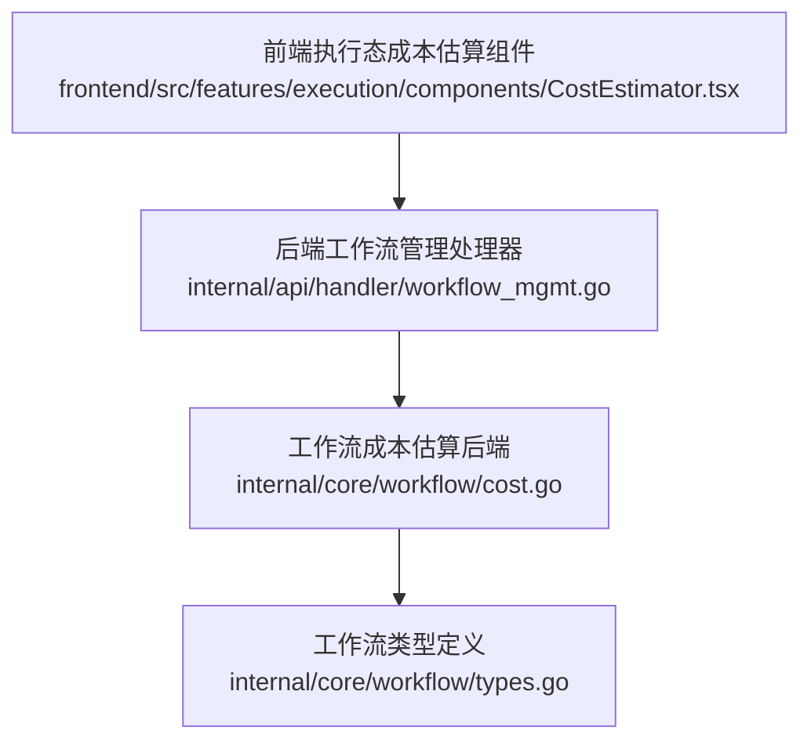
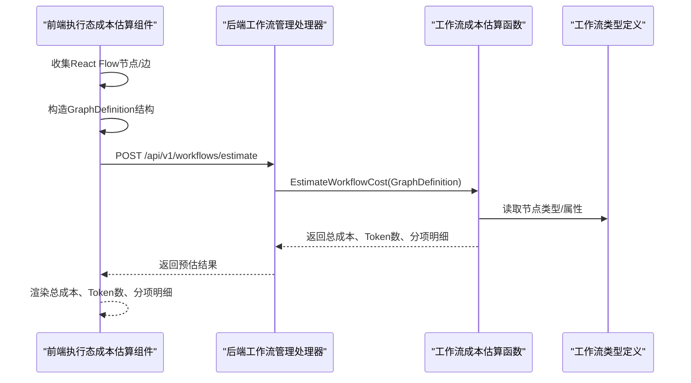
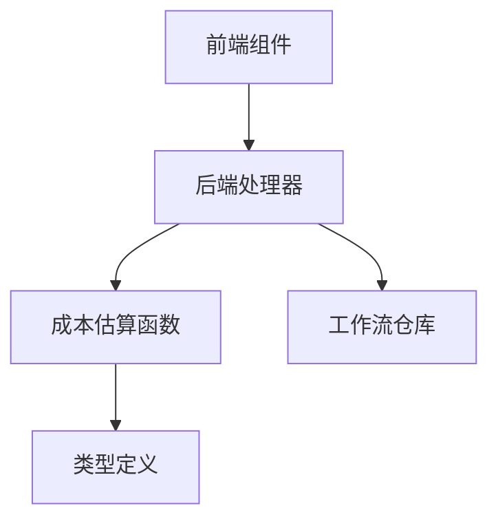
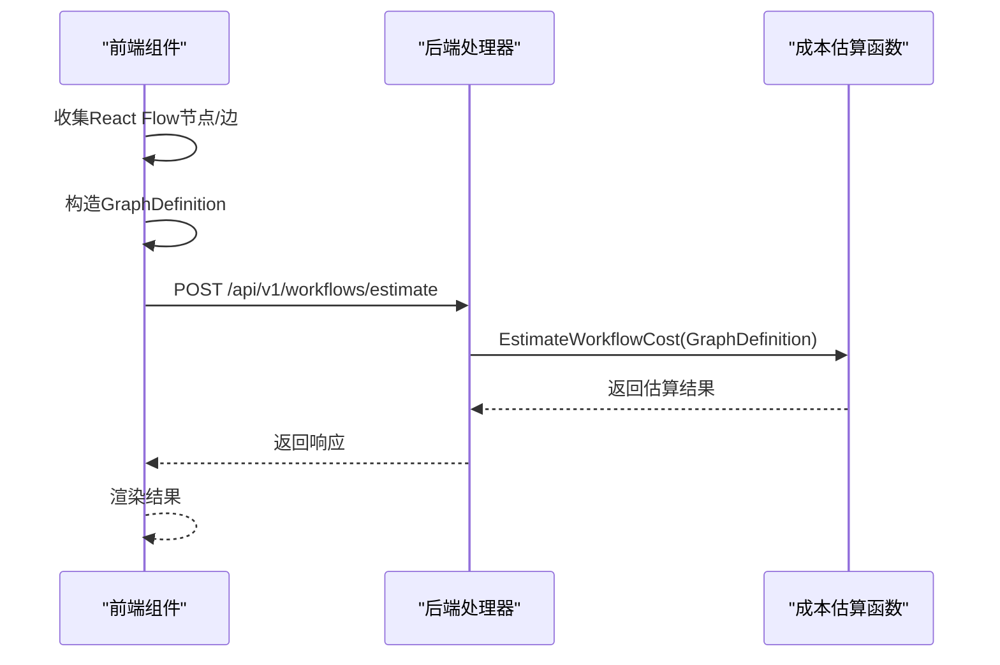

# 成本控制

<cite>
**本文引用的文件**
- [SPEC-407 成本估算API](file://docs/specs/backend/SPEC-407-cost-estimation-api.md)
- [成本估算API设计文档](file://docs/api/cost_estimation.md)
- [工作流管理处理器](file://internal/api/handler/workflow_mgmt.go)
- [工作流成本估算（后端）](file://internal/core/workflow/cost.go)
- [工作流类型定义](file://internal/core/workflow/types.go)
- [工作流校验](file://internal/core/workflow/validation.go)
- [工作流成本估算测试](file://internal/core/workflow/cost_test.go)
- [执行态成本估算组件](file://frontend/src/features/execution/components/CostEstimator.tsx)
- [编辑器保存转换（前端）](file://frontend/src/features/editor/WorkflowEditor.tsx)
- [会话运行状态存储（前端）](file://frontend/src/stores/useWorkflowRunStore.ts)
</cite>

## 目录
1. [简介](#简介)
2. [项目结构](#项目结构)
3. [核心组件](#核心组件)
4. [架构总览](#架构总览)
5. [详细组件分析](#详细组件分析)
6. [依赖分析](#依赖分析)
7. [性能考量](#性能考量)
8. [故障排查指南](#故障排查指南)
9. [结论](#结论)
10. [附录](#附录)

## 简介
本文件聚焦“成本控制”能力，围绕成本预估模块在工作流执行前的Token消耗与执行时间预测进行系统化说明。文档涵盖：
- 前端CostEstimator组件如何采集节点与边信息，构造GraphDefinition结构并发送至后端API；
- 后端如何依据LLM提供商定价模型、输入输出长度估算总成本，并返回包含总成本、Token数及按智能体细分的详细数据；
- 实际估算偏差分析与优化建议，确保预估结果的准确性与实用性。

## 项目结构
成本控制相关代码分布在前后端与核心引擎中：
- 前端：执行态成本估算组件负责将React Flow节点/边转换为后端期望的GraphDefinition结构并发起请求；
- 后端：工作流管理处理器接收请求，调用工作流成本估算函数，返回预估结果；
- 核心引擎：定义GraphDefinition、Node等类型，提供成本估算逻辑与测试。

图表来源
- [执行态成本估算组件](file://frontend/src/features/execution/components/CostEstimator.tsx#L1-L137)
- [工作流管理处理器](file://internal/api/handler/workflow_mgmt.go#L190-L219)
- [工作流成本估算（后端）](file://internal/core/workflow/cost.go#L1-L87)
- [工作流类型定义](file://internal/core/workflow/types.go#L43-L60)

章节来源
- [执行态成本估算组件](file://frontend/src/features/execution/components/CostEstimator.tsx#L1-L137)
- [工作流管理处理器](file://internal/api/handler/workflow_mgmt.go#L190-L219)
- [工作流成本估算（后端）](file://internal/core/workflow/cost.go#L1-L87)
- [工作流类型定义](file://internal/core/workflow/types.go#L43-L60)

## 核心组件
- 前端执行态成本估算组件：将React Flow的nodes/edges转换为后端期望的GraphDefinition结构，发起预估请求并渲染结果。
- 后端工作流管理处理器：接收请求，支持通过ID读取已保存工作流或直接接收草稿GraphDefinition，调用成本估算函数并返回结果。
- 核心成本估算函数：遍历节点，按节点类型与模型配置估算Token与费用，汇总并返回分项明细与总成本。

章节来源
- [执行态成本估算组件](file://frontend/src/features/execution/components/CostEstimator.tsx#L1-L137)
- [工作流管理处理器](file://internal/api/handler/workflow_mgmt.go#L190-L219)
- [工作流成本估算（后端）](file://internal/core/workflow/cost.go#L1-L87)

## 架构总览
成本预估的端到端流程如下：

图表来源
- [执行态成本估算组件](file://frontend/src/features/execution/components/CostEstimator.tsx#L1-L137)
- [工作流管理处理器](file://internal/api/handler/workflow_mgmt.go#L190-L219)
- [工作流成本估算（后端）](file://internal/core/workflow/cost.go#L1-L87)
- [工作流类型定义](file://internal/core/workflow/types.go#L43-L60)

## 详细组件分析

### 前端：执行态成本估算组件
- 能力概述
  - 从React Flow节点/边集合中提取节点类型、名称、属性与连接关系；
  - 将其映射为后端期望的GraphDefinition结构（包含id、name、description、start_node_id、nodes等）；
  - 发起预估请求，接收并渲染总成本、Token数与按智能体的分项明细。
- 关键行为
  - 节点映射：将每个节点的id/type/name/next_ids/properties映射到后端节点结构；
  - 边到next_ids：通过筛选出source为当前节点的所有边的目标节点作为next_ids；
  - 草稿工作流：若未传入ID，则直接以草稿形式提交GraphDefinition；
  - 防抖：节点/边变化时延迟1秒发起请求，避免频繁重算。
- 数据结构
  - 请求体：GraphDefinition（草稿或已保存工作流）
  - 响应体：包含total_cost_usd、total_tokens、agent_breakdown等字段

章节来源
- [执行态成本估算组件](file://frontend/src/features/execution/components/CostEstimator.tsx#L1-L137)

### 后端：工作流管理处理器
- 能力概述
  - 支持两种调用方式：
    - 通过ID读取已保存工作流（GET /api/v1/workflows/:id/estimate）；
    - 直接提交草稿GraphDefinition（POST /api/v1/workflows/estimate）。
  - 调用核心成本估算函数，返回预估结果。
- 关键行为
  - 参数解析：若URL携带ID则从仓库读取工作流；否则从请求体绑定GraphDefinition；
  - 错误处理：未找到工作流返回404，请求体绑定失败返回400；
  - 结果返回：200 OK返回成本估算结果。

章节来源
- [工作流管理处理器](file://internal/api/handler/workflow_mgmt.go#L190-L219)

### 核心：工作流成本估算（后端）
- 能力概述
  - 遍历GraphDefinition中的节点，按节点类型与模型配置估算Token与费用；
  - 逻辑节点免费（如start/end/parallel/vote/loop等），非逻辑节点按平均输入/输出Token估算；
  - 汇总总成本与总Token，并按智能体聚合分项明细。
- 关键逻辑
  - 节点类型判定：逻辑节点返回0成本与0 Token；
  - 模型定价：从全局定价表读取模型单价（默认兜底）；
  - 成本计算：按平均输入/输出Token与单价计算；
  - 分项明细：记录节点ID、名称、模型、估算Token与成本；
  - 总结：返回总成本USD、总Token、节点分项与按智能体的分项明细。

章节来源
- [工作流成本估算（后端）](file://internal/core/workflow/cost.go#L1-L87)

### 类型与结构：GraphDefinition与Node
- GraphDefinition
  - 字段：id、name、description、nodes（map[string]*Node）、start_node_id；
  - 作用：承载工作流的静态定义。
- Node
  - 字段：id、type、name、next_ids、properties；
  - 作用：承载节点的类型、连接关系与属性（如模型、提示词等）。

章节来源
- [工作流类型定义](file://internal/core/workflow/types.go#L43-L60)

### 校验与可达性
- 校验规则
  - 起始节点存在；
  - next_ids指向存在的节点；
  - 允许循环（循环由运行时处理器保护）；
  - 从起始节点可达所有节点。
- 作用：保证GraphDefinition结构有效，避免无效或不可达的节点导致估算偏差。

章节来源
- [工作流校验](file://internal/core/workflow/validation.go#L1-L55)
- [工作流校验](file://internal/core/workflow/validation.go#L53-L69)

### 测试要点
- 估算总Token与总成本符合预期；
- 逻辑节点（如loop/vote）成本为0；
- 按智能体聚合的分项明细正确。

章节来源
- [工作流成本估算测试](file://internal/core/workflow/cost_test.go#L1-L75)

## 依赖分析
- 前端组件依赖
  - React Flow节点/边数据结构；
  - 与后端API的HTTP通信；
  - 本地状态管理（防抖、错误处理）。
- 后端处理器依赖
  - 工作流仓库（读取已保存工作流）；
  - 核心成本估算函数；
  - GraphDefinition与Node类型定义。
- 核心成本估算依赖
  - GraphDefinition与Node类型；
  - 模型定价表（全局定价映射）。

图表来源
- [执行态成本估算组件](file://frontend/src/features/execution/components/CostEstimator.tsx#L1-L137)
- [工作流管理处理器](file://internal/api/handler/workflow_mgmt.go#L190-L219)
- [工作流成本估算（后端）](file://internal/core/workflow/cost.go#L1-L87)
- [工作流类型定义](file://internal/core/workflow/types.go#L43-L60)

章节来源
- [执行态成本估算组件](file://frontend/src/features/execution/components/CostEstimator.tsx#L1-L137)
- [工作流管理处理器](file://internal/api/handler/workflow_mgmt.go#L190-L219)
- [工作流成本估算（后端）](file://internal/core/workflow/cost.go#L1-L87)
- [工作流类型定义](file://internal/core/workflow/types.go#L43-L60)

## 性能考量
- 前端
  - 防抖机制减少频繁请求，提升交互流畅度；
  - 仅在节点/边变化时重新估算，避免不必要的计算。
- 后端
  - 成本估算为O(N)遍历节点，复杂度低；
  - 逻辑节点直接跳过，减少计算量；
  - 定价表查询为常数时间，整体开销可控。

[本节为通用指导，无需列出具体文件来源]

## 故障排查指南
- 前端
  - 若预估失败，检查网络请求是否成功、响应体结构是否符合预期；
  - 确认GraphDefinition构造是否包含start_node_id与nodes映射完整；
  - 检查防抖设置是否导致估算延迟过长。
- 后端
  - 若返回404，确认工作流ID是否存在；
  - 若返回400，检查请求体是否符合GraphDefinition结构；
  - 若估算结果异常，核对模型定价表与节点类型映射。
- 核心
  - 若逻辑节点仍产生费用，检查节点类型枚举与判定逻辑；
  - 若分项明细缺失，检查properties中模型字段是否正确传递。

章节来源
- [执行态成本估算组件](file://frontend/src/features/execution/components/CostEstimator.tsx#L1-L137)
- [工作流管理处理器](file://internal/api/handler/workflow_mgmt.go#L190-L219)
- [工作流成本估算（后端）](file://internal/core/workflow/cost.go#L1-L87)

## 结论
成本预估模块通过“前端采集+后端估算”的协作，实现了在工作流执行前对Token消耗与费用的快速评估。前端组件负责将React Flow结构转换为后端可消费的GraphDefinition，后端基于节点类型与模型定价表进行估算并返回分项明细。通过逻辑节点免费、平均Token估算与按智能体聚合等策略，系统在准确性与性能之间取得平衡。后续可在以下方面持续优化：引入更精细的Token计数、动态定价表、循环/并行节点的权重系数，以及更丰富的警告与建议提示。

[本节为总结性内容，无需列出具体文件来源]

## 附录

### API与数据模型概览
- 端点
  - POST /api/v1/workflows/estimate（草稿）
  - POST /api/v1/workflows/:id/estimate（已保存工作流）
- 请求体
  - GraphDefinition（草稿）或已保存工作流（通过ID）
- 响应体
  - total_cost_usd、total_tokens、agent_breakdown等

章节来源
- [成本估算API设计文档](file://docs/api/cost_estimation.md#L61-L140)
- [SPEC-407 成本估算API](file://docs/specs/backend/SPEC-407-cost-estimation-api.md#L7-L11)
- [工作流管理处理器](file://internal/api/handler/workflow_mgmt.go#L190-L219)

### 前端与后端对接流程（序列图）

图表来源
- [执行态成本估算组件](file://frontend/src/features/execution/components/CostEstimator.tsx#L1-L137)
- [工作流管理处理器](file://internal/api/handler/workflow_mgmt.go#L190-L219)
- [工作流成本估算（后端）](file://internal/core/workflow/cost.go#L1-L87)

### 估算偏差分析与优化建议
- 偏差来源
  - Token估算采用平均值（如1000输入、500输出），未考虑具体提示词长度与上下文；
  - 逻辑节点免费假设与实际运行时的中间产物不一致；
  - 并行/循环节点对总Token的影响未精确建模。
- 优化建议
  - 引入更细粒度的Token计数：基于提示词长度与附件大小动态估算；
  - 为并行/循环节点引入权重系数，反映分支数量与迭代次数；
  - 动态定价表：支持按提供商/模型实时查询最新价格；
  - 增加“预估耗时”字段：结合模型推理速度与并发度估算总耗时；
  - 增强警告与建议：对高成本/长耗时/复杂工作流给出优化建议（如切换模型、拆分节点）。

[本节为通用指导，无需列出具体文件来源]