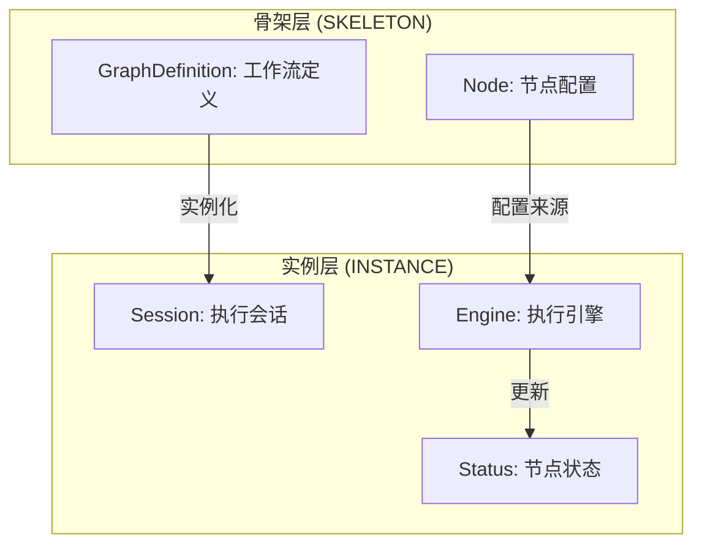
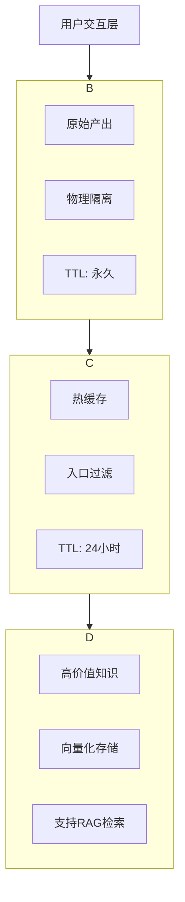
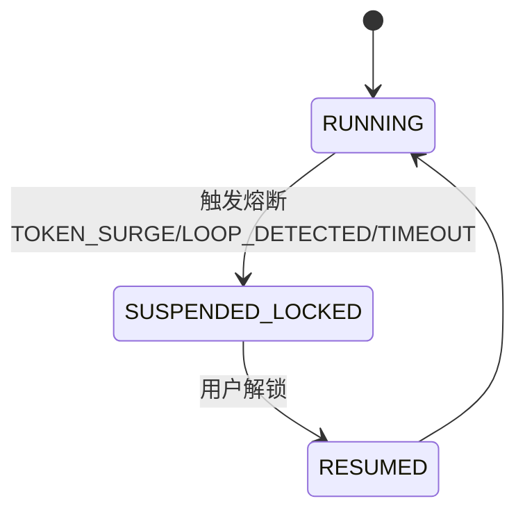
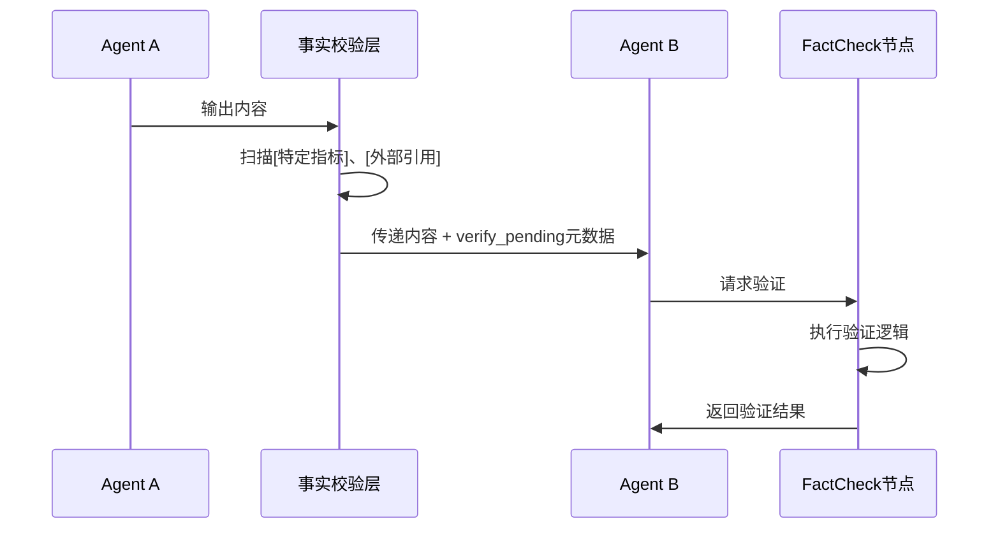
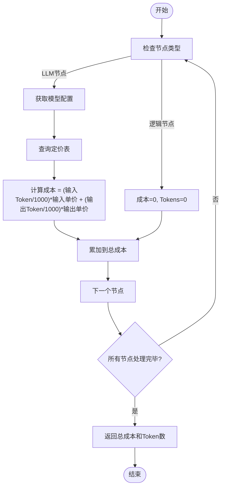

# 核心设计原则

<cite>
**本文档引用的文件**  
- [engine.go](file://internal/core/workflow/engine.go)
- [service.go](file://internal/core/memory/service.go)
- [circuit_breaker.go](file://internal/core/middleware/circuit_breaker.go)
- [cost.go](file://internal/core/workflow/cost.go)
- [factory.go](file://internal/core/workflow/nodes/factory.go)
- [types.go](file://internal/core/workflow/types.go)
- [fact_check.go](file://internal/core/middleware/fact_check.go)
- [memory_retrieval.go](file://internal/core/workflow/nodes/memory_retrieval.go)
- [01_architecture.md](file://docs/tdd/01_architecture.md)
- [THE_COUNCIL_GENESIS.md](file://docs/methodology/THE_COUNCIL_GENESIS.md)
- [08_adr.md](file://docs/tdd/08_adr.md)
- [SPEC-408-memory-protocol.md](file://docs/specs/backend/SPEC-408-memory-protocol.md)
- [SPEC-409-circuit-breaker.md](file://docs/specs/backend/SPEC-409-circuit-breaker.md)
- [SPEC-410-anti-hallucination.md](file://docs/specs/backend/SPEC-410-anti-hallucination.md)
- [SPEC-407-cost-estimation-api.md](file://docs/specs/backend/SPEC-407-cost-estimation-api.md)
</cite>

## 目录
1. [引言](#引言)
2. [骨架层与实例层分离](#骨架层与实例层分离)
3. [三层记忆系统](#三层记忆系统)
4. [防御性编程原则](#防御性编程原则)
5. [成本预估模块](#成本预估模块)
6. [TDD与ADR文档保证架构一致性](#tdd与adr文档保证架构一致性)
7. [结论](#结论)

## 引言

The Council 系统是一个基于云原生的智能代理协作平台，其核心设计原则围绕着可扩展性、可靠性与安全性构建。本文件旨在深入阐述系统背后的关键架构决策，包括“骨架层（SKELETON）”与“实例层（INSTANCE）”的分离哲学、三层记忆系统的实现机制、防御性编程的应用、成本预估逻辑以及如何通过测试驱动开发（TDD）和架构决策记录（ADR）来确保架构的一致性。

**文档来源**
- [THE_COUNCIL_GENESIS.md](file://docs/methodology/THE_COUNCIL_GENESIS.md)

## 骨架层与实例层分离

The Council 系统采用“模式分离 (Mode Separation)”的设计理念，将系统的静态定义与动态执行明确区分开来，即“骨架层”与“实例层”的分离。

- **骨架层（SKELETON）**：代表工作流的静态定义，包含节点类型、连接关系、配置参数等元数据。它不包含任何运行时状态，是可复用、可版本化的模板。在代码中，`GraphDefinition` 结构体（定义于 `types.go`）承载了这一角色，其字段如 `ID`、`Name`、`Nodes` 和 `StartNodeID` 构成了工作流的蓝图。
  
- **实例层（INSTANCE）**：代表工作流的一次具体执行实例，包含运行时状态、输入输出数据、执行进度等动态信息。每个实例都基于一个骨架创建，但拥有独立的生命周期和上下文。`Session` 结构体（未直接展示，但被 `Engine` 引用）和 `Engine` 结构体共同管理实例层的状态。

这种分离使得用户可以设计复杂的工作流模板（骨架），并在不同场景下多次启动执行（实例），同时保证了执行环境的隔离性和可追溯性。

**图示来源**
- [types.go](file://internal/core/workflow/types.go#L43-L67)
- [engine.go](file://internal/core/workflow/engine.go#L11-L37)

**本节来源**
- [01_architecture.md](file://docs/tdd/01_architecture.md)
- [engine.go](file://internal/core/workflow/engine.go)
- [types.go](file://internal/core/workflow/types.go)

## 三层记忆系统

The Council 系统实现了创新的三层记忆协议，旨在净化和管理知识流，确保信息的可靠性与可用性。该系统由隔离区、工作记忆和长期记忆构成，形成了一个从“原始产出”到“可信知识”的净化流水线。

### 隔离区 (Quarantine)

隔离区是所有会议产出的默认存储位置。它充当一个安全的沙箱，防止未经验证的低质量内容或幻觉直接污染核心知识库。任何由 AI 生成的内容在最初阶段都会被存入此层，不参与后续的检索增强生成（RAG）流程。`MemoryService` 的 `LogQuarantine` 方法负责将内容写入 PostgreSQL 的 `quarantine_logs` 表。

### 工作记忆 (Working Memory)

工作记忆是一个基于 Redis 的热缓存层，具有 24 小时的 TTL（生存时间）。它存储了经过入口过滤器（Ingress Filter）筛选的、高置信度的临时上下文。入口过滤器通过检查内容的置信度分数（`confidence < 0.8` 则拒绝）和长度（过短则视为噪声）来确保数据质量。`MemoryService` 的 `UpdateWorkingMemory` 方法实现了这一层的写入逻辑。

### 长期记忆 (Long-Term Memory)

长期记忆是经验证的高价值知识的永久存储，基于 PostgreSQL 的 `pgvector` 扩展实现。当用户或系统确认某条信息的可靠性后，可通过 `Promote` 操作将其从隔离区晋升至此层。晋升过程包括文本分块、嵌入生成和向量化存储，使得知识可以被高效地语义检索。`MemoryService` 的 `Promote` 和 `Retrieve` 方法分别负责知识的晋升和检索。

**图示来源**
- [SPEC-408-memory-protocol.md](file://docs/specs/backend/SPEC-408-memory-protocol.md)
- [service.go](file://internal/core/memory/service.go#L28-L208)

**本节来源**
- [THE_COUNCIL_GENESIS.md](file://docs/methodology/THE_COUNCIL_GENESIS.md)
- [SPEC-408-memory-protocol.md](file://docs/specs/backend/SPEC-408-memory-protocol.md)
- [service.go](file://internal/core/memory/service.go)

## 防御性编程原则

The Council 系统将防御性编程作为核心原则，通过逻辑熔断器和反幻觉机制来确保系统的稳定性和输出的可靠性。

### 逻辑熔断器

逻辑熔断器是一种中间件（`Middleware`），用于防止无限循环和资源滥用。它通过监控执行过程中的关键指标来触发保护机制：
- **Token 消耗激增**：当实际 Token 消耗超过预估值的 3 倍时，熔断器会触发。
- **死循环检测**：通过计算连续对话的熵值，若熵值过低（如 < 0.1），则判定为无效重复循环。
- **执行超时**：单次执行超过 10 分钟则强制中断。

一旦触发，系统会进入 `SUSPENDED_LOCKED` 状态，前端会弹出灰阶模式的解锁对话框，要求用户进行风险陈述或完成安全自查后才能继续，从而有效防止失控。

**图示来源**
- [SPEC-409-circuit-breaker.md](file://docs/specs/backend/SPEC-409-circuit-breaker.md)
- [circuit_breaker.go](file://internal/core/middleware/circuit_breaker.go#L9-L40)

### 反幻觉机制

反幻觉机制通过一个事实校验层（Fact Verification Layer）来确保输出的可靠性。该机制在 `AfterNodeExecution` 阶段扫描节点输出，使用正则表达式匹配潜在的未验证声明，如百分比、金额、年份和引用声明。一旦发现，系统会自动在输出的元数据中添加 `verify_pending` 标志。

前端会根据此标志显示“⚠️ Verify Pending”警告徽章，并对可疑文本进行波浪线下划线高亮。这不仅提醒用户注意信息的可靠性，还为下游的 `FactCheck` 节点提供了明确的验证目标，形成一个闭环的防幻觉流程。

**图示来源**
- [SPEC-410-anti-hallucination.md](file://docs/specs/backend/SPEC-410-anti-hallucination.md)
- [fact_check.go](file://internal/core/middleware/fact_check.go#L10-L53)

**本节来源**
- [SPEC-409-circuit-breaker.md](file://docs/specs/backend/SPEC-409-circuit-breaker.md)
- [SPEC-410-anti-hallucination.md](file://docs/specs/backend/SPEC-410-anti-hallucination.md)
- [circuit_breaker.go](file://internal/core/middleware/circuit_breaker.go)
- [fact_check.go](file://internal/core/middleware/fact_check.go)

## 成本预估模块

成本预估模块允许用户在执行工作流之前预测其 Token 消耗和费用，从而实现成本控制。该模块的核心是 `EstimateWorkflowCost` 函数，它基于工作流的骨架定义进行静态分析。

预估过程如下：
1. **遍历所有节点**：对工作流中的每个节点进行分析。
2. **跳过逻辑节点**：`start`、`end`、`vote`、`loop` 等逻辑节点不消耗 Token，成本为 0。
3. **估算 LLM 节点**：对于 `agent` 等 LLM 节点，采用默认的启发式估算（如 1000 输入 Token，500 输出 Token）。
4. **查询定价模型**：根据节点配置的模型（如 `gpt-4-turbo`）查询内置的 `ModelPricing` 表，获取每千 Token 的价格。
5. **计算总成本**：将所有 LLM 节点的成本累加，得出总预估成本和 Token 数。

该预估通过 `/api/v1/workflows/:id/estimate` API 端点暴露给前端，使用户能够在启动前做出知情决策。

**图示来源**
- [cost.go](file://internal/core/workflow/cost.go#L18-L87)
- [SPEC-407-cost-estimation-api.md](file://docs/specs/backend/SPEC-407-cost-estimation-api.md)

**本节来源**
- [cost.go](file://internal/core/workflow/cost.go)
- [SPEC-407-cost-estimation-api.md](file://docs/specs/backend/SPEC-407-cost-estimation-api.md)

## TDD与ADR文档保证架构一致性

The Council 系统通过严格的测试驱动开发（TDD）和架构决策记录（ADR）流程来保证架构的一致性和可维护性。

### 测试驱动开发 (TDD)

项目采用“契约优先”和“模拟优先”的开发模式。所有核心功能（如工作流引擎、记忆服务、中间件）都遵循“Spec -> Test -> Code”的流程。在 `docs/tdd/` 目录下，为每个核心组件（如 `01_architecture.md`、`02_ai_gateway.md`）都编写了详细的 TDD 规范。开发人员首先根据规范编写测试用例，然后实现代码，确保所有功能在开发初期就具备可测试性，最终通过全面的单元测试和集成测试来验证系统质量。

### 架构决策记录 (ADR)

所有关键技术选型都通过 ADR 文档进行正式记录和论证。例如：
- **ADR-001** 记录了选择 PostgreSQL + pgvector 作为数据库的决策，基于其对向量和关系数据的统一支持。
- **ADR-002** 解释了选用 Gin 框架的原因，包括其高性能和丰富的中间件生态。
- **ADR-003** 论证了采用前后端分离架构的必要性，以实现最佳的交互体验和独立部署。

这些 ADR 文档（位于 `docs/tdd/08_adr.md`）为团队提供了清晰的技术路线图，确保了决策的透明性和可追溯性，避免了技术债务的积累。

**本节来源**
- [08_adr.md](file://docs/tdd/08_adr.md)
- [01_architecture.md](file://docs/tdd/01_architecture.md)
- [THE_COUNCIL_GENESIS.md](file://docs/methodology/THE_COUNCIL_GENESIS.md)

## 结论

The Council 系统的核心设计原则体现了对复杂 AI 系统工程化的深刻理解。通过“骨架层”与“实例层”的分离，实现了工作流的灵活复用；通过三层记忆系统，构建了一个可靠的知识净化与管理机制；通过逻辑熔断器和反幻觉机制，确保了系统的安全与输出的可信；通过成本预估模块，赋予了用户成本控制的能力；最后，通过 TDD 和 ADR 文档，建立了保证架构一致性和长期可维护性的坚实基础。这些原则共同构成了 The Council 系统稳健、可靠且可扩展的基石。