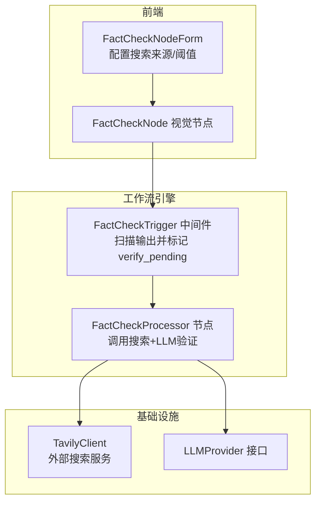
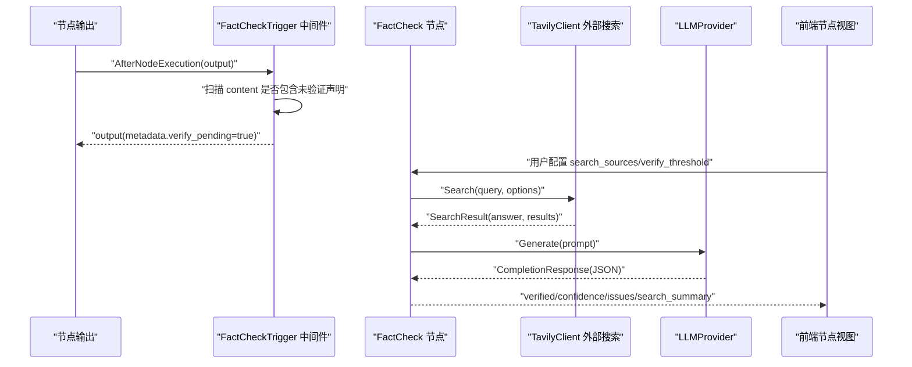
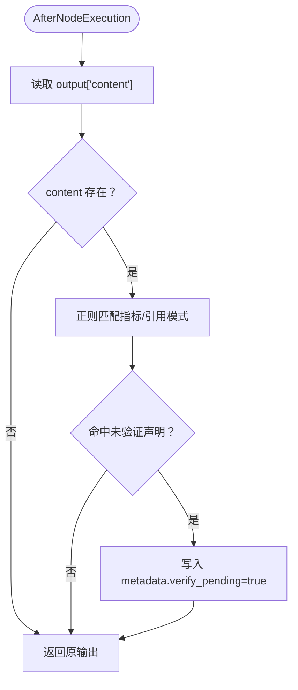
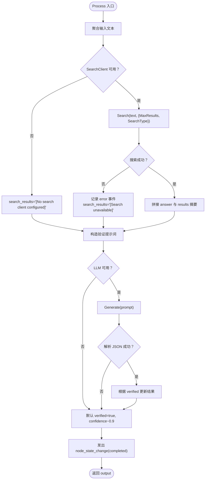
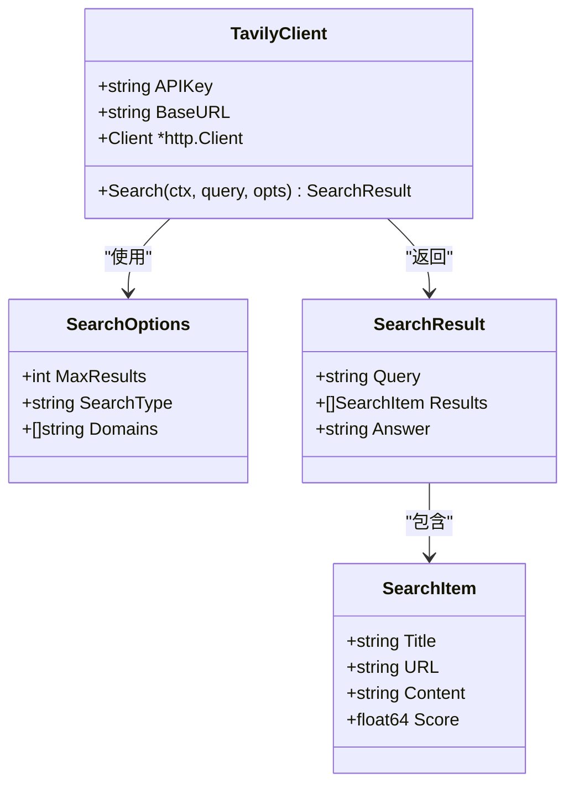
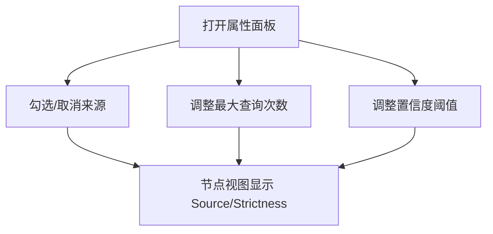
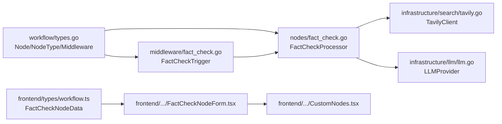

# 反幻觉机制

<cite>
**本文引用的文件列表**
- [internal/core/middleware/fact_check.go](file://internal/core/middleware/fact_check.go)
- [internal/core/workflow/nodes/fact_check.go](file://internal/core/workflow/nodes/fact_check.go)
- [internal/infrastructure/search/tavily.go](file://internal/infrastructure/search/tavily.go)
- [frontend/src/features/editor/components/PropertyPanel/NodeForms/FactCheckNodeForm.tsx](file://frontend/src/features/editor/components/PropertyPanel/NodeForms/FactCheckNodeForm.tsx)
- [frontend/src/components/workflow/nodes/CustomNodes.tsx](file://frontend/src/components/workflow/nodes/CustomNodes.tsx)
- [frontend/src/types/workflow.ts](file://frontend/src/types/workflow.ts)
- [internal/core/workflow/types.go](file://internal/core/workflow/types.go)
- [internal/infrastructure/llm/llm.go](file://internal/infrastructure/llm/llm.go)
- [docs/specs/backend/SPEC-410-anti-hallucination.md](file://docs/specs/backend/SPEC-410-anti-hallucination.md)
- [docs/specs/backend/SPEC-404-factcheck-processor.md](file://docs/specs/backend/SPEC-404-factcheck-processor.md)
- [docs/specs/sprint3/SPEC-203-factcheck-humanreview-nodes.md](file://docs/specs/sprint3/SPEC-203-factcheck-humanreview-nodes.md)
- [docs/tdd/02_core/12_fact_check.md](file://docs/tdd/02_core/12_fact_check.md)
- [internal/core/workflow/nodes/fact_check_test.go](file://internal/core/workflow/nodes/fact_check_test.go)
</cite>

## 目录
1. [引言](#引言)
2. [项目结构](#项目结构)
3. [核心组件](#核心组件)
4. [架构总览](#架构总览)
5. [详细组件分析](#详细组件分析)
6. [依赖关系分析](#依赖关系分析)
7. [性能考量](#性能考量)
8. [故障排查指南](#故障排查指南)
9. [结论](#结论)
10. [附录](#附录)

## 引言
本文件系统性阐述反幻觉机制的实现原理，重点围绕 FactCheckNode 节点如何触发外部搜索服务（Tavily）进行信息验证，解释 verify_threshold 阈值控制与 search_sources 来源限制在事实核查中的作用机制，并结合前端 UI 组件 FactCheckNode 的配置界面，展示用户如何定义核查严格度。同时提供典型误报场景的处理策略与性能开销优化方案，帮助读者全面理解该机制的设计目标、实现方式与工程实践。

## 项目结构
反幻觉机制由三部分协同组成：
- 中间件扫描：在节点执行后扫描输出内容，识别潜在未验证事实声明并打上待核查标记。
- 工作流节点：FactCheck 节点负责调用外部搜索（如 Tavily）并结合 LLM 进行事实验证，产出 verified、confidence、issues 等结果。
- 前端配置：通过节点属性面板允许用户选择搜索来源、设置最大查询次数与置信度阈值，直观定义核查严格度。

图表来源
- [internal/core/middleware/fact_check.go](file://internal/core/middleware/fact_check.go#L1-L52)
- [internal/core/workflow/nodes/fact_check.go](file://internal/core/workflow/nodes/fact_check.go#L1-L114)
- [internal/infrastructure/search/tavily.go](file://internal/infrastructure/search/tavily.go#L1-L154)
- [frontend/src/features/editor/components/PropertyPanel/NodeForms/FactCheckNodeForm.tsx](file://frontend/src/features/editor/components/PropertyPanel/NodeForms/FactCheckNodeForm.tsx#L1-L88)
- [frontend/src/components/workflow/nodes/CustomNodes.tsx](file://frontend/src/components/workflow/nodes/CustomNodes.tsx#L77-L94)

章节来源
- [internal/core/middleware/fact_check.go](file://internal/core/middleware/fact_check.go#L1-L52)
- [internal/core/workflow/nodes/fact_check.go](file://internal/core/workflow/nodes/fact_check.go#L1-L114)
- [frontend/src/features/editor/components/PropertyPanel/NodeForms/FactCheckNodeForm.tsx](file://frontend/src/features/editor/components/PropertyPanel/NodeForms/FactCheckNodeForm.tsx#L1-L88)
- [frontend/src/components/workflow/nodes/CustomNodes.tsx](file://frontend/src/components/workflow/nodes/CustomNodes.tsx#L77-L94)

## 核心组件
- 中间件 FactCheckTrigger：在节点执行后扫描输出内容，若命中特定模式（如指标、外部引用等），则在 metadata 中注入 verify_pending 标记，提示后续需要事实核查。
- FactCheckProcessor：收集输入文本，调用外部搜索（默认 Tavily）与 LLM，综合判断是否通过验证，输出 verified、confidence、issues、search_summary 等字段。
- 前端 FactCheckNodeForm：提供搜索来源勾选（tavily、serper、local_kb）、最大查询次数与置信度阈值滑块，用于定义核查严格度。
- 类型定义：工作流节点类型、FactCheck 节点数据结构、LLM 请求/响应接口等。

章节来源
- [internal/core/middleware/fact_check.go](file://internal/core/middleware/fact_check.go#L1-L52)
- [internal/core/workflow/nodes/fact_check.go](file://internal/core/workflow/nodes/fact_check.go#L1-L114)
- [frontend/src/features/editor/components/PropertyPanel/NodeForms/FactCheckNodeForm.tsx](file://frontend/src/features/editor/components/PropertyPanel/NodeForms/FactCheckNodeForm.tsx#L1-L88)
- [frontend/src/types/workflow.ts](file://frontend/src/types/workflow.ts#L1-L45)
- [internal/core/workflow/types.go](file://internal/core/workflow/types.go#L1-L67)
- [internal/infrastructure/llm/llm.go](file://internal/infrastructure/llm/llm.go#L1-L64)

## 架构总览
反幻觉机制在工作流执行链路中形成“检测—验证—反馈”的闭环：
- 执行阶段：中间件扫描节点输出，发现未验证事实声明即打上 verify_pending。
- 核查阶段：FactCheck 节点触发外部搜索（Tavily）并结合 LLM 对文本进行验证，输出验证结果。
- 反馈阶段：前端节点展示来源数量与严格度；工作流可根据 verify_threshold 决定是否放行或阻断。

图表来源
- [internal/core/middleware/fact_check.go](file://internal/core/middleware/fact_check.go#L31-L51)
- [internal/core/workflow/nodes/fact_check.go](file://internal/core/workflow/nodes/fact_check.go#L20-L113)
- [internal/infrastructure/search/tavily.go](file://internal/infrastructure/search/tavily.go#L80-L143)
- [internal/infrastructure/llm/llm.go](file://internal/infrastructure/llm/llm.go#L13-L41)
- [frontend/src/components/workflow/nodes/CustomNodes.tsx](file://frontend/src/components/workflow/nodes/CustomNodes.tsx#L77-L94)

## 详细组件分析

### 中间件：FactCheckTrigger
- 功能：在节点执行后扫描输出内容，若命中指标或外部引用等模式，则在 metadata 中注入 verify_pending 标记，提示后续需要事实核查。
- 关键点：正则匹配规则用于识别潜在未验证声明；中间件不改变输出内容，仅注入元数据标记。

图表来源
- [internal/core/middleware/fact_check.go](file://internal/core/middleware/fact_check.go#L31-L51)

章节来源
- [internal/core/middleware/fact_check.go](file://internal/core/middleware/fact_check.go#L1-L52)

### 节点：FactCheckProcessor
- 输入聚合：遍历输入 map，拼接字符串作为待核查文本。
- 外部搜索：调用 SearchClient.Search，使用 MaxResults 与 SearchType（answer）获取直接答案与检索结果摘要。
- LLM 验证：构造提示词，要求 LLM 输出 JSON，包含 verified、confidence、issues 字段；解析响应并更新结果。
- 结果输出：包含 verified、confidence、issues、search_summary、timestamp 等字段，并发出节点状态变更事件。

图表来源
- [internal/core/workflow/nodes/fact_check.go](file://internal/core/workflow/nodes/fact_check.go#L20-L113)

章节来源
- [internal/core/workflow/nodes/fact_check.go](file://internal/core/workflow/nodes/fact_check.go#L1-L114)
- [internal/infrastructure/llm/llm.go](file://internal/infrastructure/llm/llm.go#L13-L41)

### 外部搜索：TavilyClient
- 客户端创建：从环境变量读取 API Key，设置超时，构造 HTTP 客户端。
- 请求体：包含 api_key、query、search_depth、include_answer、max_results、domains 等字段。
- 响应解析：解码 answer 与 results，映射为 SearchResult 结构。
- 错误处理：API Key 缺失、请求失败、HTTP 非 200、JSON 解码失败均返回错误。

图表来源
- [internal/infrastructure/search/tavily.go](file://internal/infrastructure/search/tavily.go#L1-L154)

章节来源
- [internal/infrastructure/search/tavily.go](file://internal/infrastructure/search/tavily.go#L1-L154)

### 前端：FactCheckNode 配置界面
- 搜索来源：支持勾选 tavily、serper、local_kb，用于限制事实核查的来源范围。
- 最大查询次数：滑块控制，影响节点内部的搜索强度与成本。
- 置信度阈值：滑块控制，决定整体验证通过与否的严格程度。
- 节点展示：在画布上显示当前来源数量与严格度，便于用户快速感知。

图表来源
- [frontend/src/features/editor/components/PropertyPanel/NodeForms/FactCheckNodeForm.tsx](file://frontend/src/features/editor/components/PropertyPanel/NodeForms/FactCheckNodeForm.tsx#L1-L88)
- [frontend/src/components/workflow/nodes/CustomNodes.tsx](file://frontend/src/components/workflow/nodes/CustomNodes.tsx#L77-L94)
- [frontend/src/types/workflow.ts](file://frontend/src/types/workflow.ts#L27-L31)

章节来源
- [frontend/src/features/editor/components/PropertyPanel/NodeForms/FactCheckNodeForm.tsx](file://frontend/src/features/editor/components/PropertyPanel/NodeForms/FactCheckNodeForm.tsx#L1-L88)
- [frontend/src/components/workflow/nodes/CustomNodes.tsx](file://frontend/src/components/workflow/nodes/CustomNodes.tsx#L77-L94)
- [frontend/src/types/workflow.ts](file://frontend/src/types/workflow.ts#L27-L31)

### 验证阈值与来源限制的作用机制
- verify_threshold：节点输出包含 verified 字段，前端节点视图显示当前严格度；工作流可根据该阈值决定是否放行或阻断。
- search_sources：前端属性面板允许用户勾选来源，节点内部可据此选择搜索客户端（如 Tavily）；结合 max_queries 控制搜索强度与成本。

章节来源
- [frontend/src/features/editor/components/PropertyPanel/NodeForms/FactCheckNodeForm.tsx](file://frontend/src/features/editor/components/PropertyPanel/NodeForms/FactCheckNodeForm.tsx#L1-L88)
- [frontend/src/components/workflow/nodes/CustomNodes.tsx](file://frontend/src/components/workflow/nodes/CustomNodes.tsx#L77-L94)
- [frontend/src/types/workflow.ts](file://frontend/src/types/workflow.ts#L27-L31)
- [internal/core/workflow/nodes/fact_check.go](file://internal/core/workflow/nodes/fact_check.go#L20-L113)

### 与规范/设计的对照
- SPEC-410：防幻觉传播机制概述、消息标记、与 FactCheck 节点集成思路。
- SPEC-404：FactCheckProcessor 数据结构与实现逻辑，强调“逐条核查—汇总判定”的流程。
- TDD-12：FactCheck 节点处理器的早期设计，包含 claims 抽取、混合搜索（Web+Local）、阈值判定等。
- Sprint3 UI 规范：明确 FactCheck 节点属性（search_sources、max_queries、verify_threshold）与属性面板。

章节来源
- [docs/specs/backend/SPEC-410-anti-hallucination.md](file://docs/specs/backend/SPEC-410-anti-hallucination.md#L1-L157)
- [docs/specs/backend/SPEC-404-factcheck-processor.md](file://docs/specs/backend/SPEC-404-factcheck-processor.md#L1-L79)
- [docs/tdd/02_core/12_fact_check.md](file://docs/tdd/02_core/12_fact_check.md#L1-L84)
- [docs/specs/sprint3/SPEC-203-factcheck-humanreview-nodes.md](file://docs/specs/sprint3/SPEC-203-factcheck-humanreview-nodes.md#L1-L65)

## 依赖关系分析
- 中间件依赖工作流 Session/Node 类型，用于在节点执行后注入元数据。
- FactCheck 节点依赖 SearchClient（默认 Tavily）与 LLMProvider 接口，输出标准化验证结果。
- 前端节点类型与属性面板通过统一的 FactCheckNodeData 结构承载配置。

图表来源
- [internal/core/workflow/types.go](file://internal/core/workflow/types.go#L1-L67)
- [internal/core/middleware/fact_check.go](file://internal/core/middleware/fact_check.go#L1-L52)
- [internal/core/workflow/nodes/fact_check.go](file://internal/core/workflow/nodes/fact_check.go#L1-L114)
- [internal/infrastructure/search/tavily.go](file://internal/infrastructure/search/tavily.go#L1-L154)
- [internal/infrastructure/llm/llm.go](file://internal/infrastructure/llm/llm.go#L1-L64)
- [frontend/src/types/workflow.ts](file://frontend/src/types/workflow.ts#L1-L45)
- [frontend/src/features/editor/components/PropertyPanel/NodeForms/FactCheckNodeForm.tsx](file://frontend/src/features/editor/components/PropertyPanel/NodeForms/FactCheckNodeForm.tsx#L1-L88)
- [frontend/src/components/workflow/nodes/CustomNodes.tsx](file://frontend/src/components/workflow/nodes/CustomNodes.tsx#L77-L94)

章节来源
- [internal/core/workflow/types.go](file://internal/core/workflow/types.go#L1-L67)
- [internal/core/middleware/fact_check.go](file://internal/core/middleware/fact_check.go#L1-L52)
- [internal/core/workflow/nodes/fact_check.go](file://internal/core/workflow/nodes/fact_check.go#L1-L114)
- [internal/infrastructure/search/tavily.go](file://internal/infrastructure/search/tavily.go#L1-L154)
- [internal/infrastructure/llm/llm.go](file://internal/infrastructure/llm/llm.go#L1-L64)
- [frontend/src/types/workflow.ts](file://frontend/src/types/workflow.ts#L1-L45)
- [frontend/src/features/editor/components/PropertyPanel/NodeForms/FactCheckNodeForm.tsx](file://frontend/src/features/editor/components/PropertyPanel/NodeForms/FactCheckNodeForm.tsx#L1-L88)
- [frontend/src/components/workflow/nodes/CustomNodes.tsx](file://frontend/src/components/workflow/nodes/CustomNodes.tsx#L77-L94)

## 性能考量
- 搜索成本控制
  - 使用 max_queries 限制搜索次数，避免重复或冗余查询。
  - 通过 search_sources 限定来源，减少跨域检索带来的网络与时间开销。
- LLM 调用优化
  - 采用较低温度与简洁提示词，降低 Token 消耗与响应时间。
  - 在搜索失败或未配置时，节点以降级方式继续执行，避免阻塞。
- 中间件扫描开销
  - 正则匹配仅针对 content 字段，复杂度与内容长度线性相关，通常开销可控。
- 前端渲染与交互
  - 节点视图仅展示来源数量与严格度，不涉及重型计算；属性面板滑块交互轻量。

章节来源
- [frontend/src/features/editor/components/PropertyPanel/NodeForms/FactCheckNodeForm.tsx](file://frontend/src/features/editor/components/PropertyPanel/NodeForms/FactCheckNodeForm.tsx#L53-L88)
- [internal/core/workflow/nodes/fact_check.go](file://internal/core/workflow/nodes/fact_check.go#L20-L113)
- [internal/core/middleware/fact_check.go](file://internal/core/middleware/fact_check.go#L31-L51)

## 故障排查指南
- 外部搜索失败
  - 现象：节点输出包含 error 事件，search_summary 显示“[Search unavailable]”。
  - 排查：检查 TAVILY_API_KEY 是否正确配置；确认网络连通性；查看 TavilyClient 返回的状态码与错误信息。
- LLM 解析失败
  - 现象：节点输出 verified 默认为 true，confidence 为约 0.9；或 issues 包含“LLM flagged potential inaccuracies”。
  - 排查：确认 LLMProvider 可用；检查提示词格式与 JSON 输出约束；必要时提高温度或调整提示词。
- 中间件未标记 verify_pending
  - 现象：节点输出未注入 metadata.verify_pending。
  - 排查：确认 content 字段存在；核对正则匹配规则是否覆盖到目标模式。
- 前端配置无效
  - 现象：节点视图未反映来源数量与严格度。
  - 排查：确认节点数据结构 FactCheckNodeData 的 search_sources、verify_threshold 字段已正确传入；检查属性面板 onChange 回调是否生效。

章节来源
- [internal/core/workflow/nodes/fact_check.go](file://internal/core/workflow/nodes/fact_check.go#L36-L63)
- [internal/infrastructure/search/tavily.go](file://internal/infrastructure/search/tavily.go#L80-L143)
- [internal/core/middleware/fact_check.go](file://internal/core/middleware/fact_check.go#L31-L51)
- [frontend/src/features/editor/components/PropertyPanel/NodeForms/FactCheckNodeForm.tsx](file://frontend/src/features/editor/components/PropertyPanel/NodeForms/FactCheckNodeForm.tsx#L1-L88)
- [frontend/src/components/workflow/nodes/CustomNodes.tsx](file://frontend/src/components/workflow/nodes/CustomNodes.tsx#L77-L94)

## 结论
反幻觉机制通过“中间件扫描 + 节点验证 + 前端配置”的组合，实现了对工作流中潜在未验证事实声明的拦截与纠正。FactCheckNode 节点以 Tavily 为默认外部搜索源，结合 LLM 的 JSON 输出解析，输出 verified、confidence、issues 等关键指标；verify_threshold 与 search_sources 为用户提供可调的严格度与来源限制。配合中间件的 verify_pending 标记，可在工作流层面形成“可逆性”的事实核查闭环。在工程实践中，应重视搜索与 LLM 的成本控制、错误处理与前端配置的可见性，以获得更稳健的用户体验。

## 附录
- 典型误报场景与策略
  - 场景：LLM 将“可能”“据称”等模糊表述误判为事实。
    - 策略：提高 verify_threshold；在提示词中强调“仅当明确事实时才视为 verified”；必要时引入人工复核节点。
  - 场景：外部搜索结果质量不佳或时效性不足。
    - 策略：扩展 search_sources（如 serper、local_kb）；限制 MaxResults 与 Domains；在节点内部对 answer 与 results 进行加权评分后再判定。
  - 场景：中间件误判（如正则覆盖过宽）。
    - 策略：细化正则规则；仅对高风险模式（如指标、引用）启用 verify_pending；在前端 UI 中提供“忽略并继续”的安全开关。
- 性能优化建议
  - 搜索侧：缓存热点查询结果；按来源聚合去重；限制 Domains 与 MaxResults。
  - LLM 侧：固定提示词模板；降低温度；对 JSON 输出进行强约束与校验。
  - 中间件侧：对超长内容进行截断或采样；仅在命中高置信度模式时注入 verify_pending。
  - 前端侧：延迟加载节点详情；合并多次配置变更；提供“一键重置”默认值。

章节来源
- [docs/specs/backend/SPEC-410-anti-hallucination.md](file://docs/specs/backend/SPEC-410-anti-hallucination.md#L1-L157)
- [docs/specs/backend/SPEC-404-factcheck-processor.md](file://docs/specs/backend/SPEC-404-factcheck-processor.md#L1-L79)
- [docs/tdd/02_core/12_fact_check.md](file://docs/tdd/02_core/12_fact_check.md#L1-L84)
- [internal/core/workflow/nodes/fact_check_test.go](file://internal/core/workflow/nodes/fact_check_test.go#L1-L62)