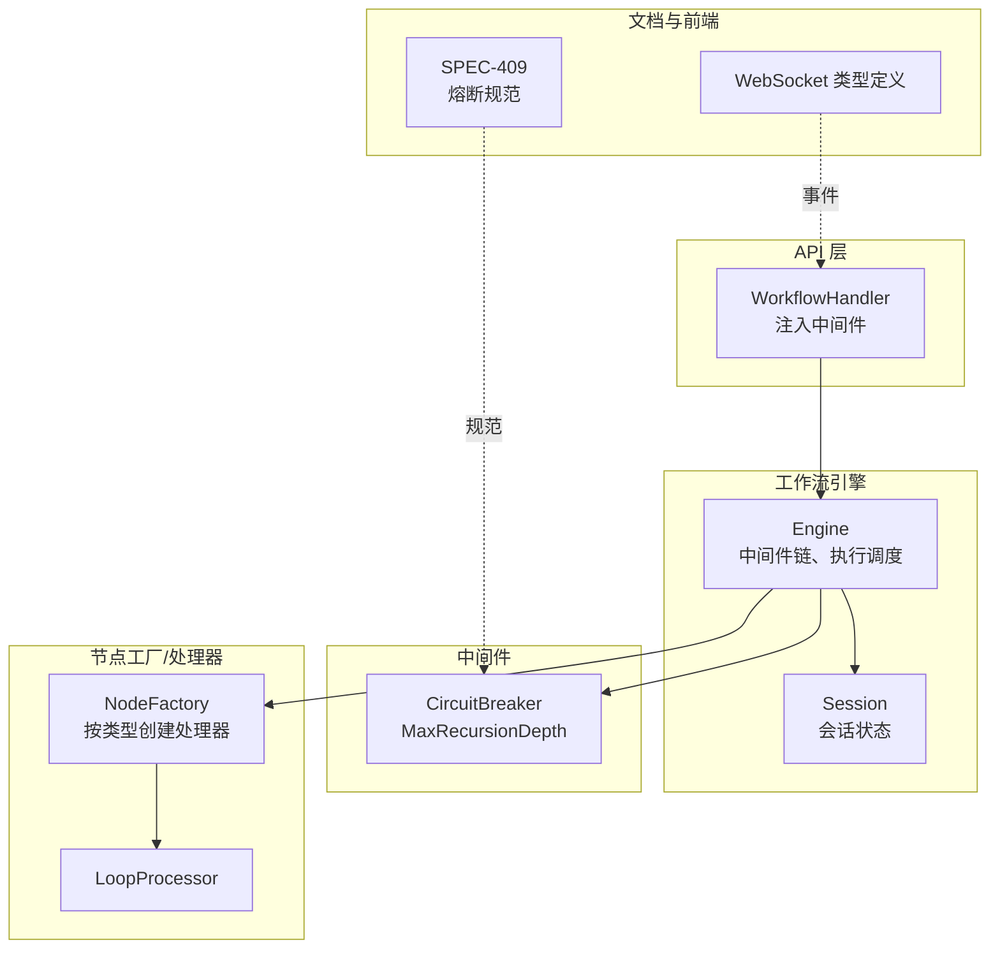
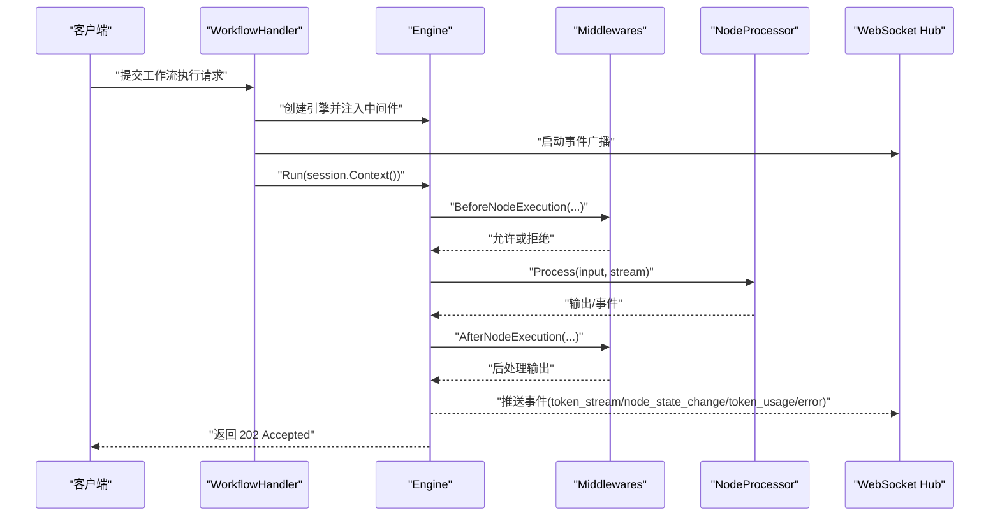
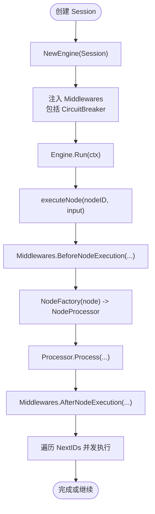
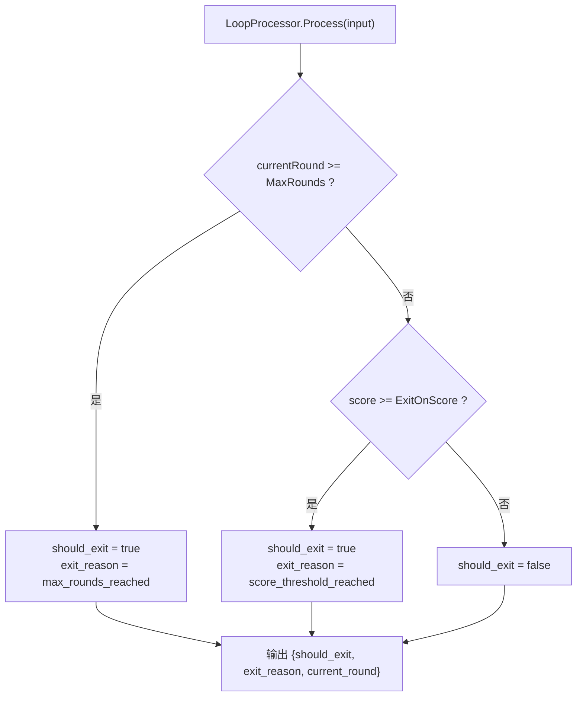
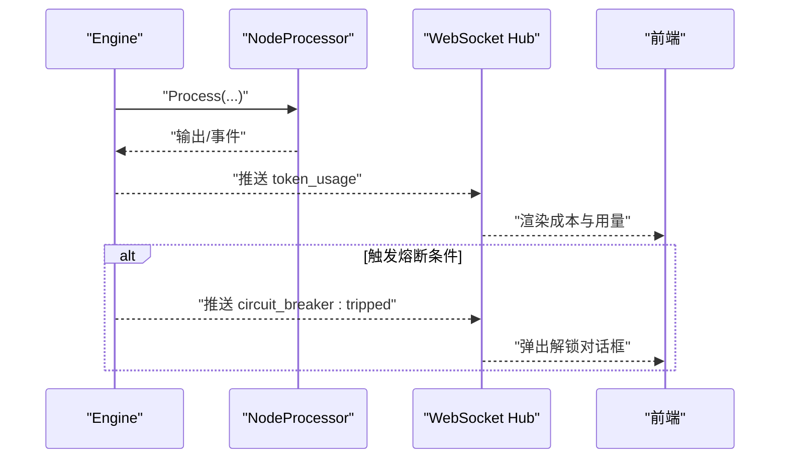
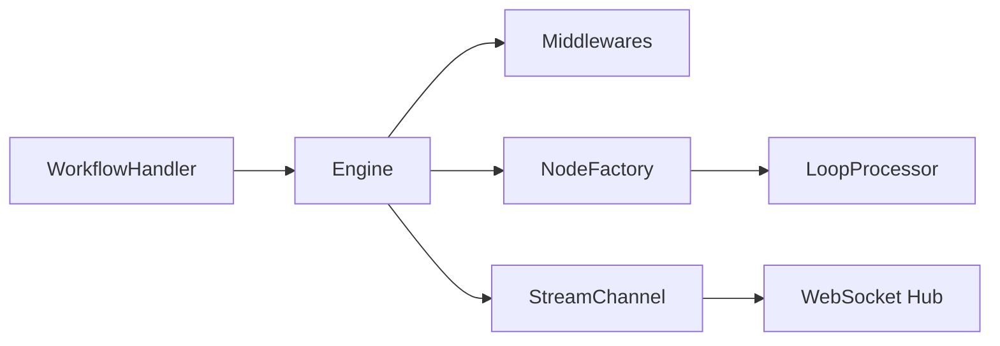

# 熔断机制

<cite>
**本文引用的文件**
- [circuit_breaker.go](file://internal/core/middleware/circuit_breaker.go)
- [engine.go](file://internal/core/workflow/engine.go)
- [workflow.go](file://internal/api/handler/workflow.go)
- [SPEC-409-circuit-breaker.md](file://docs/specs/backend/SPEC-409-circuit-breaker.md)
- [loop.go](file://internal/core/workflow/nodes/loop.go)
- [factory.go](file://internal/core/workflow/nodes/factory.go)
- [SPEC-603-default-workflows.md](file://docs/specs/sprint6/SPEC-603-default-workflows.md)
- [SPEC-005-websocket-optimization.md](file://docs/specs/sprint1/SPEC-005-websocket-optimization.md)
- [websocket.ts](file://frontend/src/types/websocket.ts)
- [useSessionStore.ts](file://frontend/src/stores/useSessionStore.ts)
- [2025-12-21-websocket-debugging-report.md](file://docs/reports/debugging/2025-12-21-websocket-debugging-report.md)
</cite>

## 目录
1. [简介](#简介)
2. [项目结构](#项目结构)
3. [核心组件](#核心组件)
4. [架构总览](#架构总览)
5. [详细组件分析](#详细组件分析)
6. [依赖关系分析](#依赖关系分析)
7. [性能考量](#性能考量)
8. [故障排查指南](#故障排查指南)
9. [结论](#结论)
10. [附录](#附录)

## 简介
本文件围绕“逻辑熔断”能力展开，重点解释以下主题：
- CircuitBreaker 结构体中 MaxRecursionDepth 字段在防止工作流无限递归中的作用与现状
- NodeFactory 的初始化流程与工作流执行引擎的集成方式
- 熔断器作为中间件注入到工作流执行引擎的控制流
- 实际工作流配置示例，展示当递归深度超过阈值时系统的响应行为
- 错误日志格式、监控指标采集方式以及可配置参数的调优建议

## 项目结构
围绕熔断机制的相关代码分布在如下模块：
- 中间件层：逻辑熔断器实现位于 middleware 包
- 工作流引擎：执行流程、中间件链、事件通道等位于 workflow 包
- API 层：工作流执行入口处注入中间件，桥接引擎事件到 WebSocket
- 节点工厂与节点处理器：负责根据节点类型创建处理器
- 规范文档：SPEC-409 对熔断器的状态机、触发条件、解锁流程进行了规范
- 前后端通信协议：WebSocket 事件类型、token_usage 等指标



图表来源
- [workflow.go](file://internal/api/handler/workflow.go#L83-L123)
- [engine.go](file://internal/core/workflow/engine.go#L40-L140)
- [circuit_breaker.go](file://internal/core/middleware/circuit_breaker.go#L1-L39)
- [factory.go](file://internal/core/workflow/nodes/factory.go#L1-L106)
- [loop.go](file://internal/core/workflow/nodes/loop.go#L1-L66)
- [SPEC-409-circuit-breaker.md](file://docs/specs/backend/SPEC-409-circuit-breaker.md#L1-L133)
- [SPEC-005-websocket-optimization.md](file://docs/specs/sprint1/SPEC-005-websocket-optimization.md#L47-L105)

章节来源
- [workflow.go](file://internal/api/handler/workflow.go#L83-L123)
- [engine.go](file://internal/core/workflow/engine.go#L40-L140)
- [circuit_breaker.go](file://internal/core/middleware/circuit_breaker.go#L1-L39)
- [factory.go](file://internal/core/workflow/nodes/factory.go#L1-L106)
- [loop.go](file://internal/core/workflow/nodes/loop.go#L1-L66)
- [SPEC-409-circuit-breaker.md](file://docs/specs/backend/SPEC-409-circuit-breaker.md#L1-L133)
- [SPEC-005-websocket-optimization.md](file://docs/specs/sprint1/SPEC-005-websocket-optimization.md#L47-L105)

## 核心组件
- 逻辑熔断器 CircuitBreaker
  - 字段：MaxRecursionDepth
  - 方法：Name、BeforeNodeExecution、AfterNodeExecution
- 工作流引擎 Engine
  - 中间件链 Middlewares
  - 执行流程：校验图、遍历节点、并发执行分支、事件通道
- API 层 WorkflowHandler
  - 注入中间件（含 CircuitBreaker）
  - 将引擎事件广播到 WebSocket Hub
- 节点工厂 NodeFactory
  - 根据节点类型返回对应的 NodeProcessor
- Loop 节点处理器 LoopProcessor
  - 基于 iteration/max_rounds/score 判定是否退出循环

章节来源
- [circuit_breaker.go](file://internal/core/middleware/circuit_breaker.go#L1-L39)
- [engine.go](file://internal/core/workflow/engine.go#L40-L140)
- [workflow.go](file://internal/api/handler/workflow.go#L83-L123)
- [factory.go](file://internal/core/workflow/nodes/factory.go#L1-L106)
- [loop.go](file://internal/core/workflow/nodes/loop.go#L1-L66)

## 架构总览
逻辑熔断器以中间件形式接入工作流引擎，贯穿节点执行前后，形成“链式责任”式的拦截与检查。API 层在创建引擎时注入中间件，随后由引擎驱动执行，节点处理器按需并发推进，期间通过中间件进行安全限制与观测。



图表来源
- [workflow.go](file://internal/api/handler/workflow.go#L83-L123)
- [engine.go](file://internal/core/workflow/engine.go#L92-L140)
- [SPEC-005-websocket-optimization.md](file://docs/specs/sprint1/SPEC-005-websocket-optimization.md#L47-L105)

## 详细组件分析

### CircuitBreaker 结构体与 MaxRecursionDepth
- 字段含义
  - MaxRecursionDepth：最大递归深度阈值，用于限制循环类节点的迭代深度
- 当前实现
  - BeforeNodeExecution 提供钩子，注释中明确“TDD says: Recursion Depth > 10”，但当前实现为占位，未对 Session 或上下文中的递归计数进行严格检查
  - AfterNodeExecution 提供后置检查点，注释中提到“Token Velocity?”，但当前实现也为占位
- 设计意图
  - 在 Loop 节点等存在自循环或回环的工作流中，通过该阈值避免无限递归导致资源耗尽
  - 与 LoopProcessor 的 max_rounds/score 退出条件配合，形成“硬性上限 + 条件退出”的双重保障

```mermaid
classDiagram
class CircuitBreaker {
+int MaxRecursionDepth
+Name() string
+BeforeNodeExecution(ctx, session, node) error
+AfterNodeExecution(ctx, session, node, output) (map[string]interface{}, error)
}
class Engine {
+Middlewares []Middleware
+Run(ctx)
+executeNode(ctx, nodeID, input)
}
class LoopProcessor {
+MaxRounds int
+ExitOnScore int
+Process(ctx, input, stream) (map[string]interface{}, error)
}
CircuitBreaker --> Engine : "作为中间件被调用"
LoopProcessor --> Engine : "由 NodeFactory 创建并执行"
```

图表来源
- [circuit_breaker.go](file://internal/core/middleware/circuit_breaker.go#L1-L39)
- [engine.go](file://internal/core/workflow/engine.go#L92-L140)
- [loop.go](file://internal/core/workflow/nodes/loop.go#L1-L66)

章节来源
- [circuit_breaker.go](file://internal/core/middleware/circuit_breaker.go#L1-L39)
- [SPEC-409-circuit-breaker.md](file://docs/specs/backend/SPEC-409-circuit-breaker.md#L1-L133)

### NodeFactory 初始化与工作流执行引擎集成
- NodeFactory
  - 根据节点类型返回对应处理器：Start、End、Agent、Vote、Loop、FactCheck、HumanReview、MemoryRetrieval
  - Loop 节点处理器支持 max_rounds、exit_on_score 等属性
- 工作流引擎
  - 在执行节点前，先通过 NodeFactory 获取处理器
  - 执行前后依次调用 Middlewares 的 BeforeNodeExecution/AfterNodeExecution
  - 并发执行多条 NextIDs，推进工作流图
- API 层
  - 在创建引擎时注入 Middlewares（含 CircuitBreaker），并通过 goroutine 将 Engine.StreamChannel 的事件广播到 WebSocket Hub



图表来源
- [workflow.go](file://internal/api/handler/workflow.go#L83-L123)
- [engine.go](file://internal/core/workflow/engine.go#L92-L140)
- [factory.go](file://internal/core/workflow/nodes/factory.go#L1-L106)

章节来源
- [workflow.go](file://internal/api/handler/workflow.go#L83-L123)
- [engine.go](file://internal/core/workflow/engine.go#L92-L140)
- [factory.go](file://internal/core/workflow/nodes/factory.go#L1-L106)

### 实际工作流配置示例与递归深度响应
- 默认工作流示例
  - 包含 loop_decision 节点，其 properties 设置了 max_rounds 与 exit_on_score
  - 该节点的 next_ids 指向 memory_retrieval（继续下一轮）与 end（结束）
- 递归深度与退出条件
  - LoopProcessor 基于 iteration、max_rounds、exit_on_score 判断 should_exit
  - 若达到 max_rounds 或分数阈值，则退出循环；否则继续下一轮
- 熔断器的作用
  - 当前实现中，CircuitBreaker 的 MaxRecursionDepth 为占位，尚未与 Session 的递归计数绑定
  - 建议在 BeforeNodeExecution 中读取 Session 的递归计数（例如基于 nodeID 的迭代次数），并与 MaxRecursionDepth 比较，超过阈值则返回错误，阻止继续执行



图表来源
- [loop.go](file://internal/core/workflow/nodes/loop.go#L1-L66)
- [SPEC-603-default-workflows.md](file://docs/specs/sprint6/SPEC-603-default-workflows.md#L117-L126)

章节来源
- [SPEC-603-default-workflows.md](file://docs/specs/sprint6/SPEC-603-default-workflows.md#L53-L134)
- [loop.go](file://internal/core/workflow/nodes/loop.go#L1-L66)

### 错误日志格式与监控指标采集
- 错误日志
  - 引擎在 emitError 中统一记录节点错误，包含 node_id 与错误信息
  - 日志格式为“Error in node {node_id}: {error}”
- 监控指标
  - token_usage 事件：包含 input_tokens、output_tokens、estimated_cost_usd 等
  - 前端 useSessionStore 会累计节点与消息级别的 token 使用与成本
- 熔断器指标
  - 规范文档定义了“Token 消耗激增 > 3x 预估”“死循环检测（连续 N 轮对话熵值 < 0.1）”“执行超时 > 10 分钟”三类触发条件
  - 当触发时，熔断器将 Session 状态置为 SUSPENDED_LOCKED，并通过 StreamChannel 发送 circuit_breaker:tripped 事件



图表来源
- [engine.go](file://internal/core/workflow/engine.go#L173-L182)
- [SPEC-409-circuit-breaker.md](file://docs/specs/backend/SPEC-409-circuit-breaker.md#L1-L133)
- [SPEC-005-websocket-optimization.md](file://docs/specs/sprint1/SPEC-005-websocket-optimization.md#L47-L105)
- [websocket.ts](file://frontend/src/types/websocket.ts#L1-L51)
- [useSessionStore.ts](file://frontend/src/stores/useSessionStore.ts#L243-L266)

章节来源
- [engine.go](file://internal/core/workflow/engine.go#L173-L182)
- [SPEC-409-circuit-breaker.md](file://docs/specs/backend/SPEC-409-circuit-breaker.md#L1-L133)
- [SPEC-005-websocket-optimization.md](file://docs/specs/sprint1/SPEC-005-websocket-optimization.md#L47-L105)
- [websocket.ts](file://frontend/src/types/websocket.ts#L1-L51)
- [useSessionStore.ts](file://frontend/src/stores/useSessionStore.ts#L243-L266)

## 依赖关系分析
- 中间件链
  - Engine 在执行节点前后依次调用 Middlewares，形成“责任链”式拦截
  - CircuitBreaker 作为其中一环，应在 BeforeNodeExecution 中进行深度检查
- 节点工厂
  - NodeFactory 根据节点类型返回处理器，Loop 节点处理器负责循环判定
- API 层
  - WorkflowHandler 在创建引擎时注入 Middlewares，并将 Engine.StreamChannel 的事件广播至 WebSocket Hub
- 前后端通信
  - WebSocket 事件类型与数据结构在前端类型定义中明确，后端通过 StreamEvent 推送



图表来源
- [workflow.go](file://internal/api/handler/workflow.go#L83-L123)
- [engine.go](file://internal/core/workflow/engine.go#L92-L140)
- [factory.go](file://internal/core/workflow/nodes/factory.go#L1-L106)
- [SPEC-005-websocket-optimization.md](file://docs/specs/sprint1/SPEC-005-websocket-optimization.md#L47-L105)

章节来源
- [workflow.go](file://internal/api/handler/workflow.go#L83-L123)
- [engine.go](file://internal/core/workflow/engine.go#L92-L140)
- [factory.go](file://internal/core/workflow/nodes/factory.go#L1-L106)
- [SPEC-005-websocket-optimization.md](file://docs/specs/sprint1/SPEC-005-websocket-optimization.md#L47-L105)

## 性能考量
- 中间件链顺序
  - 建议将 CircuitBreaker 放在靠前位置，尽早拦截潜在的高风险节点执行
- 并发与资源
  - Loop 节点的并发执行由引擎统一管理；若存在大量分支，注意控制并发度，避免资源争用
- 事件通道缓冲
  - 引擎 StreamChannel 缓冲大小为 100，建议根据工作负载调整，避免阻塞
- 成本与超时
  - 通过 token_usage 与超时监控，及时发现异常增长并触发熔断

## 故障排查指南
- WebSocket 消息格式不匹配
  - 后端 StreamEvent 的 Type 与前端 WSMessage 的 event 字段命名不一致会导致消息静默丢失
  - 修复建议：统一字段名或在序列化/反序列化时做映射
- 递归深度未生效
  - 当前 CircuitBreaker 的 BeforeNodeExecution 为占位实现，未读取 Session 的递归计数
  - 修复建议：在 BeforeNodeExecution 中读取 Session 的递归计数（如基于 nodeID 的迭代次数），并与 MaxRecursionDepth 比较，超过阈值返回错误
- 事件广播未到达前端
  - 确认 WorkflowHandler 是否正确启动广播 goroutine，并将 Engine.StreamChannel 的事件写入 Hub
- 成本异常
  - 检查 token_usage 事件是否正确推送，前端 useSessionStore 是否正确累计

章节来源
- [2025-12-21-websocket-debugging-report.md](file://docs/reports/debugging/2025-12-21-websocket-debugging-report.md#L1-L70)
- [workflow.go](file://internal/api/handler/workflow.go#L83-L123)
- [engine.go](file://internal/core/workflow/engine.go#L173-L182)

## 结论
- MaxRecursionDepth 字段承载了防止工作流无限递归的“硬上限”能力，当前实现为占位，建议尽快与 Session 的递归计数对接
- NodeFactory 与工作流引擎的集成清晰，中间件链在执行前后提供可观测与安全拦截
- 规范文档明确了熔断器的触发条件与状态机，前端通过 token_usage 事件实现成本可视化
- 建议优先完善 CircuitBreaker 的递归深度检查，并结合 Loop 节点的条件退出策略，形成“上限 + 条件”的双重保障

## 附录
- 可配置参数调优建议
  - MaxRecursionDepth：建议根据业务工作流的典型循环深度设置，如默认 10，复杂场景可适当提高
  - LoopProcessor.max_rounds：与 MaxRecursionDepth 协同，避免仅依赖单一阈值
  - token_usage 阈值：结合业务成本预算，设定合理的激增阈值与窗口期
  - 超时时间：根据任务复杂度设定合理超时，避免长时间阻塞