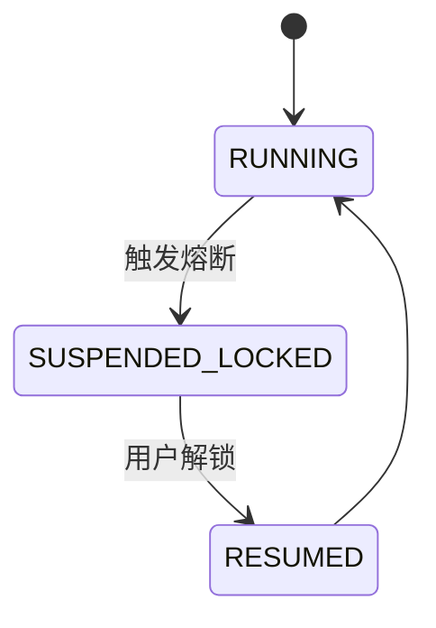
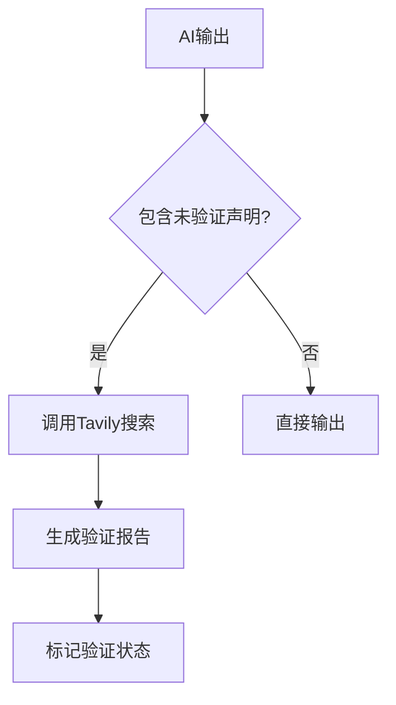

# 防御机制

<cite>
**本文档引用的文件**  
- [circuit_breaker.go](file://internal/core/middleware/circuit_breaker.go)
- [fact_check.go](file://internal/core/middleware/fact_check.go)
- [factory.go](file://internal/core/workflow/nodes/factory.go)
- [fact_check.go](file://internal/core/workflow/nodes/fact_check.go)
- [tavily.go](file://internal/infrastructure/search/tavily.go)
- [engine.go](file://internal/core/workflow/engine.go)
- [session.go](file://internal/core/workflow/session.go)
- [types.go](file://internal/core/workflow/types.go)
- [SPEC-409-circuit-breaker.md](file://docs/specs/backend/SPEC-409-circuit-breaker.md)
- [SPEC-410-anti-hallucination.md](file://docs/specs/backend/SPEC-410-anti-hallucination.md)
</cite>

## 目录
1. [引言](#引言)
2. [逻辑熔断器机制](#逻辑熔断器机制)
3. [反幻觉机制](#反幻觉机制)
4. [错误处理与日志记录](#错误处理与日志记录)
5. [系统架构与集成](#系统架构与集成)
6. [结论](#结论)

## 引言
本文档深入讲解系统中实现的防御机制，重点分析逻辑熔断器与反幻觉机制。逻辑熔断器通过限制递归深度防止工作流中的无限循环，而反幻觉机制则通过事实核查节点与外部搜索服务协同工作，确保AI输出的可靠性。这些机制共同构成了系统的安全防线，保障了系统的稳定性和输出的准确性。

## 逻辑熔断器机制

逻辑熔断器（CircuitBreaker）是系统中防止工作流失控的关键组件。它通过监控执行过程中的各种指标，如Token消耗、对话熵值和执行时间，来检测潜在的异常行为。当检测到异常时，熔断器会立即中断执行，防止问题进一步扩大。

熔断器的核心字段`MaxRecursionDepth`用于防止工作流中出现无限循环。在工作流执行过程中，每个节点的执行都会被记录，当递归深度超过预设的阈值时，熔断器会触发保护机制，阻止进一步的递归调用。这种机制确保了即使在复杂的循环结构中，系统也能保持稳定，避免因无限循环导致的资源耗尽。



**图示来源**  
- [SPEC-409-circuit-breaker.md](file://docs/specs/backend/SPEC-409-circuit-breaker.md)

**本节来源**  
- [circuit_breaker.go](file://internal/core/middleware/circuit_breaker.go)
- [SPEC-409-circuit-breaker.md](file://docs/specs/backend/SPEC-409-circuit-breaker.md)

## 反幻觉机制

反幻觉机制通过事实核查节点（FactCheckNode）与外部搜索服务（Tavily）协同工作，确保AI输出的可靠性。当AI生成的内容包含未经验证的声明时，反幻觉机制会自动标记这些内容，并触发事实核查流程。

事实核查节点首先通过正则表达式检测输出中的关键数据，如百分比、金额和引用声明。一旦发现潜在的未验证声明，节点会调用外部搜索服务进行验证。搜索服务返回的结果会被用于生成最终的验证报告，报告中包含验证结果、置信度和发现的问题。



**图示来源**  
- [fact_check.go](file://internal/core/workflow/nodes/fact_check.go)
- [tavily.go](file://internal/infrastructure/search/tavily.go)

**本节来源**  
- [fact_check.go](file://internal/core/middleware/fact_check.go)
- [SPEC-410-anti-hallucination.md](file://docs/specs/backend/SPEC-410-anti-hallucination.md)

## 错误处理与日志记录

系统中的错误处理与日志记录策略确保了在出现异常时能够及时发现并处理问题。当熔断器或反幻觉机制检测到异常时，系统会生成详细的错误日志，并通过WebSocket将错误信息实时推送给前端。

日志记录不仅包括错误信息，还包括执行过程中的关键事件，如节点状态变化、Token使用情况和对话熵值。这些日志为后续的分析和优化提供了宝贵的数据支持。

**本节来源**  
- [engine.go](file://internal/core/workflow/engine.go)
- [session.go](file://internal/core/workflow/session.go)

## 系统架构与集成

逻辑熔断器和反幻觉机制通过中间件（Middleware）模式集成到工作流引擎中。中间件在节点执行前后进行拦截，执行相应的检查和处理逻辑。这种设计使得防御机制与核心业务逻辑解耦，提高了系统的可维护性和扩展性。

工作流引擎在执行节点前会依次调用所有注册的中间件的`BeforeNodeExecution`方法，执行后则调用`AfterNodeExecution`方法。这种链式调用模式确保了每个中间件都能在适当的时机执行其逻辑。

```mermaid
classDiagram
class Middleware {
+Name() string
+BeforeNodeExecution(ctx context.Context, session *Session, node *Node) error
+AfterNodeExecution(ctx context.Context, session *Session, node *Node, output map[string]interface{}) (map[string]interface{}, error)
}
class CircuitBreaker {
+MaxRecursionDepth int
}
class FactCheckTrigger {
+MetricRegex *regexp.Regexp
+CitationRegex *regexp.Regexp
}
Middleware <|-- CircuitBreaker
Middleware <|-- FactCheckTrigger
```

**图示来源**  
- [types.go](file://internal/core/workflow/types.go)
- [circuit_breaker.go](file://internal/core/middleware/circuit_breaker.go)
- [fact_check.go](file://internal/core/middleware/fact_check.go)

**本节来源**  
- [engine.go](file://internal/core/workflow/engine.go)
- [types.go](file://internal/core/workflow/types.go)

## 结论

逻辑熔断器和反幻觉机制是系统中不可或缺的防御组件。它们通过限制递归深度和验证AI输出的可靠性，有效防止了工作流中的无限循环和幻觉传播。这些机制不仅提高了系统的稳定性，还增强了用户对AI输出的信任。未来，可以进一步优化这些机制，如引入更复杂的熵值计算方法和更高效的搜索算法，以提升系统的整体性能和安全性。