# 系统架构

<cite>
**本文档中引用的文件**  
- [main.go](file://cmd/council/main.go)
- [seeder.go](file://internal/resources/seeder.go)
- [engine.go](file://internal/core/workflow/engine.go)
- [workflow.go](file://internal/api/handler/workflow.go)
- [hub.go](file://internal/api/ws/hub.go)
- [config.go](file://internal/pkg/config/config.go)
- [entity.go](file://internal/core/agent/entity.go)
- [entity.go](file://internal/core/group/entity.go)
- [service.go](file://internal/core/memory/service.go)
- [factory.go](file://internal/core/workflow/nodes/factory.go)
- [versioning.go](file://internal/core/middleware/versioning.go)
- [session.go](file://internal/core/workflow/session.go)
- [App.tsx](file://frontend/src/App.tsx)
- [package.json](file://frontend/package.json)
- [postgres.go](file://internal/infrastructure/db/postgres.go)
</cite>

## 目录
1. [引言](#引言)
2. [项目结构](#项目结构)
3. [核心组件](#核心组件)
4. [架构概述](#架构概述)
5. [详细组件分析](#详细组件分析)
6. [依赖分析](#依赖分析)
7. [性能考虑](#性能考虑)
8. [故障排除指南](#故障排除指南)
9. [结论](#结论)

## 引言
The Council 是一个基于多智能体协作的决策系统，采用分层设计实现骨架层（SKELETON）与实例层（INSTANCE）的解耦。系统通过Go语言后端与React前端SPA实现前后端分离，利用REST API和WebSocket进行通信。本架构文档深入描述了系统的分层设计、核心组件交互、事件驱动的工作流执行流程以及技术选型理由。

## 项目结构
The Council项目采用清晰的分层架构，主要分为前端、后端核心逻辑和基础设施层。前端使用React构建SPA应用，后端采用Go语言实现，分为API接口、核心业务逻辑、基础设施和资源管理等模块。

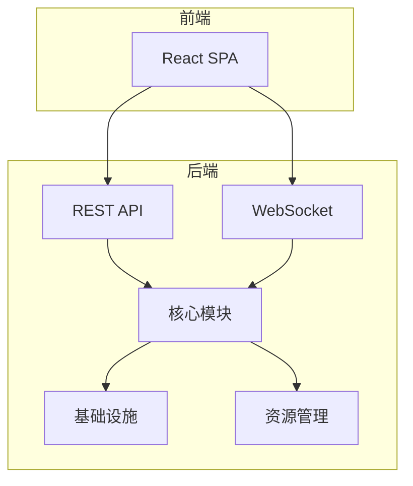

**Diagram sources**
- [App.tsx](file://frontend/src/App.tsx)
- [main.go](file://cmd/council/main.go)

**Section sources**
- [main.go](file://cmd/council/main.go#L21-L148)
- [App.tsx](file://frontend/src/App.tsx#L1-L85)

## 核心组件
The Council系统的核心组件包括Agent、Group、Workflow和Memory模块，这些模块具有高内聚低耦合的特性。系统启动时通过seeder加载默认配置，实现骨架层与实例层的分离。

**Section sources**
- [seeder.go](file://internal/resources/seeder.go#L1-L420)
- [entity.go](file://internal/core/agent/entity.go#L1-L37)
- [entity.go](file://internal/core/group/entity.go#L1-L19)
- [service.go](file://internal/core/memory/service.go#L1-L209)

## 架构概述
The Council采用分层架构设计，实现了骨架层与实例层的解耦。骨架层包含系统默认的智能体、组和工作流模板，而实例层则存储用户创建的具体实例。这种设计使得系统既具有预设的功能框架，又能灵活适应不同的使用场景。

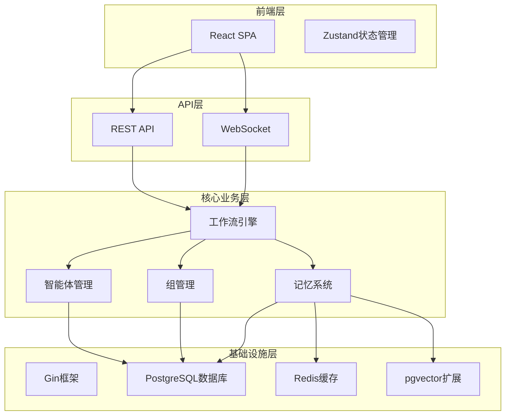

**Diagram sources**
- [main.go](file://cmd/council/main.go#L21-L148)
- [package.json](file://frontend/package.json#L1-L60)

## 详细组件分析

### 骨架层与实例层解耦设计
The Council系统通过seeder机制实现骨架层与实例层的解耦设计。骨架层包含系统预设的智能体、组和工作流模板，而实例层则存储用户创建的具体实例。

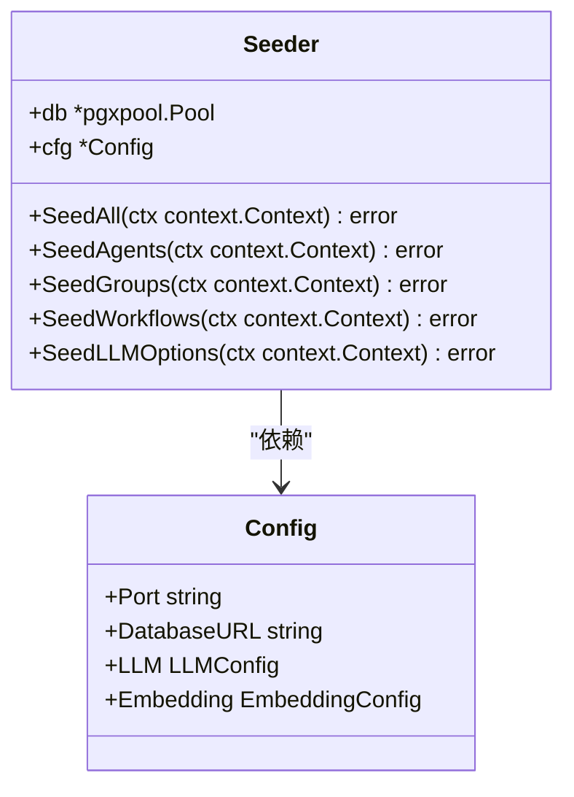

**Diagram sources**
- [seeder.go](file://internal/resources/seeder.go#L1-L420)
- [config.go](file://internal/pkg/config/config.go#L1-L133)

**Section sources**
- [seeder.go](file://internal/resources/seeder.go#L1-L420)
- [config.go](file://internal/pkg/config/config.go#L1-L133)

### Agent、Group、Workflow、Memory模块分析
The Council的核心模块具有高内聚低耦合的特性，每个模块都专注于特定的功能领域。

#### Agent模块
Agent模块定义了AI智能体的属性和能力，包括名称、头像、描述、人格提示和模型配置等。

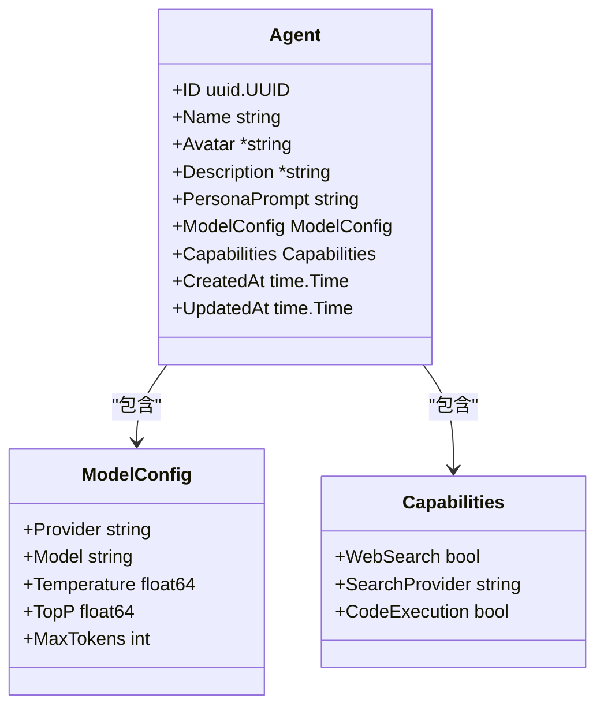

**Diagram sources**
- [entity.go](file://internal/core/agent/entity.go#L1-L37)

**Section sources**
- [entity.go](file://internal/core/agent/entity.go#L1-L37)

#### Group模块
Group模块代表协作组（项目/上下文），包含组名、图标、系统提示和默认智能体ID列表等属性。

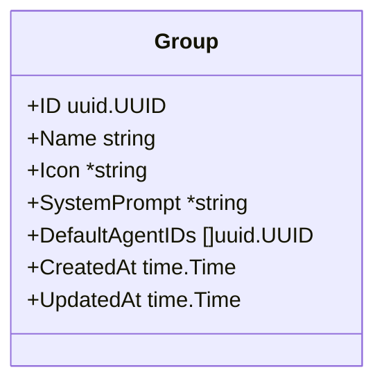

**Diagram sources**
- [entity.go](file://internal/core/group/entity.go#L1-L19)

**Section sources**
- [entity.go](file://internal/core/group/entity.go#L1-L19)

#### Workflow模块
Workflow模块负责工作流的执行，采用事件驱动的架构，从用户输入到智能体调用、节点处理、状态更新的全链路。

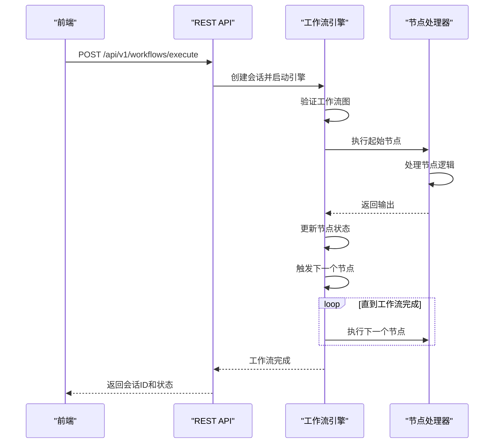

**Diagram sources**
- [engine.go](file://internal/core/workflow/engine.go#L1-L246)
- [workflow.go](file://internal/api/handler/workflow.go#L1-L246)

**Section sources**
- [engine.go](file://internal/core/workflow/engine.go#L1-L246)
- [workflow.go](file://internal/api/handler/workflow.go#L1-L246)

#### Memory模块
Memory模块实现了三级记忆系统，包括隔离区（Quarantine）、工作记忆（Working Memory）和长期记忆（Long-term Memory）。

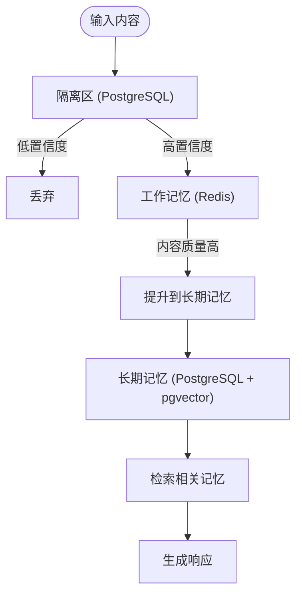

**Diagram sources**
- [service.go](file://internal/core/memory/service.go#L1-L209)

**Section sources**
- [service.go](file://internal/core/memory/service.go#L1-L209)

### 系统启动与配置加载
系统启动时通过seeder加载默认配置，包括智能体、组、工作流模板和LLM选项。

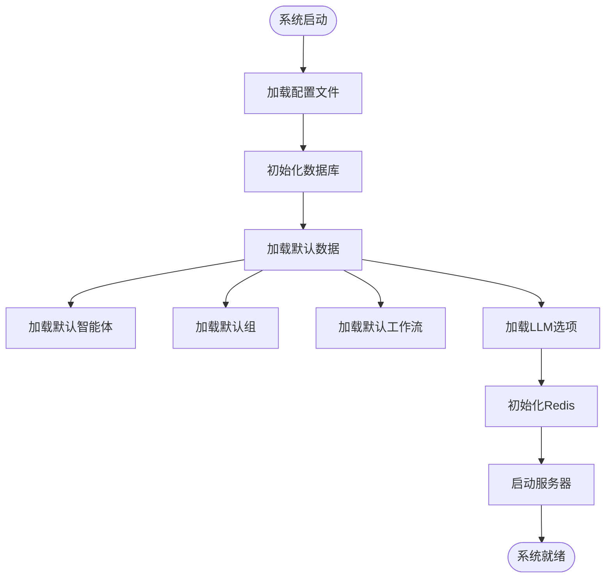

**Diagram sources**
- [main.go](file://cmd/council/main.go#L21-L148)
- [seeder.go](file://internal/resources/seeder.go#L1-L420)

**Section sources**
- [main.go](file://cmd/council/main.go#L21-L148)
- [seeder.go](file://internal/resources/seeder.go#L1-L420)

### 前后端分离架构
The Council采用前后端分离架构，前端React SPA通过REST API和WebSocket与Go后端通信。

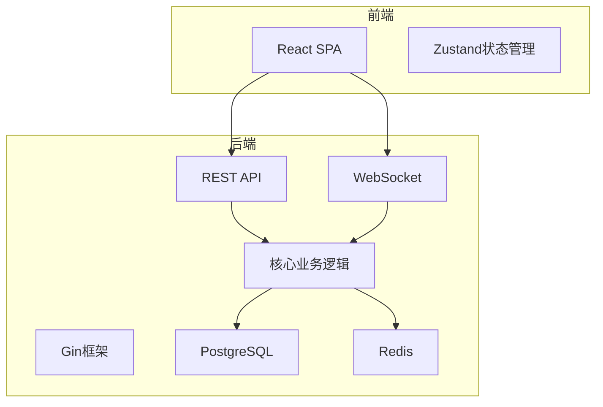

**Diagram sources**
- [main.go](file://cmd/council/main.go#L21-L148)
- [App.tsx](file://frontend/src/App.tsx#L1-L85)

**Section sources**
- [main.go](file://cmd/council/main.go#L21-L148)
- [App.tsx](file://frontend/src/App.tsx#L1-L85)

### 事件驱动的工作流执行流程
The Council采用事件驱动的工作流执行流程，从用户输入到智能体调用、节点处理、状态更新的全链路。

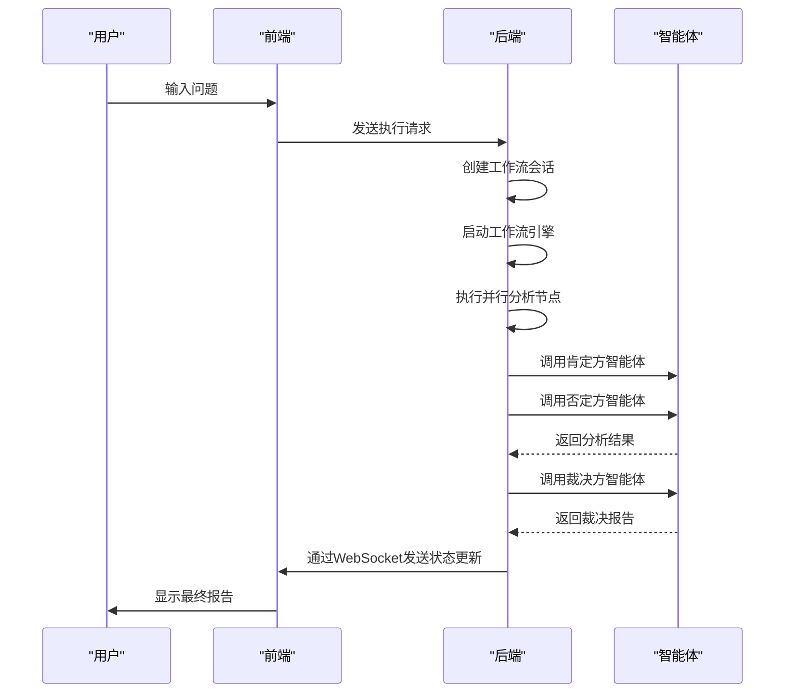

**Diagram sources**
- [engine.go](file://internal/core/workflow/engine.go#L1-L246)
- [workflow.go](file://internal/api/handler/workflow.go#L1-L246)
- [hub.go](file://internal/api/ws/hub.go#L1-L125)

**Section sources**
- [engine.go](file://internal/core/workflow/engine.go#L1-L246)
- [workflow.go](file://internal/api/handler/workflow.go#L1-L246)
- [hub.go](file://internal/api/ws/hub.go#L1-L125)

## 依赖分析
The Council系统的组件之间通过清晰的依赖关系进行交互，确保了高内聚低耦合的设计原则。

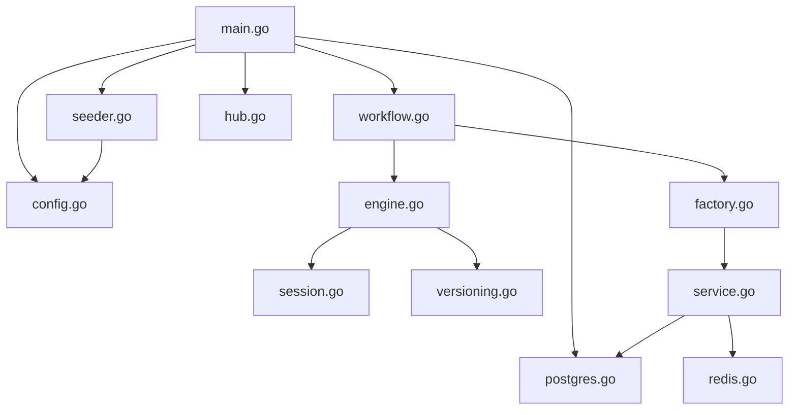

**Diagram sources**
- [main.go](file://cmd/council/main.go#L21-L148)
- [config.go](file://internal/pkg/config/config.go#L1-L133)
- [postgres.go](file://internal/infrastructure/db/postgres.go#L1-L66)

**Section sources**
- [main.go](file://cmd/council/main.go#L21-L148)
- [config.go](file://internal/pkg/config/config.go#L1-L133)
- [postgres.go](file://internal/infrastructure/db/postgres.go#L1-L66)

## 性能考虑
The Council系统在性能方面进行了多项优化，包括使用Redis作为工作记忆的缓存层，使用pgvector扩展实现高效的向量相似性搜索，以及通过Gin框架实现高性能的HTTP路由。

## 故障排除指南
当系统出现故障时，可以按照以下步骤进行排查：
1. 检查数据库连接是否正常
2. 检查Redis服务是否正常运行
3. 检查LLM API密钥是否正确配置
4. 查看系统日志以获取详细的错误信息

**Section sources**
- [main.go](file://cmd/council/main.go#L21-L148)
- [config.go](file://internal/pkg/config/config.go#L1-L133)

## 结论
The Council系统通过分层设计实现了骨架层与实例层的解耦，核心组件具有高内聚低耦合的特性。系统采用前后端分离架构，前端React SPA通过REST API和WebSocket与Go后端通信。事件驱动的工作流执行流程确保了从用户输入到智能体调用、节点处理、状态更新的全链路高效运行。技术选型方面，Gin框架提供了高性能的HTTP路由，Zustand实现了前端状态管理，pgvector扩展支持高效的向量相似性搜索。