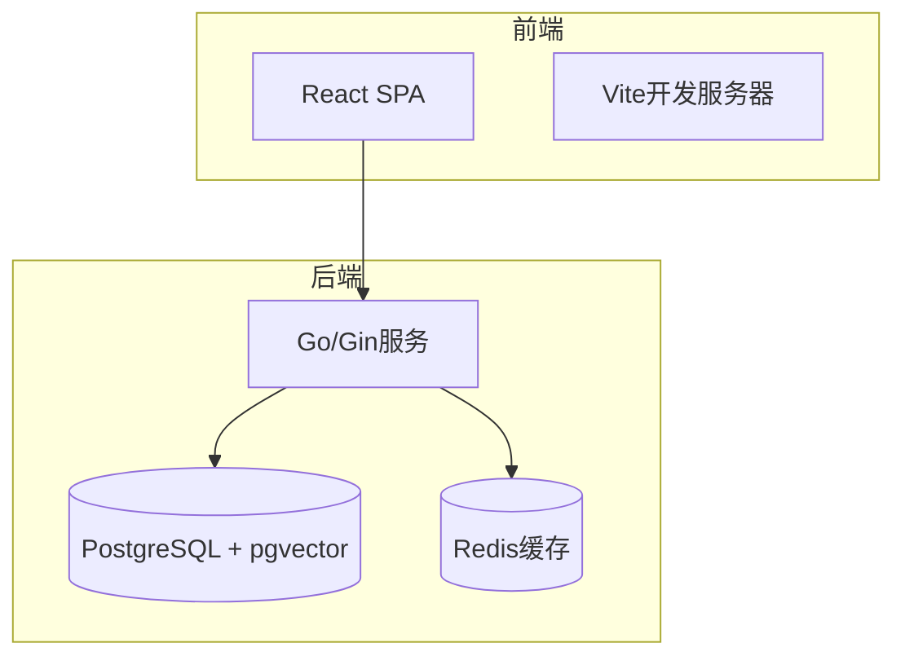
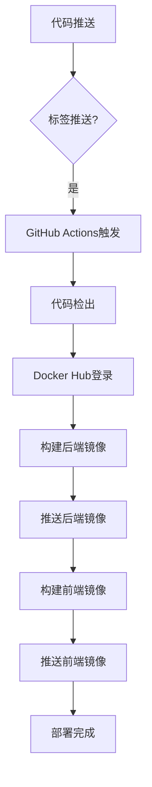
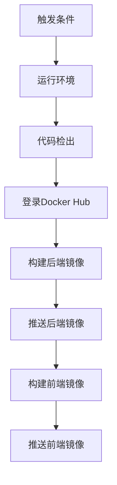
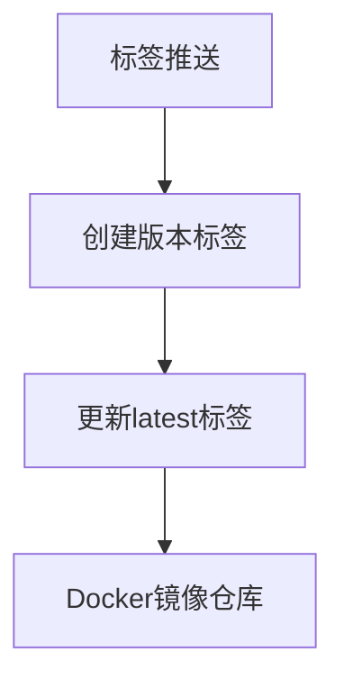
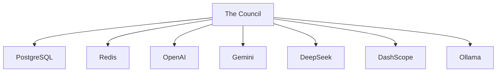

# CI/CD集成

<cite>
**本文档引用的文件**  
- [09_deployment.md](file://docs/tdd/09_deployment.md#L111-L151)
- [docker-compose.yml](file://docker-compose.yml#L1-L24)
- [Makefile](file://Makefile#L1-L374)
- [main.go](file://cmd/council/main.go#L1-L150)
</cite>

## 目录
1. [简介](#简介)
2. [项目结构](#项目结构)
3. [核心组件](#核心组件)
4. [架构概述](#架构概述)
5. [详细组件分析](#详细组件分析)
6. [依赖分析](#依赖分析)
7. [性能考虑](#性能考虑)
8. [故障排除指南](#故障排除指南)
9. [结论](#结论)
10. [附录](#附录)（如有必要）

## 简介
本文档详细说明了The Council项目的CI/CD集成流程，重点介绍如何通过GitHub Actions实现自动化部署。文档解析了release.yml工作流配置，包括触发条件、运行环境和具体步骤，并提供了扩展指南。

## 项目结构
The Council项目采用前后端分离的架构设计，包含Go后端服务和React前端应用。项目通过Docker和docker-compose进行容器化部署，使用Makefile简化开发和部署流程。

**图示来源**
- [docker-compose.yml](file://docker-compose.yml#L1-L24)

**本节来源**
- [docker-compose.yml](file://docker-compose.yml#L1-L24)
- [Makefile](file://Makefile#L1-L374)

## 核心组件
The Council的核心组件包括可视化工作流构建器、多智能体协作系统和三层记忆架构。CI/CD流程主要关注后端Go服务和前端React应用的构建与部署。

**本节来源**
- [main.go](file://cmd/council/main.go#L1-L150)
- [09_deployment.md](file://docs/tdd/09_deployment.md#L76-L109)

## 架构概述
The Council采用微服务架构，通过Docker容器化部署。CI/CD流程自动化了代码构建、镜像创建和部署过程。

**图示来源**
- [09_deployment.md](file://docs/tdd/09_deployment.md#L114-L151)

## 详细组件分析

### release.yml工作流分析
release.yml工作流定义了The Council的自动化部署流程，包含一系列有序的步骤。

#### 工作流配置

**图示来源**
- [09_deployment.md](file://docs/tdd/09_deployment.md#L114-L151)

#### 触发条件与运行环境
工作流在推送标签时触发，运行在ubuntu-latest环境中。

**本节来源**
- [09_deployment.md](file://docs/tdd/09_deployment.md#L117-L123)

#### 构建与推送步骤
工作流包含代码检出、Docker Hub登录、后端和前端镜像的构建与推送等步骤。

**本节来源**
- [09_deployment.md](file://docs/tdd/09_deployment.md#L125-L151)

### 镜像标签策略
The Council采用版本标签和latest标签的双重策略，确保部署的稳定性和灵活性。

**图示来源**
- [09_deployment.md](file://docs/tdd/09_deployment.md#L140-L141)
- [09_deployment.md](file://docs/tdd/09_deployment.md#L149-L150)

**本节来源**
- [09_deployment.md](file://docs/tdd/09_deployment.md#L140-L150)

## 依赖分析
The Council项目依赖于多个外部服务和组件，包括PostgreSQL、Redis和各种LLM提供商。

**图示来源**
- [main.go](file://cmd/council/main.go#L8-L15)
- [09_deployment.md](file://docs/tdd/09_deployment.md#L33-L34)

**本节来源**
- [main.go](file://cmd/council/main.go#L8-L15)
- [docker-compose.yml](file://docker-compose.yml#L2-L13)

## 性能考虑
CI/CD流程的设计考虑了构建效率和部署稳定性，通过多阶段Docker构建减少镜像大小，提高部署速度。

## 故障排除指南
当CI/CD流程出现问题时，可以检查Docker Hub凭据、网络连接和构建上下文等常见问题。

**本节来源**
- [09_deployment.md](file://docs/tdd/09_deployment.md#L127-L131)
- [Makefile](file://Makefile#L257-L258)

## 结论
The Council的CI/CD集成通过GitHub Actions实现了高效的自动化部署流程，确保了代码质量和部署可靠性。

## 附录
### 扩展指南
#### 添加测试阶段
可以在工作流中添加测试步骤，确保代码质量。

#### 部署到云平台
支持部署到AWS ECS、Kubernetes等云平台。

#### 回滚机制
通过版本标签实现快速回滚。

**本节来源**
- [09_deployment.md](file://docs/tdd/09_deployment.md#L114-L151)
- [Makefile](file://Makefile#L168-L172)