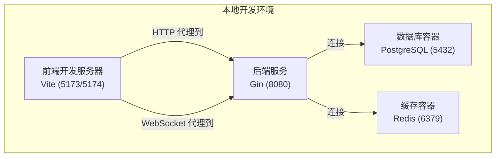
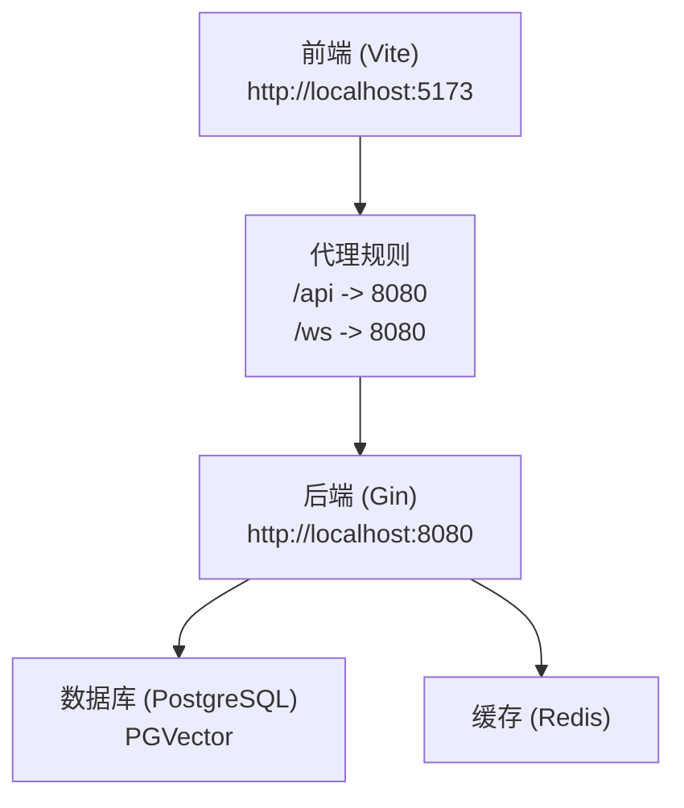
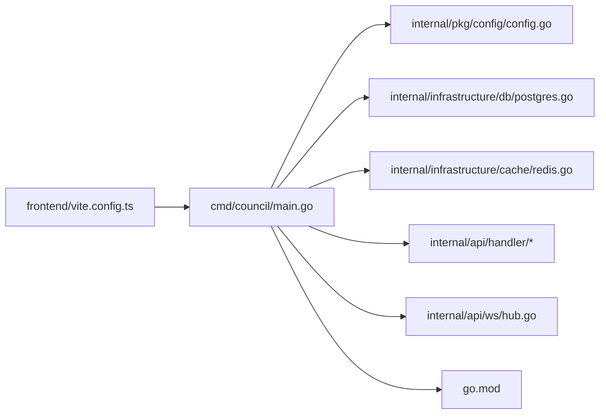

# 本地部署指南

<cite>
**本文引用的文件**
- [README.md](file://README.md)
- [Makefile](file://Makefile)
- [docker-compose.yml](file://docker-compose.yml)
- [.env.example](file://.env.example)
- [cmd/council/main.go](file://cmd/council/main.go)
- [internal/pkg/config/config.go](file://internal/pkg/config/config.go)
- [internal/infrastructure/db/postgres.go](file://internal/infrastructure/db/postgres.go)
- [internal/infrastructure/cache/redis.go](file://internal/infrastructure/cache/redis.go)
- [frontend/vite.config.ts](file://frontend/vite.config.ts)
- [frontend/package.json](file://frontend/package.json)
- [go.mod](file://go.mod)
</cite>

## 目录
1. [简介](#简介)
2. [项目结构](#项目结构)
3. [核心组件](#核心组件)
4. [架构总览](#架构总览)
5. [详细组件分析](#详细组件分析)
6. [依赖关系分析](#依赖关系分析)
7. [性能与可维护性建议](#性能与可维护性建议)
8. [故障排查指南](#故障排查指南)
9. [结论](#结论)
10. [附录：常用命令速查](#附录常用命令速查)

## 简介
本指南面向开发者，帮助你在本地快速搭建 The Council 系统。你将学会：
- 使用 docker-compose 启动 PostgreSQL 与 Redis 基础设施
- 配置环境变量（DATABASE_URL、REDIS_URL、LLM_PROVIDER 等）
- 通过 Makefile 的命令（make start-db、make start-backend、make start-frontend）分别启动数据库、后端与前端
- 在开发模式下启用热重载：前端 Vite 开发服务器（端口 5173/5174）、后端 Go 服务（端口 8080）
- 通过 make status 检查各服务状态
- 常见问题定位与解决方法（端口占用、数据库连接失败等）

## 项目结构
The Council 采用“后端 Go + 前端 React/Vite + 数据库/缓存容器”的分层架构。Makefile 提供统一的生命周期管理；docker-compose 负责数据库与缓存容器编排；后端 Gin 服务提供 REST 与 WebSocket 接口；前端通过 Vite 提供开发服务器并通过代理转发到后端。

图表来源
- [Makefile](file://Makefile#L71-L135)
- [docker-compose.yml](file://docker-compose.yml#L1-L24)
- [frontend/vite.config.ts](file://frontend/vite.config.ts#L8-L19)
- [cmd/council/main.go](file://cmd/council/main.go#L145-L148)

章节来源
- [README.md](file://README.md#L46-L91)
- [Makefile](file://Makefile#L71-L135)
- [docker-compose.yml](file://docker-compose.yml#L1-L24)

## 核心组件
- 后端入口与路由
  - 后端程序入口位于 cmd/council/main.go，负责加载 .env、初始化数据库与 Redis、构建 Gin 路由、注册 WebSocket 处理器与 API 路由组。
- 配置加载
  - 配置从环境变量读取，支持 PORT、DATABASE_URL、REDIS_URL、LLM_PROVIDER、LLM_MODEL 等。默认端口为 8080。
- 数据库与缓存
  - 数据库通过 pgx 连接池初始化，启动时自动执行迁移；缓存通过 go-redis 客户端初始化。
- 前端开发服务器
  - 前端使用 Vite，开发服务器默认监听 5173；若被占用会尝试 5174。通过代理将 /api 与 /ws 请求转发至后端 8080。

章节来源
- [cmd/council/main.go](file://cmd/council/main.go#L21-L149)
- [internal/pkg/config/config.go](file://internal/pkg/config/config.go#L45-L132)
- [internal/infrastructure/db/postgres.go](file://internal/infrastructure/db/postgres.go#L17-L53)
- [internal/infrastructure/cache/redis.go](file://internal/infrastructure/cache/redis.go#L16-L38)
- [frontend/vite.config.ts](file://frontend/vite.config.ts#L8-L19)

## 架构总览
后端服务通过 Gin 提供 REST API 与 WebSocket，前端通过 Vite 开发服务器提供交互界面。数据库与缓存以容器形式运行，后端通过连接字符串与地址进行访问。

图表来源
- [frontend/vite.config.ts](file://frontend/vite.config.ts#L8-L19)
- [cmd/council/main.go](file://cmd/council/main.go#L98-L143)
- [docker-compose.yml](file://docker-compose.yml#L1-L24)

## 详细组件分析

### 组件一：数据库与缓存（PostgreSQL + Redis）
- 启动方式
  - 使用 make start-db 启动 docker-compose，暴露宿主机端口映射：PostgreSQL 5432、Redis 6379。
- 默认凭据
  - PostgreSQL：用户/密码/库名均默认为 council；容器名为 council_db。
  - Redis：无密码，容器名为 council_redis。
- 连接字符串
  - 默认 DATABASE_URL 与 REDIS_URL 已在 .env.example 中给出，可在本地复制为 .env 并按需修改。
- 初始化流程
  - 后端启动时会解析 DATABASE_URL，创建连接池并执行迁移；同时初始化 Redis 客户端。

章节来源
- [Makefile](file://Makefile#L71-L94)
- [docker-compose.yml](file://docker-compose.yml#L1-L24)
- [.env.example](file://.env.example#L7-L17)
- [internal/infrastructure/db/postgres.go](file://internal/infrastructure/db/postgres.go#L17-L53)
- [internal/infrastructure/cache/redis.go](file://internal/infrastructure/cache/redis.go#L16-L38)

### 组件二：后端服务（Go/Gin）
- 启动方式
  - 使用 make start-backend 启动后端，自动检测 8080 端口占用并处理冲突；通过环境变量 DATABASE_URL、REDIS_URL、LLM_* 等注入配置。
- 端口与日志
  - 默认监听端口来自配置（PORT），未设置则默认 8080；启动后打印监听端口。
- 路由与 WebSocket
  - 提供 /ws WebSocket 路由；REST API 分组 /api/v1 下包含工作流、会话控制、模板、内存、LLM 等接口。
- 状态检查
  - 使用 make status 可查看后端进程是否在 8080 上运行。

章节来源
- [Makefile](file://Makefile#L99-L119)
- [cmd/council/main.go](file://cmd/council/main.go#L98-L148)
- [internal/pkg/config/config.go](file://internal/pkg/config/config.go#L45-L60)

### 组件三：前端开发服务器（Vite）
- 启动方式
  - 使用 make start-frontend 启动前端开发服务器，默认监听 5173；若被占用会自动尝试 5174。
- 代理配置
  - 通过 vite.config.ts 将 /api 与 /ws 代理到 http://localhost:8080，便于开发时前后端联调。
- 测试与构建
  - package.json 提供 dev/build/lint/test 等脚本；测试覆盖率可通过 Vitest 生成。

章节来源
- [Makefile](file://Makefile#L124-L135)
- [frontend/vite.config.ts](file://frontend/vite.config.ts#L8-L19)
- [frontend/package.json](file://frontend/package.json#L1-L60)

### 组件四：环境变量与配置加载
- 关键变量
  - DATABASE_URL：数据库连接串（默认已提供）
  - REDIS_URL：Redis 地址（默认 localhost:6379）
  - LLM_PROVIDER、LLM_MODEL：默认 LLM 提供商与模型
  - PORT：后端监听端口（默认 8080）
  - GIN_MODE：Gin 运行模式（默认 debug）
- 加载顺序
  - 后端启动时优先加载 .env 文件；若不存在则使用系统环境变量。

章节来源
- [.env.example](file://.env.example#L7-L21)
- [cmd/council/main.go](file://cmd/council/main.go#L21-L30)
- [internal/pkg/config/config.go](file://internal/pkg/config/config.go#L45-L132)

## 依赖关系分析

图表来源
- [cmd/council/main.go](file://cmd/council/main.go#L1-L149)
- [internal/pkg/config/config.go](file://internal/pkg/config/config.go#L1-L132)
- [internal/infrastructure/db/postgres.go](file://internal/infrastructure/db/postgres.go#L1-L66)
- [internal/infrastructure/cache/redis.go](file://internal/infrastructure/cache/redis.go#L1-L51)
- [go.mod](file://go.mod#L1-L66)
- [frontend/vite.config.ts](file://frontend/vite.config.ts#L1-L28)

章节来源
- [go.mod](file://go.mod#L1-L66)
- [cmd/council/main.go](file://cmd/council/main.go#L1-L149)

## 性能与可维护性建议
- 数据库连接池
  - 后端使用 pgx 连接池，建议在生产环境根据并发量调整池大小；开发阶段保持默认即可。
- 缓存命中率
  - Redis 用于会话状态与临时数据，建议在高频场景下开启持久化或合理设置过期策略。
- 前端代理
  - 开发时使用 Vite 代理减少跨域与 CORS 配置复杂度；生产构建后由后端统一提供静态资源。
- 日志与可观测性
  - Gin 默认日志输出到终端；建议在本地开发时结合 make logs-backend 查看后端日志。

[本节为通用建议，不直接分析具体文件]

## 故障排查指南

### 1. 端口冲突
- 现象
  - 启动后端时报端口 8080 已被占用；或前端无法启动（5173/5174 被占用）。
- 解决步骤
  - 使用 make status 检查 8080 是否已有进程；如存在，先停止再重启。
  - 若前端端口被占用，make start-frontend 会自动尝试 5174；也可手动释放 5173/5174。
- 参考命令
  - make status
  - make stop-backend
  - make stop-frontend

章节来源
- [Makefile](file://Makefile#L52-L66)
- [Makefile](file://Makefile#L100-L114)
- [Makefile](file://Makefile#L124-L135)

### 2. 数据库连接失败
- 现象
  - 后端启动时报数据库连接失败或迁移失败。
- 排查要点
  - 确认 make start-db 已成功启动数据库容器且端口 5432 可用。
  - 检查 DATABASE_URL 是否正确（默认值已在 .env.example 中提供）。
  - 确认容器内数据库已初始化（首次启动会自动执行迁移）。
- 参考命令
  - make start-db
  - make logs-db
  - make reset-db（谨慎使用，会删除所有数据）

章节来源
- [Makefile](file://Makefile#L71-L94)
- [.env.example](file://.env.example#L7-L9)
- [internal/infrastructure/db/postgres.go](file://internal/infrastructure/db/postgres.go#L17-L53)

### 3. Redis 连接失败
- 现象
  - 后端启动时报 Redis 连接失败。
- 排查要点
  - 确认 make start-db 已启动 Redis 容器且端口 6379 可用。
  - 检查 REDIS_URL 是否正确（默认 localhost:6379）。
- 参考命令
  - make start-db
  - make logs-db

章节来源
- [Makefile](file://Makefile#L71-L94)
- [.env.example](file://.env.example#L15-L17)
- [internal/infrastructure/cache/redis.go](file://internal/infrastructure/cache/redis.go#L16-L38)

### 4. 前后端联调失败（CORS 或代理问题）
- 现象
  - 前端请求 /api 或 /ws 返回跨域错误或 404。
- 排查要点
  - 确认前端开发服务器已启动（make start-frontend），端口为 5173/5174。
  - 确认后端已启动（make start-backend），端口为 8080。
  - 确认 vite.config.ts 的代理配置已生效（/api 与 /ws 转发到 8080）。
- 参考命令
  - make start-frontend
  - make start-backend
  - make status

章节来源
- [frontend/vite.config.ts](file://frontend/vite.config.ts#L8-L19)
- [Makefile](file://Makefile#L124-L135)
- [Makefile](file://Makefile#L99-L114)

### 5. 服务状态检查
- 使用 make status 可一次性查看：
  - Docker 服务（Postgres 与 Redis）
  - 后端进程（8080）
  - 前端进程（5173/5174）

章节来源
- [Makefile](file://Makefile#L52-L66)

## 结论
通过 docker-compose 与 Makefile 的组合，你可以快速在本地完成 The Council 的基础设施、后端与前端的启动与联调。开发模式下，前端 Vite 与后端 Gin 的端口分别为 5173/5174 与 8080，配合代理即可实现无缝联调。遇到常见问题时，优先使用 make status、make logs-db、make logs-backend 与 make reset-db（谨慎使用）进行定位与恢复。

[本节为总结，不直接分析具体文件]

## 附录：常用命令速查
- 启动与停止
  - make start：一键启动数据库、后端、前端
  - make stop：一键停止数据库、后端、前端
  - make restart：一键重启数据库、后端、前端
- 数据库相关
  - make start-db / make stop-db / make restart-db
  - make logs-db：查看数据库容器日志
  - make reset-db：重置数据库（会删除所有数据，请谨慎）
- 后端相关
  - make start-backend / make stop-backend / make restart-backend
  - make logs-backend：查看后端日志（终端输出）
- 前端相关
  - make start-frontend / make stop-frontend / make restart-frontend
- 其他
  - make status：查看服务状态
  - make install：安装依赖（Go 与前端）
  - make clean：清理产物与容器

章节来源
- [README.md](file://README.md#L314-L331)
- [Makefile](file://Makefile#L46-L163)
- [Makefile](file://Makefile#L308-L321)