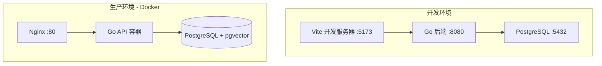
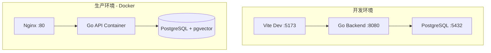
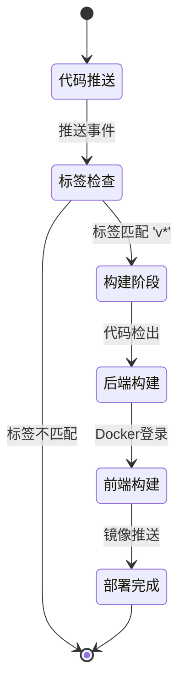
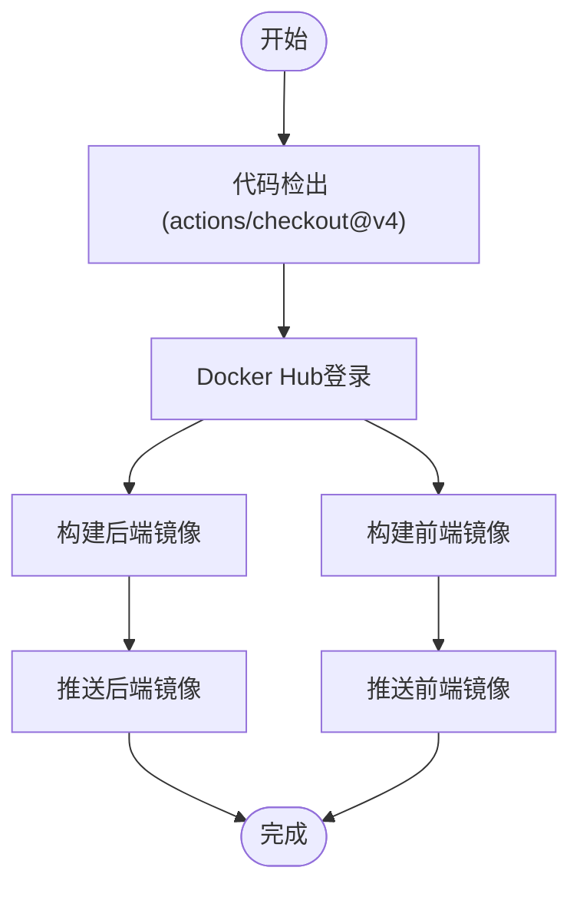
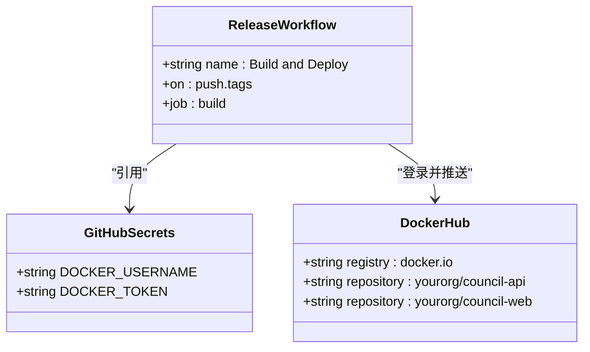
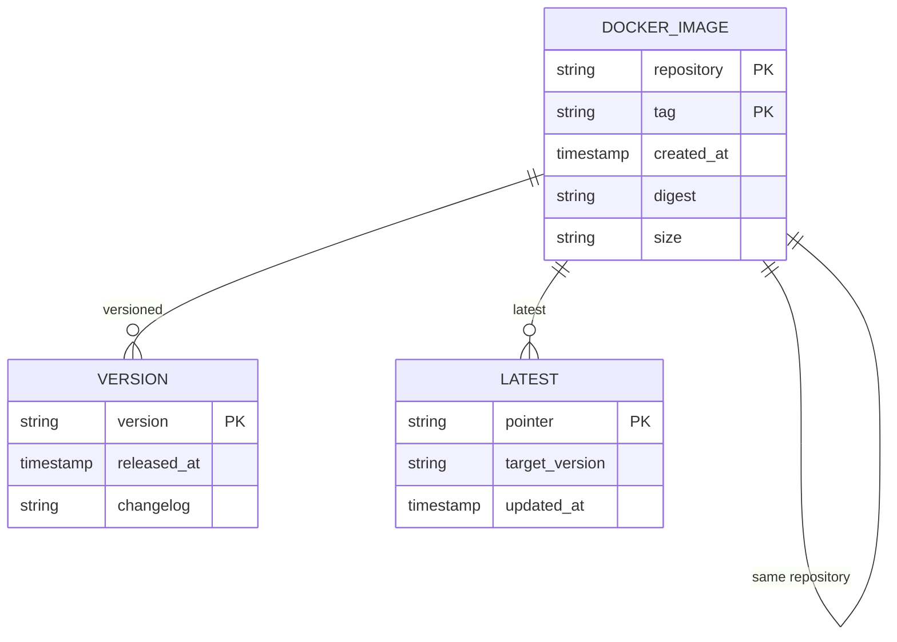
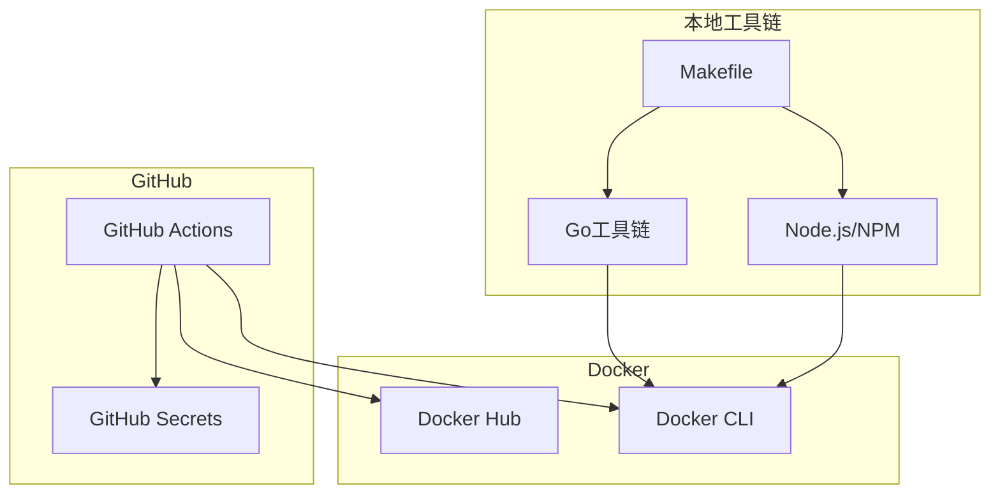

# CI/CD集成

<cite>
**本文档引用的文件**  
- [docs/tdd/09_deployment.md](file://docs/tdd/09_deployment.md)
- [docker-compose.yml](file://docker-compose.yml)
- [Makefile](file://Makefile)
- [.env.example](file://.env.example)
</cite>

## 目录
1. [简介](#简介)
2. [项目结构](#项目结构)
3. [核心组件](#核心组件)
4. [架构概述](#架构概述)
5. [详细组件分析](#详细组件分析)
6. [依赖分析](#依赖分析)
7. [性能考虑](#性能考虑)
8. [故障排除指南](#故障排除指南)
9. [结论](#结论)
10. [附录](#附录)（如有必要）

## 简介
本文档详细说明了The Council系统的CI/CD集成方案，基于GitHub Actions实现自动化持续集成与部署。重点介绍release.yml工作流的触发条件、运行环境、执行步骤，以及如何通过GitHub Secrets管理Docker仓库凭证和镜像标签策略。同时提供工作流调试技巧、常见失败场景的排查方法，并建议如何扩展该流程以支持多环境部署。

## 项目结构
The Council系统采用前后端分离的微服务架构，主要由Go后端服务和React前端应用组成。系统通过Docker容器化部署，使用docker-compose.yml定义服务编排，包含PostgreSQL数据库、Redis缓存和前后端服务。CI/CD流程通过GitHub Actions实现，配置文件在文档中有明确说明。

**图示来源**
- [docs/tdd/09_deployment.md](file://docs/tdd/09_deployment.md#L5-L23)

**本节来源**
- [docker-compose.yml](file://docker-compose.yml)
- [docs/tdd/09_deployment.md](file://docs/tdd/09_deployment.md)

## 核心组件
The Council系统的核心组件包括可视化工作流构建器、智能节点引擎和现代化的用户界面。CI/CD流程的核心是GitHub Actions工作流，它负责自动化构建和部署前后端Docker镜像。该流程通过Docker Hub进行镜像管理，使用语义化版本标签和latest标签策略，确保生产环境的稳定性和可追溯性。

**本节来源**
- [docs/tdd/09_deployment.md](file://docs/tdd/09_deployment.md#L111-L151)
- [Makefile](file://Makefile)

## 架构概述
The Council系统的部署架构分为开发环境和生产环境。开发环境使用本地服务进行热重载开发，而生产环境采用Docker容器化部署。CI/CD流程作为连接两个环境的桥梁，当版本标签被推送到GitHub仓库时，自动触发构建和部署流程，将最新的代码打包成Docker镜像并推送到Docker Hub。

**图示来源**
- [docs/tdd/09_deployment.md](file://docs/tdd/09_deployment.md#L5-L23)

## 详细组件分析
### release.yml工作流分析
The Council系统的CI/CD流程由GitHub Actions的release.yml工作流驱动。该工作流在特定条件下自动触发，执行一系列构建和部署步骤，确保代码变更能够安全、可靠地部署到生产环境。

#### 工作流触发条件
release.yml工作流配置为在推送版本标签时触发。具体来说，当向仓库推送以'v'开头的标签（如v1.0.0）时，工作流将自动执行。这种设计遵循语义化版本控制规范，确保只有经过正式版本发布的代码才会进入生产环境。

**图示来源**
- [docs/tdd/09_deployment.md](file://docs/tdd/09_deployment.md#L117-L120)

#### 构建与部署流程
工作流的执行步骤包括代码检出、Docker Hub登录、并行构建前后端镜像以及镜像推送。整个流程在Ubuntu最新版本的运行器上执行，确保构建环境的一致性和可靠性。

**图示来源**
- [docs/tdd/09_deployment.md](file://docs/tdd/09_deployment.md#L125-L151)

**本节来源**
- [docs/tdd/09_deployment.md](file://docs/tdd/09_deployment.md#L114-L151)

### 凭证管理分析
#### GitHub Secrets配置
CI/CD流程通过GitHub Secrets安全地管理Docker仓库的访问凭证。在release.yml工作流中，使用docker/login-action@v3操作来登录Docker Hub，其用户名和密码从仓库的Secrets中获取，避免了敏感信息的明文暴露。

**图示来源**
- [docs/tdd/09_deployment.md](file://docs/tdd/09_deployment.md#L127-L131)

#### 镜像标签策略
系统采用双重标签策略，为每个版本生成两个Docker镜像标签：一个是基于版本号的具体标签（如v1.0.0），另一个是latest标签。这种策略既保证了版本的可追溯性，又提供了最新的稳定版本供快速部署。

**图示来源**
- [docs/tdd/09_deployment.md](file://docs/tdd/09_deployment.md#L139-L140)
- [docs/tdd/09_deployment.md](file://docs/tdd/09_deployment.md#L148-L149)

**本节来源**
- [docs/tdd/09_deployment.md](file://docs/tdd/09_deployment.md#L129-L130)
- [.env.example](file://.env.example)

## 依赖分析
The Council系统的CI/CD流程依赖于多个外部服务和工具。主要依赖包括GitHub Actions运行器、Docker Hub镜像仓库、以及项目自身的构建工具链。这些依赖关系构成了完整的自动化部署管道，确保代码从开发到生产的无缝流转。

**图示来源**
- [docs/tdd/09_deployment.md](file://docs/tdd/09_deployment.md)
- [Makefile](file://Makefile)

**本节来源**
- [Makefile](file://Makefile)
- [go.mod](file://go.mod)
- [frontend/package.json](file://frontend/package.json)

## 性能考虑
CI/CD流程的设计充分考虑了性能和效率。通过并行构建前后端镜像，最大限度地减少了构建时间。同时，使用缓存机制和优化的Dockerfile，确保每次构建都能快速完成。对于大型项目，建议配置自托管的GitHub Actions运行器，以获得更好的性能和控制力。

## 故障排除指南
### 常见失败场景
#### 凭证错误
当Docker Hub登录失败时，通常是由于GitHub Secrets配置不正确或凭证过期。检查DOCKER_USERNAME和DOCKER_TOKEN是否正确设置，并确保Docker Hub账户具有足够的权限来推送镜像。

**本节来源**
- [docs/tdd/09_deployment.md](file://docs/tdd/09_deployment.md#L129-L131)

#### 构建失败
构建失败可能由多种原因引起，包括依赖下载失败、代码编译错误或测试未通过。检查工作流日志中的详细错误信息，定位具体问题。确保Makefile中的构建命令与CI/CD环境兼容。

**本节来源**
- [Makefile](file://Makefile)
- [docs/tdd/09_deployment.md](file://docs/tdd/09_deployment.md)

### 调试技巧
使用GitHub Actions的调试功能，可以逐行查看工作流执行过程。对于复杂的构建问题，可以临时修改工作流，在关键步骤后添加调试命令，如列出文件目录、检查环境变量等，以帮助定位问题。

## 结论
The Council系统的CI/CD集成方案通过GitHub Actions实现了高效、可靠的自动化部署。该方案不仅简化了发布流程，还通过严格的版本控制和安全的凭证管理，确保了生产环境的稳定性。未来可以通过引入多环境部署策略，进一步提升系统的灵活性和可靠性。

## 附录
### 多环境部署建议
为了支持staging和production等多环境部署，建议扩展当前的CI/CD流程。可以通过不同的分支策略或标签前缀来区分环境，例如使用'staging-v*'标签触发预发布环境部署，使用'v*'标签触发生产环境部署。同时，为每个环境配置独立的GitHub Secrets，确保环境间的隔离和安全。

**本节来源**
- [docs/tdd/09_deployment.md](file://docs/tdd/09_deployment.md)
- [Makefile](file://Makefile)