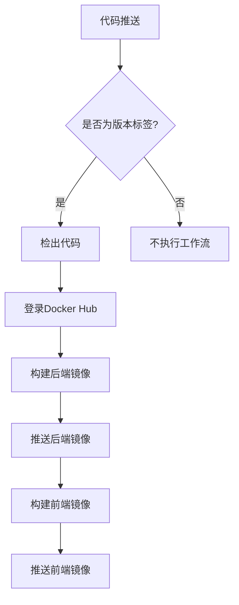

# 工作流配置

<cite>
**本文档中引用的文件**  
- [09_deployment.md](file://docs/tdd/09_deployment.md)
</cite>

## 目录
1. [简介](#简介)
2. [CI/CD工作流配置分析](#cicd工作流配置分析)
3. [触发条件详解](#触发条件详解)
4. [工作流执行流程](#工作流执行流程)
5. [环境变量与扩展性](#环境变量与扩展性)
6. [自定义配置指导](#自定义配置指导)

## 简介
The Council系统采用GitHub Actions实现持续集成与持续部署（CI/CD）自动化流程。该系统通过Docker容器化部署，结合Go语言后端和React前端技术栈，实现了高效的开发、测试和发布流程。本文档将详细解析其基于GitHub Actions的CI/CD工作流配置，重点分析release.yml文件的结构和工作机制。

## CI/CD工作流配置分析
The Council系统的CI/CD工作流配置定义在`.github/workflows/release.yml`文件中，采用YAML格式编写。该工作流的主要功能是在代码版本发布时自动构建并推送Docker镜像到Docker Hub仓库。



**Diagram sources**
- [09_deployment.md](file://docs/tdd/09_deployment.md#L113-L151)

**Section sources**
- [09_deployment.md](file://docs/tdd/09_deployment.md#L113-L151)

## 触发条件详解
工作流的触发条件通过`on`关键字进行配置，具体设置如下：

```yaml
on:
  push:
    tags: ['v*']
```

此配置表示工作流将在以下情况下被触发：
- 当有代码推送到仓库时
- 且推送的内容包含以"v"开头的标签（如v1.0.0、v0.15.1等版本标签）

这种配置策略确保了只有在正式发布新版本时才会触发构建和部署流程，避免了日常开发提交对生产环境的影响。通过标签过滤机制，团队可以灵活地控制何时进行自动化部署，保证了发布的可控性和稳定性。

**Section sources**
- [09_deployment.md](file://docs/tdd/09_deployment.md#L117-L119)

## 工作流执行流程
工作流的执行流程由多个有序的步骤组成，每个步骤完成特定的任务。

### 代码检出
工作流的第一步是使用`actions/checkout@v4`操作检出仓库代码，为后续的构建过程准备源代码。

### Docker认证
通过`docker/login-action@v3`操作，使用GitHub Secrets中存储的凭据登录Docker Hub，确保有权限推送镜像。

### 后端服务构建与推送
使用`docker/build-push-action@v5`操作构建后端服务镜像：
- 构建上下文为项目根目录
- 使用Dockerfile.backend作为构建文件
- 推送两个标签：具体版本号和latest

### 前端服务构建与推送
同样使用`docker/build-push-action@v5`操作构建前端服务镜像：
- 构建上下文为frontend目录
- 推送具体版本号和latest两个标签

整个执行流程确保了前后端服务能够独立构建并分别推送，实现了微服务架构下的独立部署能力。

**Section sources**
- [09_deployment.md](file://docs/tdd/09_deployment.md#L123-L151)

## 环境变量与扩展性
工作流中使用了GitHub Actions的环境变量机制来管理敏感信息和动态值：

- `${{ secrets.DOCKER_USERNAME }}`和`${{ secrets.DOCKER_TOKEN }}`：从GitHub Secrets中获取Docker Hub的登录凭据，保证了凭证的安全性
- `${{ github.ref_name }}`：获取当前引用的名称（即标签名），用于镜像版本标记

工作流具有良好的扩展性，可以通过以下方式进一步定制：
- 添加测试步骤：在构建前加入单元测试和集成测试
- 增加质量检查：集成代码质量分析工具
- 支持多环境部署：根据标签前缀区分预发布和生产环境
- 添加通知机制：在构建完成后发送通知

虽然当前配置未使用matrix策略，但可通过定义构建矩阵来支持多平台或多种配置的并行构建。

**Section sources**
- [09_deployment.md](file://docs/tdd/09_deployment.md#L129-L131)

## 自定义配置指导
开发者可以根据项目需求对CI/CD工作流进行个性化配置：

### 修改触发规则
可以调整`on`关键字的配置来改变触发条件：
- 监听特定分支的推送
- 支持语义化版本标签的精确匹配
- 添加pull_request事件以支持代码审查流程

### 扩展执行步骤
在现有流程基础上可以添加：
- 代码质量检查步骤
- 安全扫描步骤
- 性能测试步骤
- 部署验证步骤

### 环境变量管理
建议使用GitHub Secrets管理所有敏感信息，包括：
- 容器仓库凭据
- 云服务访问密钥
- 第三方API密钥
- 加密密钥

通过合理配置，可以使CI/CD流程更好地适应团队的开发实践和发布策略，提高软件交付的效率和质量。

**Section sources**
- [09_deployment.md](file://docs/tdd/09_deployment.md#L113-L151)