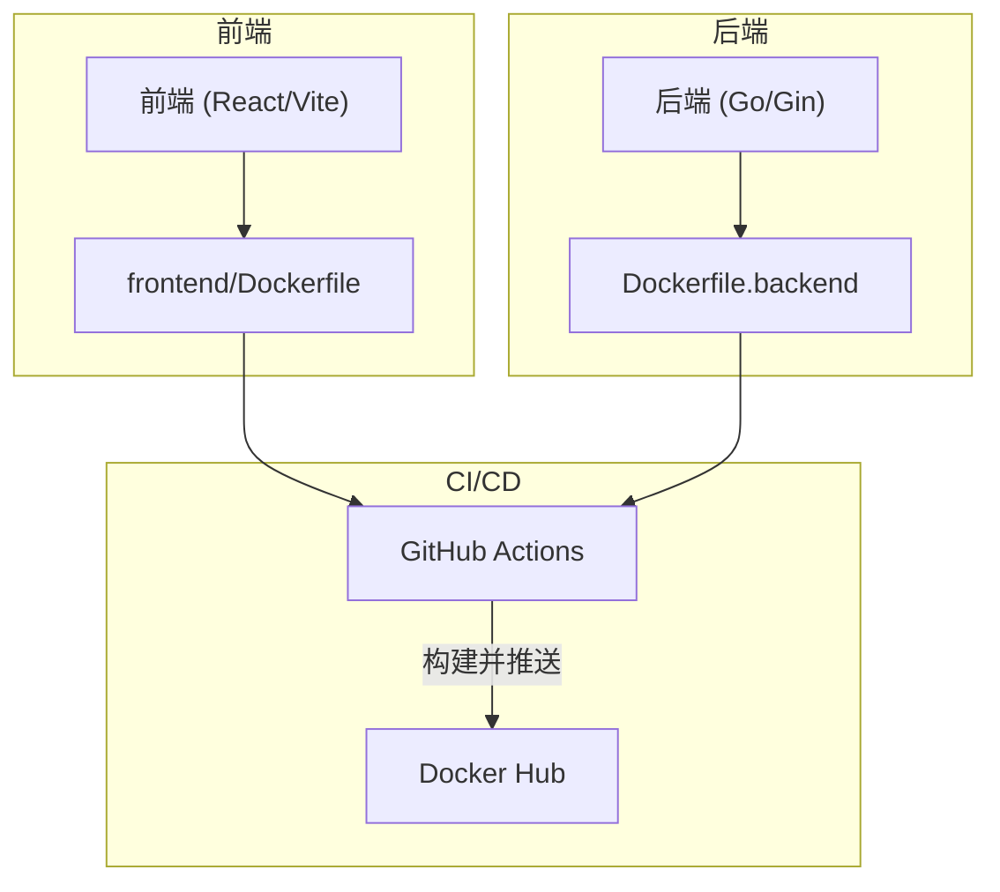
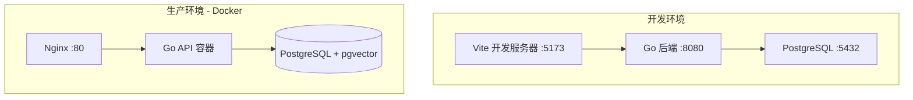
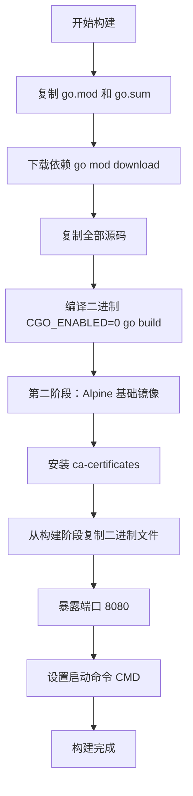
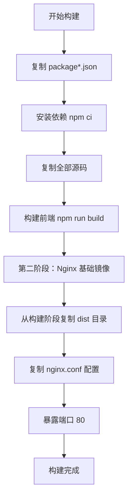
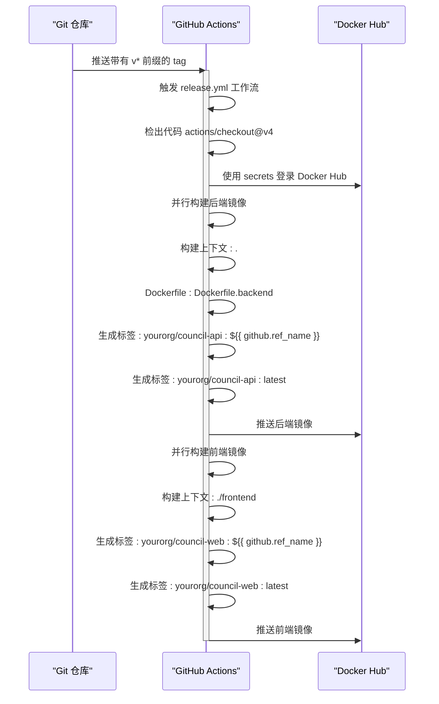
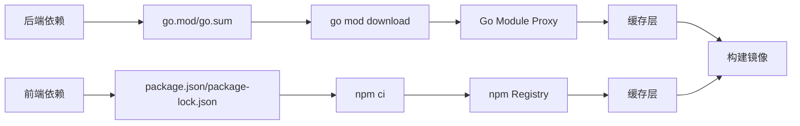

# 镜像构建与推送

<cite>
**本文档中引用的文件**  
- [Dockerfile.backend](file://Dockerfile.backend)
- [frontend/Dockerfile](file://frontend/Dockerfile)
- [.github/workflows/release.yml](file://.github/workflows/release.yml)
- [docker-compose.yml](file://docker-compose.yml)
- [docs/tdd/09_deployment.md](file://docs/tdd/09_deployment.md)
</cite>

## 目录
1. [简介](#简介)
2. [项目结构](#项目结构)
3. [核心组件](#核心组件)
4. [架构概述](#架构概述)
5. [详细组件分析](#详细组件分析)
6. [依赖分析](#依赖分析)
7. [性能考虑](#性能考虑)
8. [故障排除指南](#故障排除指南)
9. [结论](#结论)
10. [附录](#附录)（如有必要）

## 简介
本文档深入讲解在CI/CD流程中Docker镜像的构建与推送过程。重点描述如何在GitHub Actions环境中使用`docker/build-push-action`实现前后端镜像的并行构建，涵盖上下文路径、Dockerfile指定、标签生成（基于git tag和latest）及推送至Docker Hub的完整流程。同时解释多阶段构建的优势及其在本项目中的具体应用，并提供优化建议如缓存层复用和镜像体积精简，最后演示如何验证远程镜像的正确性。

## 项目结构
该项目采用前后端分离架构，后端使用Go语言开发，前端为基于React的单页应用(SPA)。项目通过Docker进行容器化部署，利用Docker Compose管理本地开发环境的服务编排。CI/CD流程通过GitHub Actions自动化实现镜像构建与推送。

**Diagram sources**
- [docker-compose.yml](file://docker-compose.yml)
- [docs/tdd/09_deployment.md](file://docs/tdd/09_deployment.md)

**Section sources**
- [docker-compose.yml](file://docker-compose.yml)
- [docs/tdd/09_deployment.md](file://docs/tdd/09_deployment.md)

## 核心组件
本项目的核心组件包括后端Go服务和前端React应用。后端服务通过Gin框架提供RESTful API，前端应用通过Vite构建并使用Nginx作为静态服务器。两个组件均通过独立的Dockerfile进行容器化，支持在CI/CD流程中并行构建。

**Section sources**
- [Dockerfile.backend](file://Dockerfile.backend)
- [frontend/Dockerfile](file://frontend/Dockerfile)

## 架构概述
系统的部署架构分为开发和生产两个环境。开发环境使用本地运行的Vite和Go服务，生产环境则完全基于Docker容器化部署，由Nginx反向代理前端请求，Go API容器处理业务逻辑，并连接PostgreSQL数据库。

**Diagram sources**
- [docs/tdd/09_deployment.md](file://docs/tdd/09_deployment.md#L5-L23)

## 详细组件分析

### 后端镜像构建分析
后端镜像采用多阶段构建策略，第一阶段使用`golang:1.22-alpine`镜像进行编译，第二阶段使用极简的`alpine:3.19`镜像仅包含运行时所需的二进制文件和证书，显著减小了最终镜像体积。

**Diagram sources**
- [Dockerfile.backend](file://Dockerfile.backend)

**Section sources**
- [Dockerfile.backend](file://Dockerfile.backend)
- [cmd/council/main.go](file://cmd/council/main.go)

### 前端镜像构建分析
前端镜像同样采用多阶段构建，第一阶段使用Node.js镜像进行依赖安装和构建，第二阶段使用Nginx镜像作为Web服务器，将构建产物部署到Nginx的HTML目录中。

**Diagram sources**
- [frontend/Dockerfile](file://frontend/Dockerfile)

**Section sources**
- [frontend/Dockerfile](file://frontend/Dockerfile)
- [frontend/package.json](file://frontend/package.json)

### CI/CD 流程分析
GitHub Actions工作流在检测到git tag推送时触发，执行镜像的并行构建与推送。流程包括代码检出、Docker Hub登录、并行构建前后端镜像等步骤。

**Diagram sources**
- [.github/workflows/release.yml](file://.github/workflows/release.yml)

**Section sources**
- [.github/workflows/release.yml](file://.github/workflows/release.yml)
- [docs/tdd/09_deployment.md](file://docs/tdd/09_deployment.md)

## 依赖分析
项目依赖通过Go Modules和npm分别管理。Docker构建过程中，依赖下载与源码复制分离，有利于利用Docker层缓存，当仅修改源码时，可复用已下载依赖的缓存层，加快构建速度。

**Diagram sources**
- [go.mod](file://go.mod)
- [frontend/package.json](file://frontend/package.json)

**Section sources**
- [go.mod](file://go.mod)
- [frontend/package.json](file://frontend/package.json)

## 性能考虑
多阶段构建和Alpine基础镜像的使用显著减小了最终镜像体积，加快了镜像的拉取和部署速度。通过合理组织Dockerfile中的指令顺序，最大化利用Docker构建缓存，减少重复下载依赖的时间。在CI/CD环境中，并行构建前后端镜像进一步缩短了整体构建时间。

## 故障排除指南
若镜像构建失败，首先检查Dockerfile语法是否正确，其次确认依赖文件（go.mod, package.json）是否完整。推送失败通常与Docker Hub凭据（secrets.DOCKER_USERNAME和secrets.DOCKER_TOKEN）配置有关。可通过本地执行相同Docker命令来复现和调试问题。

**Section sources**
- [.github/workflows/release.yml](file://.github/workflows/release.yml)
- [Dockerfile.backend](file://Dockerfile.backend)
- [frontend/Dockerfile](file://frontend/Dockerfile)

## 结论
本项目通过精心设计的Dockerfile和GitHub Actions工作流，实现了高效、可靠的CI/CD流程。多阶段构建确保了生产镜像的安全性和轻量化，而并行构建策略则优化了部署效率。该流程为项目的持续集成和交付提供了坚实的基础。