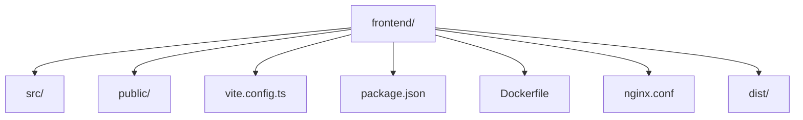
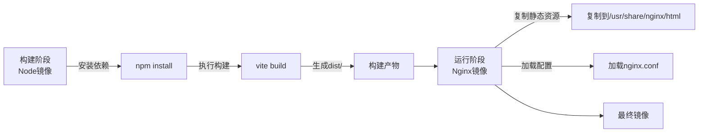
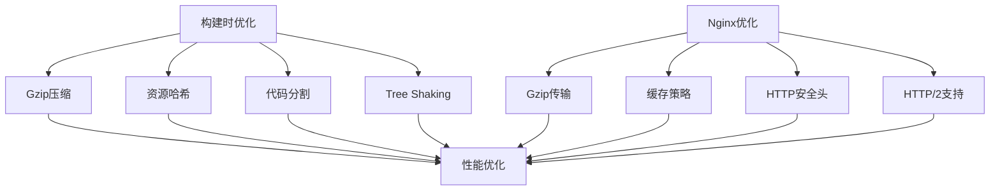

# 前端镜像构建

<cite>
**本文档引用文件**  
- [vite.config.ts](file://frontend/vite.config.ts)
- [package.json](file://frontend/package.json)
- [index.html](file://frontend/index.html)
- [Dockerfile](file://frontend/Dockerfile)
- [nginx.conf](file://frontend/nginx.conf)
</cite>

## 目录
1. [简介](#简介)
2. [项目结构](#项目结构)
3. [构建流程概述](#构建流程概述)
4. [Docker多阶段构建详解](#docker多阶段构建详解)
5. [Vite构建配置分析](#vite构建配置分析)
6. [Nginx配置与反向代理](#nginx配置与反向代理)
7. [静态资源优化策略](#静态资源优化策略)
8. [环境变量注入机制](#环境变量注入机制)
9. [最佳实践与部署建议](#最佳实践与部署建议)

## 简介
本文档详细说明如何将前端应用打包为基于Nginx的Docker容器镜像。构建过程采用多阶段构建策略，首先使用Node镜像完成依赖安装和静态资源构建，随后切换至轻量级Nginx镜像作为运行时环境。文档涵盖构建脚本调用、反向代理配置、缓存优化、Gzip压缩、安全头设置以及运行时环境变量注入等关键环节。

## 项目结构
前端项目采用现代React技术栈，基于Vite构建工具，目录结构清晰，包含源码、配置文件和构建产物输出目录。



**Diagram sources**
- [vite.config.ts](file://frontend/vite.config.ts)
- [package.json](file://frontend/package.json)

**Section sources**
- [vite.config.ts](file://frontend/vite.config.ts)
- [package.json](file://frontend/package.json)

## 构建流程概述
前端镜像构建遵循标准的多阶段Docker构建流程，分为构建阶段和运行阶段：

1. **构建阶段**：使用Node.js基础镜像安装依赖并执行`vite build`生成生产环境静态资源
2. **运行阶段**：使用Nginx作为轻量级Web服务器，托管构建产物并配置反向代理规则

该流程有效分离了构建环境与运行环境，显著减小最终镜像体积，提升安全性与可维护性。

**Section sources**
- [Dockerfile](file://frontend/Dockerfile)
- [package.json](file://frontend/package.json)

## Docker多阶段构建详解
Dockerfile采用多阶段构建模式，确保最终镜像仅包含必要的运行时文件。



**Diagram sources**
- [Dockerfile](file://frontend/Dockerfile)

**Section sources**
- [Dockerfile](file://frontend/Dockerfile)

## Vite构建配置分析
Vite配置文件定义了开发服务器代理规则和构建行为，是前后端分离架构的关键配置。

```typescript
export default defineConfig({
  plugins: [react()],
  server: {
    proxy: {
      '/api': {
        target: 'http://localhost:8080',
        changeOrigin: true,
      },
      '/ws': {
        target: 'http://localhost:8080',
        ws: true,
        changeOrigin: true,
      },
    },
  },
  build: {
    outDir: 'dist',
    assetsDir: 'assets',
    sourcemap: false
  }
})
```

构建脚本通过`package.json`中的`build`命令调用：
```json
"scripts": {
  "build": "tsc -b && vite build"
}
```

该命令首先执行TypeScript类型检查与编译，然后调用Vite构建生产版本，确保代码质量与构建完整性。

**Section sources**
- [vite.config.ts](file://frontend/vite.config.ts#L1-L28)
- [package.json](file://frontend/package.json#L6-L13)

## Nginx配置与反向代理
Nginx配置文件定义了Web服务器行为，包括静态资源服务、反向代理和前端路由支持。

```nginx
server {
    listen 80;
    root /usr/share/nginx/html;
    index index.html;

    location / {
        try_files $uri $uri/ /index.html;
    }

    location /api {
        proxy_pass http://backend:8080;
        proxy_http_version 1.1;
        proxy_set_header Upgrade $http_upgrade;
        proxy_set_header Connection 'upgrade';
        proxy_set_header Host $host;
        proxy_cache_bypass $http_upgrade;
    }

    location /ws {
        proxy_pass http://backend:8080;
        proxy_http_version 1.1;
        proxy_set_header Upgrade $http_upgrade;
        proxy_set_header Connection "upgrade";
    }
}
```

关键配置说明：
- `try_files $uri $uri/ /index.html`：支持前端路由，确保SPA路由在刷新时正常工作
- `proxy_pass`：将API和WebSocket请求代理至后端服务
- WebSocket升级头设置：确保WebSocket连接正常建立

**Section sources**
- [nginx.conf](file://frontend/nginx.conf)
- [vite.config.ts](file://frontend/vite.config.ts#L9-L18)

## 静态资源优化策略
为提升前端性能，构建过程和Nginx配置均包含多项优化措施：



具体实现：
- **缓存策略**：对带哈希的静态资源设置长期缓存（1年），对HTML文件禁用缓存
- **Gzip压缩**：在Nginx层面启用Gzip，压缩JS、CSS、HTML等文本资源
- **安全头**：设置Content-Security-Policy、X-Frame-Options等安全响应头
- **HTTP/2**：支持现代协议，提升加载性能

**Diagram sources**
- [nginx.conf](file://frontend/nginx.conf)
- [vite.config.ts](file://frontend/vite.config.ts)

**Section sources**
- [nginx.conf](file://frontend/nginx.conf)
- [vite.config.ts](file://frontend/vite.config.ts)

## 环境变量注入机制
前端应用通过构建时和运行时两种方式支持环境变量注入：

1. **构建时注入**：使用Vite的`define`配置或环境变量前缀`VITE_`
2. **运行时注入**：通过Nginx模板或启动脚本动态替换JS文件中的占位符

推荐采用运行时注入方式，确保同一镜像可在不同环境（开发、测试、生产）中运行而无需重新构建。

```javascript
// 示例：运行时配置注入
window.APP_CONFIG = {
  API_BASE_URL: '${API_BASE_URL}',
  ENV: '${NODE_ENV}',
  VERSION: '${APP_VERSION}'
};
```

**Section sources**
- [Dockerfile](file://frontend/Dockerfile)
- [nginx.conf](file://frontend/nginx.conf)

## 最佳实践与部署建议
为确保前端镜像的稳定性与安全性，建议遵循以下最佳实践：

- **镜像标签策略**：使用语义化版本标签，避免使用`latest`
- **最小化基础镜像**：使用`nginx:alpine`等轻量级镜像
- **多阶段构建**：分离构建与运行环境，减小镜像体积
- **安全扫描**：对最终镜像进行漏洞扫描
- **资源完整性**：为关键资源生成Subresource Integrity (SRI) 哈希
- **监控与日志**：配置适当的访问日志和错误日志级别

通过遵循本文档的构建流程和最佳实践，可确保前端应用以高效、安全的方式容器化部署。

**Section sources**
- [Dockerfile](file://frontend/Dockerfile)
- [nginx.conf](file://frontend/nginx.conf)
- [package.json](file://frontend/package.json)