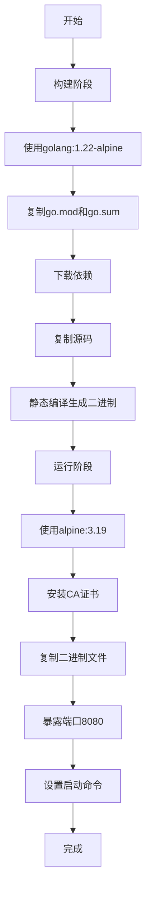

# 后端镜像构建

<cite>
**本文档引用的文件**  
- [Dockerfile.backend](file://Dockerfile.backend)
- [go.mod](file://go.mod)
- [main.go](file://cmd/council/main.go)
- [config.go](file://internal/pkg/config/config.go)
- [docker-compose.yml](file://docker-compose.yml)
- [Makefile](file://Makefile)
</cite>

## 目录
1. [简介](#简介)
2. [构建上下文组织](#构建上下文组织)
3. [多阶段构建流程](#多阶段构建流程)
4. [构建参数优化](#构建参数优化)
5. [安全与运行时配置](#安全与运行时配置)
6. [健康检查与端口暴露](#健康检查与端口暴露)

## 简介
本文档详细描述了后端Docker镜像的构建流程，重点介绍`Dockerfile.backend`的多阶段构建策略。该流程旨在创建一个安全、高效且可移植的生产级容器镜像，适用于在不同环境中部署。

**Section sources**
- [Dockerfile.backend](file://Dockerfile.backend#L1-L20)

## 构建上下文组织
后端镜像的构建上下文基于项目根目录，包含`go.mod`和`main.go`等核心文件。`go.mod`文件定义了项目依赖，确保构建过程中的依赖一致性。`main.go`作为程序入口，位于`cmd/council/`目录下，是构建过程中编译的目标文件。

构建上下文的组织遵循Go项目的标准布局，其中`internal`目录包含内部包，`pkg`目录包含可重用的公共包，`cmd`目录包含可执行命令。这种结构有助于实现代码的模块化和解耦。

**Section sources**
- [go.mod](file://go.mod#L1-L66)
- [main.go](file://cmd/council/main.go#L1-L150)

## 多阶段构建流程
后端镜像采用多阶段构建策略，分为两个阶段：构建阶段和运行阶段。

### 构建阶段
第一阶段使用`golang:1.22-alpine`镜像作为基础，该镜像包含了Go编译器和必要的构建工具。在此阶段，首先复制`go.mod`和`go.sum`文件并下载依赖，然后复制整个项目源码，最后执行静态编译生成无外部依赖的二进制文件。

### 运行阶段
第二阶段基于`alpine:3.19`镜像构建最小化运行环境。该镜像体积小，安全性高。在此阶段，仅复制上一阶段生成的二进制文件，并安装必要的CA证书。通过这种方式，最终镜像不包含Go编译器和源代码，显著减小了镜像体积并提高了安全性。

**Diagram sources**
- [Dockerfile.backend](file://Dockerfile.backend#L1-L20)

**Section sources**
- [Dockerfile.backend](file://Dockerfile.backend#L1-L20)

## 构建参数优化
通过构建参数（如`GOOS`、`GOARCH`）可以优化跨平台编译。在`Makefile`中，`build`目标使用`CGO_ENABLED=0`来禁用CGO，确保生成静态链接的二进制文件，避免了对主机系统库的依赖。同时，使用`-ldflags="-s -w"`来去除调试信息，进一步减小二进制文件大小。

这些优化措施使得生成的二进制文件可以在不同架构和操作系统上运行，提高了镜像的可移植性。

**Section sources**
- [Makefile](file://Makefile#L168-L172)

## 安全与运行时配置
为了提高安全性，运行阶段使用非root用户运行容器。虽然`Dockerfile.backend`中未显式创建非root用户，但可以在运行时通过`docker run`命令的`--user`参数指定用户ID。此外，通过设置环境变量（如`DATABASE_URL`、`REDIS_URL`）来配置应用程序，避免了在镜像中硬编码敏感信息。

`config.go`文件负责加载这些环境变量，并提供默认值，确保应用程序在不同环境中都能正常运行。

**Section sources**
- [config.go](file://internal/pkg/config/config.go#L1-L133)
- [Dockerfile.backend](file://Dockerfile.backend#L1-L20)

## 健康检查与端口暴露
`Dockerfile.backend`中使用`EXPOSE 8080`指令暴露8080端口，这是应用程序的默认监听端口。在`docker-compose.yml`中，该端口被映射到主机的8080端口，使得外部可以访问服务。

虽然`Dockerfile.backend`中未定义健康检查指令，但`docker-compose.yml`中为`postgres`服务配置了健康检查。对于后端服务，可以通过在`docker-compose.yml`中添加`healthcheck`指令来实现健康检查，例如使用`curl`命令检查`/api/v1/health`端点。

**Section sources**
- [Dockerfile.backend](file://Dockerfile.backend#L1-L20)
- [docker-compose.yml](file://docker-compose.yml#L1-L24)
- [config.go](file://internal/pkg/config/config.go#L1-L133)