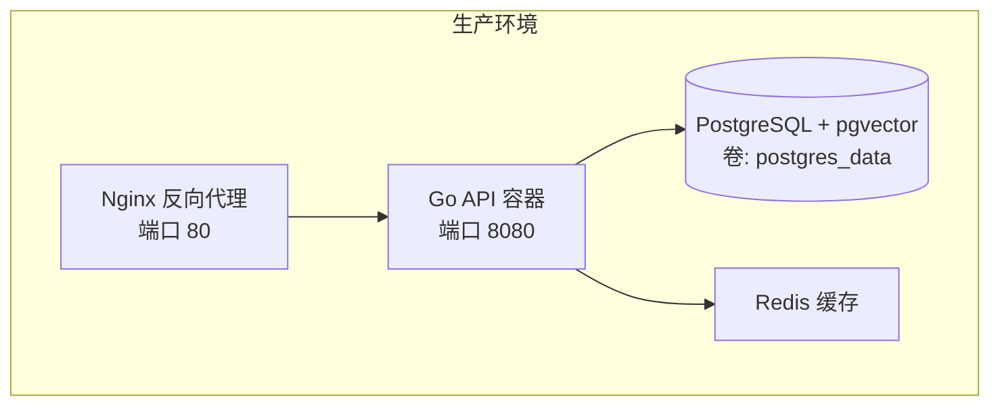
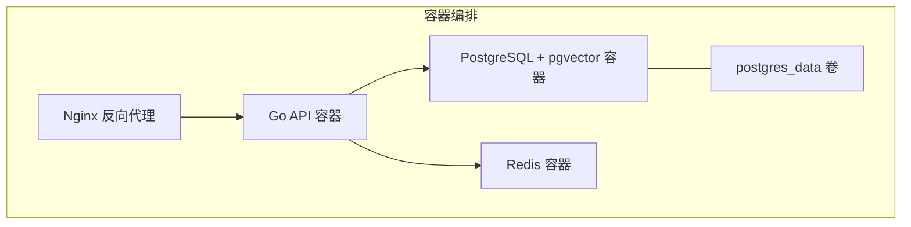
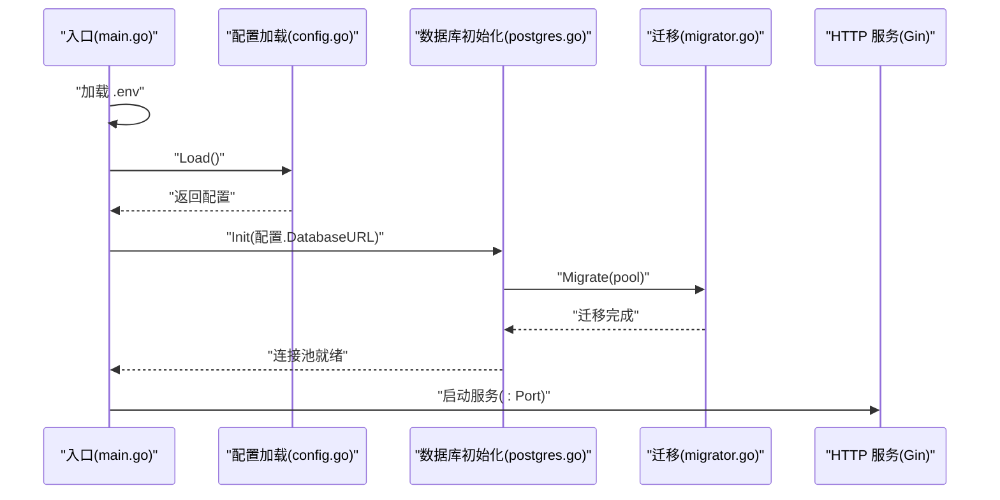
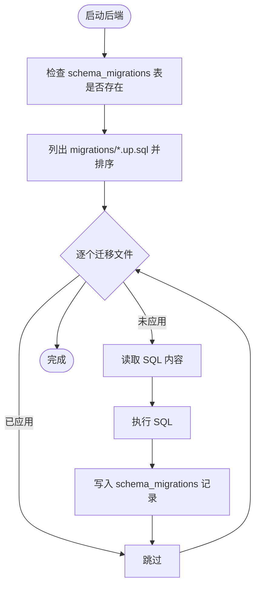
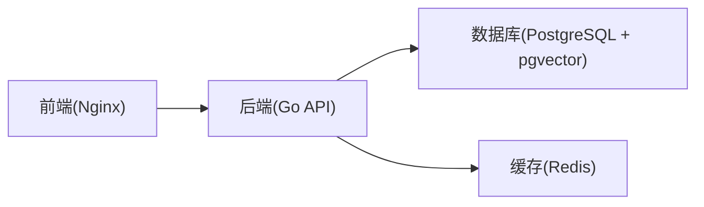

# 生产环境部署

<cite>
**本文引用的文件**
- [docker-compose.yml](file://docker-compose.yml)
- [.env.example](file://.env.example)
- [Makefile](file://Makefile)
- [cmd/council/main.go](file://cmd/council/main.go)
- [internal/pkg/config/config.go](file://internal/pkg/config/config.go)
- [internal/infrastructure/db/postgres.go](file://internal/infrastructure/db/postgres.go)
- [internal/infrastructure/db/migrator.go](file://internal/infrastructure/db/migrator.go)
- [internal/infrastructure/db/migrations/001_init_schema.up.sql](file://internal/infrastructure/db/migrations/001_init_schema.up.sql)
- [docs/tdd/09_deployment.md](file://docs/tdd/09_deployment.md)
- [README.md](file://README.md)
</cite>

## 目录
1. [简介](#简介)
2. [项目结构](#项目结构)
3. [核心组件](#核心组件)
4. [架构总览](#架构总览)
5. [详细组件分析](#详细组件分析)
6. [依赖关系分析](#依赖关系分析)
7. [性能考量](#性能考量)
8. [故障排查指南](#故障排查指南)
9. [结论](#结论)
10. [附录](#附录)

## 简介
本文件面向生产环境，系统性阐述使用 Docker 容器化部署 The Council 的完整流程，覆盖以下要点：
- docker-compose.yml 中各服务的配置：Nginx 作为前端反向代理（端口 80）、Go API 容器化部署、PostgreSQL + pgvector 数据库的持久化与健康检查。
- Dockerfile.backend 和前端 Dockerfile 的多阶段构建过程及镜像产物。
- 通过环境变量进行安全配置（数据库、缓存、LLM 提供商密钥等）。
- 生产环境最佳实践：健康检查、服务依赖管理、日志收集、数据库迁移（docker-compose exec backend council-server migrate up）。

## 项目结构
为便于理解，下图展示生产环境中的服务角色与交互关系（概念示意，非代码映射）：

[本图为概念示意，不对应具体源码文件，故无“图表来源”标注]

**章节来源**
- [docker-compose.yml](file://docker-compose.yml#L1-L24)
- [docs/tdd/09_deployment.md](file://docs/tdd/09_deployment.md#L1-L178)

## 核心组件
- 反向代理（Nginx）
  - 在生产环境中，前端静态资源由 Nginx 提供，作为入口网关统一对外暴露。
  - 本仓库提供了部署文档中 Nginx 的使用方式与端口映射思路。
- 后端 API（Go）
  - 采用多阶段构建：先在 builder 镜像中编译二进制，再复制到精简运行时镜像。
  - 运行时暴露 API 端口，依赖数据库与可选缓存。
- 数据库（PostgreSQL + pgvector）
  - 使用 pgvector 扩展支持向量检索；通过命名卷实现数据持久化。
  - 提供健康检查以确保依赖可用。
- 缓存（Redis）
  - 可选，用于会话、限流等场景。

**章节来源**
- [docs/tdd/09_deployment.md](file://docs/tdd/09_deployment.md#L1-L178)
- [docker-compose.yml](file://docker-compose.yml#L1-L24)

## 架构总览
下图展示生产部署的容器化架构与数据流：

**图表来源**
- [docker-compose.yml](file://docker-compose.yml#L1-L24)
- [docs/tdd/09_deployment.md](file://docs/tdd/09_deployment.md#L25-L73)

**章节来源**
- [docker-compose.yml](file://docker-compose.yml#L1-L24)
- [docs/tdd/09_deployment.md](file://docs/tdd/09_deployment.md#L1-L178)

## 详细组件分析

### docker-compose.yml 服务配置解析
- 数据库服务（PostgreSQL + pgvector）
  - 镜像：pgvector/pgvector:pg16
  - 环境变量：设置管理员账号、密码、数据库名
  - 挂载：命名卷 postgres_data，持久化数据目录
  - 重启策略：always
- 缓存服务（Redis）
  - 镜像：redis:alpine
  - 端口映射：6379
  - 重启策略：always
- 卷定义
  - postgres_data：用于持久化 PostgreSQL 数据

注意：当前仓库的 docker-compose.yml 未包含 Nginx、Go API 容器与健康检查配置。部署文档中提供了完整的生产级 compose 示例，建议参考该示例完善本地或生产环境的编排。

**章节来源**
- [docker-compose.yml](file://docker-compose.yml#L1-L24)
- [docs/tdd/09_deployment.md](file://docs/tdd/09_deployment.md#L25-L73)

### Dockerfile.backend 多阶段构建
- 构建阶段（builder）
  - 基于 golang:1.22-alpine
  - 工作目录复制 go.mod/go.sum 并下载依赖
  - 复制全部源码并编译生成 council-server 二进制（CGO_ENABLED=0）
- 运行阶段
  - 基于 alpine:3.19，仅安装必要证书
  - 将编译好的二进制复制到 /usr/local/bin
  - 暴露 8080 端口，CMD 启动服务

该多阶段构建确保镜像体积小、运行时安全且可重复构建。

**章节来源**
- [docs/tdd/09_deployment.md](file://docs/tdd/09_deployment.md#L74-L110)

### 前端 Dockerfile（React SPA + Nginx）
- 构建阶段（builder）
  - 基于 node:20-alpine
  - 安装依赖并构建前端产物
- 运行阶段
  - 基于 nginx:alpine
  - 将构建产物复制到 /usr/share/nginx/html
  - 复制自定义 Nginx 配置文件至 /etc/nginx/conf.d/default.conf
  - 暴露 80 端口

该方案将前端静态资源交由 Nginx 提供，具备高吞吐与低延迟优势。

**章节来源**
- [docs/tdd/09_deployment.md](file://docs/tdd/09_deployment.md#L94-L110)

### 环境变量与安全配置
- 数据库连接
  - DATABASE_URL：用于后端连接 PostgreSQL（含用户名、密码、主机、端口、数据库名、sslmode）
- LLM 配置
  - LLM_PROVIDER、LLM_MODEL、LLM_API_KEY（或按提供商前缀导出对应密钥）
  - Embedding Provider、Model、API Key（可从全局密钥派生）
- 缓存
  - REDIS_URL：可选，用于会话、限流等
- 服务器
  - PORT：后端监听端口，默认 8080
- 其他
  - GIN_MODE：开发模式控制（生产建议 debug 之外的模式）

建议在生产环境通过外部机密管理（如 KMS、Vault 或编排平台的 Secret）注入上述变量，避免硬编码在镜像或配置文件中。

**章节来源**
- [.env.example](file://.env.example#L1-L21)
- [internal/pkg/config/config.go](file://internal/pkg/config/config.go#L1-L133)

### 后端启动流程与依赖初始化
- 启动顺序
  - 加载 .env（若存在），读取配置
  - 初始化数据库连接池并执行迁移
  - 初始化 Redis（可选）
  - 构建路由与处理器，启动 HTTP 服务
- 关键路径
  - 配置加载：internal/pkg/config/config.go
  - 数据库初始化与迁移：internal/infrastructure/db/postgres.go、internal/infrastructure/db/migrator.go
  - 应用入口：cmd/council/main.go

**图表来源**
- [cmd/council/main.go](file://cmd/council/main.go#L1-L150)
- [internal/pkg/config/config.go](file://internal/pkg/config/config.go#L1-L133)
- [internal/infrastructure/db/postgres.go](file://internal/infrastructure/db/postgres.go#L1-L65)
- [internal/infrastructure/db/migrator.go](file://internal/infrastructure/db/migrator.go#L1-L109)

**章节来源**
- [cmd/council/main.go](file://cmd/council/main.go#L1-L150)
- [internal/pkg/config/config.go](file://internal/pkg/config/config.go#L1-L133)
- [internal/infrastructure/db/postgres.go](file://internal/infrastructure/db/postgres.go#L1-L65)
- [internal/infrastructure/db/migrator.go](file://internal/infrastructure/db/migrator.go#L1-L109)

### 数据库迁移流程
- 迁移机制
  - 通过嵌入式 SQL 文件按序执行 up.sql
  - 使用 schema_migrations 表记录已应用版本，避免重复执行
- 迁移触发时机
  - 后端启动时自动执行
- 命令行迁移
  - 生产环境可通过 docker-compose exec backend council-server migrate up 手动执行

**图表来源**
- [internal/infrastructure/db/migrator.go](file://internal/infrastructure/db/migrator.go#L1-L109)
- [internal/infrastructure/db/postgres.go](file://internal/infrastructure/db/postgres.go#L1-L65)
- [docs/tdd/09_deployment.md](file://docs/tdd/09_deployment.md#L166-L178)

**章节来源**
- [internal/infrastructure/db/migrator.go](file://internal/infrastructure/db/migrator.go#L1-L109)
- [internal/infrastructure/db/postgres.go](file://internal/infrastructure/db/postgres.go#L1-L65)
- [docs/tdd/09_deployment.md](file://docs/tdd/09_deployment.md#L166-L178)

### 健康检查与服务依赖管理
- 数据库健康检查
  - 建议在 docker-compose 中为数据库添加健康检查（例如基于 pg_isready），并在后端服务中声明 depends_on: condition: service_healthy
- 服务依赖
  - 后端依赖数据库（可选：Redis），前端依赖后端
- 日志
  - 建议启用容器日志采集（如 journald、fluentd、Promtail）并集中存储
  - 后端日志输出到 stdout/stderr，便于容器平台收集

**章节来源**
- [docs/tdd/09_deployment.md](file://docs/tdd/09_deployment.md#L25-L73)

## 依赖关系分析
- 组件耦合
  - 后端对数据库与可选缓存存在直接依赖
  - 前端通过 API 与后端交互
- 外部依赖
  - PostgreSQL + pgvector、Redis、Nginx
- 潜在风险
  - 数据库迁移失败会导致后端启动失败
  - 缓存不可用不会阻断核心功能，但会影响限流与会话能力

**图表来源**
- [docker-compose.yml](file://docker-compose.yml#L1-L24)
- [docs/tdd/09_deployment.md](file://docs/tdd/09_deployment.md#L25-L73)

**章节来源**
- [docker-compose.yml](file://docker-compose.yml#L1-L24)
- [docs/tdd/09_deployment.md](file://docs/tdd/09_deployment.md#L1-L178)

## 性能考量
- 镜像层优化
  - 多阶段构建减少最终镜像体积，降低拉取与启动时间
- 数据库性能
  - 使用 pgvector 扩展时，建议在生产环境为向量列建立合适的索引（如 HNSW 或 IVFFLAT），并根据业务规模调整 lists 参数
- 缓存策略
  - 对热点接口与会话状态使用 Redis，结合限流中间件控制突发流量
- 端口与网络
  - Nginx 暴露 80，后端 8080，确保防火墙与安全组放通
- 连接池
  - 合理配置数据库连接池大小与超时，避免峰值拥塞

[本节为通用指导，不直接分析具体文件，故无“章节来源”标注]

## 故障排查指南
- 后端无法启动
  - 检查数据库连接字符串与凭据是否正确
  - 查看数据库迁移是否成功（schema_migrations 是否有记录）
  - 关注启动日志中的错误提示
- 数据库迁移失败
  - 使用命令行手动执行迁移：docker-compose exec backend council-server migrate up
  - 检查迁移文件语法与依赖扩展（如 vector）
- 缓存不可用
  - 若启用限流或会话共享，需确认 Redis 可达性与连接参数
- 前端访问异常
  - 确认 Nginx 是否正常运行、静态资源是否正确挂载
  - 检查后端 API 是否可达（跨域、代理头）

**章节来源**
- [docs/tdd/09_deployment.md](file://docs/tdd/09_deployment.md#L166-L178)
- [internal/infrastructure/db/migrator.go](file://internal/infrastructure/db/migrator.go#L1-L109)
- [internal/infrastructure/db/postgres.go](file://internal/infrastructure/db/postgres.go#L1-L65)

## 结论
通过多阶段构建的 Docker 镜像、明确的环境变量配置、完善的数据库迁移与健康检查，The Council 可在生产环境中稳定运行。建议在现有 docker-compose.yml 基础上补充 Nginx、Go API 与健康检查配置，并结合外部机密管理与日志采集体系，形成可审计、可观测、可恢复的生产部署方案。

[本节为总结性内容，不直接分析具体文件，故无“章节来源”标注]

## 附录

### 生产部署步骤（基于仓库提供的部署文档）
- 启动所有服务：docker-compose up -d
- 查看日志：docker-compose logs -f backend
- 数据库迁移：docker-compose exec backend council-server migrate up

**章节来源**
- [docs/tdd/09_deployment.md](file://docs/tdd/09_deployment.md#L166-L178)

### 数据库初始化脚本（向量扩展与索引）
- 初始化脚本启用 pgvector 扩展，并创建核心表与索引
- 建议在生产环境根据实际模型维度与数据规模调优索引参数

**章节来源**
- [internal/infrastructure/db/migrations/001_init_schema.up.sql](file://internal/infrastructure/db/migrations/001_init_schema.up.sql#L1-L96)

### 开发与生产差异对照
- 开发环境
  - 通过 Makefile 启动数据库、后端与前端，便于联调
- 生产环境
  - 使用 docker-compose 编排，Nginx 反代前端，后端独立容器，数据库与缓存分离

**章节来源**
- [Makefile](file://Makefile#L46-L156)
- [README.md](file://README.md#L60-L90)